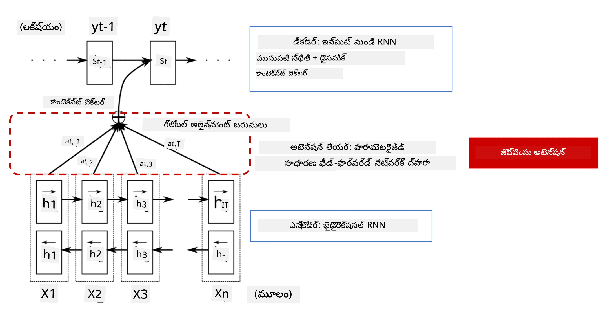
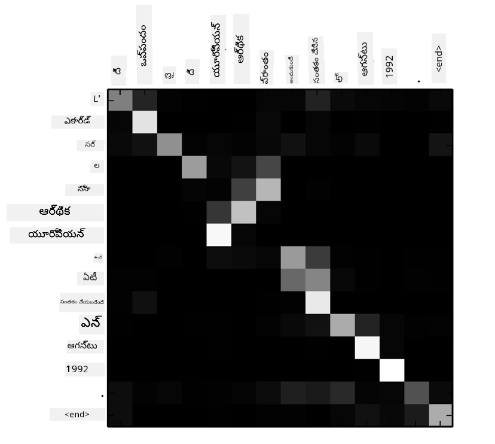
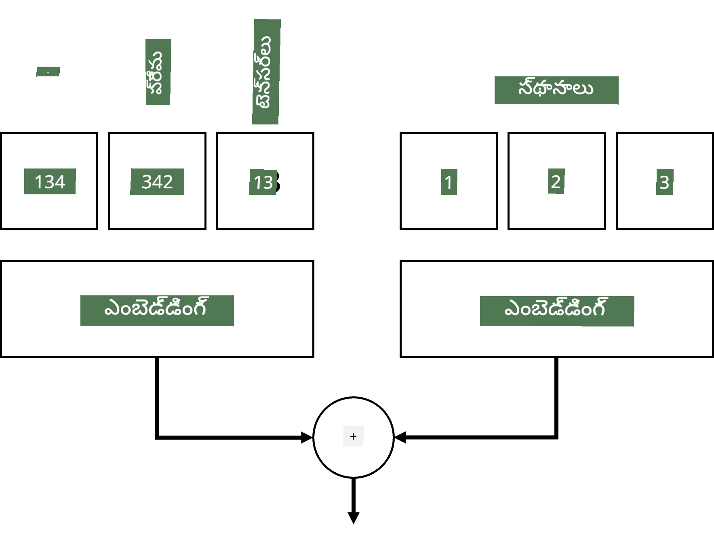
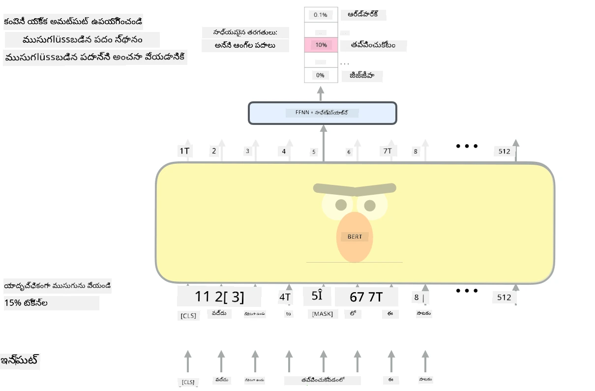

# అటెన్షన్ మెకానిజమ్స్ మరియు ట్రాన్స్‌ఫార్మర్స్

## [ప్రీ-లెక్చర్ క్విజ్](https://ff-quizzes.netlify.app/en/ai/quiz/35)

NLP డొమైన్‌లో అత్యంత ముఖ్యమైన సమస్యలలో ఒకటి **మిషన్ ట్రాన్స్‌లేషన్**, ఇది Google Translate వంటి టూల్స్‌కు ఆధారమైన ఒక అవసరమైన పని. ఈ విభాగంలో, మేము మిషన్ ట్రాన్స్‌లేషన్ లేదా సాధారణంగా ఏదైనా *సీక్వెన్స్-టు-సీక్వెన్స్* టాస్క్ (దీనిని **సెంటెన్స్ ట్రాన్స్‌డక్షన్** అని కూడా పిలుస్తారు) పై దృష్టి సారిస్తాము.

RNNలతో, సీక్వెన్స్-టు-సీక్వెన్స్ రెండు రికరెంట్ నెట్‌వర్క్స్ ద్వారా అమలు చేయబడుతుంది, ఇందులో ఒక నెట్‌వర్క్, **ఎంకోడర్**, ఇన్‌పుట్ సీక్వెన్స్‌ను ఒక హిడెన్ స్టేట్‌గా కుదింప చేస్తుంది, మరొక నెట్‌వర్క్, **డీకోడర్**, ఆ హిడెన్ స్టేట్‌ను అనువాద ఫలితంగా విస్తరించుతుంది. ఈ విధానంలో కొన్ని సమస్యలు ఉన్నాయి:

* ఎంకోడర్ నెట్‌వర్క్ యొక్క చివరి స్టేట్ వాక్య ప్రారంభాన్ని గుర్తుంచుకోవడంలో కష్టపడుతుంది, అందువల్ల పొడవైన వాక్యాలకు మోడల్ నాణ్యత తక్కువగా ఉంటుంది
* సీక్వెన్స్‌లోని అన్ని పదాలు ఫలితంపై సమాన ప్రభావం చూపుతాయి. నిజానికి, ఇన్‌పుట్ సీక్వెన్స్‌లోని కొన్ని పదాలు ఇతరాల కంటే ఎక్కువ ప్రభావం చూపుతాయి.

**అటెన్షన్ మెకానిజమ్స్** RNN యొక్క ప్రతి అవుట్‌పుట్ అంచనాపై ప్రతి ఇన్‌పుట్ వెక్టర్ యొక్క సందర్భాత్మక ప్రభావాన్ని తూగడానికి ఒక మార్గాన్ని అందిస్తాయి. ఇది అమలు చేయబడే విధానం ఇన్‌పుట్ RNN మరియు అవుట్‌పుట్ RNN మధ్య మధ్యవర్తి స్టేట్స్‌కు షార్ట్‌కట్స్ సృష్టించడం ద్వారా జరుగుతుంది. ఈ విధంగా, అవుట్‌పుట్ సింబల్ yt ఉత్పత్తి చేస్తున్నప్పుడు, మేము అన్ని ఇన్‌పుట్ హిడెన్ స్టేట్స్ hi ను వివిధ బరువు గుణకాలు &alpha;t,i తో పరిగణలోకి తీసుకుంటాము.

> [Bahdanau et al., 2015](https://arxiv.org/pdf/1409.0473.pdf) లోని యాడిటివ్ అటెన్షన్ మెకానిజం ఉన్న ఎంకోడర్-డీకోడర్ మోడల్, [ఈ బ్లాగ్ పోస్ట్](https://lilianweng.github.io/lil-log/2018/06/24/attention-attention.html) నుండి సైట్ చేయబడింది

అటెన్షన్ మ్యాట్రిక్స్ {&alpha;i,j} ఒక నిర్దిష్ట అవుట్‌పుట్ పదం ఉత్పత్తిలో కొన్ని ఇన్‌పుట్ పదాలు ఎంత మేర పాత్ర పోషిస్తున్నాయో సూచిస్తుంది. క్రింద అలాంటి మ్యాట్రిక్స్ ఉదాహరణ ఉంది:

> [Bahdanau et al., 2015](https://arxiv.org/pdf/1409.0473.pdf) నుండి ఫిగర్ (ఫిగర్ 3)

అటెన్షన్ మెకానిజమ్స్ NLPలో ప్రస్తుత లేదా సమీప ప్రస్తుత అగ్రగామి స్థితికి కారణమవుతాయి. అయితే అటెన్షన్ జోడించడం వల్ల మోడల్ పరిమాణం చాలా పెరుగుతుంది, ఇది RNNలతో స్కేలింగ్ సమస్యలకు దారితీసింది. RNNలను స్కేలు చేయడంలో ప్రధాన పరిమితి మోడల్స్ యొక్క రికరెంట్ స్వభావం కారణంగా ట్రైనింగ్‌ను బ్యాచ్ మరియు ప్యారలలైజ్ చేయడం కష్టమవుతుంది. RNNలో సీక్వెన్స్ యొక్క ప్రతి అంశం వరుసగా ప్రాసెస్ చేయాలి, అందువల్ల ఇది సులభంగా ప్యారలలైజ్ చేయలేం.

> [Google బ్లాగ్](https://research.googleblog.com/2016/09/a-neural-network-for-machine.html) నుండి చిత్రం

ఈ పరిమితితో పాటు అటెన్షన్ మెకానిజమ్స్ ఆమోదం, మనం ఇప్పుడు ఉపయోగిస్తున్న BERT నుండి Open-GPT3 వరకు ఉన్న అగ్రగామి ట్రాన్స్‌ఫార్మర్ మోడల్స్ సృష్టికి దారితీసింది.

## ట్రాన్స్‌ఫార్మర్ మోడల్స్

ట్రాన్స్‌ఫార్మర్స్ వెనుక ప్రధాన ఆలోచన RNNల వరుస స్వభావాన్ని నివారించడం మరియు ట్రైనింగ్ సమయంలో ప్యారలలైజ్ చేయగల మోడల్ సృష్టించడం. ఇది రెండు ఆలోచనల ద్వారా సాధించబడుతుంది:

* పొజిషనల్ ఎంకోడింగ్
* RNNల (లేదా CNNల) స్థానంలో ప్యాటర్న్స్‌ను పట్టుకోవడానికి సెల్ఫ్-అటెన్షన్ మెకానిజం ఉపయోగించడం (అందుకే ట్రాన్స్‌ఫార్మర్స్ పరిచయం చేసే పేపర్ పేరు *[Attention is all you need](https://arxiv.org/abs/1706.03762)*)

### పొజిషనల్ ఎంకోడింగ్/ఎంబెడ్డింగ్

పొజిషనల్ ఎంకోడింగ్ ఆలోచన ఇలా ఉంది:
1. RNNల ఉపయోగంలో, టోకెన్ల సాపేక్ష స్థానాన్ని స్టెప్స్ సంఖ్య ద్వారా సూచిస్తారు, కాబట్టి స్పష్టంగా సూచించాల్సిన అవసరం లేదు.
2. అయితే, అటెన్షన్‌కు మారినప్పుడు, సీక్వెన్స్‌లో టోకెన్ల సాపేక్ష స్థానాలు తెలుసుకోవాలి.
3. పొజిషనల్ ఎంకోడింగ్ పొందడానికి, మేము టోకెన్ల సీక్వెన్స్‌తో పాటు టోకెన్ స్థానాల సీక్వెన్స్ (అంటే 0,1, ...) జత చేస్తాము.
4. ఆపై టోకెన్ స్థానాన్ని టోకెన్ ఎంబెడ్డింగ్ వెక్టర్‌తో కలుపుతాము. స్థానాన్ని (ఇంటిజర్) వెక్టర్‌గా మార్చడానికి వివిధ విధానాలు ఉన్నాయి:

* ట్రైనబుల్ ఎంబెడ్డింగ్, టోకెన్ ఎంబెడ్డింగ్‌లకు సమానంగా. ఇక్కడ మేము ఈ విధానాన్ని పరిగణిస్తాము. టోకెన్లకు మరియు వాటి స్థానాలకు ఎంబెడ్డింగ్ లేయర్లు వర్తింపజేస్తాము, ఫలితంగా ఒకే పరిమాణాల ఎంబెడ్డింగ్ వెక్టర్లు వస్తాయి, వాటిని కలిపి ఉపయోగిస్తాము.
* ఒరిజినల్ పేపర్‌లో ప్రతిపాదించిన స్థిరమైన పొజిషనల్ ఎంకోడింగ్ ఫంక్షన్.

> రచయితచే రూపొందించిన చిత్రం

పొజిషనల్ ఎంబెడ్డింగ్ ద్వారా మేము పొందేది, ఒరిజినల్ టోకెన్ మరియు దాని సీక్వెన్స్‌లోని స్థానాన్ని రెండింటినీ ఎంబెడ్ చేయడం.

### మల్టీ-హెడ్ సెల్ఫ్-అటెన్షన్

తర్వాత, సీక్వెన్స్‌లోని కొన్ని ప్యాటర్న్స్‌ను పట్టుకోవాలి. దీని కోసం, ట్రాన్స్‌ఫార్మర్స్ **సెల్ఫ్-అటెన్షన్** మెకానిజం ఉపయోగిస్తాయి, ఇది ఇన్‌పుట్ మరియు అవుట్‌పుట్ ఒకే సీక్వెన్స్‌పై అటెన్షన్ వర్తింపజేయడం. సెల్ఫ్-అటెన్షన్ వాక్యంలో **సందర్భం** పరిగణలోకి తీసుకోవడానికి, మరియు ఏ పదాలు పరస్పరం సంబంధం ఉన్నాయో చూడటానికి సహాయపడుతుంది. ఉదాహరణకు, ఇది *it* వంటి కోరెఫరెన్సులు సూచించే పదాలను గుర్తించడంలో సహాయపడుతుంది, అలాగే సందర్భాన్ని పరిగణలోకి తీసుకుంటుంది:

> [Google బ్లాగ్](https://research.googleblog.com/2017/08/transformer-novel-neural-network.html) నుండి చిత్రం

ట్రాన్స్‌ఫార్మర్స్‌లో, నెట్‌వర్క్‌కు వివిధ రకాల సంబంధాలను పట్టుకోవడానికి శక్తిని ఇవ్వడానికి **మల్టీ-హెడ్ అటెన్షన్** ఉపయోగిస్తారు, ఉదా: దీర్ఘకాలిక మరియు స్వల్పకాలిక పద సంబంధాలు, కోరెఫరెన్స్ మరియు ఇతర సంబంధాలు మొదలైనవి.

[TensorFlow నోట్‌బుక్](TransformersTF.ipynb) ట్రాన్స్‌ఫార్మర్ లేయర్ల అమలుపై మరిన్ని వివరాలు కలిగి ఉంది.

### ఎంకోడర్-డీకోడర్ అటెన్షన్

ట్రాన్స్‌ఫార్మర్స్‌లో, అటెన్షన్ రెండు చోట్ల ఉపయోగిస్తారు:

* ఇన్‌పుట్ టెక్స్ట్‌లోని ప్యాటర్న్స్‌ను పట్టుకోవడానికి సెల్ఫ్-అటెన్షన్ ఉపయోగించడం
* సీక్వెన్స్ అనువాదం చేయడానికి - ఇది ఎంకోడర్ మరియు డీకోడర్ మధ్య అటెన్షన్ లేయర్.

ఎంకోడర్-డీకోడర్ అటెన్షన్ RNNలలో ఉపయోగించే అటెన్షన్ మెకానిజం చాలా సమానంగా ఉంటుంది, ఈ విభాగం ప్రారంభంలో వివరించినట్లుగా. ఈ యానిమేటెడ్ డయాగ్రామ్ ఎంకోడర్-డీకోడర్ అటెన్షన్ పాత్రను వివరిస్తుంది.

ప్రతి ఇన్‌పుట్ స్థానాన్ని స్వతంత్రంగా ప్రతి అవుట్‌పుట్ స్థానానికి మ్యాప్ చేయడం వల్ల, ట్రాన్స్‌ఫార్మర్స్ RNNల కంటే మెరుగ్గా ప్యారలలైజ్ చేయగలవు, ఇది పెద్ద మరియు మరింత వ్యక్తీకరించే భాషా మోడల్స్‌ను సాధ్యమవుతుంది. ప్రతి అటెన్షన్ హెడ్ పదాల మధ్య వేర్వేరు సంబంధాలను నేర్చుకోవడానికి ఉపయోగపడుతుంది, ఇది NLP పనులను మెరుగుపరుస్తుంది.

## BERT

**BERT** (Bidirectional Encoder Representations from Transformers) అనేది చాలా పెద్ద బహుళ లేయర్ ట్రాన్స్‌ఫార్మర్ నెట్‌వర్క్, *BERT-base*కి 12 లేయర్లు, *BERT-large*కి 24 లేయర్లు ఉన్నాయి. ఈ మోడల్ మొదట పెద్ద టెక్స్ట్ డేటా కార్పస్ (వికీపీడియా + పుస్తకాలు) పై అన్‌సూపర్వైజ్డ్ ట్రైనింగ్ (వాక్యంలో మాస్క్ చేసిన పదాలను అంచనా వేయడం) ద్వారా ప్రీ-ట్రెయిన్ చేయబడుతుంది. ప్రీ-ట్రైనింగ్ సమయంలో మోడల్ భాషా అర్థం గణనీయంగా పెరుగుతుంది, దీన్ని తర్వాత ఇతర డేటాసెట్‌లతో ఫైన్-ట్యూనింగ్ ద్వారా ఉపయోగించవచ్చు. ఈ ప్రక్రియను **ట్రాన్స్‌ఫర్ లెర్నింగ్** అంటారు.

> చిత్రం [మూలం](http://jalammar.github.io/illustrated-bert/)

## ✍️ వ్యాయామాలు: ట్రాన్స్‌ఫార్మర్స్

క్రింది నోట్‌బుక్స్‌లో మీ అభ్యాసాన్ని కొనసాగించండి:

* [PyTorchలో ట్రాన్స్‌ఫార్మర్స్](TransformersPyTorch.ipynb)
* [TensorFlowలో ట్రాన్స్‌ఫార్మర్స్](TransformersTF.ipynb)

## ముగింపు

ఈ పాఠంలో మీరు ట్రాన్స్‌ఫార్మర్స్ మరియు అటెన్షన్ మెకానిజమ్స్ గురించి నేర్చుకున్నారు, ఇవి NLP టూల్‌బాక్స్‌లో అత్యవసరమైన సాధనాలు. BERT, DistilBERT, BigBird, OpenGPT3 వంటి అనేక ట్రాన్స్‌ఫార్మర్ వేరియంట్లు ఉన్నాయి, వీటిని ఫైన్-ట్యూన్ చేయవచ్చు. [HuggingFace ప్యాకేజ్](https://github.com/huggingface/) PyTorch మరియు TensorFlow రెండింటిలోనూ ఈ ఆర్కిటెక్చర్లను ట్రెయిన్ చేయడానికి రిపాజిటరీని అందిస్తుంది.

## 🚀 సవాలు

## [పోస్ట్-లెక్చర్ క్విజ్](https://ff-quizzes.netlify.app/en/ai/quiz/36)

## సమీక్ష & స్వీయ అధ్యయనం

* [బ్లాగ్ పోస్ట్](https://mchromiak.github.io/articles/2017/Sep/12/Transformer-Attention-is-all-you-need/), క్లాసికల్ [Attention is all you need](https://arxiv.org/abs/1706.03762) పేపర్‌ను వివరించడం.
* ట్రాన్స్‌ఫార్మర్స్‌పై [బ్లాగ్ పోస్టుల సిరీస్](https://towardsdatascience.com/transformers-explained-visually-part-1-overview-of-functionality-95a6dd460452), ఆర్కిటెక్చర్‌ను వివరించడం.

## [అసైన్‌మెంట్](assignment.md)

---

<!-- CO-OP TRANSLATOR DISCLAIMER START -->
**అస్పష్టత**:  
ఈ పత్రాన్ని AI అనువాద సేవ [Co-op Translator](https://github.com/Azure/co-op-translator) ఉపయోగించి అనువదించబడింది. మేము ఖచ్చితత్వానికి ప్రయత్నించినప్పటికీ, ఆటోమేటెడ్ అనువాదాల్లో పొరపాట్లు లేదా తప్పిదాలు ఉండవచ్చు. మూల పత్రం దాని స్వదేశీ భాషలో అధికారిక మూలంగా పరిగణించాలి. ముఖ్యమైన సమాచారానికి, ప్రొఫెషనల్ మానవ అనువాదం సిఫార్సు చేయబడుతుంది. ఈ అనువాదం వాడకంలో ఏర్పడిన ఏవైనా అపార్థాలు లేదా తప్పుదారుల కోసం మేము బాధ్యత వహించము.
<!-- CO-OP TRANSLATOR DISCLAIMER END -->