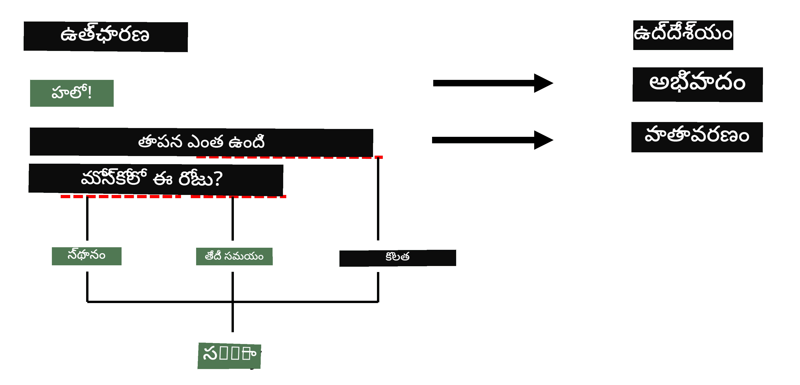

# పేరుగల సত্ত్వ గుర్తింపు

ఇప్పటివరకు, మనం ప్రధానంగా ఒక NLP పనిపై - వర్గీకరణపై - దృష్టి పెట్టాము. అయితే, న్యూరల్ నెట్‌వర్క్‌లతో సాధించగల ఇతర NLP పనులు కూడా ఉన్నాయి. వాటిలో ఒకటి **[పేరుగల సత్త్వ గుర్తింపు](https://wikipedia.org/wiki/Named-entity_recognition)** (NER), ఇది వచనంలో ప్రత్యేక సత్త్వాలను గుర్తించడంపై పనిచేస్తుంది, ఉదాహరణకు ప్రదేశాలు, వ్యక్తి పేర్లు, తేదీ-సమయ వ్యవధులు, రసాయన సూత్రాలు మొదలైనవి.

## [పాఠం ముందు క్విజ్](https://ff-quizzes.netlify.app/en/ai/quiz/37)

## NER ఉపయోగం ఉదాహరణ

మీరు అమెజాన్ అలెక్సా లేదా గూగుల్ అసిస్టెంట్ లాంటి సహజ భాషా చాట్ బాట్‌ను అభివృద్ధి చేయాలనుకుంటున్నారని ఊహించుకోండి. తెలివైన చాట్ బాట్లు పనిచేసే విధానం ఏమిటంటే, వినియోగదారు ఏమి కోరుకుంటున్నాడో అర్థం చేసుకోవడం కోసం ఇన్‌పుట్ వాక్యంపై టెక్స్ట్ వర్గీకరణ చేస్తాయి. ఈ వర్గీకరణ ఫలితం **ఇంటెంట్** అని పిలవబడుతుంది, ఇది చాట్ బాట్ ఏం చేయాలో నిర్ణయిస్తుంది.

> చిత్రాన్ని రచయిత అందించారు

అయితే, వినియోగదారు వాక్య భాగంగా కొన్ని పారామితులను కూడా అందించవచ్చు. ఉదాహరణకు, వాతావరణం గురించి అడుగుతున్నప్పుడు, ఆమె ఒక ప్రదేశం లేదా తేదీని పేర్కొనవచ్చు. బాట్ ఆ సత్త్వాలను అర్థం చేసుకుని, ఆ ప్రకారం పారామితి స్థలాలను నింపగలగాలి, ఆ తర్వాత చర్యను చేపట్టాలి. ఇదే NER అవసరం అయ్యే స్థలం.

> ✅ మరో ఉదాహరణగా [వైద్య శాస్త్రీయ పత్రాలను విశ్లేషించడం](https://soshnikov.com/science/analyzing-medical-papers-with-azure-and-text-analytics-for-health/) తీసుకోవచ్చు. మనం ముఖ్యంగా చూడవలసినవి ప్రత్యేక వైద్య పదాలు, ఉదాహరణకు వ్యాధులు మరియు వైద్య పదార్థాలు. కొంతమంది వ్యాధులను సబ్‌స్ట్రింగ్ శోధనతో పొందవచ్చు, కానీ రసాయన సమ్మేళనాలు మరియు మందుల పేర్ల వంటి క్లిష్టమైన సత్త్వాలకు మరింత సంక్లిష్టమైన విధానం అవసరం.

## NER ను టోకెన్ వర్గీకరణగా చూడటం

NER మోడల్స్ ప్రాథమికంగా **టోకెన్ వర్గీకరణ మోడల్స్** అవుతాయి, ఎందుకంటే ప్రతి ఇన్‌పుట్ టోకెన్ ఒక సత్త్వానికి చెందుతుందా లేదా అని నిర్ణయించాలి, మరియు ఉంటే - ఏ సత్త్వ తరగతికి చెందుతుందో కూడా.

క్రింది పత్ర శీర్షికను పరిశీలించండి:

**ట్రైకస్పిడ్ వాల్వ్ రిగర్జిటేషన్** మరియు **లిథియం కార్బోనేట్** **విషపూరితత** ఒక నూతన శిశువులో.

ఇక్కడ సత్త్వాలు:

* ట్రైకస్పిడ్ వాల్వ్ రిగర్జిటేషన్ ఒక వ్యాధి (`DIS`)
* లిథియం కార్బోనేట్ ఒక రసాయన పదార్థం (`CHEM`)
* విషపూరితత కూడా ఒక వ్యాధి (`DIS`)

ఒక సత్త్వం అనేక టోకెన్లను కవర్ చేయవచ్చు. ఈ సందర్భంలో, రెండు వరుస సత్త్వాలను వేరుచేయాలి. అందుకే, ప్రతి సత్త్వానికి రెండు తరగతులు ఉపయోగిస్తారు - ఒకటి సత్త్వం మొదటి టోకెన్‌ను సూచిస్తుంది (సాధారణంగా `B-` ప్రిఫిక్స్, అంటే **b**eginning), మరొకటి సత్త్వం కొనసాగింపు టోకెన్ (`I-`, అంటే **i**nner token). మిగతా అన్ని టోకెన్లకు `O` తరగతి ఉపయోగిస్తారు, అంటే **o**ther టోకెన్లు. ఈ టోకెన్ ట్యాగింగ్‌ను [BIO ట్యాగింగ్](https://en.wikipedia.org/wiki/Inside%E2%80%93outside%E2%80%93beginning_(tagging)) (లేదా IOB) అంటారు. ట్యాగ్ చేసినప్పుడు, మన శీర్షిక ఇలా ఉంటుంది:

టోకెన్ | ట్యాగ్
------|-----
Tricuspid | B-DIS
valve | I-DIS
regurgitation | I-DIS
and | O
lithium | B-CHEM
carbonate | I-CHEM
toxicity | B-DIS
in | O
a | O
newborn | O
infant | O
. | O

టోకెన్లు మరియు తరగతుల మధ్య ఒకటి-కోటి అనుసంధానం అవసరం కాబట్టి, ఈ చిత్రంలో చూపినట్లుగా ఒక కుడి వైపు **బహుళ-కు-బహుళ** న్యూరల్ నెట్‌వర్క్ మోడల్‌ను శిక్షణ ఇవ్వవచ్చు:

> *చిత్రం [ఈ బ్లాగ్ పోస్ట్](http://karpathy.github.io/2015/05/21/rnn-effectiveness/) నుండి, రచయిత [అండ్రేజ్ కార్పతి](http://karpathy.github.io/). NER టోకెన్ వర్గీకరణ మోడల్స్ ఈ చిత్రంలో కుడి వైపు నెట్‌వర్క్ నిర్మాణానికి సరిపోతాయి.*

## NER మోడల్స్ శిక్షణ

NER మోడల్ ప్రాథమికంగా టోకెన్ వర్గీకరణ మోడల్ కావడంతో, మనకు తెలిసిన RNNలను ఈ పనికి ఉపయోగించవచ్చు. ఈ సందర్భంలో, ప్రతి రికరెంట్ నెట్‌వర్క్ బ్లాక్ టోకెన్ IDని తిరిగి ఇస్తుంది. క్రింది ఉదాహరణ నోట్‌బుక్ LSTMని టోకెన్ వర్గీకరణకు ఎలా శిక్షణ ఇవ్వాలో చూపిస్తుంది.

## ✍️ ఉదాహరణ నోట్‌బుక్స్: NER

క్రింది నోట్‌బుక్‌లో మీ అభ్యాసాన్ని కొనసాగించండి:

* [TensorFlowతో NER](NER-TF.ipynb)

## ముగింపు

NER మోడల్ అనేది **టోకెన్ వర్గీకరణ మోడల్**, అంటే ఇది టోకెన్ వర్గీకరణ చేయడానికి ఉపయోగించవచ్చు. ఇది NLPలో చాలా సాధారణ పని, వచనంలో ప్రదేశాలు, పేర్లు, తేదీలు మరియు మరిన్ని ప్రత్యేక సత్త్వాలను గుర్తించడంలో సహాయపడుతుంది.

## 🚀 సవాలు

క్రింద ఇచ్చిన అసైన్‌మెంట్ పూర్తి చేసి వైద్య పదాల కోసం పేరుగల సత్త్వ గుర్తింపు మోడల్ శిక్షణ ఇవ్వండి, ఆ తర్వాత వేరే డేటాసెట్‌పై ప్రయత్నించండి.

## [పాఠం తర్వాత క్విజ్](https://ff-quizzes.netlify.app/en/ai/quiz/38)

## సమీక్ష & స్వీయ అధ్యయనం

[The Unreasonable Effectiveness of Recurrent Neural Networks](http://karpathy.github.io/2015/05/21/rnn-effectiveness/) అనే బ్లాగ్ చదవండి మరియు ఆ వ్యాసంలోని Further Reading విభాగాన్ని అనుసరించి మీ జ్ఞానాన్ని మరింత పెంచుకోండి.

## [అసైన్‌మెంట్](lab/README.md)

ఈ పాఠం కోసం అసైన్‌మెంట్‌లో, మీరు వైద్య సత్త్వ గుర్తింపు మోడల్ శిక్షణ ఇవ్వాలి. ఈ పాఠంలో వివరించినట్లుగా LSTM మోడల్‌తో ప్రారంభించి, తరువాత BERT ట్రాన్స్‌ఫార్మర్ మోడల్ ఉపయోగించవచ్చు. అన్ని వివరాల కోసం [సూచనలు](lab/README.md) చదవండి.

---

<!-- CO-OP TRANSLATOR DISCLAIMER START -->
**అస్పష్టత**:  
ఈ పత్రాన్ని AI అనువాద సేవ [Co-op Translator](https://github.com/Azure/co-op-translator) ఉపయోగించి అనువదించబడింది. మేము ఖచ్చితత్వానికి ప్రయత్నించినప్పటికీ, ఆటోమేటెడ్ అనువాదాల్లో పొరపాట్లు లేదా తప్పిదాలు ఉండవచ్చు. మూల పత్రం దాని స్వదేశీ భాషలో అధికారిక మూలంగా పరిగణించాలి. ముఖ్యమైన సమాచారానికి, ప్రొఫెషనల్ మానవ అనువాదం సిఫార్సు చేయబడుతుంది. ఈ అనువాదం వాడకంలో ఏర్పడిన ఏవైనా అపార్థాలు లేదా తప్పుదారితీసే అర్థాలు కోసం మేము బాధ్యత వహించము.
<!-- CO-OP TRANSLATOR DISCLAIMER END -->