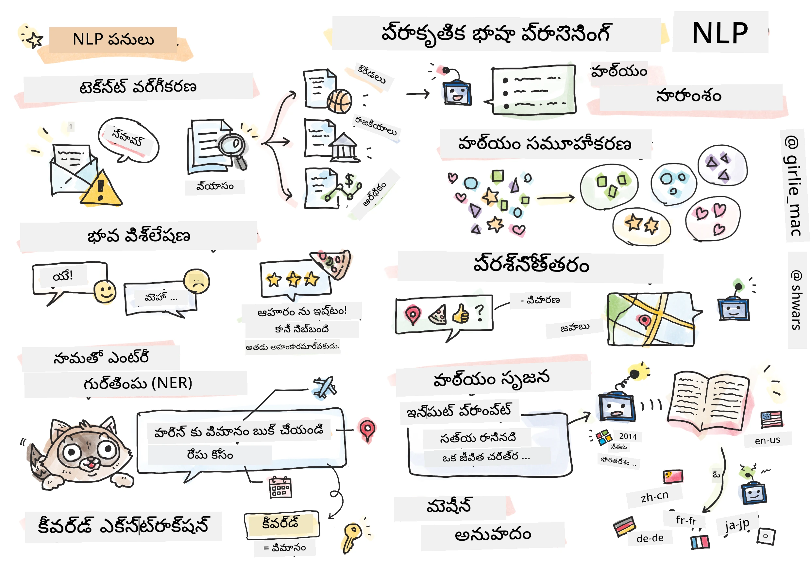

# సహజ భాషా ప్రాసెసింగ్



ఈ విభాగంలో, మనం సహజ భాషా ప్రాసెసింగ్ (NLP) సంబంధిత పనులను నిర్వహించడానికి న్యూరల్ నెట్‌వర్క్‌లను ఉపయోగించడంపై దృష్టి పెట్టబోతున్నాము. కంప్యూటర్లు పరిష్కరించగలిగే అనేక NLP సమస్యలు ఉన్నాయి:

* **పాఠ్య వర్గీకరణ** అనేది పాఠ్య శ్రేణులకి సంబంధించిన సాధారణ వర్గీకరణ సమస్య. ఉదాహరణకు, ఇమెయిల్ సందేశాలను స్పామ్ లేదా నాన్-స్పామ్‌గా వర్గీకరించడం, లేదా వ్యాసాలను క్రీడలు, వ్యాపారం, రాజకీయాలు వంటి వర్గాలుగా వర్గీకరించడం. చాట్ బాట్లను అభివృద్ధి చేస్తున్నప్పుడు, వినియోగదారు ఏమి చెప్పాలనుకున్నాడో అర్థం చేసుకోవడం అవసరం అవుతుంది -- ఈ సందర్భంలో మనం **ఇరాదా వర్గీకరణ**తో వ్యవహరిస్తున్నాము. ఇరాదా వర్గీకరణలో తరచుగా అనేక వర్గాలతో వ్యవహరించాల్సి ఉంటుంది.
* **భావ విశ్లేషణ** అనేది సాధారణ రిగ్రెషన్ సమస్య, ఇందులో వాక్య అర్థం ఎంత సానుకూలం/నెగటివ్ అనేదానికి సంబంధించిన సంఖ్య (భావం) ఇవ్వాలి. భావ విశ్లేషణ యొక్క అభివృద్ధి చెందిన రూపం **అంశాల ఆధారిత భావ విశ్లేషణ** (ABSA), ఇందులో భావాన్ని మొత్తం వాక్యం కాకుండా వాక్యంలోని వివిధ భాగాలకు (అంశాలకు) కేటాయిస్తారు, ఉదా. *ఈ రెస్టారెంట్‌లో నాకు వంటకం నచ్చింది, కానీ వాతావరణం భయంకరంగా ఉంది*.
* **పేరు గుర్తింపు** (NER) అనేది పాఠ్యంలోని నిర్దిష్ట అంశాలను తీసుకోవడం. ఉదాహరణకు, *నేను రేపు పారిస్‌కు ప్రయాణించాలి* అనే వాక్యంలో *రేపు* అనేది తేదీకి (DATE) సూచిస్తుందని, *పారిస్* అనేది స్థలానికి (LOCATION) సంబంధించినదని అర్థం చేసుకోవాలి.
* **కీవర్డ్ ఎక్స్‌ట్రాక్షన్** NERకి సమానంగా ఉంటుంది, కానీ ఇందులో నిర్దిష్ట అంశ రకాల కోసం ముందుగా శిక్షణ లేకుండా వాక్య అర్థానికి ముఖ్యమైన పదాలను ఆటోమేటిక్‌గా తీసుకోవాలి.
* **పాఠ్య క్లస్టరింగ్** అనేది సారూప్యమైన వాక్యాలను ఒకటిగా సమూహీకరించడానికి ఉపయోగపడుతుంది, ఉదాహరణకు, సాంకేతిక మద్దతు సంభాషణలలో సారూప్యమైన అభ్యర్థనలు.
* **ప్రశ్నోత్తరం** అనేది ఒక నమూనా నిర్దిష్ట ప్రశ్నకు సమాధానం ఇవ్వగల సామర్థ్యం. నమూనా ఒక పాఠ్య భాగం మరియు ప్రశ్నను ఇన్‌పుట్‌గా తీసుకుని, ప్రశ్నకు సమాధానం ఉన్న పాఠ్య భాగాన్ని అందించాలి (లేదా, కొన్నిసార్లు సమాధానాన్ని సృష్టించాలి).
* **పాఠ్య ఉత్పత్తి** అనేది ఒక నమూనా కొత్త పాఠ్యాన్ని సృష్టించగల సామర్థ్యం. ఇది ఒక వర్గీకరణ పనిగా పరిగణించవచ్చు, ఇది కొన్ని *పాఠ్య ప్రాంప్ట్* ఆధారంగా తదుపరి అక్షరం/పదాన్ని అంచనా వేస్తుంది. GPT-3 వంటి అభివృద్ధి చెందిన పాఠ్య ఉత్పత్తి నమూనాలు, [prompt programming](https://towardsdatascience.com/software-3-0-how-prompting-will-change-the-rules-of-the-game-a982fbfe1e0) లేదా [prompt engineering](https://medium.com/swlh/openai-gpt-3-and-prompt-engineering-dcdc2c5fcd29) అనే సాంకేతికత ఉపయోగించి వర్గీకరణ వంటి ఇతర NLP పనులను కూడా పరిష్కరించగలవు.
* **పాఠ్య సారాంశం** అనేది కంప్యూటర్‌ను పొడవైన పాఠ్యాన్ని "చదవించి" దాన్ని కొన్ని వాక్యాలలో సారాంశం చేయించడానికి ఉపయోగించే సాంకేతికత.
* **యంత్ర అనువాదం** అనేది ఒక భాషలో పాఠ్యాన్ని అర్థం చేసుకోవడం మరియు మరొక భాషలో పాఠ్యాన్ని ఉత్పత్తి చేయడం కలయికగా చూడవచ్చు.

ప్రారంభంలో, చాలా NLP పనులు వ్యాకరణాలు వంటి సాంప్రదాయ పద్ధతులతో పరిష్కరించబడ్డాయి. ఉదాహరణకు, యంత్ర అనువాదంలో మొదటి వాక్యాన్ని సింటాక్స్ ట్రీగా మార్చడానికి పార్సర్లు ఉపయోగించబడ్డాయి, ఆపై వాక్య అర్థాన్ని సూచించే ఉన్నత స్థాయి సేమాంటిక్ నిర్మాణాలు తీసుకున్నారు, ఆ అర్థం మరియు లక్ష్య భాష వ్యాకరణం ఆధారంగా ఫలితాన్ని ఉత్పత్తి చేశారు. ఈ రోజుల్లో, అనేక NLP పనులు న్యూరల్ నెట్‌వర్క్‌లను ఉపయోగించి మరింత సమర్థవంతంగా పరిష్కరించబడుతున్నాయి.

> అనేక సాంప్రదాయ NLP పద్ధతులు [Natural Language Processing Toolkit (NLTK)](https://www.nltk.org) పైథాన్ లైబ్రరీలో అమలు చేయబడ్డాయి. వివిధ NLP పనులను NLTK ఉపయోగించి ఎలా పరిష్కరించాలో వివరించే గొప్ప [NLTK పుస్తకం](https://www.nltk.org/book/) ఆన్‌లైన్‌లో అందుబాటులో ఉంది.

మన కోర్సులో, మనం ప్రధానంగా NLP కోసం న్యూరల్ నెట్‌వర్క్‌లను ఉపయోగించడంపై దృష్టి పెట్టబోతున్నాము, అవసరమైతే NLTKని ఉపయోగిస్తాము.

మనం ఇప్పటికే పట్టిక డేటా మరియు చిత్రాలతో వ్యవహరించడానికి న్యూరల్ నెట్‌వర్క్‌లను ఉపయోగించడం గురించి నేర్చుకున్నాము. ఆ డేటా రకాలతో పాఠ్యం మధ్య ప్రధాన తేడా ఏమిటంటే, పాఠ్యం అనేది మార్పిడి పొడవు కలిగిన శ్రేణి, కానీ చిత్రాల ఇన్‌పుట్ పరిమాణం ముందే తెలుసు. కన్వల్యూషనల్ నెట్‌వర్క్‌లు ఇన్‌పుట్ డేటా నుండి నమూనాలను తీసుకోవచ్చు, కానీ పాఠ్యంలో నమూనాలు మరింత సంక్లిష్టంగా ఉంటాయి. ఉదా., నెగేషన్ (నాక ఇష్టం లేదు) మరియు విషయం మధ్య అనేక పదాల దూరం ఉండొచ్చు (ఉదా. *I do not like oranges*, vs. *I do not like those big colorful tasty oranges*), కానీ అది ఒకే నమూనాగా భావించాలి. కాబట్టి, భాషను నిర్వహించడానికి మనం కొత్త న్యూరల్ నెట్‌వర్క్ రకాలు, ఉదా. *రెకరెంట్ నెట్‌వర్క్‌లు* మరియు *ట్రాన్స్‌ఫార్మర్స్* పరిచయం చేయాలి.

## లైబ్రరీలు ఇన్‌స్టాల్ చేయండి

మీరు ఈ కోర్సును స్థానిక Python ఇన్‌స్టాలేషన్‌లో నడుపుతున్నట్లయితే, NLPకి అవసరమైన అన్ని లైబ్రరీలను క్రింది కమాండ్లతో ఇన్‌స్టాల్ చేయవచ్చు:

**PyTorch కోసం**
```bash
pip install -r requirements-torch.txt
```
**TensorFlow కోసం**
```bash
pip install -r requirements-tf.txt
```

> మీరు TensorFlowతో NLPని [Microsoft Learn](https://docs.microsoft.com/learn/modules/intro-natural-language-processing-tensorflow/?WT.mc_id=academic-77998-cacaste)లో ప్రయత్నించవచ్చు

## GPU హెచ్చరిక

ఈ విభాగంలో, కొన్ని ఉదాహరణల్లో మనం పెద్ద నమూనాలను శిక్షణ ఇస్తున్నాము.
* **GPU-సమర్థ కంప్యూటర్ ఉపయోగించండి**: పెద్ద నమూనాలతో పని చేస్తున్నప్పుడు వేచి ఉండే సమయాన్ని తగ్గించడానికి GPU-సమర్థ కంప్యూటర్‌లో మీ నోట్‌బుక్స్ నడపడం మంచిది.
* **GPU మెమరీ పరిమితులు**: GPUపై నడిపేటప్పుడు, ముఖ్యంగా పెద్ద నమూనాలను శిక్షణ ఇస్తున్నప్పుడు GPU మెమరీ తక్కువ కావచ్చు.
* **GPU మెమరీ వినియోగం**: శిక్షణ సమయంలో GPU మెమరీ వినియోగం వివిధ అంశాలపై ఆధారపడి ఉంటుంది, అందులో మినీబ్యాచ్ పరిమాణం కూడా ఉంది.
* **మినీబ్యాచ్ పరిమాణం తగ్గించండి**: GPU మెమరీ సమస్యలు ఎదురైతే, మీ కోడ్‌లో మినీబ్యాచ్ పరిమాణాన్ని తగ్గించడం ఒక పరిష్కారం కావచ్చు.
* **TensorFlow GPU మెమరీ విడుదల**: పాత TensorFlow సంస్కరణలు ఒకే Python కర్నెల్‌లో అనేక నమూనాలను శిక్షణ ఇస్తున్నప్పుడు GPU మెమరీని సరిగ్గా విడుదల చేయకపోవచ్చు. GPU మెమరీ వినియోగాన్ని సమర్థవంతంగా నిర్వహించడానికి, TensorFlowని అవసరమైనప్పుడు మాత్రమే GPU మెమరీ కేటాయించేలా సెట్ చేయవచ్చు.
* **కోడ్ చేర్చడం**: TensorFlow GPU మెమరీ కేటాయింపును అవసరమైనప్పుడు మాత్రమే పెంచేలా సెట్ చేయడానికి, మీ నోట్‌బుక్స్‌లో క్రింది కోడ్ చేర్చండి:

```python
physical_devices = tf.config.list_physical_devices('GPU') 
if len(physical_devices)>0:
    tf.config.experimental.set_memory_growth(physical_devices[0], True) 
```

మీకు క్లాసిక్ మెషీన్ లెర్నింగ్ దృష్టికోణం నుండి NLP నేర్చుకోవాలంటే, [ఈ పాఠ్యాల సూట్](https://github.com/microsoft/ML-For-Beginners/tree/main/6-NLP)ను సందర్శించండి

## ఈ విభాగంలో
ఈ విభాగంలో మనం నేర్చుకునేది:

* [పాఠ్యాన్ని టెన్సర్లుగా ప్రాతినిధ్యం వహించడం](13-TextRep/README.md)
* [పద ఎంబెడ్డింగ్స్](14-Emdeddings/README.md)
* [భాషా మోడలింగ్](15-LanguageModeling/README.md)
* [రెకరెంట్ న్యూరల్ నెట్‌వర్క్‌లు](16-RNN/README.md)
* [జనరేటివ్ నెట్‌వర్క్‌లు](17-GenerativeNetworks/README.md)
* [ట్రాన్స్‌ఫార్మర్స్](18-Transformers/README.md)

---

<!-- CO-OP TRANSLATOR DISCLAIMER START -->
**అస్పష్టత**:  
ఈ పత్రాన్ని AI అనువాద సేవ [Co-op Translator](https://github.com/Azure/co-op-translator) ఉపయోగించి అనువదించబడింది. మేము ఖచ్చితత్వానికి ప్రయత్నించినప్పటికీ, ఆటోమేటెడ్ అనువాదాల్లో పొరపాట్లు లేదా తప్పిదాలు ఉండవచ్చు. మూల పత్రం దాని స్వదేశీ భాషలో అధికారిక మూలంగా పరిగణించాలి. ముఖ్యమైన సమాచారానికి, ప్రొఫెషనల్ మానవ అనువాదం సిఫార్సు చేయబడుతుంది. ఈ అనువాదం వాడకం వల్ల కలిగే ఏవైనా అపార్థాలు లేదా తప్పుదారితీసే అర్థాలు కోసం మేము బాధ్యత వహించము.
<!-- CO-OP TRANSLATOR DISCLAIMER END -->