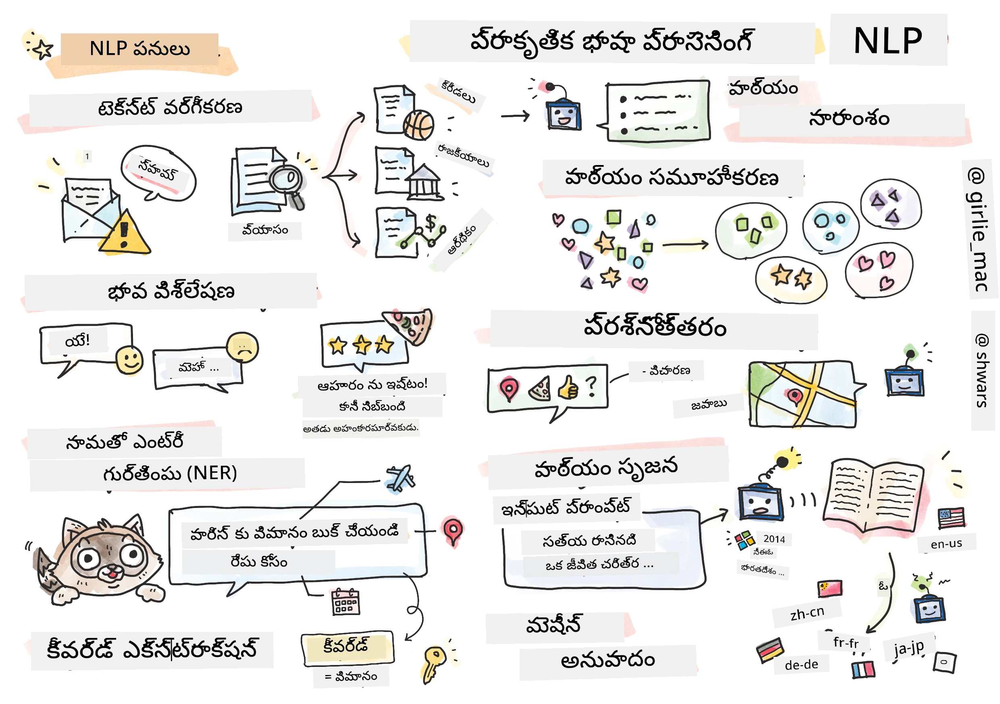

# సహజ భాషా ప్రాసెసింగ్



ఈ ప్రథాయంలో, మనం **సహజ భాషా ప్రాసెసింగ్ (NLP)** కు సంబంధించిన పనులను చూసే న్యూరల్ నెట్‌వర్క్స్ ఉపయోగంపై ధ్యాస పెట్టుకుందని ఉంటాం. కంప్యూటర్లు పరిష్కరించగలిగే అనేక NLP సమస్యలు ఉన్నాయి:

* **టెక్స్ట్ వర్గీకరణ** అనేది ఒక సాధారణ వర్గీకరణ సమస్య, ఇది వచన సలుపులతో సంబంధం కలిగినది. ఉదాహరణకు, ఇమెయిల్ సందేశాలను స్పామ్ లేదా నాన్-స్పామ్‌గా వర్గీకరించడం, లేదా వ్యాసాలను క్రీడలు, వ్యాపారం, రాజకీయాలు వంటివిగా వర్గీకరించడం. అలాగే, చాట్ బాట్ల అభివృద్ధిలో యూజర్ ఏమి చెప్పాలని భావిస్తున్నాడో అర్థం చేసుకోవాలి -- ఈ సందర్భంలో మనం **ఉద్దేశ వర్గీకరణ**తో వ్యవహరిస్తున్నాం. చాలా సందర్భాల్లో, ఉద్దేశ వర్గీకరణలో అనేక వర్గాలతో జోరుల ప్రయోజనం ఉంటుంది.
* **భావ విశ్లేషణ** ఒక సాధారణ రిగ్రెషన్ సమస్య, ఇందులో వాక్యం యొక్క అర్థం ఎంత అభినందనాత్మక లేదా ప్రతికూలమో సూచించే సంఖ్య (భావం)ని కేటాయించాలి. భావ విశ్లేషణ యొక్క మరింత అభివృద్ధి చెందిన సంస్కరణ **అంశాభిప్రాయ ఆధారిత భావ విశ్లేషణ** (ABSA) అంటే భావం పూర్తి వాక్యం కాకుండా వాక్యం భాగాలకు (అంశాలు) కేటాయించడం, ఉదా. *ఈ రెస్టారెంట్‌లో, నేను వంటకాన్ని ఇష్టపడ్డాను, కానీ వాతావరణం భయంకరంగా ఉంది*.
* **పేరు సాధారణ గుర్తింపు** (NER) అంటే వచనం నుండి కొన్ని నిర్దిష్ట ఏకకాల ప్రసంగాలను తీయడమే. ఉదాహరణకు, *నేను రేపు పారిస్‌కు ఫ్లై చేయాలి* అన్న పదంలో *రేపు* అంటే తేదీ మరియు *పారిస్* అంటే స్థలం అనేది అర్థం చేసుకోవాలి.  
* **కీవర్డ్ ఎక్స్ట్రాక్షన్** NER కి సమానంగా ఉంటుంది, కానీ ప్రత్యేక ఏకకాలప్రకారాల కోసం ముందుగా శిక్షణ చేయకుండా వాక్యం అర్థానికి ముఖ్యమైన పదాలను స్వయంచాలకంగా తీసుకోవాలి.
* **వచన సమూహీకరణ** అనగా దాదాపు సమానమైన వాక్యాలను ఒకదానితో మరొకటి సమూహీకరించడంలో ఉపయోగపడుతుంది, ఉదా., సాంకేతిక మద్దతు సంభాషణలలో ఇలాంటి సమానమైన అభ్యర్థనలు.
* **ప్రశ్నోత్తరము** అంటే ఒక మోడల్ నిర్దిష్టమైన ప్రశ్నకు సమాధానం ఇవ్వగల సామర్థ్యం. మోడల్ ఒక వచన భాగం మరియు ప్రశ్నను ఇన్‌పుట్‌గా తీసుకుంటుంది, ప్రశ్నకు సమాధానం ఉన్న వచన భాగాన్ని ఇవ్వాలి (లేదా కొన్ని సందర్భాల్లో సమాధాన వచనం ఉత్పత్తి చేయాలి).
* **వచన సృష్టి** అంటే ఒక మోడల్ కొత్త వచనం సృష్టించగల సామర్థ్యం. ఇది ఒక వర్గీకరణగా పరిగణించవచ్చు, ఇది కొంత *వచన సూచన* ఆధారంగా తదుపరి అక్షరం/పదాన్ని ఊహిస్తుంది. GPT-3 వంటి ఆధునిక వచన సృష్టి మోడళ్లు [prompt programming](https://towardsdatascience.com/software-3-0-how-prompting-will-change-the-rules-of-the-game-a982fbfe1e0) లేదా [prompt engineering](https://medium.com/swlh/openai-gpt-3-and-prompt-engineering-dcdc2c5fcd29) అనే సాంకేతికత ఉపయోగించి వేరే NLP పనులను కూడా పరిష్కరిస్తాయి.
* **వచన సారాంశీకరణ** అంటే కంప్యూటర్ చాలా వడిగా వచనం చదవటం, మరియు కొన్ని వాక్యాలలో దాని సారాంశాన్ని ఇవ్వడం.
* **మిషన్ అనువాదం** అనగా ఒక భాషలో వచనం అర్ధం చేసుకుని, మరొక భాషలో వచనం సృష్టించడం.

మొదట్లో, చాలామంది NLP పనులను సంప్రదాయ విధానాలతో జరిపేవారు, ఉదా. వ్యాకరణాలు. ఉదాహరణకు మిషన్ అనువాదంలో పార్సర్లు మూల వాక్యాన్ని సింటాక్స్ చెట్టు గా మార్చేవి, తరువాతపై స్థాయి సారాంశ నిర్మాణాలను తీసుకుని వాక్యం అర్థాన్ని సృష్టించేవి, ఆర్థం మరియు లక్ష్య భాష వ్యాకరణంతో ఫలితాన్ని జనరేట్ చేసేవి. ప్రస్తుతం, అనేక NLP పనులు అధిక సమర్థతతో న్యూరల్ నెట్‌వర్క్స్ ద్వారా పరిష్కరించబడుతున్నాయి.

> [Natural Language Processing Toolkit (NLTK)](https://www.nltk.org) పైథాన్ లైబ్రరీలో చాలా సంప్రదాయ NLP పద్ధతులు అమలవుతాయి. అంతేకాకుండా, ఎలా NLTK ఉపయోగించి వివిధ NLP పనులు పరిష్కరించవచ్చో చెప్తున్న గొప్ప [NLTK పుస్తకం](https://www.nltk.org/book/) ఆన్లైన్ లో అందుబాటులో ఉంది.

మన కోర్సులో, ఎక్కువగా న్యూరల్ నెట్‌వర్క్స్‌ని NLP కోసం ఉపయోగించేటట్టు తీసుకువస్తాం, అవసరమైతే NLTK ని ఉపయోగిస్తాం.

మేము ఇప్పటికే పట్టికా డేటా మరియు చిత్రాలతో పని చేసే న్యూరల్ నెట్‌వర్క్‌లు గురించి నేర్చుకున్నాము. ఆ డేటా రకాలతో మరియు వచనంతో ప్రధాన వ్యత్యాసం ఏమిటంటే, వచనం వరుసగా ఉంటే, చిత్రాల ఇన్‌పుట్ పరిమాణం ముందుగా తెలిసి ఉంటుంది. కాంలోవల్యూషనల్ నెట్‌వర్క్‌లు ఇన్‌పుట్ డేటా నుండి నమూనాలను వెలువరించగలవు కానీ వచన నమూనాలు మరింత క్లిష్టమైనవి. ఉదా., వాక్యం లో నెగేషన్ విషయం నుండి వేరుగా ఉండొచ్చు (ఉదా. *I do not like oranges* మరియు *I do not like those big colorful tasty oranges*), అయినా అది ఒక్కటేనైన నమూనాగా అర్థం చేసుకోవాలి. కాబట్టి భాషను నిర్వహించడానికి మనం కొత్త న్యూరల్ నెట్‌వర్క్ రకాలు అవసరం, ఉదా., *రీకరెంట్ నెట్‌వర్క్‌లు* మరియు *ట్రాన్స్‌ఫార్మర్స్*.

## లైబ్రరీల ఇన్‌స్టాల్ చేయండి

మీరు ఈ కోర్సు కోసం స్థానికంగా పైథాన్ ఇన్‌స్టాలేషన్ ఉపయోగిస్తుంటే, క్రింద పేర్కొన్న ఆదేశాలను ఉపయోగించి NLP కి అవసరమైన అన్ని లైబ్రరీలను ఇన్‌స్టాల్ చేసుకోవాలి:

**PyTorch కోసం**
```bash
pip install -r requirements-pytorch.txt
```
**TensorFlow కోసం**
```bash
pip install -r requirements-tf.txt
```

> [Microsoft Learn](https://docs.microsoft.com/learn/modules/intro-natural-language-processing-tensorflow/?WT.mc_id=academic-77998-cacaste)లో TensorFlowతో NLP ప్రయత్నించవచ్చు

## GPU హెచ్చరిక

ఈ భాగంలో, కొన్ని ఉదాహరణలలో మనం చాలా పెద్ద మోడళ్లను శిక్షణ ఇస్తామన్నది ఉంది.
* **GPU-సమర్థ కంప్యూటర్ ఉపయోగించండి**: పెద్ద మోడళ్లతో పనిచేసేటప్పుడు వేచి ఉండే సమయాలను తగ్గించడానికి GPU-సమర్థ కంప్యూటర్‌లో నోట్బుక్స్ నడపడం సలహా.
* **GPU మెమరీ పరిమితులు**: పెద్ద మోడళ్ల శిక్షణలో GPU మెమరీ కొరతగా ఉండొచ్చు.
* **GPU మెమరీ వినియోగం**: శిక్షణ సమయంలో GPU మెమరీ వినియోగం వివిధ అంశాలపై ఆధారపడి ఉంటుంది, వాటిలోని ఒకటి మినిబ్యాచ్ పరిమాణం.
* **మినిబ్యాచ్ పరిమాణం తగ్గించండి**: GPU మెమరీ సమస్యలు ఎదురైతే, కోడ్లో మినిబ్యాచ్ పరిమాణం తగ్గించడం ఒక పరిష్కారంగా ఉపయోగపడి ఉంటుంది.
* **TensorFlow GPU మెమరీ విడుదల**: పాత TensorFlow సంకలనాలు ఒకే పైథాన్ కర్నెల్‌లో అనేక మోడళ్లను శిక్షణ ఇస్తూ GPU మెమరీను సరిగా విడుదల చేయకపోవచ్చు. GPU మెమరీ వినియోగాన్ని సమర్థవంతంగా నిర్వహించేందుకు TensorFlowని అవసరమైన వెంటనే GPU మెమరీ కేటాయించ하도록 సెట్ చేయవచ్చు.
* **కోడ్ చేర్పు**: GPU మెమరీ కేటాయింపును అవసరానికి మాత్రమే పెరుగుదల చేసే విధంగా TensorFlowని సెట్ చేయడానికి మీ నోట్బుక్స్‌లో క్రింది కోడ్ చేర్చండి:

```python
physical_devices = tf.config.list_physical_devices('GPU') 
if len(physical_devices)>0:
    tf.config.experimental.set_memory_growth(physical_devices[0], True) 
```

మీరు క్లాసిక్ మెషీన్ లెర్నింగ్ దృక్పథం నుండి NLP నేర్చుకోవాలనుకుంటే, [ఈ పాఠశాల శ్రేణి](https://github.com/microsoft/ML-For-Beginners/tree/main/6-NLP)ను సందర్శించండి

## ఈ భాగంలో
ఈ భాగంలో మనం నేర్చుకునేది:

* [పదాలను టెన్సర్స్ రూపంలో ప్రాతినిధ్యం](13-TextRep/README.md)
* [వర్డ్ ఎంబెడ్డింగ్స్](14-Embeddings/README.md)
* [భాషా మోడలింగ్](15-LanguageModeling/README.md)
* [రికరెంట్ న్యూరల్ నెట్‌వర్క్స్](16-RNN/README.md)
* [జనరేటివ్ నెట్‌వర్క్స్](17-GenerativeNetworks/README.md)
* [ట్రాన్స్‌ఫార్మర్స్](18-Transformers/README.md)

---

<!-- CO-OP TRANSLATOR DISCLAIMER START -->
**అస్వీకరణ**:
ఈ పత్రం AI అనువాద సేవ [Co-op Translator](https://github.com/Azure/co-op-translator) ఉపయోగించి అనువదించబడింది. మేము ఖచ్చితత్వానికి ప్రయత్నిస్తున్నప్పటికీ, ఆటోమేటెడ్ అనువాదాలు తప్పులు లేదా అసమగ్రతలను కలిగి ఉండవచ్చు. దాని స్వదేశ భాషలో ఉన్న అసలు పత్రాన్ని అధికారం కలిగిన మూలంగా పరిగణించాలి. కీలకమైన సమాచారం కోసం, ప్రొఫెషనల్ మానవ అనువాదాన్ని సిఫారసు చేస్తాము. ఈ అనువాదం ఉపయోగం వల్ల కలిగే ఏవైనా అపార్థాలు లేదా తప్పుదారులు కోసం మేము బాధ్యత వహించము.
<!-- CO-OP TRANSLATOR DISCLAIMER END -->