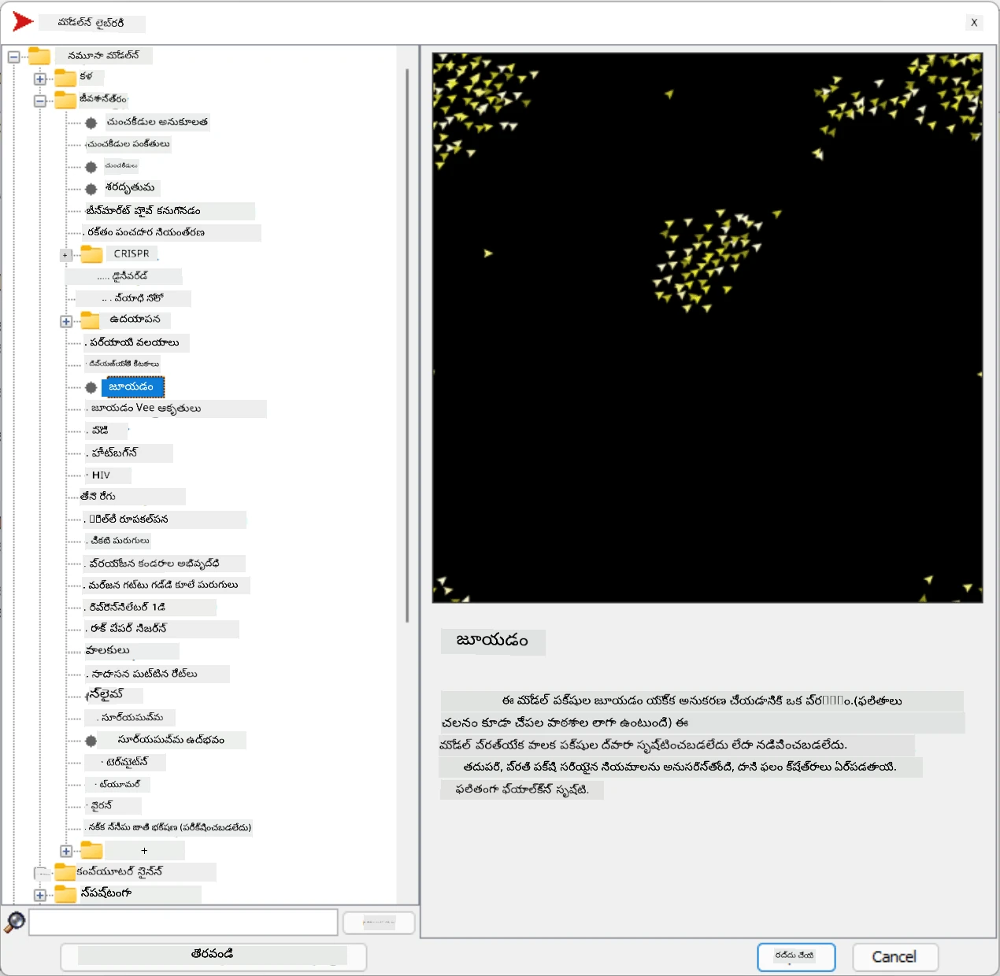

# బహుళ-ఏజెంట్ వ్యవస్థలు

బుద్ధిమత్తను సాధించడానికి ఒక సాధ్యమైన మార్గం అనేది **ఎమర్జెంట్** (లేదా **సినర్జెటిక్**) దృష్టికోణం, ఇది అనేక సాపేక్షంగా సులభమైన ఏజెంట్ల సమ్మిళిత ప్రవర్తన మొత్తం వ్యవస్థ యొక్క మరింత సంక్లిష్టమైన (లేదా బుద్ధిమంతమైన) ప్రవర్తనకు దారితీస్తుందని ఆధారపడింది. స 이 సిద్ధాంతం [సమూహ బుద్ధిమత్త](https://en.wikipedia.org/wiki/Collective_intelligence), [ఎమర్జెంటిజం](https://en.wikipedia.org/wiki/Global_brain) మరియు [ఎవల్యూషనరీ సైబర్నెటిక్స్](https://en.wikipedia.org/wiki/Global_brain) సూత్రాలపై ఆధారపడి ఉంటుంది, ఇవి తక్కువ స్థాయి వ్యవస్థల నుండి సరైన రీతిలో కలిపినప్పుడు ఉన్నత స్థాయి వ్యవస్థలకు అదనపు విలువ లభిస్తుందని (ఇది *మెటాసిస్టమ్ ట్రాన్సిషన్ సూత్రం* అని పిలవబడుతుంది) చెబుతాయి.

## [పూర్వ-లెక్చర్ క్విజ్](https://ff-quizzes.netlify.app/en/ai/quiz/45)

**బహుళ-ఏజెంట్ వ్యవస్థలు** దిశ 1990లలో ఇంటర్నెట్ మరియు పంపిణీ వ్యవస్థల పెరుగుదలకు ప్రతిస్పందనగా AIలో ఏర్పడింది. క్లాసికల్ AI పాఠ్యపుస్తకాలలో ఒకటి అయిన [Artificial Intelligence: A Modern Approach](https://en.wikipedia.org/wiki/Artificial_Intelligence:_A_Modern_Approach) బహుళ-ఏజెంట్ వ్యవస్థల దృష్టికోణం నుండి క్లాసికల్ AIని పరిశీలిస్తుంది.

బహుళ-ఏజెంట్ దృష్టికోణానికి కేంద్రంగా ఉన్నది **ఏజెంట్** అనే భావన - ఇది ఒక **పరిసరంలో** జీవించే ఒక సত্ত, దాన్ని గ్రహించి, దానిపై చర్యలు తీసుకోవచ్చు. ఇది చాలా విస్తృత నిర్వచనం, మరియు ఏజెంట్లకు అనేక రకాల వర్గీకరణలు ఉండవచ్చు:

* వారి తర్క సామర్థ్యాల ప్రకారం:
   - **ప్రతిస్పందక** ఏజెంట్లు సాధారణంగా సులభమైన అభ్యర్థన-ప్రతిస్పందన ప్రవర్తన కలిగి ఉంటాయి
   - **తర్కసంబంధి** ఏజెంట్లు తర్కం మరియు/లేదా ప్రణాళిక సామర్థ్యాలను ఉపయోగిస్తారు
* ఏజెంట్ కోడ్ ఎక్కడ అమలు అవుతుందో ఆధారంగా:
   - **స్థిర** ఏజెంట్లు ప్రత్యేక నెట్‌వర్క్ నోడ్‌లో పనిచేస్తాయి
   - **మొబైల్** ఏజెంట్లు తమ కోడ్‌ను నెట్‌వర్క్ నోడ్‌ల మధ్య తరలించగలవు
* వారి ప్రవర్తన ఆధారంగా:
   - **నిష్క్రియ ఏజెంట్లు** నిర్దిష్ట లక్ష్యాలు ఉండవు. ఇలాంటి ఏజెంట్లు బాహ్య ప్రేరణలకు ప్రతిస్పందించగలవు, కానీ స్వయంగా చర్యలు ప్రారంభించరు.
   - **క్రియాశీల ఏజెంట్లు** తమ లక్ష్యాలను అనుసరిస్తారు
   - **జ్ఞానాత్మక ఏజెంట్లు** సంక్లిష్ట ప్రణాళిక మరియు తర్కాన్ని కలిగి ఉంటాయి

ఇప్పటికీ బహుళ-ఏజెంట్ వ్యవస్థలు అనేక అనువర్తనాల్లో ఉపయోగించబడుతున్నాయి:

* గేమ్స్‌లో, అనేక నాన్-ప్లేయర్ క్యారెక్టర్లు ఏఐని ఉపయోగించి తెలివైన ఏజెంట్లుగా పరిగణించబడతాయి
* వీడియో ఉత్పత్తిలో, గుంపులున్న సంక్లిష్ట 3D సన్నివేశాలను సాధారణంగా బహుళ-ఏజెంట్ సిమ్యులేషన్ ద్వారా రూపొందిస్తారు
* వ్యవస్థల మోడలింగ్‌లో, బహుళ-ఏజెంట్ దృష్టికోణం సంక్లిష్ట మోడల్ ప్రవర్తనను అనుకరించడానికి ఉపయోగిస్తారు. ఉదాహరణకు, COVID-19 వ్యాప్తిని ప్రపంచవ్యాప్తంగా అంచనా వేయడానికి బహుళ-ఏజెంట్ దృష్టికోణం విజయవంతంగా ఉపయోగించబడింది. ఇలాంటి దృష్టికోణం నగర ట్రాఫిక్‌ను మోడల్ చేయడానికి మరియు ట్రాఫిక్ నియమాలలో మార్పులకు ఎలా స్పందిస్తుందో చూడటానికి ఉపయోగించవచ్చు.
* సంక్లిష్ట ఆటోమేషన్ వ్యవస్థల్లో, ప్రతి పరికరం స్వతంత్ర ఏజెంట్‌గా పనిచేయవచ్చు, ఇది మొత్తం వ్యవస్థను తక్కువ మోనోలిథిక్ మరియు మరింత బలమైనదిగా చేస్తుంది.

మనం బహుళ-ఏజెంట్ వ్యవస్థలలో లోతుగా వెళ్ళకపోయినా, ఒక **బహుళ-ఏజెంట్ మోడలింగ్** ఉదాహరణను పరిశీలిద్దాం.

## నెట్‌లాగో

[NetLogo](https://ccl.northwestern.edu/netlogo/) అనేది [Logo](https://en.wikipedia.org/wiki/Logo_(programming_language)) ప్రోగ్రామింగ్ భాష యొక్క సవరించిన వెర్షన్ ఆధారంగా ఉన్న బహుళ-ఏజెంట్ మోడలింగ్ వాతావరణం. ఈ భాష పిల్లలకు ప్రోగ్రామింగ్ కాన్సెప్ట్‌లు నేర్పడానికి అభివృద్ధి చేయబడింది, మరియు మీరు **టర్టిల్** అనే ఏజెంట్‌ను నియంత్రించవచ్చు, ఇది కదిలి, వెనుకకు ట్రేస్ వదిలిస్తుంది. ఇది సంక్లిష్ట జ్యామితీయ ఆకారాలను సృష్టించడానికి అనుమతిస్తుంది, ఇది ఏజెంట్ ప్రవర్తనను అర్థం చేసుకోవడానికి చాలా దృశ్యమాన మార్గం.

నెట్‌లాగోలో, `create-turtles` కమాండ్ ఉపయోగించి అనేక టర్టిల్స్ సృష్టించవచ్చు. తరువాత మీరు అన్ని టర్టిల్స్‌ను కొన్ని చర్యలు చేయమని ఆదేశించవచ్చు (క్రింది ఉదాహరణలో - 10 పాయింట్లు ముందుకు):

```
create-turtles 10
ask turtles [
  forward 10
]
```


అవును, అన్ని టర్టిల్స్ ఒకే పని చేయడం ఆసక్తికరం కాదు, కాబట్టి మీరు `ask` ద్వారా టర్టిల్స్ సమూహాలను అడగవచ్చు, ఉదాహరణకు ఒక నిర్దిష్ట బిందువు సమీపంలో ఉన్నవారు. మీరు `breed [cats cat]` కమాండ్ ఉపయోగించి వేర్వేరు *జాతులు* టర్టిల్స్ సృష్టించవచ్చు. ఇక్కడ `cat` అనేది జాతి పేరు, మరియు స్పష్టత కోసం ఏకవచనం మరియు బహువచనం రెండూ ఇవ్వాలి, ఎందుకంటే వేర్వేరు కమాండ్లు వేర్వేరు రూపాలను ఉపయోగిస్తాయి.

> ✅ నెట్‌లాగో భాష నేర్చుకోవడంలో మేము లోతుగా వెళ్ళము - మీరు ఆసక్తి ఉంటే అద్భుతమైన [ప్రారంభకుల ఇంటరాక్టివ్ నెట్‌లాగో డిక్షనరీ](https://ccl.northwestern.edu/netlogo/bind/) వనరును సందర్శించవచ్చు.

మీరు [డౌన్లోడ్](https://ccl.northwestern.edu/netlogo/download.shtml) చేసి నెట్‌లాగోను ఇన్‌స్టాల్ చేసి ప్రయత్నించవచ్చు.

### మోడల్స్ లైబ్రరీ

నెట్‌లాగోలో ఉన్న గొప్ప విషయం ఏమిటంటే, మీరు ప్రయత్నించగల పని చేసే మోడల్స్ లైబ్రరీ ఉంది. **File → Models Library**కి వెళ్లండి, మీరు ఎన్నుకోవడానికి అనేక మోడల్స్ వర్గాలు ఉంటాయి.



> మోడల్స్ లైబ్రరీ స్క్రీన్‌షాట్ - Dmitry Soshnikov

మీరు ఒక మోడల్ తెరవవచ్చు, ఉదాహరణకు **Biology → Flocking**.

### ప్రధాన సూత్రాలు

మోడల్ తెరిచిన తర్వాత, మీరు ప్రధాన నెట్‌లాగో స్క్రీన్‌కు తీసుకువెళ్ళబడతారు. ఇక్కడ ఒక నమూనా మోడల్ ఉంది, ఇది పరిమిత వనరులు (గడ్డి) ఉన్నప్పుడు నక్కలు మరియు గొర్రెల జనాభాను వివరించేది.


> స్క్రీన్‌షాట్ - Dmitry Soshnikov

ఈ స్క్రీన్‌లో మీరు చూడగలరు:

* **ఇంటర్‌ఫేస్** విభాగం, ఇది:
  - అన్ని ఏజెంట్లు నివసించే ప్రధాన ఫీల్డ్
  - వివిధ నియంత్రణలు: బటన్లు, స్లైడర్లు, మొదలైనవి
  - సిమ్యులేషన్ పరామితులను ప్రదర్శించడానికి గ్రాఫ్లు
* **కోడ్** ట్యాబ్, ఇది ఎడిటర్‌ను కలిగి ఉంటుంది, మీరు ఇక్కడ నెట్‌లాగో ప్రోగ్రామ్ టైప్ చేయవచ్చు

అధికంగా, ఇంటర్‌ఫేస్‌లో **Setup** బటన్ ఉంటుంది, ఇది సిమ్యులేషన్ స్థితిని ప్రారంభిస్తుంది, మరియు **Go** బటన్ ఉంటుంది, ఇది అమలును ప్రారంభిస్తుంది. ఇవి కోడ్‌లోని సంబంధిత హ్యాండ్లర్ల ద్వారా నిర్వహించబడతాయి, ఇవి ఇలా ఉంటాయి:

```
to go [
...
]
```


నెట్‌లాగో ప్రపంచం క్రింది వస్తువుల నుండి ఉంటుంది:

* **ఏజెంట్లు** (టర్టిల్స్) ఫీల్డ్‌లో కదిలి ఏదైనా చేయగలవు. మీరు `ask turtles [...]` సింటాక్స్ ఉపయోగించి ఏజెంట్లను ఆదేశిస్తారు, మరియు బ్రాకెట్లలో ఉన్న కోడ్ అన్ని ఏజెంట్ల ద్వారా *టర్టిల్ మోడ్*లో అమలు అవుతుంది.
* **ప్యాచెస్** ఫీల్డ్‌లోని చతురస్ర ప్రాంతాలు, ఏజెంట్లు ఇక్కడ నివసిస్తారు. మీరు అదే ప్యాచ్‌లో ఉన్న ఏజెంట్లను సూచించవచ్చు, లేదా ప్యాచ్ రంగులు మరియు ఇతర లక్షణాలను మార్చవచ్చు. మీరు `ask patches` కూడా చేయవచ్చు.
* **ఆబ్జర్వర్** ఒక ప్రత్యేక ఏజెంట్, ఇది ప్రపంచాన్ని నియంత్రిస్తుంది. అన్ని బటన్ హ్యాండ్లర్లు *ఆబ్జర్వర్ మోడ్*లో అమలు అవుతాయి.

> ✅ బహుళ-ఏజెంట్ వాతావరణం అందమైన విషయం ఏమిటంటే, టర్టిల్ మోడ్ లేదా ప్యాచ్ మోడ్‌లో నడిచే కోడ్ అన్ని ఏజెంట్ల ద్వారా సమాంతరంగా అమలు అవుతుంది. కాబట్టి, కొద్దిగా కోడ్ రాయడం ద్వారా మరియు వ్యక్తిగత ఏజెంట్ ప్రవర్తనను ప్రోగ్రామ్ చేయడం ద్వారా, మీరు మొత్తం సిమ్యులేషన్ వ్యవస్థ యొక్క సంక్లిష్ట ప్రవర్తనను సృష్టించవచ్చు.

### ఫ్లాకింగ్

బహుళ-ఏజెంట్ ప్రవర్తన ఉదాహరణగా, **[ఫ్లాకింగ్](https://en.wikipedia.org/wiki/Flocking_(behavior))**ను పరిశీలిద్దాం. ఫ్లాకింగ్ అనేది పక్షుల గుంపులు ఎలాగు ఎగరుతాయో దానికి చాలా సమానమైన సంక్లిష్ట నమూనా. వాటిని ఎగరుతూ చూస్తే, అవి ఏదో సమూహ అల్గోరిథం అనుసరిస్తున్నట్లు లేదా అవి ఒక రకమైన *సమూహ బుద్ధిమత్త* కలిగి ఉన్నట్లు అనిపిస్తుంది. అయితే, ఈ సంక్లిష్ట ప్రవర్తన ప్రతి వ్యక్తిగత ఏజెంట్ (ఈ సందర్భంలో, *పక్షి*) తాను దగ్గరలో ఉన్న కొన్ని ఏజెంట్లను మాత్రమే గమనించి, మూడు సులభమైన నియమాలను అనుసరించినప్పుడు ఏర్పడుతుంది:

* **అలైన్‌మెంట్** - ఇది సమీప ఏజెంట్ల సగటు దిశ వైపు తిప్పుకుంటుంది
* **కోహెషన్** - ఇది సమీపవాసుల సగటు స్థాన వైపు తిప్పుకోవడానికి ప్రయత్నిస్తుంది (*దూర ఆకర్షణ*)
* **సెపరేషన్** - ఇతర పక్షులకి చాలా దగ్గరగా వచ్చినప్పుడు, దూరంగా కదలడానికి ప్రయత్నిస్తుంది (*సన్నని విరోధం*)

మీరు ఫ్లాకింగ్ ఉదాహరణను నడిపించి ప్రవర్తనను గమనించవచ్చు. మీరు *వేరుపాటు స్థాయి* లేదా *దృష్టి పరిధి* వంటి పరామితులను సర్దుబాటు చేయవచ్చు, ఇది ప్రతి పక్షి ఎంత దూరం చూడగలదో నిర్వచిస్తుంది. దృష్టి పరిధిని 0కి తగ్గిస్తే, అన్ని పక్షులు అంధులవుతాయి, ఫ్లాకింగ్ ఆగిపోతుంది. వేరుపాటును 0కి తగ్గిస్తే, అన్ని పక్షులు ఒక సరళ రేఖలో చేరిపోతాయి.

> ✅ **కోడ్** ట్యాబ్‌కు మారి ఫ్లాకింగ్ యొక్క మూడు నియమాలు (అలైన్‌మెంట్, కోహెషన్, సెపరేషన్) ఎక్కడ అమలు అవుతున్నాయో చూడండి. మనం దృష్టిలో ఉన్న ఏజెంట్లను మాత్రమే ఎలా సూచిస్తున్నామో గమనించండి.

### చూడవలసిన ఇతర మోడల్స్

మరిన్ని ఆసక్తికరమైన మోడల్స్ ఉన్నాయి, వాటితో మీరు ప్రయోగాలు చేయవచ్చు:

* **Art → Fireworks** ఒక ఫైర్వర్క్ వ్యక్తిగత అగ్నిప్రమాణాల సమూహ ప్రవర్తనగా ఎలా పరిగణించబడుతుందో చూపిస్తుంది
* **Social Science → Traffic Basic** మరియు **Social Science → Traffic Grid** నగర ట్రాఫిక్ మోడల్‌ను 1D మరియు 2D గ్రిడ్‌లో ట్రాఫిక్ లైట్లతో లేదా లేకుండా చూపిస్తాయి. సిమ్యులేషన్‌లో ప్రతి కారు ఈ నియమాలను అనుసరిస్తుంది:
   - ముందున్న స్థలం ఖాళీగా ఉంటే - వేగం పెంచు (గరిష్ట వేగం వరకు)
   - ముందున్న అడ్డంకిని చూసినప్పుడు - బ్రేక్ వేయి (డ్రైవర్ ఎంత దూరం చూడగలడో సర్దుబాటు చేయవచ్చు)
* **Social Science → Party** ఒక కాక్‌టెయిల్ పార్టీ సమయంలో ప్రజలు ఎలా గుంపులుగా చేరుకుంటారో చూపిస్తుంది. మీరు గుంపు సంతోషం వేగంగా పెరిగే పరామితుల కలయికను కనుగొనవచ్చు.

ఈ ఉదాహరణల నుండి మీరు చూడగలిగినట్లు, బహుళ-ఏజెంట్ సిమ్యులేషన్లు ఒకే లేదా సమాన తర్కాన్ని అనుసరించే వ్యక్తుల సమూహం ఉన్న సంక్లిష్ట వ్యవస్థ ప్రవర్తనను అర్థం చేసుకోవడానికి చాలా ఉపయోగకరమైన మార్గం. ఇది కంప్యూటర్ గేమ్స్‌లో [NPCs](https://en.wikipedia.org/wiki/NPC) లేదా 3D యానిమేటెడ్ ప్రపంచాల్లో ఏజెంట్లను నియంత్రించడానికి కూడా ఉపయోగించవచ్చు.

## తర్కసంబంధి ఏజెంట్లు

పైన వివరించిన ఏజెంట్లు చాలా సులభమైనవి, పరిసరాల్లో మార్పులకు ప్రతిస్పందించే అల్గోరిథం ఉపయోగిస్తాయి. వీటిని **ప్రతిస్పందక ఏజెంట్లు** అంటారు. అయితే, కొన్ని సార్లు ఏజెంట్లు తర్కం చేసి తమ చర్యలను ప్రణాళిక చేయగలవు, అప్పుడు వీటిని **తర్కసంబంధి** అంటారు.

సాధారణ ఉదాహరణగా, ఒక వ్యక్తిగత ఏజెంట్ ఒక మనిషి నుండి సెలవు పర్యటన బుక్ చేయమని సూచన పొందుతుంది. ఇంటర్నెట్‌లో నివసించే అనేక ఏజెంట్లు సహాయం చేయగలవు. అది ఇతర ఏజెంట్లను సంప్రదించి ఎలాంటి విమానాలు అందుబాటులో ఉన్నాయో, వివిధ తేదీలకు హోటల్ ధరలు ఏమిటో తెలుసుకుని ఉత్తమ ధర కోసం చర్చించాలి. సెలవు ప్రణాళిక పూర్తయి యజమాని ధృవీకరించిన తర్వాత బుకింగ్ చేయవచ్చు.

అందుకోసం, ఏజెంట్లు **సంవాదం** చేయాలి. విజయవంతమైన సంభాషణకు అవసరమైనవి:

* **జ్ఞాన మార్పిడి కోసం కొన్ని ప్రామాణిక భాషలు**, ఉదాహరణకు [Knowledge Interchange Format](https://en.wikipedia.org/wiki/Knowledge_Interchange_Format) (KIF) మరియు [Knowledge Query and Manipulation Language](https://en.wikipedia.org/wiki/Knowledge_Query_and_Manipulation_Language) (KQML). ఈ భాషలు [Speech Act theory](https://en.wikipedia.org/wiki/Speech_act) ఆధారంగా రూపొందించబడ్డాయి.
* వివిధ **లైలాలు** ఆధారంగా **చర్చల ప్రోటోకాల్‌లు** కూడా ఉండాలి.
* ఒకే భావాలను సూచించడానికి **సాధారణ ఆంటాలజీ** ఉండాలి, దాని అర్థం తెలుసుకుని
* వివిధ ఏజెంట్లు ఏమి చేయగలరో కనుగొనడానికి ఒక విధానం ఉండాలి, ఇది కూడా ఆంటాలజీ ఆధారంగా ఉంటుంది

తర్కసంబంధి ఏజెంట్లు ప్రతిస్పందక ఏజెంట్ల కంటే చాలా సంక్లిష్టమైనవి, ఎందుకంటే అవి పరిసరాల్లో మార్పులకు మాత్రమే ప్రతిస్పందించకుండా, *చర్యలు ప్రారంభించగలగాలి*. తర్కసంబంధి ఏజెంట్లకు ప్రతిపాదించిన ఆర్కిటెక్చర్‌లలో ఒకటి బిలీఫ్-డిజైర్-ఇంటెన్షన్ (BDI) ఏజెంట్:

* **బిలీఫ్స్** ఏజెంట్ పరిసరాల గురించి జ్ఞాన సెట్. ఇది ఒక జ్ఞాన ఆధారం లేదా నియమాల సెట్‌గా ఉండవచ్చు, ఏజెంట్ దాన్ని పరిసర పరిస్థితికి అనుగుణంగా వర్తింపజేస్తుంది.
* **డిజైర్స్** ఏజెంట్ చేయదలచుకున్నవి, అంటే లక్ష్యాలు. ఉదాహరణకు, పై వ్యక్తిగత సహాయక ఏజెంట్ లక్ష్యం పర్యటన బుక్ చేయడం, హోటల్ ఏజెంట్ లక్ష్యం లాభం గరిష్టం చేయడం.
* **ఇంటెన్షన్స్** ఏజెంట్ తన లక్ష్యాలను సాధించడానికి ప్రణాళ

---

<!-- CO-OP TRANSLATOR DISCLAIMER START -->
**అస్పష్టత**:  
ఈ పత్రాన్ని AI అనువాద సేవ [Co-op Translator](https://github.com/Azure/co-op-translator) ఉపయోగించి అనువదించబడింది. మేము ఖచ్చితత్వానికి ప్రయత్నించినప్పటికీ, ఆటోమేటెడ్ అనువాదాల్లో పొరపాట్లు లేదా తప్పిదాలు ఉండవచ్చు. మూల పత్రం దాని స్వదేశీ భాషలో అధికారిక మూలంగా పరిగణించాలి. ముఖ్యమైన సమాచారానికి, ప్రొఫెషనల్ మానవ అనువాదం సిఫార్సు చేయబడుతుంది. ఈ అనువాదం వాడకం వల్ల కలిగే ఏవైనా అపార్థాలు లేదా తప్పుదారుల బాధ్యత మేము తీసుకోము.
<!-- CO-OP TRANSLATOR DISCLAIMER END -->