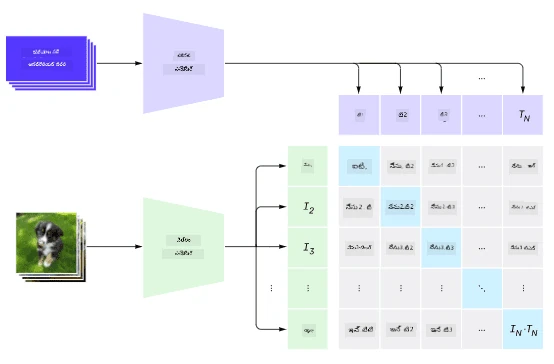
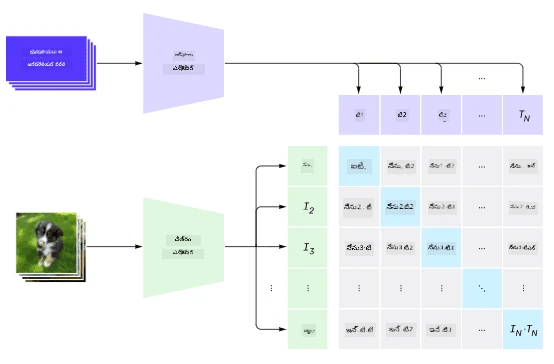
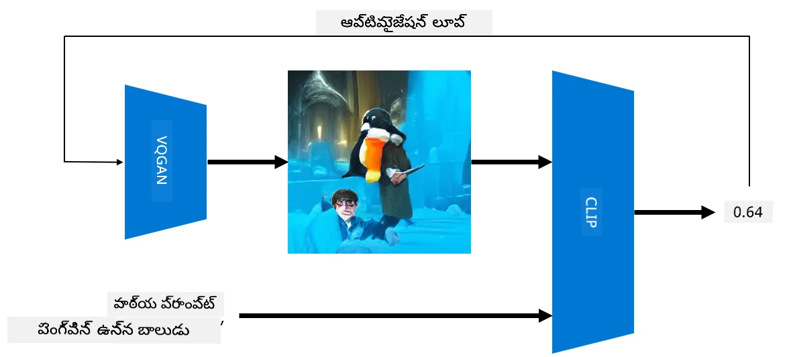

# బహుముఖ నెట్‌వర్క్స్

NLP పనులను పరిష్కరించడంలో ట్రాన్స్‌ఫార్మర్ మోడల్స్ విజయవంతమైన తర్వాత, అదే లేదా సమానమైన నిర్మాణాలను కంప్యూటర్ విజన్ పనులకు కూడా వర్తింపజేశారు. విజన్ మరియు సహజ భాషా సామర్థ్యాలను *కలిపే* మోడల్స్ నిర్మించడంలో పెరుగుతున్న ఆసక్తి ఉంది. అలాంటి ప్రయత్నాల్లో ఒకటి OpenAI ద్వారా చేయబడింది, దాన్ని CLIP మరియు DALL.E అని పిలుస్తారు.

## కాంట్రాస్టివ్ ఇమేజ్ ప్రీ-ట్రైనింగ్ (CLIP)

CLIP యొక్క ప్రధాన ఆలోచన ఏమిటంటే, టెక్స్ట్ ప్రాంప్ట్‌లను ఒక చిత్రంతో పోల్చి, ఆ చిత్రం ప్రాంప్ట్‌కు ఎంతగా సరిపోతుందో నిర్ణయించగలగడం.

> *చిత్రం [ఈ బ్లాగ్ పోస్ట్](https://openai.com/blog/clip/) నుండి*

మోడల్ ఇంటర్నెట్ నుండి సేకరించిన చిత్రాలు మరియు వాటి క్యాప్షన్లపై శిక్షణ పొందుతుంది. ప్రతి బ్యాచ్‌లో, N జంటల (చిత్రం, టెక్స్ట్) తీసుకుని వాటిని I1,..., IN / T1, ..., TN అనే వెక్టర్ ప్రాతినిధ్యాలుగా మార్చుతారు. ఆ ప్రాతినిధ్యాలను జతచేస్తారు. లాస్ ఫంక్షన్ ఒక జంటకు చెందిన వెక్టర్ల (ఉదా: Ii మరియు Ti) మధ్య కోసైన్ సారూప్యతను గరిష్టం చేయాలని, మరియు ఇతర జంటల మధ్య కోసైన్ సారూప్యతను తగ్గించాలని నిర్వచిస్తుంది. అందుకే ఈ పద్ధతిని **కాంట్రాస్టివ్** అంటారు.

CLIP మోడల్/లైబ్రరీ [OpenAI GitHub](https://github.com/openai/CLIP) నుండి అందుబాటులో ఉంది. ఈ పద్ధతి [ఈ బ్లాగ్ పోస్ట్](https://openai.com/blog/clip/)లో వివరించబడింది, మరింత వివరంగా [ఈ పేపర్](https://arxiv.org/pdf/2103.00020.pdf)లో ఉంది.

ఒకసారి ఈ మోడల్ ప్రీ-ట్రెయిన్ అయిన తర్వాత, చిత్రాల బ్యాచ్ మరియు టెక్స్ట్ ప్రాంప్ట్‌ల బ్యాచ్ ఇవ్వగలము, ఇది ప్రాబబిలిటీలతో కూడిన టెన్సర్‌ను తిరిగి ఇస్తుంది. CLIP ను అనేక పనుల కోసం ఉపయోగించవచ్చు:

**చిత్ర వర్గీకరణ**

ఉదాహరణకు, పిల్లులు, కుక్కలు మరియు మనుషుల మధ్య చిత్రాలను వర్గీకరించాలి అనుకుందాం. ఈ సందర్భంలో, మోడల్‌కు ఒక చిత్రం మరియు టెక్స్ట్ ప్రాంప్ట్‌ల సిరీస్ ఇవ్వవచ్చు: "*పిల్లి యొక్క చిత్రం*", "*కుక్క యొక్క చిత్రం*", "*మనిషి యొక్క చిత్రం*". 3 ప్రాబబిలిటీల వెక్టర్‌లో అత్యధిక విలువ ఉన్న సూచికను ఎంచుకోవడం సరిపోతుంది.

> *చిత్రం [ఈ బ్లాగ్ పోస్ట్](https://openai.com/blog/clip/) నుండి*

**టెక్స్ట్ ఆధారిత చిత్రం శోధన**

మరియు విరుద్ధంగా కూడా చేయవచ్చు. మన దగ్గర చిత్రాల సేకరణ ఉంటే, ఆ సేకరణను మోడల్‌కు ఇవ్వవచ్చు, మరియు ఒక టెక్స్ట్ ప్రాంప్ట్ ఇవ్వగలము - ఇది ఆ ప్రాంప్ట్‌కు అత్యంత సమానమైన చిత్రాన్ని ఇస్తుంది.

## ✍️ ఉదాహరణ: [చిత్ర వర్గీకరణ మరియు చిత్రం శోధన కోసం CLIP ఉపయోగించడం](Clip.ipynb)

CLIP ను ప్రాక్టికల్‌గా చూడడానికి [Clip.ipynb](Clip.ipynb) నోట్‌బుక్‌ను తెరవండి.

## VQGAN+ CLIP తో చిత్రం సృష్టి

CLIP ను టెక్స్ట్ ప్రాంప్ట్ నుండి **చిత్రం సృష్టించడానికి** కూడా ఉపయోగించవచ్చు. దీని కోసం, కొన్ని వెక్టర్ ఇన్‌పుట్ ఆధారంగా చిత్రాలను సృష్టించగల **జనరేటర్ మోడల్** అవసరం. అలాంటి మోడల్స్‌లో ఒకటి [VQGAN](https://compvis.github.io/taming-transformers/) (వెక్టర్-క్వాంటైజ్డ్ GAN).

సాధారణ [GAN](../../4-ComputerVision/10-GANs/README.md)తో పోల్చితే VQGAN యొక్క ముఖ్యమైన తేడాలు:
* చిత్రాన్ని నిర్మించే కంటెక్స్ట్-సంపన్నమైన దృశ్య భాగాల సీక్వెన్స్‌ను ఉత్పత్తి చేయడానికి ఆటోరెగ్రెసివ్ ట్రాన్స్‌ఫార్మర్ నిర్మాణాన్ని ఉపయోగించడం. ఆ దృశ్య భాగాలు [CNN](../../4-ComputerVision/07-ConvNets/README.md) ద్వారా నేర్చుకోబడతాయి.
* చిత్రంలోని భాగాలు "నిజమైనవి" లేదా "నకిలీ" అని గుర్తించే ఉప-చిత్ర డిస్క్రిమినేటర్ ఉపయోగించడం (సాంప్రదాయ GANలో "అన్నీ లేదా ఏమీ కాదు" విధానం కాకుండా).

VQGAN గురించి మరింత తెలుసుకోడానికి [Taming Transformers](https://compvis.github.io/taming-transformers/) వెబ్‌సైట్‌ను చూడండి.

VQGAN మరియు సాంప్రదాయ GAN మధ్య ముఖ్య తేడా ఏమిటంటే, సాంప్రదాయ GAN ఏ ఇన్‌పుట్ వెక్టర్ నుండి సరైన చిత్రం ఉత్పత్తి చేయగలదు, కానీ VQGAN కొన్నిసార్లు సారూప్యమైన చిత్రం కాకపోవచ్చు. అందుకే, చిత్ర సృష్టి ప్రక్రియను మరింత మార్గనిర్దేశం చేయాలి, దీని కోసం CLIP ఉపయోగించవచ్చు.

టెక్స్ట్ ప్రాంప్ట్‌కు అనుగుణంగా చిత్రం సృష్టించడానికి, మొదట రాండమ్ ఎంకోడింగ్ వెక్టర్ తీసుకుని దాన్ని VQGAN ద్వారా చిత్రంగా మార్చుతారు. ఆ తర్వాత CLIP ఉపయోగించి ఆ చిత్రం టెక్స్ట్ ప్రాంప్ట్‌కు ఎంతగా సరిపోతుందో చూపించే లాస్ ఫంక్షన్ తయారుచేస్తారు. ఆ లాస్‌ను తగ్గించడం లక్ష్యం, బ్యాక్ ప్రొపగేషన్ ద్వారా ఇన్‌పుట్ వెక్టర్ పరామితులను సర్దుబాటు చేస్తారు.

VQGAN+CLIP ను అమలు చేసే గొప్ప లైబ్రరీ [Pixray](http://github.com/pixray/pixray)

 |   | 
----|----|----
*పుస్తకం తో యువ సాహిత్య ఉపాధ్యాయుడి watercolor సమీప చిత్రము* | *కంప్యూటర్ తో యువ కంప్యూటర్ సైన్స్ ఉపాధ్యాయురాలి oil సమీప చిత్రము* | *బ్లాక్‌బోర్డ్ ముందు వృద్ధ గణితం ఉపాధ్యాయుడి oil సమీప చిత్రము*

> చిత్రాలు **Artificial Teachers** సేకరణ నుండి [Dmitry Soshnikov](http://soshnikov.com)

## DALL-E
### [DALL-E 1](https://openai.com/research/dall-e)
DALL-E అనేది GPT-3 యొక్క ఒక వెర్షన్, ఇది ప్రాంప్ట్‌ల నుండి చిత్రాలను సృష్టించడానికి శిక్షణ పొందింది. దీని పరిమాణం 12 బిలియన్ పరామితులతో ఉంది.

CLIP తో భిన్నంగా, DALL-E టెక్స్ట్ మరియు చిత్రాలను ఒకే టోకెన్ల స్ట్రీమ్‌గా అందుకుంటుంది. అందువల్ల, అనేక ప్రాంప్ట్‌ల నుండి టెక్స్ట్ ఆధారంగా చిత్రాలను సృష్టించవచ్చు.

### [DALL-E 2](https://openai.com/dall-e-2)
DALL.E 1 మరియు 2 మధ్య ప్రధాన తేడా ఏమిటంటే, DALL.E 2 మరింత వాస్తవికమైన చిత్రాలు మరియు కళను సృష్టిస్తుంది.

DALL-E తో చిత్ర సృష్టి ఉదాహరణలు:
 |   | 
----|----|----
*పుస్తకం తో యువ సాహిత్య ఉపాధ్యాయుడి watercolor సమీప చిత్రము* | *కంప్యూటర్ తో యువ కంప్యూటర్ సైన్స్ ఉపాధ్యాయురాలి oil సమీప చిత్రము* | *బ్లాక్‌బోర్డ్ ముందు వృద్ధ గణితం ఉపాధ్యాయుడి oil సమీప చిత్రము*

## సూచనలు

* VQGAN పేపర్: [Taming Transformers for High-Resolution Image Synthesis](https://compvis.github.io/taming-transformers/paper/paper.pdf)
* CLIP పేపర్: [Learning Transferable Visual Models From Natural Language Supervision](https://arxiv.org/pdf/2103.00020.pdf)

---

<!-- CO-OP TRANSLATOR DISCLAIMER START -->
**అస్పష్టత**:  
ఈ పత్రాన్ని AI అనువాద సేవ [Co-op Translator](https://github.com/Azure/co-op-translator) ఉపయోగించి అనువదించబడింది. మేము ఖచ్చితత్వానికి ప్రయత్నించినప్పటికీ, ఆటోమేటెడ్ అనువాదాల్లో పొరపాట్లు లేదా తప్పిదాలు ఉండవచ్చు. మూల పత్రం దాని స్వదేశీ భాషలోనే అధికారిక మూలంగా పరిగణించాలి. ముఖ్యమైన సమాచారానికి, ప్రొఫెషనల్ మానవ అనువాదం చేయించుకోవడం మంచిది. ఈ అనువాదం వలన కలిగే ఏవైనా అపార్థాలు లేదా తప్పుదారుల బాధ్యత మేము తీసుకోము.
<!-- CO-OP TRANSLATOR DISCLAIMER END -->