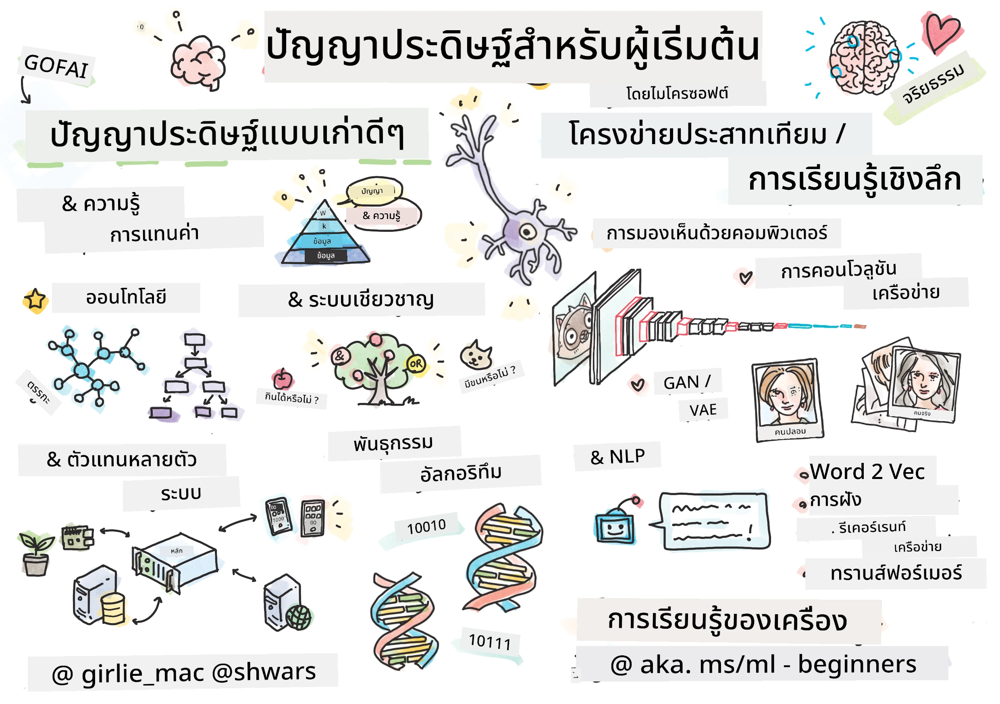

<!--
CO_OP_TRANSLATOR_METADATA:
{
  "original_hash": "0dc6311637b811abb415a936669d7e76",
  "translation_date": "2026-01-05T15:32:03+00:00",
  "source_file": "README.md",
  "language_code": "th"
}
-->
[](https://github.com/microsoft/AI-For-Beginners/blob/main/LICENSE)
[](https://GitHub.com/microsoft/AI-For-Beginners/graphs/contributors/)
[](https://GitHub.com/microsoft/AI-For-Beginners/issues/)
[](https://GitHub.com/microsoft/AI-For-Beginners/pulls/)
[](http://makeapullrequest.com)

[](https://GitHub.com/microsoft/AI-For-Beginners/watchers/)
[](https://GitHub.com/microsoft/AI-For-Beginners/network/)
[](https://GitHub.com/microsoft/AI-For-Beginners/stargazers/)
[](https://mybinder.org/v2/gh/microsoft/ai-for-beginners/HEAD)
[](https://gitter.im/Microsoft/ai-for-beginners?utm_source=badge&utm_medium=badge&utm_campaign=pr-badge)

[](https://discord.gg/nTYy5BXMWG)

# ปัญญาประดิษฐ์สำหรับผู้เริ่มต้น - หลักสูตร

||
|:---:|
| AI For Beginners - _สเก็ตช์โน้ตโดย [@girlie_mac](https://twitter.com/girlie_mac)_ |

สำรวจโลกของ **ปัญญาประดิษฐ์** (AI) ด้วยหลักสูตร 12 สัปดาห์ 24 บทเรียนของเรา! ประกอบด้วยบทเรียนเชิงปฏิบัติ แบบทดสอบ และห้องปฏิบัติการ หลักสูตรนี้เหมาะสำหรับผู้เริ่มต้นและครอบคลุมเครื่องมือต่าง ๆ เช่น TensorFlow และ PyTorch รวมถึงจริยธรรมใน AI

### 🌐 รองรับหลายภาษา

#### สนับสนุนผ่าน GitHub Action (อัตโนมัติและอัปเดตอยู่เสมอ)

<!-- CO-OP TRANSLATOR LANGUAGES TABLE START -->
[Arabic](../ar/README.md) | [Bengali](../bn/README.md) | [Bulgarian](../bg/README.md) | [Burmese (Myanmar)](../my/README.md) | [Chinese (Simplified)](../zh/README.md) | [Chinese (Traditional, Hong Kong)](../hk/README.md) | [Chinese (Traditional, Macau)](../mo/README.md) | [Chinese (Traditional, Taiwan)](../tw/README.md) | [Croatian](../hr/README.md) | [Czech](../cs/README.md) | [Danish](../da/README.md) | [Dutch](../nl/README.md) | [Estonian](../et/README.md) | [Finnish](../fi/README.md) | [French](../fr/README.md) | [German](../de/README.md) | [Greek](../el/README.md) | [Hebrew](../he/README.md) | [Hindi](../hi/README.md) | [Hungarian](../hu/README.md) | [Indonesian](../id/README.md) | [Italian](../it/README.md) | [Japanese](../ja/README.md) | [Kannada](../kn/README.md) | [Korean](../ko/README.md) | [Lithuanian](../lt/README.md) | [Malay](../ms/README.md) | [Malayalam](../ml/README.md) | [Marathi](../mr/README.md) | [Nepali](../ne/README.md) | [Nigerian Pidgin](../pcm/README.md) | [Norwegian](../no/README.md) | [Persian (Farsi)](../fa/README.md) | [Polish](../pl/README.md) | [Portuguese (Brazil)](../br/README.md) | [Portuguese (Portugal)](../pt/README.md) | [Punjabi (Gurmukhi)](../pa/README.md) | [Romanian](../ro/README.md) | [Russian](../ru/README.md) | [Serbian (Cyrillic)](../sr/README.md) | [Slovak](../sk/README.md) | [Slovenian](../sl/README.md) | [Spanish](../es/README.md) | [Swahili](../sw/README.md) | [Swedish](../sv/README.md) | [Tagalog (Filipino)](../tl/README.md) | [Tamil](../ta/README.md) | [Telugu](../te/README.md) | [Thai](./README.md) | [Turkish](../tr/README.md) | [Ukrainian](../uk/README.md) | [Urdu](../ur/README.md) | [Vietnamese](../vi/README.md)

> **ต้องการโคลนแบบโลคอล?**

> รีโพสิโทรี่นี้มีการแปลภาษากว่า 50 ภาษา ซึ่งเพิ่มขนาดดาวน์โหลดอย่างมาก เพื่อโคลนโดยไม่ต้องดาวน์โหลดการแปล ให้ใช้ sparse checkout:
> ```bash
> git clone --filter=blob:none --sparse https://github.com/microsoft/AI-For-Beginners.git
> cd AI-For-Beginners
> git sparse-checkout set --no-cone '/*' '!translations' '!translated_images'
> ```
> วิธีนี้จะให้ทุกอย่างที่คุณต้องการในการเรียนหลักสูตรโดยดาวน์โหลดได้รวดเร็วขึ้นมาก
<!-- CO-OP TRANSLATOR LANGUAGES TABLE END -->

**หากคุณต้องการให้รองรับภาษาการแปลเพิ่มเติม รายการภาษาที่รองรับอยู่ [ที่นี่](https://github.com/Azure/co-op-translator/blob/main/getting_started/supported-languages.md)**

## เข้าร่วมชุมชน
[](https://discord.gg/nTYy5BXMWG)

## สิ่งที่คุณจะได้เรียนรู้

**[แผนผังความคิดของหลักสูตร](http://soshnikov.com/courses/ai-for-beginners/mindmap.html)**

ในหลักสูตรนี้ คุณจะได้เรียนรู้:

* แนวทางต่าง ๆ ของปัญญาประดิษฐ์ รวมถึงวิธีเชิงสัญลักษณ์ “เก่าแต่เก๋า” กับ **การแทนความรู้** และการอนุมาน ([GOFAI](https://en.wikipedia.org/wiki/Symbolic_artificial_intelligence))
* **โครงข่ายประสาทเทียม** และ **การเรียนรู้เชิงลึก** ซึ่งเป็นแกนหลักของ AI สมัยใหม่ เราจะอธิบายแนวคิดเบื้องหลังหัวข้อสำคัญเหล่านี้โดยใช้โค้ดในสองเฟรมเวิร์กยอดนิยมคือ [TensorFlow](http://Tensorflow.org) และ [PyTorch](http://pytorch.org)
* **สถาปัตยกรรมโครงข่ายประสาทเทียม** สำหรับการทำงานกับภาพและข้อความ เราจะครอบคลุมโมเดลล่าสุดแต่บางส่วนอาจยังไม่เป็น state-of-the-art
* แนวทาง AI ที่ไม่ค่อยเป็นที่นิยม เช่น **อัลกอริทึมทางพันธุกรรม** และ **ระบบหลายตัวแทน**

สิ่งที่เราไม่ครอบคลุมในหลักสูตรนี้:

> [ค้นหาทรัพยากรเพิ่มเติมสำหรับหลักสูตรนี้ในคอลเลกชัน Microsoft Learn ของเรา](https://learn.microsoft.com/en-us/collections/7w28iy2xrqzdj0?WT.mc_id=academic-77998-bethanycheum)

* กรณีธุรกิจการใช้ **AI ในธุรกิจ** พิจารณาเรียนเส้นทาง [แนะนำ AI สำหรับผู้ใช้ธุรกิจ](https://docs.microsoft.com/learn/paths/introduction-ai-for-business-users/?WT.mc_id=academic-77998-bethanycheum) บน Microsoft Learn หรือ [AI Business School](https://www.microsoft.com/ai/ai-business-school/?WT.mc_id=academic-77998-bethanycheum) ซึ่งพัฒนาร่วมกับ [INSEAD](https://www.insead.edu/)
* **Machine Learning คลาสสิก** ที่อธิบายอย่างดีใน [หลักสูตร Machine Learning สำหรับผู้เริ่มต้น](http://github.com/Microsoft/ML-for-Beginners)
* แอปพลิเคชัน AI เชิงปฏิบัติที่สร้างด้วย **[บริการ Cognitive Services](https://azure.microsoft.com/services/cognitive-services/?WT.mc_id=academic-77998-bethanycheum)** สำหรับเรื่องนี้เราแนะนำให้เริ่มจากโมดูลใน Microsoft Learn เกี่ยวกับ [การมองเห็น](https://docs.microsoft.com/learn/paths/create-computer-vision-solutions-azure-cognitive-services/?WT.mc_id=academic-77998-bethanycheum), [การประมวลผลภาษาธรรมชาติ](https://docs.microsoft.com/learn/paths/explore-natural-language-processing/?WT.mc_id=academic-77998-bethanycheum), **[Generative AI ด้วย Azure OpenAI Service](https://learn.microsoft.com/en-us/training/paths/develop-ai-solutions-azure-openai/?WT.mc_id=academic-77998-bethanycheum)** และอื่น ๆ
* เฟรมเวิร์ก **ML บนคลาวด์โดยเฉพาะ** เช่น [Azure Machine Learning](https://azure.microsoft.com/services/machine-learning/?WT.mc_id=academic-77998-bethanycheum), [Microsoft Fabric](https://learn.microsoft.com/en-us/training/paths/get-started-fabric/?WT.mc_id=academic-77998-bethanycheum) หรือ [Azure Databricks](https://docs.microsoft.com/learn/paths/data-engineer-azure-databricks?WT.mc_id=academic-77998-bethanycheum) แนะนำเส้นทางการเรียนรู้ [สร้างและดำเนินการแก้ปัญหา machine learning ด้วย Azure Machine Learning](https://docs.microsoft.com/learn/paths/build-ai-solutions-with-azure-ml-service/?WT.mc_id=academic-77998-bethanycheum) และ [สร้างและดำเนินการแก้ปัญหา machine learning ด้วย Azure Databricks](https://docs.microsoft.com/learn/paths/build-operate-machine-learning-solutions-azure-databricks/?WT.mc_id=academic-77998-bethanycheum)
* **AI สนทนา** และ **แชทบอท** มีเส้นทางการเรียนรู้แยกเฉพาะ [สร้างโซลูชัน AI สนทนา](https://docs.microsoft.com/learn/paths/create-conversational-ai-solutions/?WT.mc_id=academic-77998-bethanycheum) และคุณยังสามารถดู [โพสต์บล็อกนี้](https://soshnikov.com/azure/hello-bot-conversational-ai-on-microsoft-platform/) เพื่อรายละเอียดเพิ่มเติม
* **คณิตศาสตร์ลึก** เบื้องหลังการเรียนรู้เชิงลึก สำหรับเรื่องนี้ เราแนะนำหนังสือ [Deep Learning](https://www.amazon.com/Deep-Learning-Adaptive-Computation-Machine/dp/0262035618) โดย Ian Goodfellow, Yoshua Bengio และ Aaron Courville ซึ่งก็มีให้บริการออนไลน์ที่ [https://www.deeplearningbook.org/](https://www.deeplearningbook.org/)

สำหรับการแนะนำแบบนุ่มนวลเกี่ยวกับหัวข้อ _AI บนคลาวด์_ คุณอาจพิจารณาเรียนเส้นทาง [เริ่มต้นกับปัญญาประดิษฐ์บน Azure](https://docs.microsoft.com/learn/paths/get-started-with-artificial-intelligence-on-azure/?WT.mc_id=academic-77998-bethanycheum)

# เนื้อหา

|     |                                                                 ลิงก์บทเรียน                                                                  |                                           PyTorch/Keras/TensorFlow                                          | ห้องปฏิบัติการ                                                            |
| :-: | :------------------------------------------------------------------------------------------------------------------------------------------: | :---------------------------------------------------------------------------------------------: | ------------------------------------------------------------------------------ |
| 0  |                                 [ตั้งค่าหลักสูตร](./lessons/0-course-setup/setup.md)                                 |                      [ตั้งค่าสภาพแวดล้อมสำหรับพัฒนา](./lessons/0-course-setup/how-to-run.md)                       |   |
| I  |               [**แนะนำ AI**](./lessons/1-Intro/README.md)      | | |
| 01  |       [แนะนำและประวัติของ AI](./lessons/1-Intro/README.md)       |           -                            | -  |
| II |              **AI เชิงสัญลักษณ์**              |
| 02  |       [การแทนความรู้และระบบผู้เชี่ยวชาญ](./lessons/2-Symbolic/README.md)       |            [ระบบผู้เชี่ยวชาญ](./lessons/2-Symbolic/Animals.ipynb) /  [Ontology](./lessons/2-Symbolic/FamilyOntology.ipynb) /[Concept Graph](./lessons/2-Symbolic/MSConceptGraph.ipynb)                             |  |
| III |                        [**แนะนำโครงข่ายประสาทเทียม**](./lessons/3-NeuralNetworks/README.md) |||
| 03  |                [Perceptron](./lessons/3-NeuralNetworks/03-Perceptron/README.md)                 |                       [Notebook](./lessons/3-NeuralNetworks/03-Perceptron/Perceptron.ipynb)                      | [Lab](./lessons/3-NeuralNetworks/03-Perceptron/lab/README.md) |
| 04  |                   [Multi-Layered Perceptron and Creating our own Framework](./lessons/3-NeuralNetworks/04-OwnFramework/README.md)                   |        [Notebook](./lessons/3-NeuralNetworks/04-OwnFramework/OwnFramework.ipynb)        | [Lab](./lessons/3-NeuralNetworks/04-OwnFramework/lab/README.md) |
| 05  |            [Intro to Frameworks (PyTorch/TensorFlow) and Overfitting](./lessons/3-NeuralNetworks/05-Frameworks/README.md)             |           [PyTorch](./lessons/3-NeuralNetworks/05-Frameworks/IntroPyTorch.ipynb) / [Keras](./lessons/3-NeuralNetworks/05-Frameworks/IntroKeras.ipynb) / [TensorFlow](./lessons/3-NeuralNetworks/05-Frameworks/IntroKerasTF.ipynb)             | [Lab](./lessons/3-NeuralNetworks/05-Frameworks/lab/README.md) |
| IV  |            [**Computer Vision**](./lessons/4-ComputerVision/README.md)             | [PyTorch](https://docs.microsoft.com/learn/modules/intro-computer-vision-pytorch/?WT.mc_id=academic-77998-cacaste) / [TensorFlow](https://docs.microsoft.com/learn/modules/intro-computer-vision-TensorFlow/?WT.mc_id=academic-77998-cacaste)| [Explore Computer Vision on Microsoft Azure](https://learn.microsoft.com/en-us/collections/7w28iy2xrqzdj0?WT.mc_id=academic-77998-bethanycheum) |
| 06  |            [Intro to Computer Vision. OpenCV](./lessons/4-ComputerVision/06-IntroCV/README.md)             |           [Notebook](./lessons/4-ComputerVision/06-IntroCV/OpenCV.ipynb)         | [Lab](./lessons/4-ComputerVision/06-IntroCV/lab/README.md) |
| 07  |            [Convolutional Neural Networks](./lessons/4-ComputerVision/07-ConvNets/README.md) &  [CNN Architectures](./lessons/4-ComputerVision/07-ConvNets/CNN_Architectures.md)             |           [PyTorch](./lessons/4-ComputerVision/07-ConvNets/ConvNetsPyTorch.ipynb) /[TensorFlow](./lessons/4-ComputerVision/07-ConvNets/ConvNetsTF.ipynb)             | [Lab](./lessons/4-ComputerVision/07-ConvNets/lab/README.md) |
| 08  |            [Pre-trained Networks and Transfer Learning](./lessons/4-ComputerVision/08-TransferLearning/README.md) and [Training Tricks](./lessons/4-ComputerVision/08-TransferLearning/TrainingTricks.md)             |           [PyTorch](./lessons/4-ComputerVision/08-TransferLearning/TransferLearningPyTorch.ipynb) / [TensorFlow](./lessons/3-NeuralNetworks/05-Frameworks/IntroKerasTF.ipynb)             | [Lab](./lessons/4-ComputerVision/08-TransferLearning/lab/README.md) |
| 09  |            [Autoencoders and VAEs](./lessons/4-ComputerVision/09-Autoencoders/README.md)             |           [PyTorch](./lessons/4-ComputerVision/09-Autoencoders/AutoEncodersPyTorch.ipynb) / [TensorFlow](./lessons/4-ComputerVision/09-Autoencoders/AutoencodersTF.ipynb)             |  |
| 10  |            [Generative Adversarial Networks & Artistic Style Transfer](./lessons/4-ComputerVision/10-GANs/README.md)             |           [PyTorch](./lessons/4-ComputerVision/10-GANs/GANPyTorch.ipynb) / [TensorFlow](./lessons/4-ComputerVision/10-GANs/GANTF.ipynb)             |  |
| 11  |            [Object Detection](./lessons/4-ComputerVision/11-ObjectDetection/README.md)             |         [TensorFlow](./lessons/4-ComputerVision/11-ObjectDetection/ObjectDetection.ipynb)             | [Lab](./lessons/4-ComputerVision/11-ObjectDetection/lab/README.md) |
| 12  |            [Semantic Segmentation. U-Net](./lessons/4-ComputerVision/12-Segmentation/README.md)             |           [PyTorch](./lessons/4-ComputerVision/12-Segmentation/SemanticSegmentationPytorch.ipynb) / [TensorFlow](./lessons/4-ComputerVision/12-Segmentation/SemanticSegmentationTF.ipynb)             |  |
| V  |            [**Natural Language Processing**](./lessons/5-NLP/README.md)             | [PyTorch](https://docs.microsoft.com/learn/modules/intro-natural-language-processing-pytorch/?WT.mc_id=academic-77998-cacaste) /[TensorFlow](https://docs.microsoft.com/learn/modules/intro-natural-language-processing-TensorFlow/?WT.mc_id=academic-77998-cacaste) | [Explore Natural Language Processing on Microsoft Azure](https://learn.microsoft.com/en-us/collections/7w28iy2xrqzdj0?WT.mc_id=academic-77998-bethanycheum)|
| 13  |            [Text Representation. Bow/TF-IDF](./lessons/5-NLP/13-TextRep/README.md)             |           [PyTorch](https://github.com/microsoft/AI-For-Beginners/blob/main/lessons/5-NLP/13-TextRep/TextRepresentationPyTorch.ipynb) / [TensorFlow](https://github.com/microsoft/AI-For-Beginners/blob/main/lessons/5-NLP/13-TextRep/TextRepresentationTF.ipynb)             | |
| 14  |            [Semantic word embeddings. Word2Vec and GloVe](./lessons/5-NLP/14-Embeddings/README.md)             |           [PyTorch](https://github.com/microsoft/AI-For-Beginners/blob/main/lessons/5-NLP/14-Embeddings/EmbeddingsPyTorch.ipynb) / [TensorFlow](https://github.com/microsoft/AI-For-Beginners/blob/main/lessons/5-NLP/14-Embeddings/EmbeddingsTF.ipynb)             |  |
| 15  |            [Language Modeling. Training your own embeddings](./lessons/5-NLP/15-LanguageModeling/README.md)             |           [PyTorch](https://github.com/microsoft/AI-For-Beginners/blob/main/lessons/5-NLP/15-LanguageModeling/CBoW-PyTorch.ipynb) / [TensorFlow](https://github.com/microsoft/AI-For-Beginners/blob/main/lessons/5-NLP/15-LanguageModeling/CBoW-TF.ipynb)             | [Lab](./lessons/5-NLP/15-LanguageModeling/lab/README.md) |
| 16  |            [Recurrent Neural Networks](./lessons/5-NLP/16-RNN/README.md)             |           [PyTorch](https://github.com/microsoft/AI-For-Beginners/blob/main/lessons/5-NLP/16-RNN/RNNPyTorch.ipynb) / [TensorFlow](https://github.com/microsoft/AI-For-Beginners/blob/main/lessons/5-NLP/16-RNN/RNNTF.ipynb)             |  |
| 17  |            [Generative Recurrent Networks](./lessons/5-NLP/17-GenerativeNetworks/README.md)             |           [PyTorch](https://github.com/microsoft/AI-For-Beginners/blob/main/lessons/5-NLP/17-GenerativeNetworks/GenerativePyTorch.ipynb) / [TensorFlow](https://github.com/microsoft/AI-For-Beginners/blob/main/lessons/5-NLP/17-GenerativeNetworks/GenerativeTF.ipynb)             | [Lab](./lessons/5-NLP/17-GenerativeNetworks/lab/README.md) |
| 18  |            [Transformers. BERT.](./lessons/5-NLP/18-Transformers/README.md)             |           [PyTorch](https://github.com/microsoft/AI-For-Beginners/blob/main/lessons/5-NLP/18-Transformers/TransformersPyTorch.ipynb) /[TensorFlow](https://github.com/microsoft/AI-For-Beginners/blob/main/lessons/5-NLP/18-Transformers/TransformersTF.ipynb)             |  |
| 19  |            [Named Entity Recognition](./lessons/5-NLP/19-NER/README.md)             |           [TensorFlow](https://microsoft.github.io/AI-For-Beginners/lessons/5-NLP/19-NER/NER-TF.ipynb)             | [Lab](./lessons/5-NLP/19-NER/lab/README.md) |
| 20  |            [Large Language Models, Prompt Programming and Few-Shot Tasks](./lessons/5-NLP/20-LangModels/README.md)             |           [PyTorch](https://microsoft.github.io/AI-For-Beginners/lessons/5-NLP/20-LangModels/GPT-PyTorch.ipynb) | |
| VI |            **Other AI Techniques** || |
| 21  |            [Genetic Algorithms](./lessons/6-Other/21-GeneticAlgorithms/README.md)             |           [Notebook](./lessons/6-Other/21-GeneticAlgorithms/Genetic.ipynb) | |
| 22  |            [Deep Reinforcement Learning](./lessons/6-Other/22-DeepRL/README.md)             |           [PyTorch](./lessons/6-Other/22-DeepRL/CartPole-RL-PyTorch.ipynb) /[TensorFlow](./lessons/6-Other/22-DeepRL/CartPole-RL-TF.ipynb)             | [Lab](./lessons/6-Other/22-DeepRL/lab/README.md) |
| 23  |            [Multi-Agent Systems](./lessons/6-Other/23-MultiagentSystems/README.md)             |  | |
| VII |            **AI Ethics** | | |
| 24  |            [AI Ethics and Responsible AI](./lessons/7-Ethics/README.md)             |           [Microsoft Learn: Responsible AI Principles](https://docs.microsoft.com/learn/paths/responsible-ai-business-principles/?WT.mc_id=academic-77998-cacaste) | |
| IX  |            **Extras** | | |
| 25  |            [Multi-Modal Networks, CLIP and VQGAN](./lessons/X-Extras/X1-MultiModal/README.md)             |           [Notebook](./lessons/X-Extras/X1-MultiModal/Clip.ipynb)    | |

## แต่ละบทเรียนประกอบด้วย

* เนื้อหาการอ่านล่วงหน้า
* Jupyter Notebooks ที่สามารถรันได้ ซึ่งมักจะเฉพาะเจาะจงกับเฟรมเวิร์ก (**PyTorch** หรือ **TensorFlow**) โน๊ตบุ๊กรันได้ยังประกอบด้วยเนื้อหาทฤษฎีมากมาย เพื่อให้เข้าใจหัวข้อควรผ่านเวอร์ชันใดเวอร์ชันหนึ่งของโน๊ตบุ๊ก (ไม่ว่าจะเป็น PyTorch หรือ TensorFlow)
* **แลบ** สำหรับบางหัวข้อ ซึ่งเปิดโอกาสให้คุณได้ลองใช้เนื้อหาที่เรียนมาแก้ปัญหาเฉพาะ
* บางส่วนมีลิงก์ไปยังโมดูล [**MS Learn**](https://learn.microsoft.com/en-us/collections/7w28iy2xrqzdj0?WT.mc_id=academic-77998-bethanycheum) ที่ครอบคลุมหัวข้อที่เกี่ยวข้อง

## การเริ่มต้นใช้งาน

### 🎯 ใหม่กับ AI? เริ่มที่นี่!

ถ้าคุณยังใหม่กับ AI และต้องการตัวอย่างใช้งานจริงแบบรวดเร็ว ลองดูที่ [**ตัวอย่างสำหรับผู้เริ่มต้น**](./examples/README.md)! ซึ่งมีดังนี้:

- 🌟 **Hello AI World** - โปรแกรม AI แรกของคุณ (การจดจำรูปแบบ)
- 🧠 **Simple Neural Network** - สร้างโครงข่ายประสาทเทียมจากศูนย์  
- 🖼️ **Image Classifier** - จำแนกรูปภาพพร้อมคำอธิบายละเอียด
- 💬 **การวิเคราะห์อารมณ์ข้อความ** - วิเคราะห์ข้อความเชิงบวก/เชิงลบ

ตัวอย่างเหล่านี้ถูกออกแบบมาเพื่อช่วยให้คุณเข้าใจแนวคิด AI ก่อนที่จะเริ่มเรียนหลักสูตรทั้งหมด

### 📚 การตั้งค่าหลักสูตรเต็ม

- เราได้สร้าง [บทเรียนการตั้งค่า](./lessons/0-course-setup/setup.md) เพื่อช่วยคุณในการตั้งค่าสภาพแวดล้อมพัฒนา - สำหรับผู้สอน เราได้สร้าง [บทเรียนการตั้งค่าหลักสูตร](./lessons/0-course-setup/for-teachers.md) สำหรับคุณด้วย!
- วิธี [รันโค้ดใน VSCode หรือ Codepace](./lessons/0-course-setup/how-to-run.md)

ทำตามขั้นตอนเหล่านี้:

Fork Repository: คลิกที่ปุ่ม "Fork" ที่มุมบนขวาของหน้านี้

Clone Repository: `git clone https://github.com/microsoft/AI-For-Beginners.git`

อย่าลืมกดดาว (🌟) repo นี้เพื่อให้ค้นหาได้ง่ายขึ้นในภายหลัง

## พบปะผู้เรียนคนอื่นๆ

เข้าร่วม [เซิร์ฟเวอร์ Discord AI อย่างเป็นทางการ](https://aka.ms/genai-discord?WT.mc_id=academic-105485-bethanycheum) เพื่อพบปะและสร้างเครือข่ายกับผู้เรียนคนอื่นๆ ที่เรียนคอร์สนี้และรับการสนับสนุน

หากคุณมีคำติชมเกี่ยวกับผลิตภัณฑ์หรือคำถามขณะสร้าง กรุณาเยี่ยมชม [ฟอรั่มนักพัฒนา Azure AI Foundry](https://aka.ms/foundry/forum)

## แบบทดสอบ

> **หมายเหตุเกี่ยวกับแบบทดสอบ**: แบบทดสอบทั้งหมดอยู่ในโฟลเดอร์ Quiz-app ที่ etc\quiz-app หรือ [ออนไลน์ที่นี่](https://ff-quizzes.netlify.app/) แบบทดสอบถูกลิงก์จากภายในบทเรียน แอปแบบทดสอบสามารถรันได้ในเครื่องหรือปรับใช้บน Azure; ทำตามคำแนะนำในโฟลเดอร์ `quiz-app` แบบทดสอบกำลังถูกแปลเป็นภาษาต่าง ๆ อย่างค่อยเป็นค่อยไป

## ขอความช่วยเหลือ

คุณมีคำแนะนำหรือพบข้อผิดพลาดการสะกดหรือโค้ดไหม? กรุณาเปิด issue หรือตั้ง pull request

## ขอบคุณพิเศษ

* **✍️ ผู้เขียนหลัก:** [Dmitry Soshnikov](http://soshnikov.com), PhD
* **🔥 ผู้แก้ไข:** [Jen Looper](https://twitter.com/jenlooper), PhD
* **🎨 นักวาดภาพสเก็ตช์:** [Tomomi Imura](https://twitter.com/girlie_mac)
* **✅ ผู้สร้างแบบทดสอบ:** [Lateefah Bello](https://github.com/CinnamonXI), [MLSA](https://studentambassadors.microsoft.com/)
* **🙏 ผู้ร่วมพัฒนาหลัก:** [Evgenii Pishchik](https://github.com/Pe4enIks)

## หลักสูตรอื่น ๆ

ทีมของเรายังผลิตหลักสูตรอื่นๆ! ดูได้ที่:

<!-- CO-OP TRANSLATOR OTHER COURSES START -->
### LangChain
[](https://aka.ms/langchain4j-for-beginners)
[](https://aka.ms/langchainjs-for-beginners?WT.mc_id=m365-94501-dwahlin)

---

### Azure / Edge / MCP / Agents
[](https://github.com/microsoft/AZD-for-beginners?WT.mc_id=academic-105485-koreyst)
[](https://github.com/microsoft/edgeai-for-beginners?WT.mc_id=academic-105485-koreyst)
[](https://github.com/microsoft/mcp-for-beginners?WT.mc_id=academic-105485-koreyst)
[](https://github.com/microsoft/ai-agents-for-beginners?WT.mc_id=academic-105485-koreyst)

---
 
### Generative AI Series
[](https://github.com/microsoft/generative-ai-for-beginners?WT.mc_id=academic-105485-koreyst)
[-9333EA?style=for-the-badge&labelColor=E5E7EB&color=9333EA)](https://github.com/microsoft/Generative-AI-for-beginners-dotnet?WT.mc_id=academic-105485-koreyst)
[-C084FC?style=for-the-badge&labelColor=E5E7EB&color=C084FC)](https://github.com/microsoft/generative-ai-for-beginners-java?WT.mc_id=academic-105485-koreyst)
[-E879F9?style=for-the-badge&labelColor=E5E7EB&color=E879F9)](https://github.com/microsoft/generative-ai-with-javascript?WT.mc_id=academic-105485-koreyst)

---
 
### การเรียนรู้หลัก
[](https://aka.ms/ml-beginners?WT.mc_id=academic-105485-koreyst)
[](https://aka.ms/datascience-beginners?WT.mc_id=academic-105485-koreyst)
[](https://aka.ms/ai-beginners?WT.mc_id=academic-105485-koreyst)
[](https://github.com/microsoft/Security-101?WT.mc_id=academic-96948-sayoung)
[](https://aka.ms/webdev-beginners?WT.mc_id=academic-105485-koreyst)
[](https://aka.ms/iot-beginners?WT.mc_id=academic-105485-koreyst)
[](https://github.com/microsoft/xr-development-for-beginners?WT.mc_id=academic-105485-koreyst)

---
 
### ชุดเรียน Copilot
[](https://aka.ms/GitHubCopilotAI?WT.mc_id=academic-105485-koreyst)
[](https://github.com/microsoft/mastering-github-copilot-for-dotnet-csharp-developers?WT.mc_id=academic-105485-koreyst)
[](https://github.com/microsoft/CopilotAdventures?WT.mc_id=academic-105485-koreyst)
<!-- CO-OP TRANSLATOR OTHER COURSES END -->

## ขอความช่วยเหลือ

หากคุณติดขัดหรือมีคำถามเกี่ยวกับการสร้างแอป AI เข้าร่วมพูดคุยกับผู้เรียนและนักพัฒนาที่มีประสบการณ์เกี่ยวกับ MCP นี่คือชุมชนที่สนับสนุนซึ่งเปิดรับคำถามและแบ่งปันความรู้กันอย่างอิสระ

[](https://discord.gg/nTYy5BXMWG)

หากคุณมีคำติชมผลิตภัณฑ์หรือพบข้อผิดพลาดขณะสร้าง โปรดเยี่ยมชม:

[](https://aka.ms/foundry/forum)

---

<!-- CO-OP TRANSLATOR DISCLAIMER START -->
**ข้อจำกัดความรับผิดชอบ**:  
เอกสารฉบับนี้ได้รับการแปลโดยใช้บริการแปลภาษา AI [Co-op Translator](https://github.com/Azure/co-op-translator) แม้เราจะพยายามให้ความถูกต้องสูงสุด แต่โปรดทราบว่าการแปลโดยอัตโนมัติอาจมีข้อผิดพลาดหรือความคลาดเคลื่อน เอกสารต้นฉบับในภาษาต้นทางถือเป็นแหล่งข้อมูลที่เป็นทางการที่สุด สำหรับข้อมูลสำคัญแนะนำให้ใช้บริการแปลโดยมืออาชีพที่เป็นมนุษย์ เราจะไม่รับผิดชอบต่อความเข้าใจผิดหรือการตีความผิดที่เกิดจากการใช้การแปลนี้
<!-- CO-OP TRANSLATOR DISCLAIMER END -->