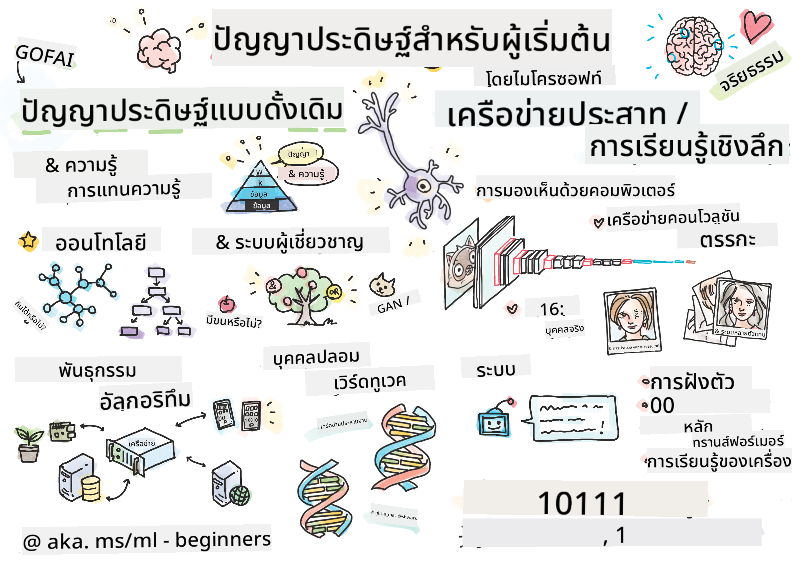

<!--
CO_OP_TRANSLATOR_METADATA:
{
  "original_hash": "14816e97d79b296c87811724f7785923",
  "translation_date": "2026-01-01T11:50:02+00:00",
  "source_file": "README.md",
  "language_code": "th"
}
-->

# ปัญญาประดิษฐ์สำหรับผู้เริ่มต้น - หลักสูตร

||
|:---:|
| AI สำหรับผู้เริ่มต้น - _สเก็ตช์โน้ตโดย [@girlie_mac](https://twitter.com/girlie_mac)_ |

สำรวจโลกของ **ปัญญาประดิษฐ์** (AI) ด้วยหลักสูตร 12 สัปดาห์ 24 บทเรียนของเรา! หลักสูตรประกอบด้วยบทเรียนเชิงปฏิบัติ การทดสอบย่อย และแลป หลักสูตรเหมาะสำหรับผู้เริ่มต้นและครอบคลุมเครื่องมือต่างๆ เช่น TensorFlow และ PyTorch รวมถึงจริยธรรมใน AI

### 🌐 การรองรับหลายภาษา

#### รองรับผ่าน GitHub Action (อัตโนมัติ & อัปเดตอยู่เสมอ)

<!-- CO-OP TRANSLATOR LANGUAGES TABLE START -->
[อาหรับ](../ar/README.md) | [เบงกาลี](../bn/README.md) | [บัลแกเรีย](../bg/README.md) | [พม่า (เมียนมา)](../my/README.md) | [จีน (ตัวย่อ)](../zh/README.md) | [จีน (ตัวเต็ม, ฮ่องกง)](../hk/README.md) | [จีน (ตัวเต็ม, มาเก๊า)](../mo/README.md) | [จีน (ตัวเต็ม, ไต้หวัน)](../tw/README.md) | [โครเอเชีย](../hr/README.md) | [เช็ก](../cs/README.md) | [เดนมาร์ก](../da/README.md) | [ดัตช์](../nl/README.md) | [เอสโตเนีย](../et/README.md) | [ฟินแลนด์](../fi/README.md) | [ฝรั่งเศส](../fr/README.md) | [เยอรมัน](../de/README.md) | [กรีก](../el/README.md) | [ฮีบรู](../he/README.md) | [ฮินดี](../hi/README.md) | [ฮังการี](../hu/README.md) | [อินโดนีเซีย](../id/README.md) | [อิตาเลียน](../it/README.md) | [ญี่ปุ่น](../ja/README.md) | [คันนาดา](../kn/README.md) | [เกาหลี](../ko/README.md) | [ลิทัวเนีย](../lt/README.md) | [มลายู](../ms/README.md) | [มาลายาลัม](../ml/README.md) | [มราฐี](../mr/README.md) | [เนปาลี](../ne/README.md) | [ไนจีเรีย พิดจิน](../pcm/README.md) | [นอร์เวย์](../no/README.md) | [เปอร์เซีย (ฟาร์ซี)](../fa/README.md) | [โปแลนด์](../pl/README.md) | [โปรตุเกส (บราซิล)](../br/README.md) | [โปรตุเกส (โปรตุเกส)](../pt/README.md) | [ปัญจาบ (Gurmukhi)](../pa/README.md) | [โรมาเนีย](../ro/README.md) | [รัสเซีย](../ru/README.md) | [เซอร์เบีย (คีริลลิก)](../sr/README.md) | [สโลวัก](../sk/README.md) | [สโลวีเนีย](../sl/README.md) | [สเปน](../es/README.md) | [สวาฮีลี](../sw/README.md) | [สวีเดน](../sv/README.md) | [ตากาล็อก (ฟิลิปปินส์)](../tl/README.md) | [ทมิฬ](../ta/README.md) | [เตลูกู](../te/README.md) | [ไทย](./README.md) | [ตุรกี](../tr/README.md) | [ยูเครน](../uk/README.md) | [อูรดู](../ur/README.md) | [เวียดนาม](../vi/README.md)
<!-- CO-OP TRANSLATOR LANGUAGES TABLE END -->

**หากคุณต้องการให้มีการแปลภาษาเพิ่มเติม รายชื่อภาษาที่รองรับอยู่ [ที่นี่](https://github.com/Azure/co-op-translator/blob/main/getting_started/supported-languages.md)**

## เข้าร่วมชุมชน

## สิ่งที่คุณจะได้เรียนรู้

**[แผนผังความคิดของหลักสูตร](http://soshnikov.com/courses/ai-for-beginners/mindmap.html)**

ในหลักสูตรนี้ คุณจะได้เรียนรู้:

* แนวทางต่างๆ ของปัญญาประดิษฐ์ รวมถึงแนวทางเชิงสัญลักษณ์แบบคลาสสิกที่มี **การแทนความรู้** และการให้เหตุผล ([GOFAI](https://en.wikipedia.org/wiki/Symbolic_artificial_intelligence)).
* **โครงข่ายประสาทเทียม** และ **การเรียนรู้เชิงลึก** ซึ่งเป็นหัวใจของ AI สมัยใหม่ เราจะแสดงแนวคิดเบื้องหลังหัวข้อสำคัญเหล่านี้ด้วยโค้ดในสองเฟรมเวิร์กยอดนิยม - [TensorFlow](http://Tensorflow.org) และ [PyTorch](http://pytorch.org).
* **สถาปัตยกรรมเครือข่ายประสาท** สำหรับการทำงานกับภาพและข้อความ เราจะครอบคลุมโมเดลล่าสุดแต่บางส่วนอาจไม่ได้ทันสมัยที่สุด
* แนวทาง AI ที่ไม่เป็นที่นิยมเท่า เช่น **อัลกอริทึมเชิงพันธุกรรม** และ **ระบบหลายตัวแทน**

สิ่งที่เราไม่ได้ครอบคลุมในหลักสูตรนี้:

> [ค้นหาทรัพยากรเพิ่มเติมสำหรับหลักสูตรนี้ในคอลเล็กชัน Microsoft Learn ของเรา](https://learn.microsoft.com/en-us/collections/7w28iy2xrqzdj0?WT.mc_id=academic-77998-bethanycheum)

* กรณีธุรกิจของการใช้ **AI ในธุรกิจ** พิจารณาเรียนเส้นทางการเรียนรู้ [Introduction to AI for business users](https://docs.microsoft.com/learn/paths/introduction-ai-for-business-users/?WT.mc_id=academic-77998-bethanycheum) บน Microsoft Learn หรือ [AI Business School](https://www.microsoft.com/ai/ai-business-school/?WT.mc_id=academic-77998-bethanycheum) ซึ่งพัฒนาร่วมกับ [INSEAD](https://www.insead.edu/).
* **การเรียนรู้ของเครื่องแบบคลาสสิก** ซึ่งอธิบายไว้อย่างดีใน [หลักสูตร Machine Learning for Beginners ของเรา](http://github.com/Microsoft/ML-for-Beginners).
* แอปพลิเคชัน AI เชิงปฏิบัติที่สร้างด้วย **[Cognitive Services](https://azure.microsoft.com/services/cognitive-services/?WT.mc_id=academic-77998-bethanycheum)** สำหรับเรื่องนี้ เราแนะนำให้คุณเริ่มจากโมดูล Microsoft Learn สำหรับ [vision](https://docs.microsoft.com/learn/paths/create-computer-vision-solutions-azure-cognitive-services/?WT.mc_id=academic-77998-bethanycheum), [natural language processing](https://docs.microsoft.com/learn/paths/explore-natural-language-processing/?WT.mc_id=academic-77998-bethanycheum), **[Generative AI with Azure OpenAI Service](https://learn.microsoft.com/en-us/training/paths/develop-ai-solutions-azure-openai/?WT.mc_id=academic-77998-bethanycheum)** และอื่นๆ
* **เฟรมเวิร์กคลาวด์สำหรับ ML เฉพาะทาง** เช่น [Azure Machine Learning](https://azure.microsoft.com/services/machine-learning/?WT.mc_id=academic-77998-bethanycheum), [Microsoft Fabric](https://learn.microsoft.com/en-us/training/paths/get-started-fabric/?WT.mc_id=academic-77998-bethanycheum) หรือ [Azure Databricks](https://docs.microsoft.com/learn/paths/data-engineer-azure-databricks?WT.mc_id=academic-77998-bethanycheum). พิจารณาใช้เส้นทางการเรียนรู้ [Build and operate machine learning solutions with Azure Machine Learning](https://docs.microsoft.com/learn/paths/build-ai-solutions-with-azure-ml-service/?WT.mc_id=academic-77998-bethanycheum) และ [Build and Operate Machine Learning Solutions with Azure Databricks](https://docs.microsoft.com/learn/paths/build-operate-machine-learning-solutions-azure-databricks/?WT.mc_id=academic-77998-bethanycheum).
* **AI แบบโต้ตอบ** และ **แชทบอท** มีเส้นทางการเรียนรู้แยกต่างหาก [Create conversational AI solutions](https://docs.microsoft.com/learn/paths/create-conversational-ai-solutions/?WT.mc_id=academic-77998-bethanycheum) และคุณยังสามารถอ้างอิงจาก [บล็อกโพสต์นี้](https://soshnikov.com/azure/hello-bot-conversational-ai-on-microsoft-platform/) สำหรับรายละเอียดเพิ่มเติม
* **คณิตศาสตร์เชิงลึก** ที่อยู่เบื้องหลังการเรียนรู้เชิงลึก สำหรับเรื่องนี้ เราแนะนำหนังสือ [Deep Learning](https://www.amazon.com/Deep-Learning-Adaptive-Computation-Machine/dp/0262035618) โดย Ian Goodfellow, Yoshua Bengio และ Aaron Courville ซึ่งยังมีให้ใช้ออนไลน์ที่ [https://www.deeplearningbook.org/](https://www.deeplearningbook.org/)

สำหรับการแนะนำอย่างนุ่มนวลเกี่ยวกับหัวข้อ _AI บนคลาวด์_ คุณอาจพิจารณาเรียนเส้นทางการเรียนรู้ [Get started with artificial intelligence on Azure](https://docs.microsoft.com/learn/paths/get-started-with-artificial-intelligence-on-azure/?WT.mc_id=academic-77998-bethanycheum)

# เนื้อหา

|     |                                                                 ลิงก์บทเรียน                                                                  |                                           PyTorch/Keras/TensorFlow                                          | Lab                                                            |
| :-: | :------------------------------------------------------------------------------------------------------------------------------------------: | :---------------------------------------------------------------------------------------------: | ------------------------------------------------------------------------------ |
| 0  |                                 [การตั้งค่าหลักสูตร](./lessons/0-course-setup/setup.md)                                 |                      [ตั้งค่าสภาพแวดล้อมการพัฒนา](./lessons/0-course-setup/how-to-run.md)                       |   |
| I  |               [**บทนำสู่ AI**](./lessons/1-Intro/README.md)      | | |
| 01  |       [บทนำและประวัติของ AI](./lessons/1-Intro/README.md)       |           -                            | -  |
| II |              **AI เชิงสัญลักษณ์**              |
| 02  |       [การแทนความรู้และระบบผู้เชี่ยวชาญ](./lessons/2-Symbolic/README.md)       |            [ระบบผู้เชี่ยวชาญ](./lessons/2-Symbolic/Animals.ipynb) /  [ออนโทโลยี](./lessons/2-Symbolic/FamilyOntology.ipynb) /[กราฟแนวคิด](./lessons/2-Symbolic/MSConceptGraph.ipynb)                             |  |
| III |                        [**บทนำสู่โครงข่ายประสาทเทียม**](./lessons/3-NeuralNetworks/README.md) |||
| 03  |                [เปอร์เซปตรอน](./lessons/3-NeuralNetworks/03-Perceptron/README.md)                 |                       [โน้ตบุ๊ก](./lessons/3-NeuralNetworks/03-Perceptron/Perceptron.ipynb)                      | [แล็บ](./lessons/3-NeuralNetworks/03-Perceptron/lab/README.md) |
| 04  |                   [เปอร์เซปตรอนหลายชั้นและการสร้างเฟรมเวิร์กของเราเอง](./lessons/3-NeuralNetworks/04-OwnFramework/README.md)                   |        [โน้ตบุ๊ก](./lessons/3-NeuralNetworks/04-OwnFramework/OwnFramework.ipynb)        | [แล็บ](./lessons/3-NeuralNetworks/04-OwnFramework/lab/README.md) |
| 05  |            [บทนำสู่เฟรมเวิร์ก (PyTorch/TensorFlow) และปัญหา overfitting](./lessons/3-NeuralNetworks/05-Frameworks/README.md)             |           [PyTorch](./lessons/3-NeuralNetworks/05-Frameworks/IntroPyTorch.ipynb) / [Keras](./lessons/3-NeuralNetworks/05-Frameworks/IntroKeras.ipynb) / [TensorFlow](./lessons/3-NeuralNetworks/05-Frameworks/IntroKerasTF.ipynb)             | [แล็บ](./lessons/3-NeuralNetworks/05-Frameworks/lab/README.md) |
| IV  |            [**การมองเห็นด้วยคอมพิวเตอร์**](./lessons/4-ComputerVision/README.md)             | [PyTorch](https://docs.microsoft.com/learn/modules/intro-computer-vision-pytorch/?WT.mc_id=academic-77998-cacaste) / [TensorFlow](https://docs.microsoft.com/learn/modules/intro-computer-vision-TensorFlow/?WT.mc_id=academic-77998-cacaste)| [สำรวจการมองเห็นด้วยคอมพิวเตอร์บน Microsoft Azure](https://learn.microsoft.com/en-us/collections/7w28iy2xrqzdj0?WT.mc_id=academic-77998-bethanycheum) |
| 06  |            [บทนำสู่การมองเห็นด้วยคอมพิวเตอร์. OpenCV](./lessons/4-ComputerVision/06-IntroCV/README.md)             |           [โน้ตบุ๊ก](./lessons/4-ComputerVision/06-IntroCV/OpenCV.ipynb)         | [แล็บ](./lessons/4-ComputerVision/06-IntroCV/lab/README.md) |
| 07  |            [เครือข่ายประสาทแบบคอนโวลูชัน](./lessons/4-ComputerVision/07-ConvNets/README.md) &  [สถาปัตยกรรม CNN](./lessons/4-ComputerVision/07-ConvNets/CNN_Architectures.md)             |           [PyTorch](./lessons/4-ComputerVision/07-ConvNets/ConvNetsPyTorch.ipynb) /[TensorFlow](./lessons/4-ComputerVision/07-ConvNets/ConvNetsTF.ipynb)             | [แล็บ](./lessons/4-ComputerVision/07-ConvNets/lab/README.md) |
| 08  |            [เครือข่ายที่ถูกฝึกมาก่อนและการเรียนรู้แบบถ่ายโอน](./lessons/4-ComputerVision/08-TransferLearning/README.md) and [เทคนิคการฝึก](./lessons/4-ComputerVision/08-TransferLearning/TrainingTricks.md)             |           [PyTorch](./lessons/4-ComputerVision/08-TransferLearning/TransferLearningPyTorch.ipynb) / [TensorFlow](./lessons/3-NeuralNetworks/05-Frameworks/IntroKerasTF.ipynb)             | [แล็บ](./lessons/4-ComputerVision/08-TransferLearning/lab/README.md) |
| 09  |            [ออโต้เอนโค้ดเดอร์และ VAE](./lessons/4-ComputerVision/09-Autoencoders/README.md)             |           [PyTorch](./lessons/4-ComputerVision/09-Autoencoders/AutoEncodersPyTorch.ipynb) / [TensorFlow](./lessons/4-ComputerVision/09-Autoencoders/AutoencodersTF.ipynb)             |  |
| 10  |            [เครือข่ายปฏิปักษ์เชิงกำเนิด และการถ่ายโอนสไตล์เชิงศิลป์](./lessons/4-ComputerVision/10-GANs/README.md)             |           [PyTorch](./lessons/4-ComputerVision/10-GANs/GANPyTorch.ipynb) / [TensorFlow](./lessons/4-ComputerVision/10-GANs/GANTF.ipynb)             |  |
| 11  |            [การตรวจจับวัตถุ](./lessons/4-ComputerVision/11-ObjectDetection/README.md)             |         [TensorFlow](./lessons/4-ComputerVision/11-ObjectDetection/ObjectDetection.ipynb)             | [แล็บ](./lessons/4-ComputerVision/11-ObjectDetection/lab/README.md) |
| 12  |            [การแบ่งส่วนเชิงความหมาย และ U-Net](./lessons/4-ComputerVision/12-Segmentation/README.md)             |           [PyTorch](./lessons/4-ComputerVision/12-Segmentation/SemanticSegmentationPytorch.ipynb) / [TensorFlow](./lessons/4-ComputerVision/12-Segmentation/SemanticSegmentationTF.ipynb)             |  |
| V  |            [**การประมวลผลภาษาธรรมชาติ**](./lessons/5-NLP/README.md)             | [PyTorch](https://docs.microsoft.com/learn/modules/intro-natural-language-processing-pytorch/?WT.mc_id=academic-77998-cacaste) /[TensorFlow](https://docs.microsoft.com/learn/modules/intro-natural-language-processing-TensorFlow/?WT.mc_id=academic-77998-cacaste) | [สำรวจการประมวลผลภาษาธรรมชาติบน Microsoft Azure](https://learn.microsoft.com/en-us/collections/7w28iy2xrqzdj0?WT.mc_id=academic-77998-bethanycheum)|
| 13  |            [การแทนข้อความ: BoW/TF-IDF](./lessons/5-NLP/13-TextRep/README.md)             |           [PyTorch](https://github.com/microsoft/AI-For-Beginners/blob/main/lessons/5-NLP/13-TextRep/TextRepresentationPyTorch.ipynb) / [TensorFlow](https://github.com/microsoft/AI-For-Beginners/blob/main/lessons/5-NLP/13-TextRep/TextRepresentationTF.ipynb)             | |
| 14  |            [การฝังคำเชิงความหมาย: Word2Vec และ GloVe](./lessons/5-NLP/14-Embeddings/README.md)             |           [PyTorch](https://github.com/microsoft/AI-For-Beginners/blob/main/lessons/5-NLP/14-Embeddings/EmbeddingsPyTorch.ipynb) / [TensorFlow](https://github.com/microsoft/AI-For-Beginners/blob/main/lessons/5-NLP/14-Embeddings/EmbeddingsTF.ipynb)             |  |
| 15  |            [การสร้างแบบจำลองภาษา และการฝึก embedding ของคุณเอง](./lessons/5-NLP/15-LanguageModeling/README.md)             |           [PyTorch](https://github.com/microsoft/AI-For-Beginners/blob/main/lessons/5-NLP/15-LanguageModeling/CBoW-PyTorch.ipynb) / [TensorFlow](https://github.com/microsoft/AI-For-Beginners/blob/main/lessons/5-NLP/15-LanguageModeling/CBoW-TF.ipynb)             | [แล็บ](./lessons/5-NLP/15-LanguageModeling/lab/README.md) |
| 16  |            [เครือข่ายประสาทแบบวนซ้ำ](./lessons/5-NLP/16-RNN/README.md)             |           [PyTorch](https://github.com/microsoft/AI-For-Beginners/blob/main/lessons/5-NLP/16-RNN/RNNPyTorch.ipynb) / [TensorFlow](https://github.com/microsoft/AI-For-Beginners/blob/main/lessons/5-NLP/16-RNN/RNNTF.ipynb)             |  |
| 17  |            [เครือข่ายวนซ้ำเชิงกำเนิด](./lessons/5-NLP/17-GenerativeNetworks/README.md)             |           [PyTorch](https://github.com/microsoft/AI-For-Beginners/blob/main/lessons/5-NLP/17-GenerativeNetworks/GenerativePyTorch.ipynb) / [TensorFlow](https://github.com/microsoft/AI-For-Beginners/blob/main/lessons/5-NLP/17-GenerativeNetworks/GenerativeTF.ipynb)             | [แล็บ](./lessons/5-NLP/17-GenerativeNetworks/lab/README.md) |
| 18  |            [Transformers และ BERT](./lessons/5-NLP/18-Transformers/README.md)             |           [PyTorch](https://github.com/microsoft/AI-For-Beginners/blob/main/lessons/5-NLP/18-Transformers/TransformersPyTorch.ipynb) /[TensorFlow](https://github.com/microsoft/AI-For-Beginners/blob/main/lessons/5-NLP/18-Transformers/TransformersTF.ipynb)             |  |
| 19  |            [การจำแนกเอนทิตีที่มีชื่อ](./lessons/5-NLP/19-NER/README.md)             |           [TensorFlow](https://microsoft.github.io/AI-For-Beginners/lessons/5-NLP/19-NER/NER-TF.ipynb)             | [แล็บ](./lessons/5-NLP/19-NER/lab/README.md) |
| 20  |            [โมเดลภาษาใหญ่ การเขียนโปรแกรมด้วยพรอมต์ และงานแบบ Few-Shot](./lessons/5-NLP/20-LangModels/README.md)             |           [PyTorch](https://microsoft.github.io/AI-For-Beginners/lessons/5-NLP/20-LangModels/GPT-PyTorch.ipynb) | |
| VI |            **เทคนิค AI อื่นๆ** || |
| 21  |            [อัลกอริทึมทางพันธุกรรม](./lessons/6-Other/21-GeneticAlgorithms/README.md)             |           [โน้ตบุ๊ก](./lessons/6-Other/21-GeneticAlgorithms/Genetic.ipynb) | |
| 22  |            [การเรียนรู้เสริมเชิงลึก](./lessons/6-Other/22-DeepRL/README.md)             |           [PyTorch](./lessons/6-Other/22-DeepRL/CartPole-RL-PyTorch.ipynb) /[TensorFlow](./lessons/6-Other/22-DeepRL/CartPole-RL-TF.ipynb)             | [แล็บ](./lessons/6-Other/22-DeepRL/lab/README.md) |
| 23  |            [ระบบหลายตัวแทน](./lessons/6-Other/23-MultiagentSystems/README.md)             |  | |
| VII |            **จริยธรรม AI** | | |
| 24  |            [จริยธรรม AI และ AI ที่รับผิดชอบ](./lessons/7-Ethics/README.md)             |           [Microsoft Learn: หลักการ AI ที่รับผิดชอบ](https://docs.microsoft.com/learn/paths/responsible-ai-business-principles/?WT.mc_id=academic-77998-cacaste) | |
| IX  |            **เพิ่มเติม** | | |
| 25  |            [เครือข่ายมัลติ-โมดอล, CLIP และ VQGAN](./lessons/X-Extras/X1-MultiModal/README.md)             |           [โน้ตบุ๊ก](./lessons/X-Extras/X1-MultiModal/Clip.ipynb)    | |

## แต่ละบทเรียนประกอบด้วย

* เอกสารอ่านก่อนเรียน
* ไฟล์ Jupyter Notebook ที่สามารถรันได้ ซึ่งมักจะระบุเฉพาะสำหรับเฟรมเวิร์ก (**PyTorch** หรือ **TensorFlow**). ไฟล์โน้ตบุ๊กที่สามารถรันได้ยังมีเนื้อหาทฤษฎีจำนวนมาก ดังนั้นเพื่อจะเข้าใจหัวข้อ คุณจำเป็นต้องอ่านหรือทำอย่างน้อยหนึ่งเวอร์ชันของโน้ตบุ๊ก (ไม่ว่าจะเป็น PyTorch หรือ TensorFlow).
* **Labs** มีให้สำหรับบางหัวข้อ ซึ่งให้โอกาสคุณทดลองนำเนื้อหาที่เรียนไปประยุกต์กับปัญหาเฉพาะ
* บางส่วนมีลิงก์ไปยังโมดูลของ [**MS Learn**](https://learn.microsoft.com/en-us/collections/7w28iy2xrqzdj0?WT.mc_id=academic-77998-bethanycheum) ที่ครอบคลุมหัวข้อที่เกี่ยวข้อง.

## การเริ่มต้น

### 🎯 ใหม่กับ AI? เริ่มที่นี่!

หากคุณเป็นผู้เริ่มต้นกับ AI และต้องการตัวอย่างแบบลงมือปฏิบัติอย่างรวดเร็ว ให้ดูที่ [**ตัวอย่างสำหรับผู้เริ่มต้น**](./examples/README.md)! ตัวอย่างเหล่านี้รวมถึง:

- 🌟 **Hello AI World** - โปรแกรม AI แรกของคุณ (การรู้จำรูปแบบ)
- 🧠 **Simple Neural Network** - สร้างเครือข่ายประสาทเทียมจากศูนย์  
- 🖼️ **Image Classifier** - จำแนกภาพพร้อมคำอธิบายโดยละเอียด
- 💬 **การวิเคราะห์ความรู้สึกของข้อความ** - วิเคราะห์ข้อความเชิงบวก/เชิงลบ

ตัวอย่างเหล่านี้ออกแบบมาเพื่อช่วยให้คุณเข้าใจแนวคิด AI ก่อนที่จะลงลึกในหลักสูตรเต็ม

### 📚 การตั้งค่าหลักสูตรทั้งหมด

- เราได้สร้าง a [บทเรียนการติดตั้ง](./lessons/0-course-setup/setup.md) เพื่อช่วยคุณในการตั้งค่าสภาพแวดล้อมการพัฒนา. - สำหรับผู้สอน เราได้สร้าง a [บทเรียนการตั้งค่าหลักสูตร](./lessons/0-course-setup/for-teachers.md) ให้คุณด้วย!
- วิธี [เรียกใช้โค้ดใน VSCode หรือ a Codepace](./lessons/0-course-setup/how-to-run.md)

Follow these steps:

Fork the Repository: Click on the "Fork" button at the top-right corner of this page.

Clone the Repository: `git clone https://github.com/microsoft/AI-For-Beginners.git`

Don't forget to star (🌟) this repo to find it easier later.

## พบผู้เรียนคนอื่นๆ

เข้าร่วม [เซิร์ฟเวอร์ Discord อย่างเป็นทางการของ AI](https://aka.ms/genai-discord?WT.mc_id=academic-105485-bethanycheum) เพื่อพบปะและสร้างเครือข่ายกับผู้เรียนคนอื่นๆ ที่เรียนหลักสูตรนี้และขอรับการสนับสนุน.

หากคุณมีคำติชมเกี่ยวกับผลิตภัณฑ์หรือคำถามในระหว่างการพัฒนา ให้ไปที่ [ฟอรัมผู้พัฒนา Azure AI Foundry](https://aka.ms/foundry/forum)

## แบบทดสอบ 

> **หมายเหตุเกี่ยวกับแบบทดสอบ**: แบบทดสอบทั้งหมดถูกรวมอยู่ในโฟลเดอร์ Quiz-app ภายใน etc\quiz-app, หรือ [ออนไลน์ที่นี่](https://ff-quizzes.netlify.app/) พวกมันถูกลิงก์จากภายในบทเรียน แอปแบบทดสอบสามารถรันได้ในเครื่องหรือปรับใช้ไปยัง Azure; ทำตามคำแนะนำในโฟลเดอร์ `quiz-app` พวกมันกำลังทยอยถูกแปล

## ต้องการความช่วยเหลือ

คุณมีข้อเสนอแนะหรือพบข้อผิดพลาดด้านการสะกดคำหรือตัวโค้ดหรือไม่? เปิด issue หรือสร้าง pull request.

## ขอบคุณเป็นพิเศษ

* **✍️ ผู้เขียนหลัก:** [Dmitry Soshnikov](http://soshnikov.com), PhD
* **🔥 บรรณาธิการ:** [Jen Looper](https://twitter.com/jenlooper), PhD
* **🎨 ผู้วาดสเก็ตช์โน้ต:** [Tomomi Imura](https://twitter.com/girlie_mac)
* **✅ ผู้สร้างแบบทดสอบ:** [Lateefah Bello](https://github.com/CinnamonXI), [MLSA](https://studentambassadors.microsoft.com/)
* **🙏 ผู้ร่วมพัฒนาหลัก:** [Evgenii Pishchik](https://github.com/Pe4enIks)

## หลักสูตรอื่นๆ

ทีมของเราจัดทำหลักสูตรอื่นๆ! ดูได้ที่:

<!-- CO-OP TRANSLATOR OTHER COURSES START -->
### LangChain

---

### Azure / Edge / MCP / Agents

---
 
### Generative AI Series

[-9333EA?style=for-the-badge&labelColor=E5E7EB&color=9333EA)](https://github.com/microsoft/Generative-AI-for-beginners-dotnet?WT.mc_id=academic-105485-koreyst)
[-C084FC?style=for-the-badge&labelColor=E5E7EB&color=C084FC)](https://github.com/microsoft/generative-ai-for-beginners-java?WT.mc_id=academic-105485-koreyst)
[-E879F9?style=for-the-badge&labelColor=E5E7EB&color=E879F9)](https://github.com/microsoft/generative-ai-with-javascript?WT.mc_id=academic-105485-koreyst)

---
 
### การเรียนรู้หลัก

---
 
### ชุด Copilot

<!-- CO-OP TRANSLATOR OTHER COURSES END -->

## การขอความช่วยเหลือ

หากคุณติดขัดหรือมีคำถามเกี่ยวกับการสร้างแอป AI เข้าร่วมกับผู้เรียนคนอื่นๆ และนักพัฒนาที่มีประสบการณ์ในการอภิปรายเกี่ยวกับ MCP ชุมชนนี้ให้การสนับสนุนโดยยินดีต้อนรับคำถามและแบ่งปันความรู้กันอย่างเสรี

หากคุณมีคำติชมเกี่ยวกับผลิตภัณฑ์หรือข้อผิดพลาดในขณะสร้าง โปรดไปที่:

---

<!-- CO-OP TRANSLATOR DISCLAIMER START -->
ข้อจำกัดความรับผิดชอบ:
เอกสารฉบับนี้ถูกแปลโดยใช้บริการแปลด้วย AI [Co-op Translator](https://github.com/Azure/co-op-translator) แม้เราจะพยายามให้การแปลมีความถูกต้อง โปรดทราบว่าการแปลอัตโนมัติอาจมีข้อผิดพลาดหรือความคลาดเคลื่อนได้ เอกสารต้นฉบับในภาษาต้นทางควรถือเป็นแหล่งข้อมูลหลัก หากเป็นข้อมูลที่สำคัญ ขอแนะนำให้ใช้การแปลโดยนักแปลมืออาชีพ เราไม่รับผิดชอบต่อความเข้าใจผิดหรือการตีความผิดที่เกิดจากการใช้การแปลฉบับนี้
<!-- CO-OP TRANSLATOR DISCLAIMER END -->