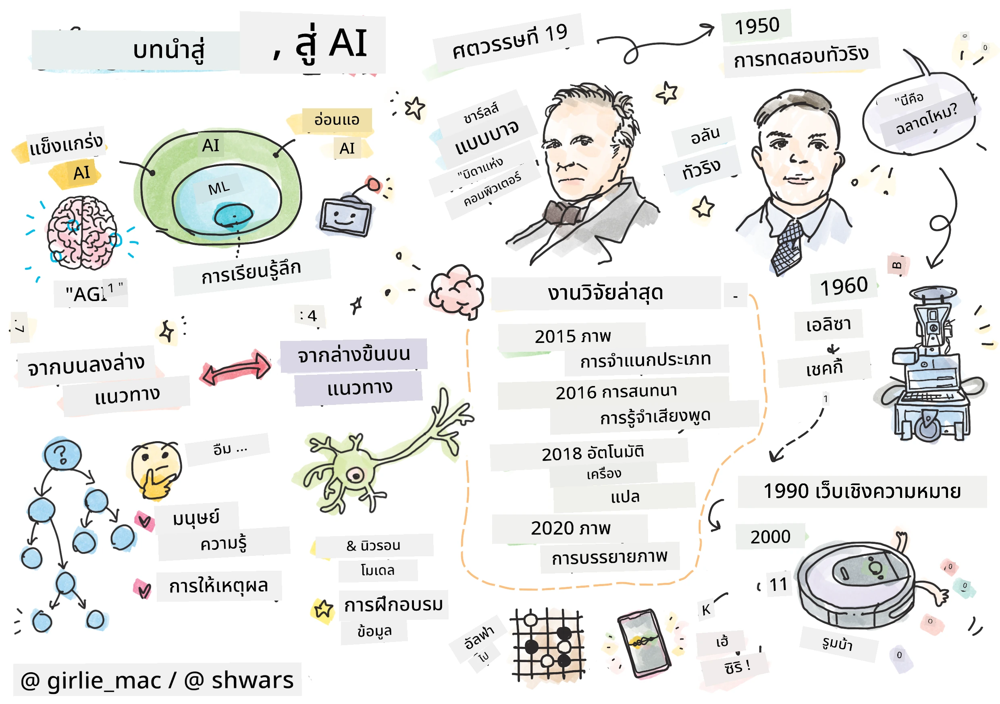
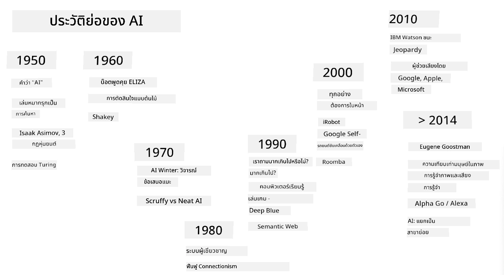

# การแนะนำเกี่ยวกับ AI

> ภาพวาดโดย [Tomomi Imura](https://twitter.com/girlie_mac)

## [แบบทดสอบก่อนการบรรยาย](https://ff-quizzes.netlify.app/en/ai/quiz/1)

**ปัญญาประดิษฐ์** เป็นสาขาวิทยาศาสตร์ที่น่าตื่นเต้นที่ศึกษาว่าเราสามารถทำให้คอมพิวเตอร์แสดงพฤติกรรมที่ชาญฉลาดได้อย่างไร เช่น การทำสิ่งที่มนุษย์เก่งในการทำ

เดิมทีคอมพิวเตอร์ถูกคิดค้นโดย [Charles Babbage](https://en.wikipedia.org/wiki/Charles_Babbage) เพื่อทำงานกับตัวเลขตามกระบวนการที่กำหนดไว้อย่างชัดเจน - หรือที่เรียกว่าอัลกอริทึม คอมพิวเตอร์สมัยใหม่ แม้ว่าจะมีความก้าวหน้ามากกว่ารุ่นต้นแบบในศตวรรษที่ 19 แต่ก็ยังคงยึดแนวคิดเดิมเกี่ยวกับการคำนวณที่ควบคุมได้ ดังนั้นจึงเป็นไปได้ที่จะเขียนโปรแกรมให้คอมพิวเตอร์ทำบางสิ่งได้ หากเรารู้ลำดับขั้นตอนที่แน่นอนที่เราต้องทำเพื่อให้บรรลุเป้าหมาย

> ภาพถ่ายโดย [Vickie Soshnikova](http://twitter.com/vickievalerie)

> ✅ การกำหนดอายุของบุคคลจากภาพถ่ายของเขาหรือเธอเป็นงานที่ไม่สามารถเขียนโปรแกรมได้อย่างชัดเจน เพราะเราไม่รู้ว่าทำไมเราถึงคิดตัวเลขในหัวเมื่อเราทำสิ่งนี้

---

มีบางงานที่เราไม่รู้วิธีแก้ไขอย่างชัดเจน ลองพิจารณาการกำหนดอายุของบุคคลจากภาพถ่ายของเขาหรือเธอ เราเรียนรู้ที่จะทำสิ่งนี้ได้ เพราะเราเคยเห็นตัวอย่างของคนในวัยต่าง ๆ มากมาย แต่เราไม่สามารถอธิบายได้อย่างชัดเจนว่าเราทำสิ่งนี้อย่างไร หรือเขียนโปรแกรมให้คอมพิวเตอร์ทำได้ นี่คือลักษณะของงานที่น่าสนใจสำหรับ **ปัญญาประดิษฐ์** (หรือเรียกสั้น ๆ ว่า AI)

✅ ลองคิดถึงงานบางอย่างที่คุณสามารถมอบหมายให้คอมพิวเตอร์ทำได้และจะได้รับประโยชน์จาก AI ลองพิจารณาด้านการเงิน การแพทย์ และศิลปะ - สาขาเหล่านี้ได้รับประโยชน์จาก AI อย่างไรในปัจจุบัน?

## AI แบบอ่อน vs. AI แบบแข็ง

AI แบบอ่อน | AI แบบแข็ง
---------------------------------------|-------------------------------------
AI แบบอ่อนหมายถึงระบบ AI ที่ถูกออกแบบและฝึกฝนเพื่อทำงานเฉพาะหรือชุดงานที่จำกัด | AI แบบแข็ง หรือปัญญาประดิษฐ์ทั่วไป (AGI) หมายถึงระบบ AI ที่มีความฉลาดและความเข้าใจในระดับมนุษย์
ระบบ AI เหล่านี้ไม่ได้มีความฉลาดทั่วไป แต่เก่งในการทำงานที่กำหนดไว้ล่วงหน้า แต่ขาดความเข้าใจหรือจิตสำนึกที่แท้จริง | ระบบ AI เหล่านี้มีความสามารถในการทำงานทางปัญญาใด ๆ ที่มนุษย์สามารถทำได้ ปรับตัวในโดเมนต่าง ๆ และมีรูปแบบของจิตสำนึกหรือการรับรู้ตัวเอง
ตัวอย่างของ AI แบบอ่อน ได้แก่ ผู้ช่วยเสมือนอย่าง Siri หรือ Alexa อัลกอริทึมแนะนำที่ใช้โดยบริการสตรีมมิ่ง และแชทบอทที่ออกแบบมาสำหรับงานบริการลูกค้าเฉพาะ | การบรรลุ AI แบบแข็งเป็นเป้าหมายระยะยาวของการวิจัย AI และจะต้องพัฒนาระบบ AI ที่สามารถให้เหตุผล เรียนรู้ เข้าใจ และปรับตัวในงานและบริบทที่หลากหลาย
AI แบบอ่อนมีความเชี่ยวชาญสูงและไม่มีความสามารถทางปัญญาเหมือนมนุษย์หรือความสามารถในการแก้ปัญหาโดยทั่วไปนอกเหนือจากโดเมนที่จำกัด | AI แบบแข็งยังคงเป็นแนวคิดเชิงทฤษฎี และยังไม่มีระบบ AI ใดที่ถึงระดับความฉลาดทั่วไปนี้

สำหรับข้อมูลเพิ่มเติม โปรดดู **[Artificial General Intelligence](https://en.wikipedia.org/wiki/Artificial_general_intelligence)** (AGI)

## คำจำกัดความของความฉลาดและการทดสอบทัวริง

หนึ่งในปัญหาเมื่อพูดถึงคำว่า **[ความฉลาด](https://en.wikipedia.org/wiki/Intelligence)** คือไม่มีคำจำกัดความที่ชัดเจนของคำนี้ บางคนอาจโต้แย้งว่าความฉลาดเชื่อมโยงกับ **การคิดเชิงนามธรรม** หรือ **การรับรู้ตัวเอง** แต่เราไม่สามารถกำหนดมันได้อย่างเหมาะสม

> [ภาพถ่าย](https://unsplash.com/photos/75715CVEJhI) โดย [Amber Kipp](https://unsplash.com/@sadmax) จาก Unsplash

เพื่อดูความคลุมเครือของคำว่า *ความฉลาด* ลองตอบคำถามว่า "แมวฉลาดหรือไม่?" คนต่าง ๆ มักจะให้คำตอบที่แตกต่างกันสำหรับคำถามนี้ เพราะไม่มีการทดสอบที่ได้รับการยอมรับอย่างสากลเพื่อพิสูจน์ว่าคำกล่าวนั้นจริงหรือไม่ และถ้าคุณคิดว่ามี - ลองให้แมวของคุณทำแบบทดสอบ IQ...

✅ ลองคิดสักนาทีว่าคุณนิยามความฉลาดอย่างไร อีกา ที่สามารถแก้ปริศนาและหาอาหารได้ ฉลาดหรือไม่? เด็กฉลาดหรือไม่?

---

เมื่อพูดถึง AGI เราจำเป็นต้องมีวิธีบอกว่าเราได้สร้างระบบที่ฉลาดจริงหรือไม่ [Alan Turing](https://en.wikipedia.org/wiki/Alan_Turing) เสนอวิธีที่เรียกว่า **[การทดสอบทัวริง](https://en.wikipedia.org/wiki/Turing_test)** ซึ่งทำหน้าที่เหมือนคำจำกัดความของความฉลาด การทดสอบเปรียบเทียบระบบที่กำหนดกับสิ่งที่ฉลาดโดยธรรมชาติ - มนุษย์จริง และเนื่องจากการเปรียบเทียบอัตโนมัติใด ๆ สามารถถูกหลีกเลี่ยงได้โดยโปรแกรมคอมพิวเตอร์ เราจึงใช้ผู้สอบสวนมนุษย์ ดังนั้น หากมนุษย์ไม่สามารถแยกแยะระหว่างคนจริงและระบบคอมพิวเตอร์ในบทสนทนาแบบข้อความ - ระบบนั้นถือว่าฉลาด

> แชทบอทที่ชื่อ [Eugene Goostman](https://en.wikipedia.org/wiki/Eugene_Goostman) ซึ่งพัฒนาในเซนต์ปีเตอร์สเบิร์ก เกือบผ่านการทดสอบทัวริงในปี 2014 โดยใช้กลยุทธ์บุคลิกภาพที่ชาญฉลาด มันประกาศล่วงหน้าว่ามันเป็นเด็กชายชาวยูเครนอายุ 13 ปี ซึ่งอธิบายถึงการขาดความรู้และความไม่สอดคล้องบางอย่างในข้อความ บอททำให้ผู้ตัดสิน 30% เชื่อว่ามันเป็นมนุษย์หลังจากบทสนทนา 5 นาที ซึ่งเป็นตัวชี้วัดที่ทัวริงเชื่อว่าคอมพิวเตอร์จะสามารถผ่านได้ภายในปี 2000 อย่างไรก็ตาม ควรเข้าใจว่านี่ไม่ได้หมายความว่าเราได้สร้างระบบที่ฉลาด หรือว่าระบบคอมพิวเตอร์หลอกผู้สอบสวนมนุษย์ - ระบบไม่ได้หลอกมนุษย์ แต่ผู้สร้างบอทต่างหากที่หลอก!

✅ คุณเคยถูกแชทบอทหลอกให้คิดว่าคุณกำลังพูดคุยกับมนุษย์หรือไม่? มันทำให้คุณเชื่อได้อย่างไร?

## วิธีการต่าง ๆ ในการสร้าง AI

หากเราต้องการให้คอมพิวเตอร์มีพฤติกรรมเหมือนมนุษย์ เราจำเป็นต้องสร้างแบบจำลองวิธีคิดของเราในคอมพิวเตอร์ ดังนั้นเราจำเป็นต้องพยายามทำความเข้าใจว่าอะไรทำให้มนุษย์ฉลาด

> เพื่อที่จะเขียนโปรแกรมความฉลาดลงในเครื่องจักร เราจำเป็นต้องเข้าใจว่ากระบวนการตัดสินใจของเราเองทำงานอย่างไร หากคุณลองสำรวจตัวเอง คุณจะพบว่ามีกระบวนการบางอย่างที่เกิดขึ้นโดยไม่รู้ตัว เช่น เราสามารถแยกแยะแมวจากสุนัขได้โดยไม่ต้องคิด ในขณะที่บางกระบวนการเกี่ยวข้องกับการให้เหตุผล

มีสองวิธีที่เป็นไปได้สำหรับปัญหานี้:

วิธีจากบนลงล่าง (การให้เหตุผลเชิงสัญลักษณ์) | วิธีจากล่างขึ้นบน (เครือข่ายประสาท)
---------------------------------------|-------------------------------------
วิธีจากบนลงล่างสร้างแบบจำลองวิธีที่บุคคลให้เหตุผลในการแก้ปัญหา มันเกี่ยวข้องกับการดึง **ความรู้** จากมนุษย์ และแสดงในรูปแบบที่คอมพิวเตอร์อ่านได้ นอกจากนี้เรายังต้องพัฒนาวิธีการสร้างแบบจำลอง **การให้เหตุผล** ในคอมพิวเตอร์ | วิธีจากล่างขึ้นบนสร้างแบบจำลองโครงสร้างของสมองมนุษย์ ซึ่งประกอบด้วยหน่วยง่าย ๆ จำนวนมากที่เรียกว่า **เซลล์ประสาท** แต่ละเซลล์ประสาททำหน้าที่เหมือนค่าเฉลี่ยถ่วงน้ำหนักของอินพุต และเราสามารถฝึกเครือข่ายเซลล์ประสาทเพื่อแก้ปัญหาที่มีประโยชน์โดยให้ **ข้อมูลการฝึกฝน**

นอกจากนี้ยังมีวิธีการอื่น ๆ ที่เป็นไปได้สำหรับความฉลาด:

* วิธี **เกิดขึ้นเอง**, **การทำงานร่วมกัน** หรือ **วิธีหลายตัวแทน** อิงตามข้อเท็จจริงที่ว่าพฤติกรรมที่ชาญฉลาดซับซ้อนสามารถเกิดขึ้นได้จากการมีปฏิสัมพันธ์ของตัวแทนง่าย ๆ จำนวนมาก ตาม [วิวัฒนาการไซเบอร์เนติกส์](https://en.wikipedia.org/wiki/Global_brain#Evolutionary_cybernetics) ความฉลาดสามารถ *เกิดขึ้น* จากพฤติกรรมที่ตอบสนองง่าย ๆ ในกระบวนการ *การเปลี่ยนแปลงระบบเมตา*

* วิธี **วิวัฒนาการ** หรือ **อัลกอริทึมทางพันธุกรรม** เป็นกระบวนการเพิ่มประสิทธิภาพที่อิงตามหลักการของวิวัฒนาการ

เราจะพิจารณาวิธีการเหล่านี้ในภายหลังในหลักสูตร แต่ตอนนี้เราจะมุ่งเน้นไปที่สองทิศทางหลัก: จากบนลงล่างและจากล่างขึ้นบน

### วิธีจากบนลงล่าง

ใน **วิธีจากบนลงล่าง** เราพยายามสร้างแบบจำลองการให้เหตุผลของเรา เพราะเราสามารถติดตามความคิดของเราเมื่อเราให้เหตุผล เราสามารถพยายามทำให้กระบวนการนี้เป็นรูปแบบและเขียนโปรแกรมลงในคอมพิวเตอร์ได้ สิ่งนี้เรียกว่า **การให้เหตุผลเชิงสัญลักษณ์**

คนมักจะมีกฎบางอย่างในหัวที่แนะนำกระบวนการตัดสินใจของพวกเขา ตัวอย่างเช่น เมื่อแพทย์วินิจฉัยผู้ป่วย เขาหรือเธออาจตระหนักว่าบุคคลนั้นมีไข้ และดังนั้นอาจมีการอักเสบเกิดขึ้นในร่างกาย โดยการใช้ชุดกฎขนาดใหญ่กับปัญหาเฉพาะ แพทย์อาจสามารถหาข้อวินิจฉัยสุดท้ายได้

วิธีนี้พึ่งพา **การแสดงความรู้** และ **การให้เหตุผล** เป็นอย่างมาก การดึงความรู้จากผู้เชี่ยวชาญมนุษย์อาจเป็นส่วนที่ยากที่สุด เพราะในหลายกรณีแพทย์อาจไม่รู้แน่ชัดว่าทำไมเขาหรือเธอถึงได้ข้อวินิจฉัยเฉพาะ บางครั้งคำตอบก็ปรากฏขึ้นในหัวของเขาหรือเธอโดยไม่ต้องคิดอย่างชัดเจน บางงาน เช่น การกำหนดอายุของบุคคลจากภาพถ่าย ไม่สามารถลดลงไปเป็นการจัดการความรู้ได้เลย

### วิธีจากล่างขึ้นบน

ในทางกลับกัน เราสามารถพยายามสร้างแบบจำลององค์ประกอบที่ง่ายที่สุดในสมองของเรา – เซลล์ประสาท เราสามารถสร้าง **เครือข่ายประสาทเทียม** ในคอมพิวเตอร์ และจากนั้นพยายามสอนมันให้แก้ปัญหาโดยการให้ตัวอย่าง กระบวนการนี้คล้ายกับวิธีที่เด็กแรกเกิดเรียนรู้เกี่ยวกับสิ่งรอบตัวโดยการสังเกต

✅ ลองค้นคว้าเกี่ยวกับวิธีที่ทารกเรียนรู้ องค์ประกอบพื้นฐานของสมองทารกคืออะไร?

> | แล้ว ML ล่ะ?         |      |
> |--------------|-----------|
> | ส่วนหนึ่งของปัญญาประดิษฐ์ที่อิงกับการเรียนรู้ของคอมพิวเตอร์ในการแก้ปัญหาตามข้อมูลบางอย่างเรียกว่า **Machine Learning** เราจะไม่พิจารณาการเรียนรู้ของเครื่องแบบคลาสสิกในหลักสูตรนี้ - เราแนะนำให้คุณดูหลักสูตร [Machine Learning for Beginners](http://aka.ms/ml-beginners) แยกต่างหาก |       |

## ประวัติย่อของ AI

ปัญญาประดิษฐ์เริ่มต้นเป็นสาขาในช่วงกลางศตวรรษที่ 20 ในช่วงแรก วิธีการให้เหตุผลเชิงสัญลักษณ์เป็นวิธีที่แพร่หลาย และนำไปสู่ความสำเร็จที่สำคัญหลายประการ เช่น ระบบผู้เชี่ยวชาญ – โปรแกรมคอมพิวเตอร์ที่สามารถทำหน้าที่เป็นผู้เชี่ยวชาญในบางโดเมนปัญหาที่จำกัด อย่างไรก็ตาม ไม่นานก็ชัดเจนว่าวิธีการดังกล่าวไม่สามารถขยายขอบเขตได้ดี การดึงความรู้จากผู้เชี่ยวชาญ การแสดงในคอมพิวเตอร์ และการรักษาฐานความรู้ให้ถูกต้องกลายเป็นงานที่ซับซ้อนมาก และมีค่าใช้จ่ายสูงเกินไปที่จะนำไปใช้ในหลายกรณี สิ่งนี้นำไปสู่สิ่งที่เรียกว่า [AI Winter](https://en.wikipedia.org/wiki/AI_winter) ในทศวรรษ 1970

> ภาพโดย [Dmitry Soshnikov](http://soshnikov.com)

เมื่อเวลาผ่านไป ทรัพยากรการคำนวณมีราคาถูกลง และมีข้อมูลมากขึ้น วิธีการเครือข่ายประสาทเริ่มแสดงประสิทธิภาพที่ยอดเยี่ยมในการแข่งขันกับมนุษย์ในหลายด้าน เช่น การมองเห็นด้วยคอมพิวเตอร์หรือการเข้าใจเสียงพูด ในทศวรรษที่ผ่านมา คำว่าปัญญาประดิษฐ์ถูกใช้เป็นคำพ้องความหมายสำหรับเครือข่ายประสาท เพราะความสำเร็จของ AI ส่วนใหญ่ที่เราได้ยินเกี่ยวกับนั้นอิงกับเครือข่ายประสาท

เราสามารถสังเกตเห็นการเปลี่ยนแปลงของวิธีการ เช่น ในการสร้างโปรแกรมคอมพิวเตอร์เล่นหมากรุก:

* โปรแกรมหมากรุกในยุคแรกอิงกับการค้นหา – โปรแกรมพยายามประเมินการเคลื่อนไหวที่เป็นไปได้ของคู่ต่อสู้ในจำนวนการเคลื่อนไหวถัดไปที่กำหนด และเลือกการเคลื่อนไหวที่เหมาะสมที่สุดตามตำแหน่งที่เหมาะสมที่สุดที่สามารถทำได้ในไม่กี่การเคลื่อนไหว สิ่งนี้นำไปสู่การพัฒนาอัลกอริทึมการค้นหา [alpha-beta pruning](https://en.wikipedia.org/wiki/Alpha%E2%80%93beta_pruning)
* กลยุทธ์การค้นหาทำงานได้ดีในช่วงท้ายเกม ซึ่งพื้นที่การค้นหาถูกจำกัดด้วยจำนวนการเคลื่อนไหวที่เป็นไปได้เล็กน้อย อย่างไรก็ตาม ในช่วงต้นเกม พื้นที่การค้นหามีขนาดใหญ่ และอัลกอริทึมสามารถปรับปรุงได้โดยการเรียนรู้จากการแข่งขันที่มีอยู่ระหว่างผู้เล่นมนุษย์ การทดลองต่อมาใช้วิธี [case-based reasoning](https://en.wikipedia.org/wiki/Case-based_reasoning) ซึ่งโปรแกรมค้นหากรณีในฐานความรู้ที่คล้ายกับตำแหน่งปัจจุบันในเกม
* โปรแกรมสมัยใหม่ที่ชนะผู้เล่นมนุษย์อิงกับเครือข่ายประสาทและ [การเรียนรู้แบบเสริมกำลัง](https://en.wikipedia.org/wiki/Reinforcement_learning) ซึ่งโปรแกรมเรียนรู้ที่จะเล่นโดยการเล่นกับตัวเองเป็นเวลานานและเรียนรู้จากความผิดพลาดของตัวเอง – คล้ายกับวิธีที่มนุษย์เรียนรู้เล่นหมากรุก อย่างไรก็ตาม โปรแกรมคอมพิวเตอร์สามารถเล่นเกมได้มากกว่าในเวลาที่น้อยกว่า และดังนั้นสามารถเรียนรู้ได้เร็วกว่า

✅ ลองค้นคว้าเกี่ยวกับเกมอื่น ๆ ที่ AI เคยเล่น

ในทำนองเดียวกัน เราสามารถเห็นการเปลี่ยนแปลงของวิธีการในการสร้าง “โปรแกรมพูดคุย” (ที่อาจผ่านการทดสอบ
> ภาพโดย Dmitry Soshnikov, [ภาพถ่าย](https://unsplash.com/photos/r8LmVbUKgns) โดย [Marina Abrosimova](https://unsplash.com/@abrosimova_marina_foto), Unsplash

## งานวิจัย AI ล่าสุด

การเติบโตอย่างมหาศาลในงานวิจัยเกี่ยวกับเครือข่ายประสาทเทียมเริ่มต้นขึ้นประมาณปี 2010 เมื่อชุดข้อมูลสาธารณะขนาดใหญ่เริ่มมีให้ใช้งาน ชุดข้อมูลภาพขนาดใหญ่ที่เรียกว่า [ImageNet](https://en.wikipedia.org/wiki/ImageNet) ซึ่งมีภาพที่มีคำอธิบายประมาณ 14 ล้านภาพ ได้ก่อให้เกิด [ImageNet Large Scale Visual Recognition Challenge](https://image-net.org/challenges/LSVRC/)

> ภาพโดย [Dmitry Soshnikov](http://soshnikov.com)

ในปี 2012 [Convolutional Neural Networks](../4-ComputerVision/07-ConvNets/README.md) ถูกนำมาใช้ครั้งแรกในงานการจำแนกภาพ ซึ่งนำไปสู่การลดข้อผิดพลาดในการจำแนกอย่างมีนัยสำคัญ (จากเกือบ 30% เหลือ 16.4%) ในปี 2015 สถาปัตยกรรม ResNet จาก Microsoft Research [บรรลุความแม่นยำในระดับมนุษย์](https://doi.org/10.1109/ICCV.2015.123)

ตั้งแต่นั้นมา เครือข่ายประสาทเทียมได้แสดงพฤติกรรมที่ประสบความสำเร็จอย่างมากในหลายงาน:

---

ปี | บรรลุความเท่าเทียมกับมนุษย์
-----|--------
2015 | [การจำแนกภาพ](https://doi.org/10.1109/ICCV.2015.123)
2016 | [การรู้จำเสียงพูดสนทนา](https://arxiv.org/abs/1610.05256)
2018 | [การแปลภาษาอัตโนมัติ](https://arxiv.org/abs/1803.05567) (จีนเป็นอังกฤษ)
2020 | [การบรรยายภาพ](https://arxiv.org/abs/2009.13682)

ในช่วงไม่กี่ปีที่ผ่านมา เราได้เห็นความสำเร็จอย่างมากของโมเดลภาษาขนาดใหญ่ เช่น BERT และ GPT-3 สิ่งนี้เกิดขึ้นส่วนใหญ่เนื่องจากมีข้อมูลข้อความทั่วไปจำนวนมากที่ช่วยให้เราฝึกโมเดลเพื่อจับโครงสร้างและความหมายของข้อความ ฝึกโมเดลล่วงหน้าด้วยชุดข้อความทั่วไป และจากนั้นจึงปรับแต่งโมเดลเหล่านั้นสำหรับงานเฉพาะ เราจะเรียนรู้เพิ่มเติมเกี่ยวกับ [การประมวลผลภาษาธรรมชาติ](../5-NLP/README.md) ในบทเรียนต่อไปของคอร์สนี้

## 🚀 ความท้าทาย

สำรวจอินเทอร์เน็ตเพื่อพิจารณาว่าในความเห็นของคุณ AI ถูกใช้อย่างมีประสิทธิภาพที่สุดในที่ใด เช่น ในแอปแผนที่ บริการแปลงเสียงเป็นข้อความ หรือในวิดีโอเกม? ศึกษาว่าระบบนั้นถูกสร้างขึ้นมาอย่างไร

## [แบบทดสอบหลังบทเรียน](https://ff-quizzes.netlify.app/en/ai/quiz/2)

## ทบทวน & ศึกษาด้วยตนเอง

ทบทวนประวัติศาสตร์ของ AI และ ML โดยการอ่าน [บทเรียนนี้](https://github.com/microsoft/ML-For-Beginners/tree/main/1-Introduction/2-history-of-ML) เลือกองค์ประกอบหนึ่งจากภาพสเก็ตช์โน้ตที่อยู่ด้านบนของบทเรียนนี้หรือบทเรียนนี้ และศึกษามันในเชิงลึกเพื่อทำความเข้าใจบริบททางวัฒนธรรมที่มีผลต่อการพัฒนาของมัน

**งานที่ได้รับมอบหมาย**: [Game Jam](assignment.md)

---

<!-- CO-OP TRANSLATOR DISCLAIMER START -->
**ข้อจำกัดความรับผิดชอบ**:  
เอกสารนี้ได้รับการแปลโดยใช้บริการแปลภาษา AI [Co-op Translator](https://github.com/Azure/co-op-translator) แม้ว่าเราจะพยายามให้การแปลมีความถูกต้อง แต่โปรดทราบว่าการแปลอัตโนมัติอาจมีข้อผิดพลาดหรือความไม่ถูกต้อง เอกสารต้นฉบับในภาษาต้นทางควรถือเป็นแหล่งข้อมูลที่เชื่อถือได้ สำหรับข้อมูลที่สำคัญ แนะนำให้ใช้บริการแปลภาษามนุษย์ที่เป็นมืออาชีพ เราไม่รับผิดชอบต่อความเข้าใจผิดหรือการตีความผิดที่เกิดจากการใช้การแปลนี้
<!-- CO-OP TRANSLATOR DISCLAIMER END -->