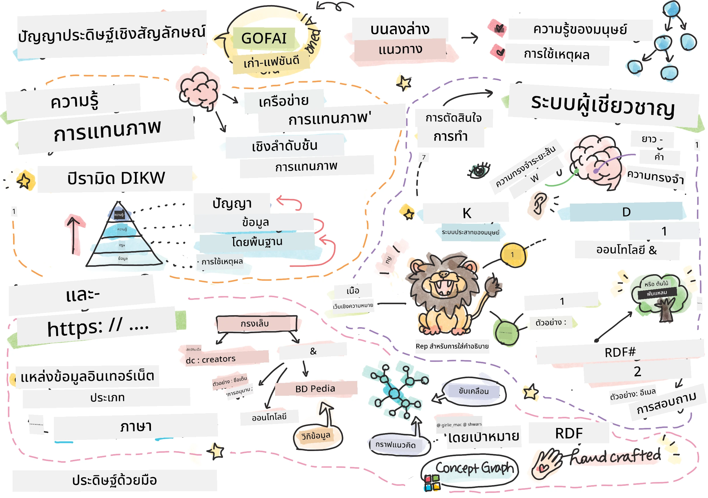
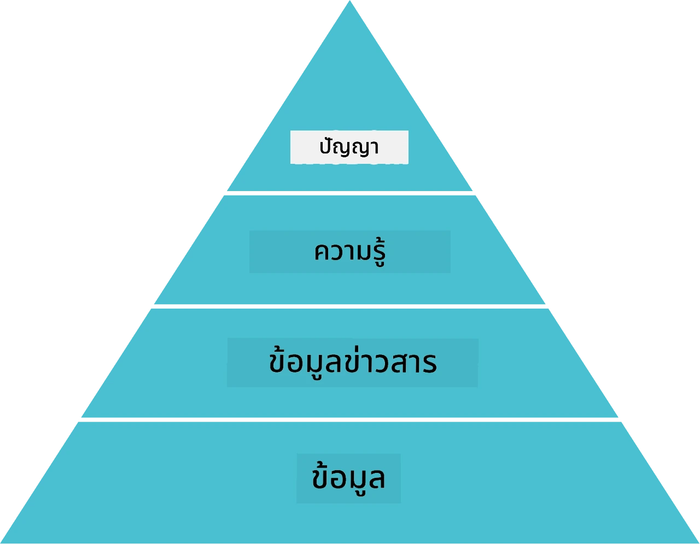
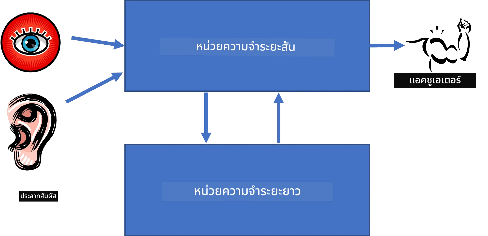
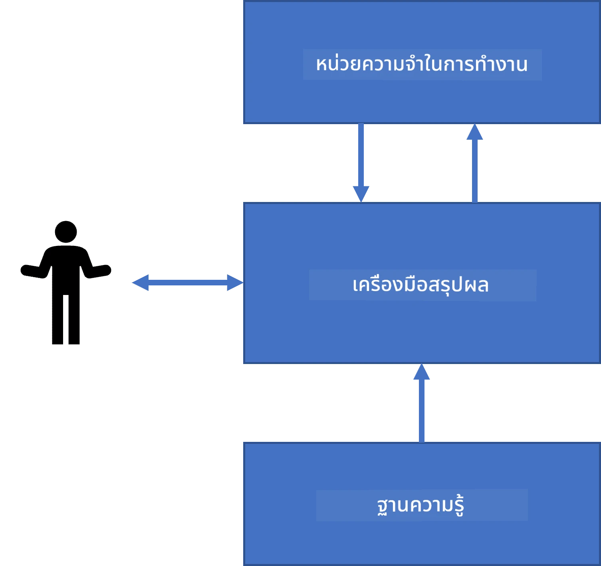
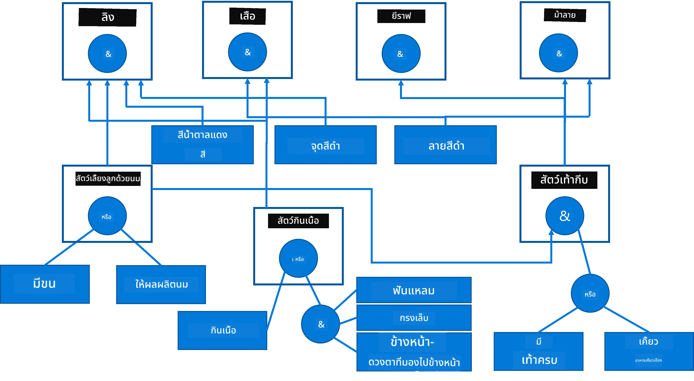
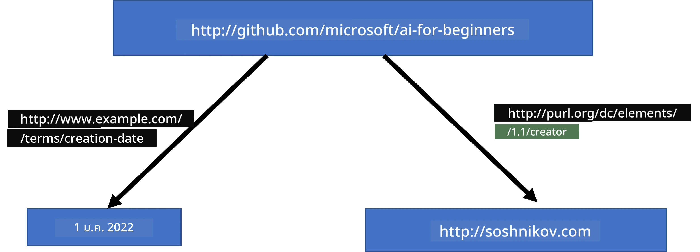
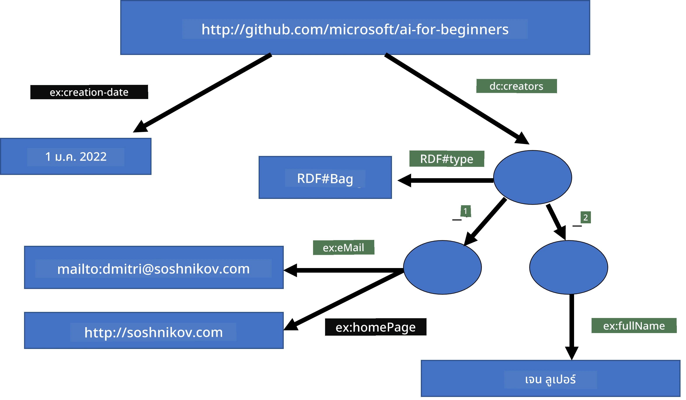
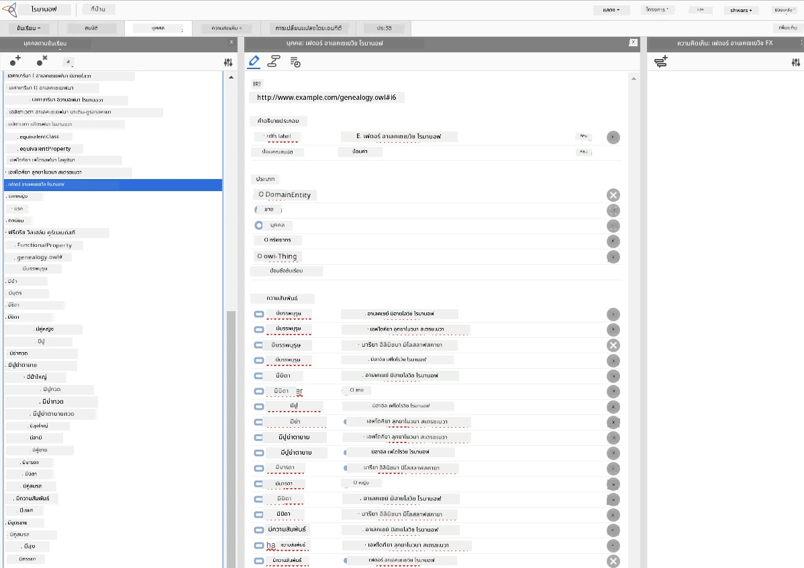

# การแทนความรู้และระบบผู้เชี่ยวชาญ



> สเก็ตช์โน้ตโดย [Tomomi Imura](https://twitter.com/girlie_mac)

ภารกิจในการพัฒนาปัญญาประดิษฐ์นั้นมีพื้นฐานจากการแสวงหาความรู้ เพื่อทำความเข้าใจโลกอย่างที่มนุษย์ทำได้ แต่เราจะทำเช่นนี้ได้อย่างไร?

## [แบบทดสอบก่อนเรียน](https://ff-quizzes.netlify.app/en/ai/quiz/3)

ในยุคแรกของ AI วิธีการสร้างระบบอัจฉริยะแบบ top-down (ที่กล่าวถึงในบทเรียนก่อนหน้า) เป็นที่นิยม แนวคิดคือการดึงความรู้จากมนุษย์ให้อยู่ในรูปแบบที่เครื่องอ่านได้ แล้วใช้เพื่อแก้ปัญหาโดยอัตโนมัติ วิธีนี้ยึดตามแนวคิดหลักสองอย่าง:

* การแทนความรู้
* การอนุมาน

## การแทนความรู้

หนึ่งในแนวคิดสำคัญของ AI เชิงสัญลักษณ์คือ **ความรู้** การแยกแยะความรู้จาก *ข้อมูล* หรือ *ข้อมูลดิบ* เป็นสิ่งสำคัญ เช่น เราสามารถกล่าวได้ว่าหนังสือมีความรู้ เพราะสามารถศึกษาหนังสือและกลายเป็นผู้เชี่ยวชาญได้ แต่แท้จริงแล้วสิ่งที่อยู่ในหนังสือเรียกว่า *ข้อมูล* และเมื่ออ่านหนังสือและรวมข้อมูลนี้เข้าในแบบจำลองโลกของเรา เราก็แปลงข้อมูลนี้เป็นความรู้

> ✅ **ความรู้** คือสิ่งที่อยู่ในหัวของเราและแทนความเข้าใจโลกของเราได้ มันได้มาจากกระบวนการ **เรียนรู้** อย่างกระตือรือร้น ซึ่งรวมชิ้นส่วนข้อมูลที่เราได้รับเข้าในแบบจำลองโลกที่เราสร้างขึ้น

โดยส่วนใหญ่ เราไม่ใช้นิยามความรู้แบบเข้มงวด แต่เราจะจัดเรียงความรู้ให้สอดคล้องกับแนวคิดที่เกี่ยวข้องอื่น ๆ ผ่าน [พีระมิด DIKW](https://en.wikipedia.org/wiki/DIKW_pyramid) ซึ่งประกอบด้วยแนวคิดดังนี้:

* **ข้อมูล (Data)** คือสิ่งที่แสดงออกในสื่อทางกายภาพ เช่น ข้อความที่เขียนหรือคำพูด ข้อมูลมีอยู่โดยอิสระจากมนุษย์และสามารถส่งผ่านกันได้
* **สารสนเทศ (Information)** คือวิธีที่เราตีความข้อมูลในหัวของเรา เช่น เมื่อเราได้ยินคำว่า *computer* เรามีความเข้าใจบางอย่างเกี่ยวกับมัน
* **ความรู้ (Knowledge)** คือสารสนเทศที่ถูกรวมเข้าในแบบจำลองโลกของเรา เช่น เมื่อเราเรียนรู้ว่าคอมพิวเตอร์คืออะไร เราจะเริ่มมีไอเดียว่ามันทำงานอย่างไร ราคาเท่าไร และใช้ทำอะไรได้ เครือข่ายของแนวคิดที่เกี่ยวข้องนี้ก่อตัวเป็นความรู้ของเรา
* **ภูมิปัญญา (Wisdom)** คือระดับหนึ่งของความเข้าใจโลก ซึ่งแทน *เมตาความรู้* เช่น แนวคิดว่าควรใช้ความรู้นั้นอย่างไรและเมื่อไร



*ภาพจาก [วิกิพีเดีย](https://commons.wikimedia.org/w/index.php?curid=37705247), โดย Longlivetheux - งานของตนเอง, CC BY-SA 4.0*

ดังนั้น ปัญหาเรื่อง **การแทนความรู้** คือการหาวิธีที่มีประสิทธิภาพในการแทนความรู้ภายในคอมพิวเตอร์ในรูปแบบข้อมูล เพื่อให้ใช้งานได้โดยอัตโนมัติ ซึ่งสามารถมองเห็นในรูปสเปกตรัมดังนี้:


> ภาพโดย [Dmitry Soshnikov](http://soshnikov.com)

* ทางซ้ายคือการแทนความรู้ชนิดง่ายที่คอมพิวเตอร์สามารถใช้ได้อย่างมีประสิทธิภาพ วิธีที่ง่ายที่สุดคือแบบอัลกอริทึม เมื่อความรู้ถูกรวมอยู่ในโปรแกรมคอมพิวเตอร์ แต่ไม่ใช่วิธีที่ดีที่สุด เพราะมันไม่ยืดหยุ่น ความรู้ในหัวเรามักไม่ใช่อัลกอริทึม
* ทางขวาคือรูปแบบการแทนความรู้เช่นข้อความตามธรรมชาติ ซึ่งทรงพลังที่สุด แต่ไม่สามารถใช้เพื่อการอนุมานอัตโนมัติได้

> ✅ ลองคิดสักครู่เกี่ยวกับวิธีที่คุณแทนความรู้ในหัวและแปลงเป็นโน้ต มีรูปแบบใดที่เหมาะสมเพื่อช่วยการจดจำของคุณไหม?

## การจัดประเภทของการแทนข้อมูลในคอมพิวเตอร์

เราสามารถจัดประเภทวิธีการแทนความรู้ในคอมพิวเตอร์ออกเป็นกลุ่มต่าง ๆ ดังนี้:

* **การแทนด้วยเครือข่าย** อิงกับความจริงที่ว่าเราเก็บเครือข่ายของแนวคิดที่เกี่ยวข้องกันในหัว เราสามารถจำลองเครือข่ายเดียวกันนี้ในคอมพิวเตอร์ในรูปแบบกราฟ — ที่เรียกว่า **เครือข่ายความหมาย (semantic network)**

1. **ข้อมูลแบบทริปเปิล (Object-Attribute-Value triplets)** หรือ **คู่คุณลักษณะ-ค่า (attribute-value pairs)** เนื่องจากกราฟสามารถแทนในคอมพิวเตอร์ด้วยรายการของโหนดและเส้นเชื่อม เราสามารถแทนเครือข่ายความหมายด้วยรายการทริปเปิลที่ประกอบด้วยวัตถุ, คุณลักษณะ, และค่า เช่น เราสร้างทริปเปิลสำหรับภาษาโปรแกรมดังนี้:

Object | Attribute | Value
-------|-----------|------
Python | is | Untyped-Language
Python | invented-by | Guido van Rossum
Python | block-syntax | indentation
Untyped-Language | doesn't have | type definitions

> ✅ คิดว่าทริปเปิลเหล่านี้สามารถใช้แทนความรู้ประเภทอื่นได้อย่างไรบ้าง

2. **การแทนแบบลำดับชั้น** เน้นว่าเรามักสร้างลำดับชั้นของวัตถุในหัว เช่น เรารู้ว่าคานารี่เป็นนก และนกทุกชนิดมีปีก เรายังมีไอเดียเกี่ยวกับสีที่คานารี่มักมีและความเร็วในการบิน

   - **การแทนด้วยเฟรม (Frame representation)** คือการแทนแต่ละวัตถุหรือคลาสวัตถุเป็น **เฟรม** ซึ่งมี **ช่อง (slots)** ช่องเหล่านี้มีค่าปริยาย ค่าที่จำกัด หรือขั้นตอนที่เก็บไว้ซึ่งสามารถเรียกใช้เพื่อตรวจค่าของช่อง เฟรมทั้งหมดก่อตัวเป็นลำดับชั้นคล้ายโครงสร้างวัตถุในภาษาโปรแกรมเชิงวัตถุ
   - **สถานการณ์ (Scenarios)** เป็นเฟมพิเศษที่แทนสถานการณ์ซับซ้อนที่เกิดขึ้นเวลา

**Python**

Slot | Value | Default value | Interval |
-----|-------|---------------|----------|
Name | Python | | |
Is-A | Untyped-Language | | |
Variable Case | | CamelCase | |
Program Length | | | 5-5000 lines |
Block Syntax | Indent | | |

3. **การแทนเชิงกระบวนการ (Procedural representations)** อาศัยการแทนความรู้โดยรายการของกระทำที่สามารถปฏิบัติได้เมื่อมีเงื่อนไขบางอย่างเกิดขึ้น
   - กฎผลิต (Production rules) คือ if-then statements ที่ช่วยให้เราอนุมานได้ เช่น หมออาจมีกฎว่า **ถ้า (IF)** ผู้ป่วยมีไข้สูง **หรือ (OR)** มีระดับ C-reactive protein สูงในผลตรวจเลือด **แล้ว (THEN)** ผู้ป่วยมีการอักเสบ เมื่อตรงตามเงื่อนไข เราสามารถสรุปได้ว่ามีการอักเสบ จากนั้นใช้ในกระบวนการอนุมานต่อไป
   - อัลกอริทึมถือเป็นวิธีการแทนแบบกระบวนการเช่นกัน แม้ว่าจะแทบไม่ถูกใช้โดยตรงในระบบฐานความรู้

4. **ตรรกศาสตร์** ถูกเสนอครั้งแรกโดยอริสโตเติลเพื่อแทนความรู้มนุษย์อย่างทั่วถึง
   - ตรรกศาสตร์เชิงพจน์ (Predicate Logic) เป็นทฤษฎีทางคณิตศาสตร์ที่ซับซ้อนเกินกว่าจะคำนวณได้ทั้งหมด ดังนั้นมักใช้เฉพาะบางส่วน เช่น Horn clauses ที่ใช้ใน Prolog
   - ตรรกศาสตร์เชิงพรรณนา (Descriptive Logic) เป็นกลุ่มของระบบตรรกะที่ใช้แทนและอนุมานเกี่ยวกับลำดับชั้นของวัตถุและใช้แทนการแทนความรู้แบบกระจาย เช่น *เว็บเชิงความหมาย*

## ระบบผู้เชี่ยวชาญ

ความสำเร็จในช่วงแรกของ AI เชิงสัญลักษณ์คือที่เรียกว่า **ระบบผู้เชี่ยวชาญ** - ระบบคอมพิวเตอร์ที่ออกแบบมาเพื่อทำหน้าที่เหมือนผู้เชี่ยวชาญในโดเมนปัญหาที่จำกัด พวกมันสร้างจาก **ฐานความรู้** ที่ดึงมาจากผู้เชี่ยวชาญคนหนึ่งหรือหลายคน และมี **เครื่องยนต์อนุมาน (inference engine)** ที่ทำการอนุมานบนฐานความรู้นั้น

 | 
---------------------------------------------|------------------------------------------------
โครงสร้างระบบประสาทมนุษย์ที่เรียบง่าย | สถาปัตยกรรมของระบบฐานความรู้

ระบบผู้เชี่ยวชาญถูกสร้างเหมือนระบบอนุมานของมนุษย์ ที่ประกอบด้วย **หน่วยความจำระยะสั้น** และ **หน่วยความจำระยะยาว** เช่นเดียวกับในระบบฐานความรู้ เรามีองค์ประกอบดังนี้:

* **หน่วยความจำปัญหา**: เก็บความรู้เกี่ยวกับปัญหาที่กำลังแก้ขณะนั้น เช่น อุณหภูมิหรือความดันเลือดของผู้ป่วยว่ามีการอักเสบหรือไม่ ความรู้นี้เรียกว่า **ความรู้คงที่ (static knowledge)** เพราะเป็นภาพรวมของสิ่งที่เรารู้ในขณะนั้น เรียกว่า *สถานะปัญหา*
* **ฐานความรู้**: แทนความรู้ระยะยาวในโดเมนปัญหา ดึงข้อมูลจากผู้เชี่ยวชาญโดยตรงและไม่เปลี่ยนแปลงในแต่ละครั้งที่ปรึกษา เพราะมันช่วยให้เราเดินทางจากสถานะปัญหาหนึ่งไปยังอีกสถานะปัญหาได้ จึงเรียกว่า **ความรู้เปลี่ยนแปลงได้ (dynamic knowledge)**
* **เครื่องยนต์อนุมาน**: ควบคุมกระบวนการค้นหาในพื้นที่สถานะปัญหา ถามคำถามกับผู้ใช้เมื่อจำเป็น และรับผิดชอบในการหากฎที่เหมาะสมใช้กับแต่ละสถานะ

ตัวอย่างของระบบผู้เชี่ยวชาญสำหรับการระบุสัตว์ตามลักษณะทางกายภาพ:



> ภาพโดย [Dmitry Soshnikov](http://soshnikov.com)

ไดอะแกรมนี้เรียกว่า **ต้นไม้ AND-OR** ซึ่งเป็นการแทนชุดกฎผลิตในรูปแบบกราฟ การวาดต้นไม้ช่วยเมื่อต้องเริ่มดึงความรู้จากผู้เชี่ยวชาญ ดีกว่าการแทนในคอมพิวเตอร์โดยตรงที่ใช้กฎแทน:

```
IF the animal eats meat
OR (animal has sharp teeth
    AND animal has claws
    AND animal has forward-looking eyes
) 
THEN the animal is a carnivore
```

คุณจะสังเกตได้ว่าเงื่อนไขในฝั่งซ้ายของกฎและการกระทำนั้นแท้จริงแล้วเป็นทริปเปิลวัตถุ-คุณลักษณะ-ค่า (OAV) **หน่วยความจำทำงาน (Working memory)** เก็บชุดทริปเปิล OAV ที่สอดคล้องกับปัญหาที่กำลังแก้ เครื่องยนต์กฎ (rules engine) จะมองหากฎที่เงื่อนไขตรงกับหน่วยความจำและใช้กฎนั้น เพิ่มทริปเปิลใหม่เข้าไปในหน่วยความจำทำงาน

> ✅ เขียนต้นไม้ AND-OR ของคุณเองในหัวข้อที่คุณสนใจ!

### อนุมานแบบเดินหน้า vs แบบถอยหลัง

กระบวนการข้างต้นเรียกว่า **การอนุมานแบบเดินหน้า (forward inference)** เริ่มจากข้อมูลเริ่มต้นที่มีในหน่วยความจำทำงาน จากนั้นก็ทำวนรอบอนุมานดังนี้:

1. ถ้าคุณสมบัติเฉพาะที่ต้องการอยู่ในหน่วยความจำทำงาน — หยุดและแสดงผลลัพธ์
2. มองหากฎที่เงื่อนไขตรงกับสถานะปัจจุบัน — ได้ชุดกฎที่ขัดแย้ง (conflict set)
3. ทำ **การแก้ข้อขัดแย้ง (conflict resolution)** เลือกกฎหนึ่งที่จะใช้ในขั้นตอนนี้ มีหลายวิธีเลือก:
   - เลือกกฎแรกที่ใช้ได้ในฐานความรู้
   - เลือกกฎแบบสุ่ม
   - เลือกกฎที่ *เฉพาะเจาะจง* มากที่สุด คือกฎที่ตรงกับเงื่อนไขมากที่สุดในฝั่งซ้าย (LHS)
4. ใช้กฎที่เลือกและเพิ่มความรู้ชิ้นใหม่ในสถานะปัญหา
5. ทำซ้ำตั้งแต่ขั้นตอน 1

อย่างไรก็ดี บางกรณีเราอาจอยากเริ่มจากไม่มีความรู้เลยเกี่ยวกับปัญหา และตั้งคำถามที่จะช่วยให้ไปถึงข้อสรุป เช่น ในการวินิจฉัยทางการแพทย์ เราไม่ได้ตรวจทุกอย่างล่วงหน้าก่อนที่จะวินิจฉัย เราจะทำการตรวจสอบเมื่อต้องตัดสินใจ

กระบวนการนี้จำลองได้ด้วย **การอนุมานแบบถอยหลัง (backward inference)** ซึ่งขึ้นอยู่กับ **เป้าหมาย (goal)** — คุณลักษณะที่เราต้องการหา:

1. เลือกกฎทั้งหมดที่สามารถให้ค่าของเป้าหมายได้ (ที่มีเป้าหมายอยู่ฝั่งขวา RHS) — ได้ชุดขัดแย้ง
2. ถ้าไม่มีกฎสำหรับคุณลักษณะนั้น หรือมีกฎที่บอกว่าให้ถามค่าจากผู้ใช้ — ให้ถามค่าคุณลักษณะนั้น มิฉะนั้น:
3. ใช้วิธีแก้ข้อขัดแย้งเพื่อเลือกกฎหนึ่งซึ่งเราจะถือเป็น *สมมติฐาน* — เราจะพยายามพิสูจน์
4. ทำซ้ำอย่างถอยหลังสำหรับทุกคุณลักษณะในฝั่งซ้าย (LHS) ของกฎ เพื่อพิสูจน์คุณลักษณะเหล่านั้นเป็นเป้าหมาย
5. หากขั้นตอนใดล้มเหลว — กลับไปใช้กฎอื่นในขั้นตอนที่ 3

> ✅ ในสถานการณ์ใดการอนุมานแบบเดินหน้าจะเหมาะกว่า? แล้วการอนุมานแบบถอยหลังล่ะ?

### การสร้างระบบผู้เชี่ยวชาญ

ระบบผู้เชี่ยวชาญสามารถสร้างได้ด้วยเครื่องมือหลากหลาย:

* เขียนโปรแกรมโดยตรงด้วยภาษาระดับสูง นี่ไม่ใช่ไอเดียที่ดีนัก เพราะข้อดีหลักของระบบฐานความรู้คือความรู้แยกออกจากกระบวนการอนุมาน และผู้เชี่ยวชาญโดเมนควรเขียนกฎได้โดยไม่ต้องเข้าใจรายละเอียดของการอนุมาน
* ใช้ **เปลือกระบบผู้เชี่ยวชาญ (expert systems shell)** คือระบบที่ออกแบบเฉพาะสำหรับใส่ความรู้โดยใช้ภาษาการแทนความรู้บางแบบ

## ✍️ แบบฝึกหัด: การอนุมานเกี่ยวกับสัตว์

ดูตัวอย่างการสร้างระบบผู้เชี่ยวชาญแบบเดินหน้าและถอยหลังได้ที่ [Animals.ipynb](https://github.com/microsoft/AI-For-Beginners/blob/main/lessons/2-Symbolic/Animals.ipynb)

> **หมายเหตุ**: ตัวอย่างนี้ค่อนข้างง่าย และแสดงแนวคิดว่าระบบผู้เชี่ยวชาญเป็นอย่างไร เมื่อสร้างระบบแบบนี้จริง คุณจะเห็นพฤติกรรม *อัจฉริยะ* ชัดเจนเมื่อมีจำนวนกฎมากพอ ประมาณ 200+ กฎขึ้นไป เมื่อมีจำนวนกฎมากเกินไป จะยากที่จะเก็บไว้ในหัว และคุณอาจสงสัยว่าทำไมระบบจึงตัดสินใจอย่างนั้น อย่างไรก็ดีลักษณะที่สำคัญของระบบฐานความรู้คือคุณสามารถ *อธิบาย* วิธีที่ระบบตัดสินใจแต่ละข้อได้อย่างชัดเจนตลอดเวลา

## ออนโทโลยีและเว็บเชิงความหมาย

ในช่วงปลายศตวรรษที่ 20 มีความริเริ่มที่จะใช้การแทนความรู้เพื่อใส่คำอธิบายทรัพยากรอินเทอร์เน็ต เพื่อให้สามารถค้นหาทรัพยากรที่สอดคล้องกับการค้นหาเจาะจงมากได้ แนวคิดนี้เรียกว่า **เว็บเชิงความหมาย (Semantic Web)** ซึ่งอาศัย:

- การแทนความรู้พิเศษที่อิงกับ **[ตรรกศาสตร์เชิงพรรณนา](https://en.wikipedia.org/wiki/Description_logic)** (DL) ที่คล้ายกับการแทนด้วยเฟรม เพราะมันสร้างลำดับชั้นของวัตถุและคุณสมบัติ แต่มีนิยามทางตรรกะทางการและการอนุมาน มีชุดของ DL ที่สมดุลระหว่างความแสดงออกและความซับซ้อนเชิงอัลกอริทึมในการอนุมาน
- การแทนความรู้แบบกระจาย ที่ซึ่งแนวคิดทั้งหมดถูกแทนด้วยตัวระบุ URI แบบทั่วโลก ทำให้สามารถสร้างลำดับชั้นความรู้ที่ครอบคลุมอินเทอร์เน็ตได้
- ครอบครัวของภาษาที่อิง XML สำหรับการอธิบายความรู้: RDF (Resource Description Framework), RDFS (RDF Schema), OWL (Ontology Web Language)

แนวคิดหลักใน Semantic Web คือแนวคิดของ **Ontology** หมายถึงการระบุขอบเขตของปัญหาอย่างชัดเจนโดยใช้การแทนความรู้แบบทางการ Ontology ที่ง่ายที่สุดอาจเป็นแค่ลำดับชั้นของวัตถุในขอบเขตของปัญหา แต่ Ontology ที่ซับซ้อนกว่าจะรวมกฎที่ใช้สำหรับการอนุมาน

ในโลก semantic web การแทนข้อมูลทั้งหมดขึ้นอยู่กับทรีเพิล แต่ละวัตถุและแต่ละความสัมพันธ์ถูกระบุอย่างเฉพาะเจาะจงด้วย URI ตัวอย่างเช่น หากเราต้องการระบุข้อเท็จจริงว่า หลักสูตร AI นี้ถูกพัฒนาโดย Dmitry Soshnikov เมื่อวันที่ 1 ม.ค. 2022 — นี่คือตัวอย่างทรีเพิลที่เราใช้:



```
http://github.com/microsoft/ai-for-beginners http://www.example.com/terms/creation-date “Jan 1, 2022”
http://github.com/microsoft/ai-for-beginners http://purl.org/dc/elements/1.1/creator http://soshnikov.com
```

> ✅ ที่นี่ `http://www.example.com/terms/creation-date` และ `http://purl.org/dc/elements/1.1/creator` เป็น URI ที่เป็นที่รู้จักและยอมรับโดยทั่วไปเพื่อแสดงถึงแนวคิดของ *creator* และ *creation date*

ในกรณีที่ซับซ้อนมากขึ้น หากเราต้องการกำหนดรายชื่อผู้สร้าง เราสามารถใช้โครงสร้างข้อมูลบางอย่างที่กำหนดใน RDF



> แผนภาพข้างต้นโดย [Dmitry Soshnikov](http://soshnikov.com)

ความก้าวหน้าในการสร้าง Semantic Web ถูกชะลอเล็กน้อยโดยความสำเร็จของเครื่องมือค้นหาและเทคนิคการประมวลผลภาษาธรรมชาติซึ่งช่วยให้การสกัดข้อมูลโครงสร้างจากข้อความ อย่างไรก็ตาม ในบางพื้นที่ยังมีความพยายามอย่างมากในการดูแลรักษา ontology และฐานความรู้ โครงการที่น่าสนใจบางโครงการ ได้แก่:

* [WikiData](https://wikidata.org/) คือชุดฐานความรู้ที่เครื่องสามารถอ่านได้ซึ่งเชื่อมโยงกับวิกิพีเดีย ข้อมูลส่วนใหญ่มาจาก *InfoBoxes* ของวิกิพีเดีย ซึ่งเป็นเนื้อหาที่มีโครงสร้างภายในหน้า Wikipedia คุณสามารถ [query](https://query.wikidata.org/) wikidata ด้วยภาษา SPARQL ซึ่งเป็นภาษาคิวรีเฉพาะสำหรับ Semantic Web นี่คือตัวอย่างคิวรีที่แสดงสีตาที่ได้รับความนิยมสูงสุดในมนุษย์:

```sparql
#defaultView:BubbleChart
SELECT ?eyeColorLabel (COUNT(?human) AS ?count)
WHERE
{
  ?human wdt:P31 wd:Q5.       # human instance-of homo sapiens
  ?human wdt:P1340 ?eyeColor. # human eye-color ?eyeColor
  SERVICE wikibase:label { bd:serviceParam wikibase:language "en". }
}
GROUP BY ?eyeColorLabel
```

* [DBpedia](https://www.dbpedia.org/) เป็นความพยายามที่คล้ายกับ WikiData

> ✅ หากคุณต้องการทดลองสร้าง ontology ของคุณเอง หรือเปิด ontology ที่มีอยู่ มีตัวแก้ไข ontology แบบภาพที่ดีชื่อ [Protégé](https://protege.stanford.edu/) ดาวน์โหลดมาใช้ หรือใช้แบบออนไลน์



*Web Protégé editor เปิดกับ ontology ของครอบครัว Romanov ภาพหน้าจอโดย Dmitry Soshnikov*

## ✍️ แบบฝึกหัด: Ontology ของครอบครัว

ดู [FamilyOntology.ipynb](https://github.com/Ezana135/AI-For-Beginners/blob/main/lessons/2-Symbolic/FamilyOntology.ipynb) สำหรับตัวอย่างการใช้เทคนิค Semantic Web ในการวิเคราะห์ความสัมพันธ์ในครอบครัว เราจะนำต้นไม้ครอบครัวในรูปแบบ GEDCOM มาปรับใช้ร่วมกับ ontology ของความสัมพันธ์ในครอบครัว และสร้างกราฟของความสัมพันธ์ทั้งหมดในชุดบุคคลที่กำหนด

## Microsoft Concept Graph

ในส่วนใหญ่ ontology จะถูกสร้างด้วยมืออย่างพิถีพิถัน แต่ก็สามารถ **สกัด** ontology จากข้อมูลที่ไม่มีโครงสร้าง เช่น ข้อความภาษาธรรมชาติได้เช่นกัน

ความพยายามหนึ่งเกิดขึ้นโดย Microsoft Research และส่งผลให้เกิด [Microsoft Concept Graph](https://blogs.microsoft.com/ai/microsoft-researchers-release-graph-that-helps-machines-conceptualize/?WT.mc_id=academic-77998-cacaste)

เป็นชุดใหญ่ของเอนทิตีที่จัดกลุ่มกันโดยใช้ความสัมพันธ์สืบทอดแบบ `is-a` ช่วยตอบคำถามเช่น "Microsoft คืออะไร?" — คำตอบคือ "บริษัทด้วยความน่าจะเป็น 0.87 และแบรนด์ด้วยความน่าจะเป็น 0.75"

กราฟนี้มีให้เลือกใช้ทั้งแบบ REST API หรือแบบไฟล์ข้อความขนาดใหญ่ดาวน์โหลดได้ที่ระบุคู่เอนทิตีทั้งหมด

## ✍️ แบบฝึกหัด: Concept Graph

ลองใช้โน้ตบุ๊ก [MSConceptGraph.ipynb](https://github.com/microsoft/AI-For-Beginners/blob/main/lessons/2-Symbolic/MSConceptGraph.ipynb) เพื่อดูวิธีการใช้ Microsoft Concept Graph ในการจัดกลุ่มบทความข่าวเป็นหมวดหมู่ต่างๆ

## สรุป

ปัจจุบัน AI มักถูกมองว่าเป็นคำพ้องความหมายกับ *Machine Learning* หรือ *Neural Networks* อย่างไรก็ตาม มนุษย์ยังแสดงการตัดสินใจอย่างชัดเจน ซึ่งเป็นสิ่งที่ปัจจุบัน Neural Networks ยังไม่สามารถจัดการได้ ในโครงการจริง การตัดสินใจที่ชัดเจนยังคงถูกใช้เพื่อทำงานที่ต้องการคำอธิบาย หรือการปรับพฤติกรรมของระบบอย่างมีการควบคุม

## 🚀 ความท้าทาย

ในโน้ตบุ๊ก Family Ontology ที่เชื่อมโยงกับบทเรียนนี้ มีโอกาสให้ทดลองใช้ความสัมพันธ์ครอบครัวอื่นๆ ลองค้นหาความเชื่อมโยงใหม่ระหว่างคนในต้นไม้ครอบครัว

## [แบบทดสอบหลังเรียน](https://ff-quizzes.netlify.app/en/ai/quiz/4)

## การทบทวน & การศึกษาด้วยตนเอง

ค้นคว้าบนอินเทอร์เน็ตเพื่อค้นหาพื้นที่ที่มนุษย์พยายามวัดและจัดระบบความรู้ ดูที่ Taxonomy ของ Bloom และย้อนกลับไปในประวัติศาสตร์เพื่อเรียนรู้ว่ามนุษย์พยายามทำความเข้าใจกับโลกอย่างไร สำรวจผลงานของ Linnaeus ในการสร้าง taxonomy ของสิ่งมีชีวิต และสังเกตวิธีที่ Dmitri Mendeleev สร้างวิธีการอธิบายและจัดกลุ่มธาตุเคมี คุณพบตัวอย่างน่าสนใจอื่นใดบ้าง?

**งานที่ได้รับมอบหมาย**: [สร้าง Ontology](assignment.md)

---

<!-- CO-OP TRANSLATOR DISCLAIMER START -->
**ข้อจำกัดความรับผิดชอบ**:  
เอกสารนี้ได้รับการแปลโดยใช้บริการแปลภาษาด้วยปัญญาประดิษฐ์ [Co-op Translator](https://github.com/Azure/co-op-translator) แม้เราจะพยายามให้มีความถูกต้องสูงสุด แต่โปรดทราบว่าการแปลอัตโนมัติอาจมีข้อผิดพลาดหรือความไม่ถูกต้องได้ เอกสารต้นฉบับที่เป็นภาษาต้นทางควรถือเป็นแหล่งข้อมูลที่เชื่อถือได้ สำหรับข้อมูลที่มีความสำคัญ ควรใช้บริการแปลโดยมนุษย์ผู้เชี่ยวชาญ เราไม่มีความรับผิดชอบต่อความเข้าใจผิดหรือการตีความที่ผิดพลาดที่เกิดจากการใช้การแปลนี้
<!-- CO-OP TRANSLATOR DISCLAIMER END -->