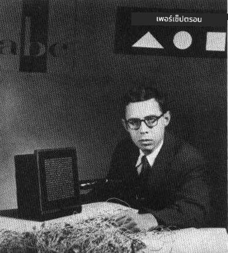
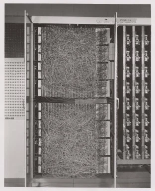
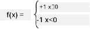

# บทนำเกี่ยวกับเครือข่ายประสาท: Perceptron

## [แบบทดสอบก่อนเรียน](https://ff-quizzes.netlify.app/en/ai/quiz/5)

หนึ่งในความพยายามแรกๆ ในการสร้างสิ่งที่คล้ายกับเครือข่ายประสาทสมัยใหม่เกิดขึ้นโดย Frank Rosenblatt จาก Cornell Aeronautical Laboratory ในปี 1957 ซึ่งเป็นการสร้างฮาร์ดแวร์ที่เรียกว่า "Mark-1" ออกแบบมาเพื่อจดจำรูปทรงเรขาคณิตพื้นฐาน เช่น สามเหลี่ยม สี่เหลี่ยม และวงกลม

|      |      |
|--------------|-----------|
| | |

> รูปภาพ [จาก Wikipedia](https://en.wikipedia.org/wiki/Perceptron)

ภาพที่ป้อนเข้าถูกแทนด้วยอาร์เรย์ของโฟโตเซลล์ขนาด 20x20 ดังนั้นเครือข่ายประสาทจึงมีอินพุต 400 ตัวและเอาต์พุตแบบไบนารีหนึ่งตัว เครือข่ายง่ายๆ นี้มีเพียงเซลล์ประสาทเดียว ซึ่งเรียกว่า **threshold logic unit** น้ำหนักของเครือข่ายประสาททำหน้าที่เหมือนตัวต้านทานที่ต้องปรับด้วยมือในระหว่างขั้นตอนการฝึก

> ✅ ตัวต้านทานปรับค่าได้ (potentiometer) คืออุปกรณ์ที่ช่วยให้ผู้ใช้ปรับค่าความต้านทานในวงจรได้

> หนังสือพิมพ์ The New York Times เขียนเกี่ยวกับ perceptron ในเวลานั้นว่า: *ตัวอ่อนของคอมพิวเตอร์อิเล็กทรอนิกส์ที่ [กองทัพเรือ] คาดหวังว่าจะสามารถเดิน พูด มองเห็น เขียน สร้างตัวเองขึ้นใหม่ และมีสติรู้ตัวถึงการดำรงอยู่ของมันเอง*

## โมเดล Perceptron

สมมติว่าเรามีคุณลักษณะ N ในโมเดลของเรา ซึ่งในกรณีนี้เวกเตอร์อินพุตจะมีขนาด N Perceptron เป็นโมเดล **การจำแนกประเภทแบบไบนารี** กล่าวคือสามารถแยกแยะระหว่างสองคลาสของข้อมูลอินพุตได้ เราจะสมมติว่า สำหรับแต่ละเวกเตอร์อินพุต x เอาต์พุตของ perceptron จะเป็น +1 หรือ -1 ขึ้นอยู่กับคลาส โดยเอาต์พุตจะถูกคำนวณด้วยสูตร:

y(x) = f(w<sup>T</sup>x)

โดยที่ f เป็นฟังก์ชันการกระตุ้นแบบขั้นบันได

<!-- img src="http://www.sciweavers.org/tex2img.php?eq=f%28x%29%20%3D%20%5Cbegin%7Bcases%7D%0A%20%20%20%20%20%20%20%20%20%2B1%20%26%20x%20%5Cgeq%200%20%5C%5C%0A%20%20%20%20%20%20%20%20%20-1%20%26%20x%20%3C%200%0A%20%20%20%20%20%20%20%5Cend%7Bcases%7D%20%5C%5C%0A&bc=White&fc=Black&im=jpg&fs=12&ff=arev&edit=0" align="center" border="0" alt="f(x) = \begin{cases} +1 & x \geq 0 \\ -1 & x < 0 \end{cases} \\" width="154" height="50" / -->


## การฝึก Perceptron

ในการฝึก Perceptron เราต้องหาน้ำหนักเวกเตอร์ w ที่สามารถจำแนกค่าต่างๆ ได้ถูกต้องมากที่สุด กล่าวคือทำให้เกิด **ข้อผิดพลาด** น้อยที่สุด ข้อผิดพลาด E นี้ถูกกำหนดโดย **perceptron criterion** ดังนี้:

E(w) = -&sum;w<sup>T</sup>x<sub>i</sub>t<sub>i</sub>

โดยที่:

* ผลรวมจะถูกคำนวณจากจุดข้อมูลการฝึก i ที่จำแนกผิด
* x<sub>i</sub> คือข้อมูลอินพุต และ t<sub>i</sub> คือ -1 หรือ +1 สำหรับตัวอย่างเชิงลบและเชิงบวกตามลำดับ

เกณฑ์นี้ถือว่าเป็นฟังก์ชันของน้ำหนัก w และเราต้องลดค่ามันให้น้อยที่สุด โดยมักใช้วิธีที่เรียกว่า **gradient descent** ซึ่งเริ่มต้นด้วยน้ำหนักเริ่มต้น w<sup>(0)</sup> และในแต่ละขั้นตอนจะปรับน้ำหนักตามสูตร:

w<sup>(t+1)</sup> = w<sup>(t)</sup> - &eta;&nabla;E(w)

ที่นี่ &eta; คือ **learning rate** และ &nabla;E(w) หมายถึง **gradient** ของ E หลังจากคำนวณ gradient เราจะได้:

w<sup>(t+1)</sup> = w<sup>(t)</sup> + &sum;&eta;x<sub>i</sub>t<sub>i</sub>

อัลกอริทึมใน Python มีลักษณะดังนี้:

```python
def train(positive_examples, negative_examples, num_iterations = 100, eta = 1):

    weights = [0,0,0] # Initialize weights (almost randomly :)
        
    for i in range(num_iterations):
        pos = random.choice(positive_examples)
        neg = random.choice(negative_examples)

        z = np.dot(pos, weights) # compute perceptron output
        if z < 0: # positive example classified as negative
            weights = weights + eta*weights.shape

        z  = np.dot(neg, weights)
        if z >= 0: # negative example classified as positive
            weights = weights - eta*weights.shape

    return weights
```


## สรุป

ในบทเรียนนี้ คุณได้เรียนรู้เกี่ยวกับ Perceptron ซึ่งเป็นโมเดลการจำแนกประเภทแบบไบนารี และวิธีการฝึกมันโดยใช้น้ำหนักเวกเตอร์

## 🚀 ความท้าทาย

หากคุณต้องการลองสร้าง Perceptron ของคุณเอง ลอง [ห้องทดลองนี้บน Microsoft Learn](https://docs.microsoft.com/en-us/azure/machine-learning/component-reference/two-class-averaged-perceptron?WT.mc_id=academic-77998-cacaste) ซึ่งใช้ [Azure ML designer](https://docs.microsoft.com/en-us/azure/machine-learning/concept-designer?WT.mc_id=academic-77998-cacaste)

## [แบบทดสอบหลังเรียน](https://ff-quizzes.netlify.app/en/ai/quiz/6)

## ทบทวนและศึกษาด้วยตนเอง

เพื่อดูว่าเราสามารถใช้ Perceptron ในการแก้ปัญหาแบบง่ายๆ รวมถึงปัญหาในชีวิตจริงได้อย่างไร และเพื่อเรียนรู้เพิ่มเติม - ไปที่ [Perceptron](Perceptron.ipynb) notebook

นี่คือ [บทความที่น่าสนใจเกี่ยวกับ Perceptron](https://towardsdatascience.com/what-is-a-perceptron-basics-of-neural-networks-c4cfea20c590) ด้วย

## [งานที่มอบหมาย](lab/README.md)

ในบทเรียนนี้ เราได้สร้าง Perceptron สำหรับงานการจำแนกประเภทแบบไบนารี และเราได้ใช้มันเพื่อจำแนกระหว่างตัวเลขเขียนด้วยมือสองตัว ในห้องทดลองนี้ คุณถูกขอให้แก้ปัญหาการจำแนกตัวเลขทั้งหมด กล่าวคือกำหนดว่าตัวเลขใดมีแนวโน้มที่จะตรงกับภาพที่กำหนดมากที่สุด

* [คำแนะนำ](lab/README.md)
* [Notebook](lab/PerceptronMultiClass.ipynb)

---

