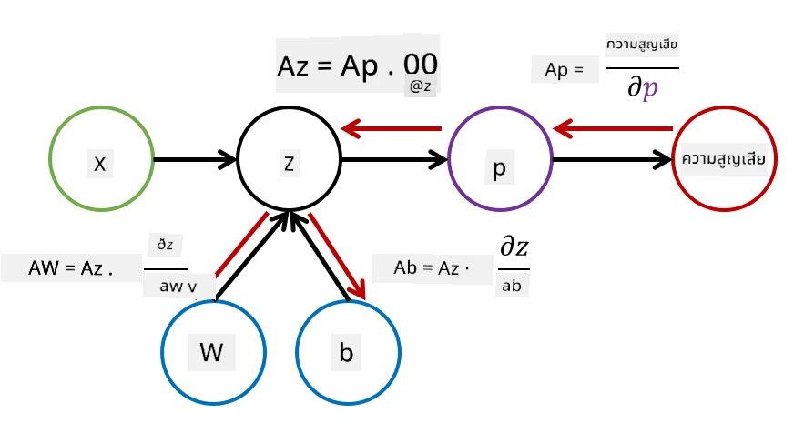

# บทนำเกี่ยวกับ Neural Networks: Multi-Layered Perceptron

ในส่วนก่อนหน้านี้ คุณได้เรียนรู้เกี่ยวกับโมเดลเครือข่ายประสาทที่ง่ายที่สุด - one-layered perceptron ซึ่งเป็นโมเดลการจำแนกประเภทสองคลาสแบบเชิงเส้น

ในส่วนนี้ เราจะขยายโมเดลนี้ให้เป็นกรอบการทำงานที่ยืดหยุ่นมากขึ้น ซึ่งจะช่วยให้เรา:

* ทำ **การจำแนกประเภทหลายคลาส** นอกเหนือจากสองคลาส
* แก้ปัญหา **การถดถอย** นอกเหนือจากการจำแนกประเภท
* แยกคลาสที่ไม่สามารถแยกได้แบบเชิงเส้น

เรายังจะพัฒนากรอบการทำงานแบบโมดูลาร์ใน Python ที่ช่วยให้เราสร้างสถาปัตยกรรมเครือข่ายประสาทที่แตกต่างกันได้

## [แบบทดสอบก่อนเรียน](https://ff-quizzes.netlify.app/en/ai/quiz/7)

## การทำให้ปัญหา Machine Learning เป็นรูปแบบทางการ

เริ่มต้นด้วยการทำให้ปัญหา Machine Learning เป็นรูปแบบทางการ สมมติว่าเรามีชุดข้อมูลการฝึกอบรม **X** พร้อมป้ายกำกับ **Y** และเราต้องสร้างโมเดล *f* ที่สามารถทำนายได้อย่างแม่นยำที่สุด คุณภาพของการทำนายจะถูกวัดโดย **Loss function** &lagran; ฟังก์ชัน loss ที่มักใช้มีดังนี้:

* สำหรับปัญหาการถดถอย เมื่อเราต้องทำนายตัวเลข เราสามารถใช้ **absolute error** &sum;i|f(x(i))-y(i)| หรือ **squared error** &sum;i(f(x(i))-y(i))2
* สำหรับการจำแนกประเภท เราใช้ **0-1 loss** (ซึ่งโดยพื้นฐานแล้วเหมือนกับ **accuracy** ของโมเดล) หรือ **logistic loss**

สำหรับ one-level perceptron ฟังก์ชัน *f* ถูกกำหนดเป็นฟังก์ชันเชิงเส้น *f(x)=wx+b* (ที่นี่ *w* คือ weight matrix, *x* คือเวกเตอร์ของคุณลักษณะอินพุต และ *b* คือ bias vector) สำหรับสถาปัตยกรรมเครือข่ายประสาทที่แตกต่างกัน ฟังก์ชันนี้สามารถมีรูปแบบที่ซับซ้อนมากขึ้นได้

> ในกรณีของการจำแนกประเภท มักจะต้องการให้ผลลัพธ์ของเครือข่ายเป็นความน่าจะเป็นของคลาสที่เกี่ยวข้อง เพื่อแปลงตัวเลขใดๆ ให้เป็นความน่าจะเป็น (เช่น การทำให้ผลลัพธ์เป็นปกติ) เรามักใช้ **softmax** function &sigma; และฟังก์ชัน *f* จะกลายเป็น *f(x)=&sigma;(wx+b)*

ในคำจำกัดความของ *f* ข้างต้น *w* และ *b* ถูกเรียกว่า **parameters** &theta;=⟨*w,b*⟩ เมื่อได้รับชุดข้อมูล ⟨**X**,**Y**⟩ เราสามารถคำนวณข้อผิดพลาดโดยรวมในชุดข้อมูลทั้งหมดเป็นฟังก์ชันของพารามิเตอร์ &theta;

> ✅ **เป้าหมายของการฝึกอบรมเครือข่ายประสาทคือการลดข้อผิดพลาดโดยการปรับเปลี่ยนพารามิเตอร์ &theta;**

## การปรับแต่งด้วย Gradient Descent

มีวิธีการปรับแต่งฟังก์ชันที่เป็นที่รู้จักกันดีเรียกว่า **gradient descent** แนวคิดคือเราสามารถคำนวณอนุพันธ์ (ในกรณีหลายมิติเรียกว่า **gradient**) ของฟังก์ชัน loss โดยสัมพันธ์กับพารามิเตอร์ และปรับเปลี่ยนพารามิเตอร์ในลักษณะที่ข้อผิดพลาดลดลง สิ่งนี้สามารถทำให้เป็นรูปแบบทางการได้ดังนี้:

* กำหนดค่าเริ่มต้นของพารามิเตอร์ด้วยค่าที่สุ่ม w(0), b(0)
* ทำซ้ำขั้นตอนต่อไปนี้หลายครั้ง:
    - w(i+1) = w(i)-&eta;&part;&lagran;/&part;w
    - b(i+1) = b(i)-&eta;&part;&lagran;/&part;b

ในระหว่างการฝึกอบรม ขั้นตอนการปรับแต่งควรคำนวณโดยพิจารณาจากชุดข้อมูลทั้งหมด (จำไว้ว่าฟังก์ชัน loss ถูกคำนวณเป็นผลรวมผ่านตัวอย่างการฝึกอบรมทั้งหมด) อย่างไรก็ตาม ในชีวิตจริง เราใช้ส่วนเล็กๆ ของชุดข้อมูลที่เรียกว่า **minibatches** และคำนวณ gradients โดยอิงจากชุดข้อมูลย่อย เนื่องจากชุดข้อมูลย่อยถูกสุ่มเลือกในแต่ละครั้ง วิธีนี้จึงเรียกว่า **stochastic gradient descent** (SGD)

## Multi-Layered Perceptrons และ Backpropagation

เครือข่ายแบบชั้นเดียว ตามที่เราได้เห็นข้างต้น สามารถจำแนกคลาสที่แยกได้แบบเชิงเส้นได้ เพื่อสร้างโมเดลที่สมบูรณ์ยิ่งขึ้น เราสามารถรวมหลายชั้นของเครือข่ายเข้าด้วยกัน ในทางคณิตศาสตร์หมายความว่าฟังก์ชัน *f* จะมีรูปแบบที่ซับซ้อนมากขึ้น และจะถูกคำนวณในหลายขั้นตอน:
* z1=w1x+b1
* z2=w2&alpha;(z1)+b2
* f = &sigma;(z2)

ที่นี่ &alpha; คือ **non-linear activation function**, &sigma; คือ softmax function และพารามิเตอร์ &theta;=<*w1,b1,w2,b2*>

อัลกอริทึม gradient descent จะยังคงเหมือนเดิม แต่การคำนวณ gradients จะยากขึ้น ตามกฎการหาอนุพันธ์แบบลูกโซ่ เราสามารถคำนวณอนุพันธ์ได้ดังนี้:

* &part;&lagran;/&part;w2 = (&part;&lagran;/&part;&sigma;)(&part;&sigma;/&part;z2)(&part;z2/&part;w2)
* &part;&lagran;/&part;w1 = (&part;&lagran;/&part;&sigma;)(&part;&sigma;/&part;z2)(&part;z2/&part;&alpha;)(&part;&alpha;/&part;z1)(&part;z1/&part;w1)

> ✅ กฎการหาอนุพันธ์แบบลูกโซ่ถูกใช้ในการคำนวณอนุพันธ์ของฟังก์ชัน loss โดยสัมพันธ์กับพารามิเตอร์

โปรดทราบว่าส่วนที่อยู่ทางซ้ายสุดของนิพจน์ทั้งหมดนั้นเหมือนกัน และดังนั้นเราสามารถคำนวณอนุพันธ์ได้อย่างมีประสิทธิภาพโดยเริ่มจากฟังก์ชัน loss และย้อนกลับ "ย้อนกลับ" ผ่านกราฟการคำนวณ ดังนั้นวิธีการฝึกอบรม multi-layered perceptron จึงเรียกว่า **backpropagation** หรือ 'backprop'

> TODO: อ้างอิงภาพ

> ✅ เราจะครอบคลุม backprop อย่างละเอียดมากขึ้นในตัวอย่าง notebook ของเรา  

## สรุป

ในบทเรียนนี้ เราได้สร้างไลบรารีเครือข่ายประสาทของเราเอง และเราได้ใช้มันสำหรับงานการจำแนกประเภทสองมิติที่ง่าย

## 🚀 ความท้าทาย

ใน notebook ที่มาพร้อมกัน คุณจะได้สร้างกรอบการทำงานของคุณเองสำหรับการสร้างและฝึกอบรม multi-layered perceptrons คุณจะสามารถเห็นรายละเอียดว่าเครือข่ายประสาทสมัยใหม่ทำงานอย่างไร

ไปที่ [OwnFramework](OwnFramework.ipynb) notebook และทำงานผ่านมัน

## [แบบทดสอบหลังเรียน](https://ff-quizzes.netlify.app/en/ai/quiz/8)

## ทบทวนและศึกษาด้วยตนเอง

Backpropagation เป็นอัลกอริทึมที่ใช้กันทั่วไปใน AI และ ML ซึ่งควรค่าแก่การศึกษา [เพิ่มเติม](https://wikipedia.org/wiki/Backpropagation)

## [งานที่ได้รับมอบหมาย](lab/README.md)

ในห้องปฏิบัติการนี้ คุณจะถูกขอให้ใช้กรอบการทำงานที่คุณสร้างขึ้นในบทเรียนนี้เพื่อแก้ปัญหาการจำแนกตัวเลขที่เขียนด้วยมือ MNIST

* [คำแนะนำ](lab/README.md)
* [Notebook](lab/MyFW_MNIST.ipynb)

---

