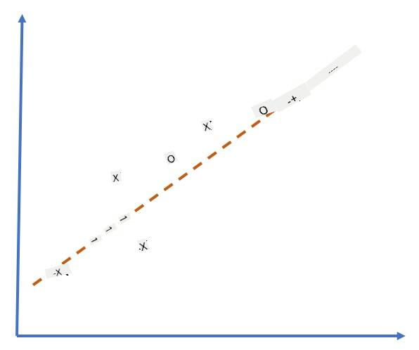
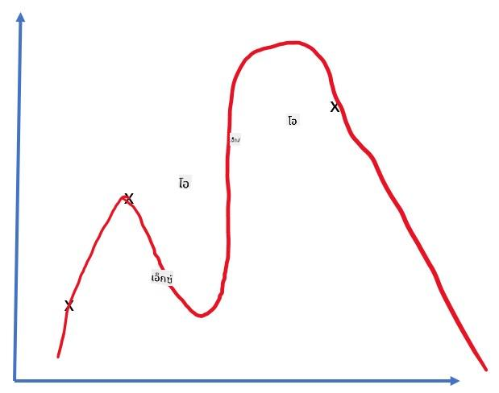

<!--
CO_OP_TRANSLATOR_METADATA:
{
  "original_hash": "2b544f20b796402507fb05a0df893323",
  "translation_date": "2025-08-29T09:11:11+00:00",
  "source_file": "lessons/3-NeuralNetworks/05-Frameworks/README.md",
  "language_code": "th"
}
-->
# เฟรมเวิร์กของโครงข่ายประสาทเทียม

ตามที่เราได้เรียนรู้ไปแล้ว การฝึกโครงข่ายประสาทเทียมให้มีประสิทธิภาพนั้นต้องทำสองสิ่งนี้:

* การดำเนินการกับเทนเซอร์ เช่น การคูณ การบวก และการคำนวณฟังก์ชันบางอย่าง เช่น sigmoid หรือ softmax
* การคำนวณกราเดียนของทุกนิพจน์ เพื่อใช้ในการปรับแต่งค่าพารามิเตอร์ด้วยวิธี gradient descent

## [แบบทดสอบก่อนเรียน](https://ff-quizzes.netlify.app/en/ai/quiz/9)

แม้ว่าไลบรารี `numpy` จะสามารถทำงานในส่วนแรกได้ แต่เรายังต้องการกลไกในการคำนวณกราเดียน ใน [เฟรมเวิร์กของเรา](../04-OwnFramework/OwnFramework.ipynb) ที่พัฒนาในส่วนก่อนหน้า เราต้องเขียนฟังก์ชันอนุพันธ์ทั้งหมดด้วยตนเองในเมธอด `backward` ซึ่งทำหน้าที่ backpropagation อุดมคติแล้ว เฟรมเวิร์กควรให้เราสามารถคำนวณกราเดียนของ *นิพจน์ใดๆ* ที่เรากำหนดได้

อีกสิ่งสำคัญคือความสามารถในการคำนวณบน GPU หรือหน่วยประมวลผลเฉพาะทางอื่นๆ เช่น [TPU](https://en.wikipedia.org/wiki/Tensor_Processing_Unit) การฝึกโครงข่ายประสาทเทียมเชิงลึกต้องใช้การคำนวณจำนวนมาก และการกระจายการคำนวณเหล่านี้บน GPU เป็นสิ่งสำคัญมาก

> ✅ คำว่า 'parallelize' หมายถึงการกระจายการคำนวณไปยังอุปกรณ์หลายตัว

ปัจจุบัน เฟรมเวิร์กโครงข่ายประสาทเทียมที่ได้รับความนิยมมากที่สุดสองตัวคือ: [TensorFlow](http://TensorFlow.org) และ [PyTorch](https://pytorch.org/) ทั้งสองมี API ระดับต่ำสำหรับการทำงานกับเทนเซอร์ทั้งบน CPU และ GPU นอกจากนี้ยังมี API ระดับสูงที่เรียกว่า [Keras](https://keras.io/) และ [PyTorch Lightning](https://pytorchlightning.ai/) ตามลำดับ

Low-Level API | [TensorFlow](http://TensorFlow.org) | [PyTorch](https://pytorch.org/)
--------------|-------------------------------------|--------------------------------
High-level API| [Keras](https://keras.io/) | [PyTorch Lightning](https://pytorchlightning.ai/)

**API ระดับต่ำ** ในทั้งสองเฟรมเวิร์กช่วยให้คุณสร้างสิ่งที่เรียกว่า **กราฟการคำนวณ** กราฟนี้กำหนดวิธีการคำนวณผลลัพธ์ (โดยปกติคือฟังก์ชัน loss) ด้วยพารามิเตอร์อินพุตที่กำหนด และสามารถส่งไปคำนวณบน GPU ได้หากมี ฟังก์ชันเหล่านี้สามารถใช้ในการหาอนุพันธ์ของกราฟการคำนวณและคำนวณกราเดียน ซึ่งสามารถนำไปใช้ในการปรับแต่งพารามิเตอร์ของโมเดลได้

**API ระดับสูง** มองโครงข่ายประสาทเทียมเป็น **ลำดับของเลเยอร์** และทำให้การสร้างโครงข่ายประสาทเทียมส่วนใหญ่เป็นเรื่องง่ายขึ้น การฝึกโมเดลมักต้องเตรียมข้อมูลและเรียกใช้ฟังก์ชัน `fit` เพื่อดำเนินการ

API ระดับสูงช่วยให้คุณสร้างโครงข่ายประสาทเทียมทั่วไปได้อย่างรวดเร็วโดยไม่ต้องกังวลกับรายละเอียดมากมาย ในขณะเดียวกัน API ระดับต่ำให้การควบคุมกระบวนการฝึกที่มากกว่า และมักใช้ในงานวิจัยเมื่อคุณต้องจัดการกับสถาปัตยกรรมโครงข่ายประสาทเทียมใหม่ๆ

สิ่งสำคัญอีกอย่างคือคุณสามารถใช้ทั้งสอง API ร่วมกันได้ เช่น คุณสามารถพัฒนาสถาปัตยกรรมเลเยอร์ของโครงข่ายของคุณเองโดยใช้ API ระดับต่ำ และนำไปใช้ในโครงข่ายขนาดใหญ่ที่สร้างและฝึกด้วย API ระดับสูง หรือคุณสามารถกำหนดโครงข่ายโดยใช้ API ระดับสูงเป็นลำดับของเลเยอร์ และใช้ลูปการฝึกของคุณเองที่เขียนด้วย API ระดับต่ำเพื่อทำการปรับแต่ง ทั้งสอง API ใช้แนวคิดพื้นฐานเดียวกัน และออกแบบมาให้ทำงานร่วมกันได้ดี

## การเรียนรู้

ในคอร์สนี้ เรานำเสนอเนื้อหาสำหรับทั้ง PyTorch และ TensorFlow คุณสามารถเลือกเฟรมเวิร์กที่คุณชอบและเรียนเฉพาะโน้ตบุ๊กที่เกี่ยวข้อง หากคุณยังไม่แน่ใจว่าจะเลือกเฟรมเวิร์กใด ลองอ่านการอภิปรายเกี่ยวกับ **PyTorch vs. TensorFlow** บนอินเทอร์เน็ต หรือทดลองใช้ทั้งสองเฟรมเวิร์กเพื่อทำความเข้าใจให้ดียิ่งขึ้น

เมื่อเป็นไปได้ เราจะใช้ API ระดับสูงเพื่อความง่าย อย่างไรก็ตาม เราเชื่อว่าสิ่งสำคัญคือการเข้าใจการทำงานของโครงข่ายประสาทเทียมตั้งแต่พื้นฐาน ดังนั้นในตอนเริ่มต้นเราจะเริ่มต้นด้วยการทำงานกับ API ระดับต่ำและเทนเซอร์ แต่หากคุณต้องการเริ่มต้นอย่างรวดเร็วและไม่ต้องการใช้เวลามากในการเรียนรู้รายละเอียดเหล่านี้ คุณสามารถข้ามไปยังโน้ตบุ๊ก API ระดับสูงได้เลย

## ✍️ แบบฝึกหัด: เฟรมเวิร์ก

เรียนรู้เพิ่มเติมในโน้ตบุ๊กต่อไปนี้:

Low-Level API | [TensorFlow+Keras Notebook](IntroKerasTF.ipynb) | [PyTorch](IntroPyTorch.ipynb)
--------------|-------------------------------------|--------------------------------
High-level API| [Keras](IntroKeras.ipynb) | *PyTorch Lightning*

หลังจากเชี่ยวชาญเฟรมเวิร์กแล้ว มาทบทวนแนวคิดเรื่อง overfitting กัน

# Overfitting

Overfitting เป็นแนวคิดที่สำคัญมากใน Machine Learning และเป็นสิ่งที่ต้องเข้าใจให้ถูกต้อง!

ลองพิจารณาปัญหาการประมาณค่าจุด 5 จุด (แสดงด้วย `x` ในกราฟด้านล่าง):

 | 
-------------------------|--------------------------
**โมเดลเชิงเส้น, 2 พารามิเตอร์** | **โมเดลไม่เชิงเส้น, 7 พารามิเตอร์**
Training error = 5.3 | Training error = 0
Validation error = 5.1 | Validation error = 20

* ทางซ้าย เราเห็นการประมาณค่าเส้นตรงที่ดี เพราะจำนวนพารามิเตอร์เหมาะสม โมเดลจึงเข้าใจการกระจายของจุดได้ถูกต้อง
* ทางขวา โมเดลมีพลังมากเกินไป เพราะเรามีเพียง 5 จุด แต่โมเดลมี 7 พารามิเตอร์ โมเดลจึงสามารถปรับให้ผ่านทุกจุดได้ ทำให้ training error เป็น 0 อย่างไรก็ตาม โมเดลไม่สามารถเข้าใจรูปแบบที่แท้จริงของข้อมูลได้ ทำให้ validation error สูงมาก

สิ่งสำคัญคือการหาสมดุลที่เหมาะสมระหว่างความซับซ้อนของโมเดล (จำนวนพารามิเตอร์) และจำนวนตัวอย่างการฝึก

## ทำไม overfitting ถึงเกิดขึ้น

  * ข้อมูลการฝึกไม่เพียงพอ
  * โมเดลมีพลังมากเกินไป
  * มีสัญญาณรบกวนในข้อมูลอินพุตมากเกินไป

## วิธีตรวจจับ overfitting

จากกราฟด้านบน เราสามารถตรวจจับ overfitting ได้จาก training error ที่ต่ำมาก และ validation error ที่สูง โดยปกติระหว่างการฝึก เราจะเห็นทั้ง training และ validation error ลดลง จากนั้น validation error อาจหยุดลดและเริ่มเพิ่มขึ้น นี่เป็นสัญญาณของ overfitting และเป็นตัวบ่งชี้ว่าเราควรหยุดการฝึกในจุดนี้ (หรืออย่างน้อยควรบันทึกสถานะของโมเดล)

## วิธีป้องกัน overfitting

หากคุณเห็นว่าเกิด overfitting คุณสามารถทำสิ่งต่อไปนี้:

 * เพิ่มจำนวนข้อมูลการฝึก
 * ลดความซับซ้อนของโมเดล
 * ใช้ [เทคนิคการปรับแต่ง](../../4-ComputerVision/08-TransferLearning/TrainingTricks.md) เช่น [Dropout](../../4-ComputerVision/08-TransferLearning/TrainingTricks.md#Dropout) ซึ่งเราจะพิจารณาในภายหลัง

## Overfitting และ Bias-Variance Tradeoff

Overfitting เป็นกรณีหนึ่งของปัญหาทางสถิติที่เรียกว่า [Bias-Variance Tradeoff](https://en.wikipedia.org/wiki/Bias%E2%80%93variance_tradeoff) หากเราพิจารณาแหล่งที่มาของข้อผิดพลาดในโมเดล เราจะพบข้อผิดพลาดสองประเภท:

* **Bias errors** เกิดจากอัลกอริทึมไม่สามารถจับความสัมพันธ์ในข้อมูลการฝึกได้อย่างถูกต้อง อาจเกิดจากโมเดลไม่ทรงพลังพอ (**underfitting**)
* **Variance errors** เกิดจากโมเดลจับสัญญาณรบกวนในข้อมูลอินพุตแทนที่จะจับความสัมพันธ์ที่มีความหมาย (**overfitting**)

ระหว่างการฝึก Bias error จะลดลง (เมื่อโมเดลเรียนรู้ที่จะประมาณค่าข้อมูล) และ Variance error จะเพิ่มขึ้น สิ่งสำคัญคือต้องหยุดการฝึก - ไม่ว่าจะด้วยวิธีการแบบแมนนวล (เมื่อเราตรวจพบ overfitting) หรืออัตโนมัติ (โดยการใช้เทคนิคการปรับแต่ง) - เพื่อป้องกัน overfitting

## สรุป

ในบทเรียนนี้ คุณได้เรียนรู้เกี่ยวกับความแตกต่างระหว่าง API ต่างๆ ของเฟรมเวิร์ก AI ที่ได้รับความนิยมสองตัวคือ TensorFlow และ PyTorch นอกจากนี้ คุณยังได้เรียนรู้เกี่ยวกับหัวข้อสำคัญอย่าง overfitting

## 🚀 ความท้าทาย

ในโน้ตบุ๊กที่แนบมานี้ คุณจะพบ 'tasks' ที่ด้านล่าง ลองทำงานผ่านโน้ตบุ๊กและทำ tasks ให้เสร็จสิ้น

## [แบบทดสอบหลังเรียน](https://ff-quizzes.netlify.app/en/ai/quiz/10)

## การทบทวนและการศึกษาด้วยตนเอง

ค้นคว้าเพิ่มเติมเกี่ยวกับหัวข้อต่อไปนี้:

- TensorFlow
- PyTorch
- Overfitting

ถามตัวเองด้วยคำถามต่อไปนี้:

- ความแตกต่างระหว่าง TensorFlow และ PyTorch คืออะไร?
- ความแตกต่างระหว่าง overfitting และ underfitting คืออะไร?

## [การบ้าน](lab/README.md)

ในแลปนี้ คุณจะได้รับมอบหมายให้แก้ปัญหาการจำแนกประเภทสองปัญหาโดยใช้โครงข่าย fully-connected แบบชั้นเดียวและหลายชั้นด้วย PyTorch หรือ TensorFlow

* [คำแนะนำ](lab/README.md)
* [โน้ตบุ๊ก](lab/LabFrameworks.ipynb)

---

**ข้อจำกัดความรับผิดชอบ**:  
เอกสารนี้ได้รับการแปลโดยใช้บริการแปลภาษา AI [Co-op Translator](https://github.com/Azure/co-op-translator) แม้ว่าเราจะพยายามให้การแปลมีความถูกต้อง แต่โปรดทราบว่าการแปลอัตโนมัติอาจมีข้อผิดพลาดหรือความไม่แม่นยำ เอกสารต้นฉบับในภาษาต้นทางควรถือเป็นแหล่งข้อมูลที่เชื่อถือได้ สำหรับข้อมูลที่สำคัญ ขอแนะนำให้ใช้บริการแปลภาษามนุษย์มืออาชีพ เราจะไม่รับผิดชอบต่อความเข้าใจผิดหรือการตีความที่ผิดพลาดซึ่งเกิดจากการใช้การแปลนี้