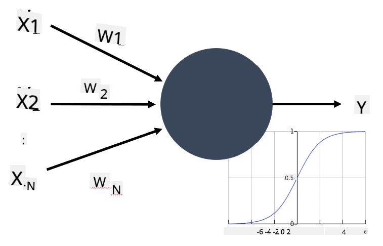

<!--
CO_OP_TRANSLATOR_METADATA:
{
  "original_hash": "1c6b8c7c1778a35fc1139b7f2aecb7b3",
  "translation_date": "2025-08-29T09:07:27+00:00",
  "source_file": "lessons/3-NeuralNetworks/README.md",
  "language_code": "th"
}
-->
# บทนำสู่โครงข่ายประสาทเทียม

ตามที่เราได้พูดถึงในบทนำ หนึ่งในวิธีการที่จะทำให้เกิดความฉลาดคือการฝึก **โมเดลคอมพิวเตอร์** หรือ **สมองเทียม** ตั้งแต่ช่วงกลางศตวรรษที่ 20 นักวิจัยได้ลองใช้โมเดลทางคณิตศาสตร์ต่าง ๆ จนกระทั่งในช่วงไม่กี่ปีที่ผ่านมา แนวทางนี้ได้พิสูจน์แล้วว่าประสบความสำเร็จอย่างมาก โมเดลทางคณิตศาสตร์ของสมองเหล่านี้เรียกว่า **โครงข่ายประสาทเทียม**

> บางครั้งโครงข่ายประสาทเทียมถูกเรียกว่า *Artificial Neural Networks* หรือ ANNs เพื่อระบุว่าเรากำลังพูดถึงโมเดล ไม่ใช่เครือข่ายของเซลล์ประสาทจริง ๆ

## การเรียนรู้ของเครื่อง

โครงข่ายประสาทเทียมเป็นส่วนหนึ่งของสาขาที่ใหญ่กว่าที่เรียกว่า **การเรียนรู้ของเครื่อง (Machine Learning)** ซึ่งมีเป้าหมายเพื่อใช้ข้อมูลในการฝึกโมเดลคอมพิวเตอร์ที่สามารถแก้ปัญหาได้ การเรียนรู้ของเครื่องถือเป็นส่วนสำคัญของปัญญาประดิษฐ์ อย่างไรก็ตาม ในหลักสูตรนี้เราจะไม่ครอบคลุมการเรียนรู้ของเครื่องแบบดั้งเดิม

> เยี่ยมชมหลักสูตร **[Machine Learning for Beginners](http://github.com/microsoft/ml-for-beginners)** ของเราเพื่อเรียนรู้เพิ่มเติมเกี่ยวกับการเรียนรู้ของเครื่องแบบดั้งเดิม

ในกระบวนการเรียนรู้ของเครื่อง เราจะสมมติว่ามีชุดข้อมูลตัวอย่าง **X** และค่าผลลัพธ์ที่สอดคล้องกัน **Y** ตัวอย่างมักจะเป็นเวกเตอร์ N มิติที่ประกอบด้วย **คุณลักษณะ (features)** และผลลัพธ์เรียกว่า **ป้ายกำกับ (labels)**

เราจะพิจารณาปัญหาการเรียนรู้ของเครื่องที่พบบ่อยที่สุดสองประเภท:

* **การจัดประเภท (Classification)** ซึ่งเราต้องจัดประเภทวัตถุอินพุตให้อยู่ในสองหรือมากกว่าสองคลาส
* **การถดถอย (Regression)** ซึ่งเราต้องทำนายค่าตัวเลขสำหรับแต่ละตัวอย่างอินพุต

> เมื่อแสดงอินพุตและผลลัพธ์ในรูปแบบเทนเซอร์ ชุดข้อมูลอินพุตจะเป็นเมทริกซ์ขนาด M×N โดยที่ M คือจำนวนตัวอย่าง และ N คือจำนวนคุณลักษณะ ส่วนป้ายกำกับผลลัพธ์ **Y** จะเป็นเวกเตอร์ขนาด M

ในหลักสูตรนี้ เราจะมุ่งเน้นเฉพาะโมเดลโครงข่ายประสาทเทียม

## โมเดลของเซลล์ประสาท

จากชีววิทยา เราทราบว่าสมองของเราประกอบด้วยเซลล์ประสาท ซึ่งแต่ละเซลล์มี "อินพุต" หลายตัว (แอกซอน) และเอาต์พุต (เดนไดรต์) แอกซอนและเดนไดรต์สามารถนำสัญญาณไฟฟ้าได้ และการเชื่อมต่อระหว่างแอกซอนและเดนไดรต์สามารถแสดงค่าการนำไฟฟ้าที่แตกต่างกันได้ (ควบคุมโดยสารสื่อประสาท)

 | 
----|----
เซลล์ประสาทจริง *([ภาพ](https://en.wikipedia.org/wiki/Synapse#/media/File:SynapseSchematic_lines.svg) จาก Wikipedia)* | เซลล์ประสาทเทียม *(ภาพโดยผู้เขียน)*

ดังนั้น โมเดลทางคณิตศาสตร์ที่ง่ายที่สุดของเซลล์ประสาทจะมีอินพุตหลายตัว X1, ..., XN และเอาต์พุต Y พร้อมกับชุดของน้ำหนัก W1, ..., WN เอาต์พุตจะถูกคำนวณดังนี้:

โดยที่ f คือ **ฟังก์ชันกระตุ้น (activation function)** ที่ไม่เป็นเชิงเส้น

> โมเดลเซลล์ประสาทในยุคแรก ๆ ถูกอธิบายไว้ในบทความคลาสสิก [A logical calculus of the ideas immanent in nervous activity](https://www.cs.cmu.edu/~./epxing/Class/10715/reading/McCulloch.and.Pitts.pdf) โดย Warren McCullock และ Walter Pitts ในปี 1943 Donald Hebb ในหนังสือของเขา "[The Organization of Behavior: A Neuropsychological Theory](https://books.google.com/books?id=VNetYrB8EBoC)" ได้เสนอวิธีการฝึกเครือข่ายเหล่านี้

## ในส่วนนี้

ในส่วนนี้เราจะเรียนรู้เกี่ยวกับ:
* [Perceptron](03-Perceptron/README.md) หนึ่งในโมเดลโครงข่ายประสาทเทียมยุคแรกสำหรับการจัดประเภทสองคลาส
* [เครือข่ายหลายชั้น](04-OwnFramework/README.md) พร้อมกับสมุดบันทึก [วิธีสร้างเฟรมเวิร์กของเราเอง](04-OwnFramework/OwnFramework.ipynb)
* [เฟรมเวิร์กโครงข่ายประสาทเทียม](05-Frameworks/README.md) พร้อมสมุดบันทึกเหล่านี้: [PyTorch](05-Frameworks/IntroPyTorch.ipynb) และ [Keras/Tensorflow](05-Frameworks/IntroKerasTF.ipynb)
* [Overfitting](../../../../lessons/3-NeuralNetworks/05-Frameworks)

---

**ข้อจำกัดความรับผิดชอบ**:  
เอกสารนี้ได้รับการแปลโดยใช้บริการแปลภาษา AI [Co-op Translator](https://github.com/Azure/co-op-translator) แม้ว่าเราจะพยายามให้การแปลมีความถูกต้อง แต่โปรดทราบว่าการแปลอัตโนมัติอาจมีข้อผิดพลาดหรือความไม่แม่นยำ เอกสารต้นฉบับในภาษาต้นทางควรถือเป็นแหล่งข้อมูลที่เชื่อถือได้ สำหรับข้อมูลที่สำคัญ ขอแนะนำให้ใช้บริการแปลภาษามนุษย์ที่เป็นมืออาชีพ เราจะไม่รับผิดชอบต่อความเข้าใจผิดหรือการตีความที่ผิดพลาดซึ่งเกิดจากการใช้การแปลนี้