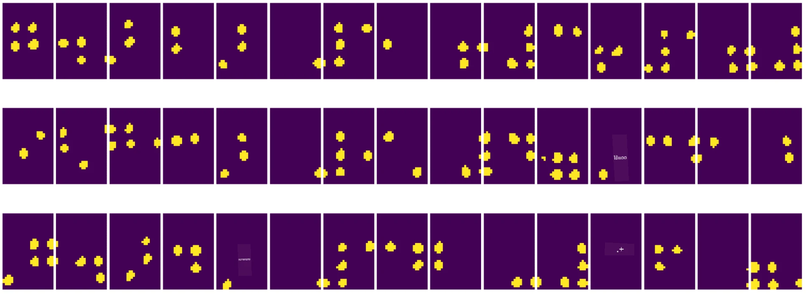
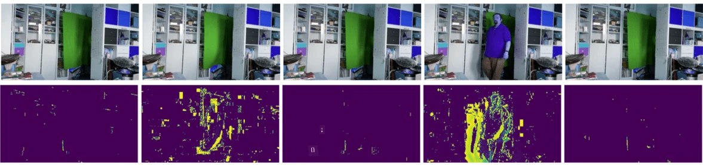

# บทนำสู่การมองเห็นด้วยคอมพิวเตอร์

[Computer Vision](https://wikipedia.org/wiki/Computer_vision) เป็นสาขาหนึ่งที่มีเป้าหมายเพื่อให้คอมพิวเตอร์สามารถเข้าใจภาพดิจิทัลในระดับสูงได้ คำว่า *เข้าใจ* ในที่นี้มีความหมายกว้างมาก เช่น การค้นหาวัตถุในภาพ (**object detection**), การเข้าใจเหตุการณ์ที่เกิดขึ้น (**event detection**), การอธิบายภาพด้วยข้อความ หรือการสร้างฉากในรูปแบบ 3D นอกจากนี้ยังมีงานเฉพาะที่เกี่ยวข้องกับภาพมนุษย์ เช่น การประมาณอายุและอารมณ์, การตรวจจับและระบุตัวตนใบหน้า, และการประมาณท่าทางในรูปแบบ 3D เป็นต้น

## [แบบทดสอบก่อนเรียน](https://ff-quizzes.netlify.app/en/ai/quiz/11)

หนึ่งในงานที่ง่ายที่สุดของการมองเห็นด้วยคอมพิวเตอร์คือ **การจำแนกภาพ** 

การมองเห็นด้วยคอมพิวเตอร์มักถูกมองว่าเป็นส่วนหนึ่งของ AI ในปัจจุบัน งานส่วนใหญ่ในสาขานี้ถูกแก้ไขโดยใช้เครือข่ายประสาทเทียม เราจะเรียนรู้เพิ่มเติมเกี่ยวกับเครือข่ายประสาทเทียมชนิดพิเศษที่ใช้ในงานนี้ [convolutional neural networks](../07-ConvNets/README.md) ในส่วนนี้

อย่างไรก็ตาม ก่อนที่คุณจะส่งภาพไปยังเครือข่ายประสาทเทียม ในหลายกรณีการใช้เทคนิคเชิงอัลกอริทึมเพื่อปรับปรุงภาพก็เป็นสิ่งที่สมเหตุสมผล

มีไลบรารี Python หลายตัวที่สามารถใช้สำหรับการประมวลผลภาพ:

* **[imageio](https://imageio.readthedocs.io/en/stable/)** ใช้สำหรับการอ่าน/เขียนภาพในรูปแบบต่าง ๆ และยังรองรับ ffmpeg ซึ่งเป็นเครื่องมือที่มีประโยชน์ในการแปลงเฟรมวิดีโอเป็นภาพ
* **[Pillow](https://pillow.readthedocs.io/en/stable/index.html)** (หรือที่รู้จักในชื่อ PIL) มีความสามารถมากกว่า และยังรองรับการปรับแต่งภาพ เช่น การเปลี่ยนรูปภาพ, การปรับพาเลต และอื่น ๆ
* **[OpenCV](https://opencv.org/)** เป็นไลบรารีการประมวลผลภาพที่ทรงพลังซึ่งเขียนด้วย C++ และกลายเป็นมาตรฐาน *de facto* สำหรับการประมวลผลภาพ มีอินเทอร์เฟซ Python ที่สะดวก
* **[dlib](http://dlib.net/)** เป็นไลบรารี C++ ที่มีการใช้อัลกอริทึมการเรียนรู้ของเครื่องหลายตัว รวมถึงอัลกอริทึมการมองเห็นด้วยคอมพิวเตอร์บางตัว มีอินเทอร์เฟซ Python และสามารถใช้สำหรับงานที่ท้าทาย เช่น การตรวจจับใบหน้าและจุดสำคัญบนใบหน้า

## OpenCV

[OpenCV](https://opencv.org/) ถือว่าเป็นมาตรฐาน *de facto* สำหรับการประมวลผลภาพ มีอัลกอริทึมที่มีประโยชน์มากมายที่ถูกพัฒนาใน C++ คุณสามารถเรียกใช้ OpenCV จาก Python ได้เช่นกัน

แหล่งเรียนรู้ที่ดีเกี่ยวกับ OpenCV คือ [คอร์ส Learn OpenCV](https://learnopencv.com/getting-started-with-opencv/) ในหลักสูตรของเรา เป้าหมายไม่ใช่การเรียนรู้ OpenCV แต่เพื่อแสดงตัวอย่างบางกรณีที่สามารถใช้งานได้ และวิธีการใช้งาน

### การโหลดภาพ

ภาพใน Python สามารถแสดงผลได้อย่างสะดวกในรูปแบบของอาร์เรย์ NumPy ตัวอย่างเช่น ภาพสีเทาที่มีขนาด 320x200 พิกเซลจะถูกเก็บในอาร์เรย์ขนาด 200x320 และภาพสีที่มีขนาดเดียวกันจะมีรูปร่างเป็น 200x320x3 (สำหรับช่องสี 3 ช่อง) เพื่อโหลดภาพ คุณสามารถใช้โค้ดดังนี้:

```python
import cv2
import matplotlib.pyplot as plt

im = cv2.imread('image.jpeg')
plt.imshow(im)
```

โดยทั่วไป OpenCV ใช้การเข้ารหัส BGR (Blue-Green-Red) สำหรับภาพสี ในขณะที่เครื่องมือ Python อื่น ๆ ใช้การเข้ารหัส RGB (Red-Green-Blue) แบบดั้งเดิม เพื่อให้ภาพแสดงผลได้ถูกต้อง คุณจำเป็นต้องแปลงภาพเป็นพื้นที่สี RGB โดยการสลับมิติในอาร์เรย์ NumPy หรือเรียกใช้ฟังก์ชัน OpenCV:

```python
im = cv2.cvtColor(im,cv2.COLOR_BGR2RGB)
```

ฟังก์ชัน `cvtColor` เดียวกันนี้สามารถใช้สำหรับการแปลงพื้นที่สีอื่น ๆ เช่น การแปลงภาพเป็นสีเทาหรือพื้นที่สี HSV (Hue-Saturation-Value)

คุณยังสามารถใช้ OpenCV เพื่อโหลดเฟรมวิดีโอทีละเฟรม - มีตัวอย่างในแบบฝึกหัด [OpenCV Notebook](OpenCV.ipynb)

### การประมวลผลภาพ

ก่อนที่จะส่งภาพไปยังเครือข่ายประสาทเทียม คุณอาจต้องการใช้ขั้นตอนการประมวลผลล่วงหน้าหลายอย่าง OpenCV สามารถทำสิ่งต่าง ๆ ได้มากมาย เช่น:

* **การปรับขนาด** ภาพโดยใช้ `im = cv2.resize(im, (320,200),interpolation=cv2.INTER_LANCZOS)`
* **การเบลอ** ภาพโดยใช้ `im = cv2.medianBlur(im,3)` หรือ `im = cv2.GaussianBlur(im, (3,3), 0)`
* การเปลี่ยน **ความสว่างและความคมชัด** ของภาพสามารถทำได้โดยการปรับอาร์เรย์ NumPy ตามที่อธิบายไว้ [ในโน้ต Stackoverflow นี้](https://stackoverflow.com/questions/39308030/how-do-i-increase-the-contrast-of-an-image-in-python-opencv)
* การใช้ [thresholding](https://docs.opencv.org/4.x/d7/d4d/tutorial_py_thresholding.html) โดยเรียกใช้ฟังก์ชัน `cv2.threshold`/`cv2.adaptiveThreshold` ซึ่งมักจะดีกว่าการปรับความสว่างหรือความคมชัด
* การใช้ [การแปลงต่าง ๆ](https://docs.opencv.org/4.5.5/da/d6e/tutorial_py_geometric_transformations.html) กับภาพ:
    - **[Affine transformations](https://docs.opencv.org/4.5.5/d4/d61/tutorial_warp_affine.html)** มีประโยชน์หากคุณต้องการรวมการหมุน, การปรับขนาด และการเอียงภาพ และคุณทราบตำแหน่งต้นทางและปลายทางของจุดสามจุดในภาพ การแปลงแบบ Affine จะรักษาเส้นคู่ขนานให้ยังคงคู่ขนาน
    - **[Perspective transformations](https://medium.com/analytics-vidhya/opencv-perspective-transformation-9edffefb2143)** มีประโยชน์เมื่อคุณทราบตำแหน่งต้นทางและปลายทางของจุดสี่จุดในภาพ ตัวอย่างเช่น หากคุณถ่ายภาพเอกสารสี่เหลี่ยมผ่านกล้องสมาร์ทโฟนจากมุมหนึ่ง และคุณต้องการสร้างภาพเอกสารในรูปแบบสี่เหลี่ยม
* การเข้าใจการเคลื่อนไหวภายในภาพโดยใช้ **[optical flow](https://docs.opencv.org/4.5.5/d4/dee/tutorial_optical_flow.html)**

## ตัวอย่างการใช้งาน Computer Vision

ใน [OpenCV Notebook](OpenCV.ipynb) เราให้ตัวอย่างบางกรณีที่การมองเห็นด้วยคอมพิวเตอร์สามารถใช้เพื่อทำงานเฉพาะ:

* **การประมวลผลภาพถ่ายของหนังสือเบรลล์** เรามุ่งเน้นที่การใช้ thresholding, การตรวจจับคุณลักษณะ, การแปลงมุมมอง และการปรับอาร์เรย์ NumPy เพื่อแยกสัญลักษณ์เบรลล์แต่ละตัวสำหรับการจำแนกผลลัพธ์โดยเครือข่ายประสาทเทียม

 |  | 
----|-----|-----

> ภาพจาก [OpenCV.ipynb](OpenCV.ipynb)

* **การตรวจจับการเคลื่อนไหวในวิดีโอโดยใช้ความแตกต่างของเฟรม** หากกล้องอยู่ในตำแหน่งคงที่ เฟรมจากกล้องควรมีความคล้ายคลึงกันมาก โดยเฟรมที่แสดงผลเป็นอาร์เรย์ เพียงแค่ลบอาร์เรย์ของเฟรมสองเฟรมที่ต่อเนื่องกัน คุณจะได้ความแตกต่างของพิกเซล ซึ่งควรต่ำสำหรับเฟรมที่นิ่ง และสูงขึ้นเมื่อมีการเคลื่อนไหวในภาพ



> ภาพจาก [OpenCV.ipynb](OpenCV.ipynb)

* **การตรวจจับการเคลื่อนไหวโดยใช้ Optical Flow** [Optical flow](https://docs.opencv.org/3.4/d4/dee/tutorial_optical_flow.html) ช่วยให้เราเข้าใจว่าพิกเซลแต่ละตัวในเฟรมวิดีโอเคลื่อนที่อย่างไร มี Optical Flow สองประเภท:

   - **Dense Optical Flow** คำนวณสนามเวกเตอร์ที่แสดงว่าพิกเซลแต่ละตัวเคลื่อนที่ไปที่ใด
   - **Sparse Optical Flow** ใช้คุณลักษณะเด่นในภาพ (เช่น ขอบ) และสร้างเส้นทางการเคลื่อนที่ของมันจากเฟรมหนึ่งไปยังอีกเฟรมหนึ่ง


> ภาพจาก [OpenCV.ipynb](OpenCV.ipynb)

## ✍️ ตัวอย่าง Notebook: OpenCV [ลองใช้งาน OpenCV](OpenCV.ipynb)

มาทำการทดลองกับ OpenCV โดยสำรวจ [OpenCV Notebook](OpenCV.ipynb)

## สรุป

บางครั้ง งานที่ซับซ้อน เช่น การตรวจจับการเคลื่อนไหวหรือการตรวจจับปลายนิ้ว สามารถแก้ไขได้โดยใช้การมองเห็นด้วยคอมพิวเตอร์เพียงอย่างเดียว ดังนั้น การรู้เทคนิคพื้นฐานของการมองเห็นด้วยคอมพิวเตอร์ และสิ่งที่ไลบรารีอย่าง OpenCV สามารถทำได้จึงเป็นสิ่งที่มีประโยชน์มาก

## 🚀 ความท้าทาย

ดู [วิดีโอนี้](https://docs.microsoft.com/shows/ai-show/ai-show--2021-opencv-ai-competition--grand-prize-winners--cortic-tigers--episode-32?WT.mc_id=academic-77998-cacaste) จาก AI Show เพื่อเรียนรู้เกี่ยวกับโครงการ Cortic Tigers และวิธีที่พวกเขาสร้างโซลูชันแบบบล็อกเพื่อทำให้การมองเห็นด้วยคอมพิวเตอร์เป็นเรื่องง่ายผ่านหุ่นยนต์ ทำการค้นคว้าเกี่ยวกับโครงการอื่น ๆ ที่ช่วยให้ผู้เรียนใหม่เข้าสู่สาขานี้

## [แบบทดสอบหลังเรียน](https://ff-quizzes.netlify.app/en/ai/quiz/12)

## ทบทวนและศึกษาด้วยตนเอง

อ่านเพิ่มเติมเกี่ยวกับ optical flow [ในบทเรียนที่ยอดเยี่ยมนี้](https://learnopencv.com/optical-flow-in-opencv/)

## [การบ้าน](lab/README.md)

ในห้องปฏิบัติการนี้ คุณจะถ่ายวิดีโอที่มีท่าทางง่าย ๆ และเป้าหมายของคุณคือการดึงการเคลื่อนไหวขึ้น/ลง/ซ้าย/ขวาโดยใช้ optical flow


---

