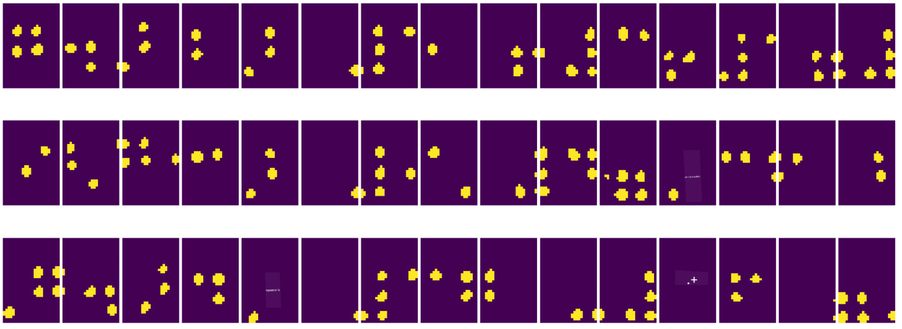

<!--
CO_OP_TRANSLATOR_METADATA:
{
  "original_hash": "4bedc8e702db17260cfe824d58b6cfd4",
  "translation_date": "2025-08-29T08:51:46+00:00",
  "source_file": "lessons/4-ComputerVision/06-IntroCV/README.md",
  "language_code": "th"
}
-->
# บทนำสู่การมองเห็นด้วยคอมพิวเตอร์

[Computer Vision](https://wikipedia.org/wiki/Computer_vision) เป็นสาขาหนึ่งที่มีเป้าหมายเพื่อให้คอมพิวเตอร์สามารถเข้าใจภาพดิจิทัลในระดับสูงได้ คำว่า *เข้าใจ* ในที่นี้มีความหมายที่หลากหลาย เช่น การค้นหาวัตถุในภาพ (**object detection**), การเข้าใจเหตุการณ์ที่เกิดขึ้น (**event detection**), การบรรยายภาพด้วยข้อความ หรือการสร้างฉากในรูปแบบ 3 มิติ นอกจากนี้ยังมีงานเฉพาะทางที่เกี่ยวข้องกับภาพมนุษย์ เช่น การประเมินอายุและอารมณ์, การตรวจจับและระบุตัวบุคคล, และการประเมินท่าทางในรูปแบบ 3 มิติ เป็นต้น

## [แบบทดสอบก่อนเรียน](https://red-field-0a6ddfd03.1.azurestaticapps.net/quiz/106)

หนึ่งในงานที่ง่ายที่สุดของการมองเห็นด้วยคอมพิวเตอร์คือ **การจำแนกประเภทของภาพ** (image classification)

การมองเห็นด้วยคอมพิวเตอร์มักถูกมองว่าเป็นส่วนหนึ่งของ AI ในปัจจุบัน งานส่วนใหญ่ในสาขานี้ถูกแก้ไขด้วยการใช้โครงข่ายประสาทเทียม เราจะได้เรียนรู้เพิ่มเติมเกี่ยวกับโครงข่ายประสาทเทียมชนิดพิเศษที่ใช้ในงานนี้ นั่นคือ [convolutional neural networks](../07-ConvNets/README.md) ในส่วนนี้

อย่างไรก็ตาม ก่อนที่เราจะส่งภาพเข้าสู่โครงข่ายประสาทเทียม ในหลายกรณี การใช้เทคนิคเชิงอัลกอริทึมเพื่อปรับปรุงภาพก่อนจะเป็นประโยชน์

มีไลบรารี Python หลายตัวที่สามารถใช้สำหรับการประมวลผลภาพ:

* **[imageio](https://imageio.readthedocs.io/en/stable/)** ใช้สำหรับการอ่าน/เขียนภาพในรูปแบบต่าง ๆ และยังรองรับ ffmpeg ซึ่งเป็นเครื่องมือที่มีประโยชน์สำหรับการแปลงเฟรมวิดีโอเป็นภาพ
* **[Pillow](https://pillow.readthedocs.io/en/stable/index.html)** (หรือที่รู้จักในชื่อ PIL) มีความสามารถมากกว่า และยังรองรับการปรับแต่งภาพ เช่น การเปลี่ยนรูป การปรับจานสี และอื่น ๆ
* **[OpenCV](https://opencv.org/)** เป็นไลบรารีประมวลผลภาพที่ทรงพลัง เขียนด้วยภาษา C++ และกลายเป็นมาตรฐานสำหรับการประมวลผลภาพ มีอินเทอร์เฟซ Python ที่สะดวก
* **[dlib](http://dlib.net/)** เป็นไลบรารี C++ ที่มีการใช้อัลกอริทึมการเรียนรู้ของเครื่องหลายตัว รวมถึงอัลกอริทึมสำหรับการมองเห็นด้วยคอมพิวเตอร์บางตัว มีอินเทอร์เฟซ Python และสามารถใช้สำหรับงานที่ท้าทาย เช่น การตรวจจับใบหน้าและจุดเด่นบนใบหน้า

## OpenCV

[OpenCV](https://opencv.org/) ถือเป็นมาตรฐานสำหรับการประมวลผลภาพ มีอัลกอริทึมที่มีประโยชน์มากมายที่พัฒนาในภาษา C++ และสามารถเรียกใช้งานจาก Python ได้เช่นกัน

แหล่งข้อมูลที่ดีสำหรับการเรียนรู้ OpenCV คือ [คอร์ส Learn OpenCV](https://learnopencv.com/getting-started-with-opencv/) ในหลักสูตรของเรา เป้าหมายไม่ได้อยู่ที่การเรียนรู้ OpenCV แต่เพื่อแสดงตัวอย่างการใช้งานและวิธีการใช้งานในบางกรณี

### การโหลดภาพ

ภาพใน Python สามารถแสดงผลได้อย่างสะดวกด้วย NumPy arrays ตัวอย่างเช่น ภาพขาวดำขนาด 320x200 พิกเซล จะถูกเก็บในอาร์เรย์ขนาด 200x320 และภาพสีที่มีขนาดเดียวกันจะมีรูปร่างเป็น 200x320x3 (สำหรับช่องสี 3 ช่อง) การโหลดภาพสามารถทำได้ด้วยโค้ดดังนี้:

```python
import cv2
import matplotlib.pyplot as plt

im = cv2.imread('image.jpeg')
plt.imshow(im)
```

โดยปกติ OpenCV ใช้การเข้ารหัสสีแบบ BGR (Blue-Green-Red) สำหรับภาพสี ในขณะที่เครื่องมือ Python อื่น ๆ ใช้ RGB (Red-Green-Blue) เพื่อให้ภาพแสดงผลได้ถูกต้อง คุณจำเป็นต้องแปลงภาพไปยังพื้นที่สี RGB โดยการสลับมิติในอาร์เรย์ NumPy หรือเรียกใช้ฟังก์ชัน OpenCV:

```python
im = cv2.cvtColor(im,cv2.COLOR_BGR2RGB)
```

ฟังก์ชัน `cvtColor` เดียวกันนี้ยังสามารถใช้สำหรับการแปลงพื้นที่สีอื่น ๆ เช่น การแปลงภาพเป็นขาวดำ หรือพื้นที่สี HSV (Hue-Saturation-Value)

OpenCV ยังสามารถใช้โหลดเฟรมวิดีโอทีละเฟรม ตัวอย่างสามารถดูได้ในแบบฝึกหัด [OpenCV Notebook](OpenCV.ipynb)

### การประมวลผลภาพ

ก่อนที่จะส่งภาพเข้าสู่โครงข่ายประสาทเทียม คุณอาจต้องการใช้ขั้นตอนการประมวลผลล่วงหน้าหลายขั้นตอน OpenCV สามารถทำสิ่งต่าง ๆ ได้มากมาย เช่น:

* **การปรับขนาดภาพ** โดยใช้ `im = cv2.resize(im, (320,200),interpolation=cv2.INTER_LANCZOS)`
* **การเบลอภาพ** โดยใช้ `im = cv2.medianBlur(im,3)` หรือ `im = cv2.GaussianBlur(im, (3,3), 0)`
* การเปลี่ยน **ความสว่างและความคมชัด** ของภาพสามารถทำได้ด้วยการจัดการอาร์เรย์ NumPy ตามที่อธิบายไว้ใน [Stackoverflow note นี้](https://stackoverflow.com/questions/39308030/how-do-i-increase-the-contrast-of-an-image-in-python-opencv)
* การใช้ [thresholding](https://docs.opencv.org/4.x/d7/d4d/tutorial_py_thresholding.html) โดยเรียกใช้ฟังก์ชัน `cv2.threshold`/`cv2.adaptiveThreshold` ซึ่งมักจะดีกว่าการปรับความสว่างหรือความคมชัด
* การใช้ [การแปลงภาพ](https://docs.opencv.org/4.5.5/da/d6e/tutorial_py_geometric_transformations.html) ต่าง ๆ:
    - **[Affine transformations](https://docs.opencv.org/4.5.5/d4/d61/tutorial_warp_affine.html)** มีประโยชน์เมื่อคุณต้องการรวมการหมุน การปรับขนาด และการบิดเบือนภาพ โดยรู้ตำแหน่งต้นทางและปลายทางของจุดสามจุดในภาพ การแปลงแบบนี้จะรักษาเส้นขนานให้คงอยู่
    - **[Perspective transformations](https://medium.com/analytics-vidhya/opencv-perspective-transformation-9edffefb2143)** มีประโยชน์เมื่อคุณรู้ตำแหน่งต้นทางและปลายทางของจุดสี่จุดในภาพ เช่น การถ่ายภาพเอกสารสี่เหลี่ยมด้วยกล้องสมาร์ทโฟนจากมุมหนึ่ง และต้องการทำให้ภาพเอกสารเป็นสี่เหลี่ยม
* การเข้าใจการเคลื่อนไหวในภาพโดยใช้ **[optical flow](https://docs.opencv.org/4.5.5/d4/dee/tutorial_optical_flow.html)**

## ตัวอย่างการใช้งาน Computer Vision

ใน [OpenCV Notebook](OpenCV.ipynb) เราได้แสดงตัวอย่างบางกรณีที่การมองเห็นด้วยคอมพิวเตอร์สามารถใช้แก้ปัญหาเฉพาะทางได้:

* **การประมวลผลภาพถ่ายหนังสือเบรลล์** เราเน้นวิธีการใช้ thresholding, การตรวจจับคุณลักษณะ, การแปลงมุมมอง และการจัดการ NumPy เพื่อแยกสัญลักษณ์เบรลล์แต่ละตัวสำหรับการจำแนกผลลัพธ์ด้วยโครงข่ายประสาทเทียม

 |  | 
----|-----|-----

> ภาพจาก [OpenCV.ipynb](OpenCV.ipynb)

* **การตรวจจับการเคลื่อนไหวในวิดีโอด้วยความแตกต่างของเฟรม** หากกล้องอยู่กับที่ เฟรมจากกล้องควรมีความคล้ายคลึงกันมาก โดยการลบอาร์เรย์ของเฟรมสองเฟรมที่ต่อเนื่องกัน เราจะได้ค่าความแตกต่างของพิกเซล ซึ่งควรต่ำสำหรับเฟรมที่นิ่ง และสูงขึ้นเมื่อมีการเคลื่อนไหวในภาพ


> ภาพจาก [OpenCV.ipynb](OpenCV.ipynb)

* **การตรวจจับการเคลื่อนไหวด้วย Optical Flow** [Optical flow](https://docs.opencv.org/3.4/d4/dee/tutorial_optical_flow.html) ช่วยให้เราเข้าใจว่าพิกเซลแต่ละจุดในเฟรมวิดีโอเคลื่อนที่อย่างไร มีสองประเภทของ optical flow:

   - **Dense Optical Flow** คำนวณเวกเตอร์ฟิลด์ที่แสดงว่าพิกเซลแต่ละจุดเคลื่อนที่ไปที่ใด
   - **Sparse Optical Flow** ใช้คุณลักษณะเด่นในภาพ (เช่น ขอบ) และสร้างเส้นทางการเคลื่อนที่ของมันจากเฟรมหนึ่งไปยังอีกเฟรมหนึ่ง


> ภาพจาก [OpenCV.ipynb](OpenCV.ipynb)

## ✍️ ตัวอย่างโน้ตบุ๊ก: OpenCV [ลองใช้ OpenCV ในการปฏิบัติ](OpenCV.ipynb)

มาลองทำการทดลองกับ OpenCV โดยสำรวจ [OpenCV Notebook](OpenCV.ipynb)

## สรุป

บางครั้ง งานที่ซับซ้อน เช่น การตรวจจับการเคลื่อนไหวหรือการตรวจจับปลายนิ้ว สามารถแก้ไขได้ด้วยการมองเห็นด้วยคอมพิวเตอร์เพียงอย่างเดียว ดังนั้น การรู้เทคนิคพื้นฐานของการมองเห็นด้วยคอมพิวเตอร์และสิ่งที่ไลบรารีอย่าง OpenCV สามารถทำได้จึงเป็นประโยชน์อย่างมาก

## 🚀 ความท้าทาย

ชม [วิดีโอนี้](https://docs.microsoft.com/shows/ai-show/ai-show--2021-opencv-ai-competition--grand-prize-winners--cortic-tigers--episode-32?WT.mc_id=academic-77998-cacaste) จาก AI Show เพื่อเรียนรู้เกี่ยวกับโครงการ Cortic Tigers และวิธีที่พวกเขาสร้างโซลูชันแบบบล็อกเพื่อทำให้การมองเห็นด้วยคอมพิวเตอร์เป็นเรื่องง่ายสำหรับทุกคน ลองค้นคว้าเกี่ยวกับโครงการอื่น ๆ ที่ช่วยให้ผู้เรียนใหม่เข้าสู่สาขานี้

## [แบบทดสอบหลังเรียน](https://red-field-0a6ddfd03.1.azurestaticapps.net/quiz/206)

## การทบทวนและการศึกษาด้วยตนเอง

อ่านเพิ่มเติมเกี่ยวกับ optical flow [ในบทแนะนำที่ยอดเยี่ยมนี้](https://learnopencv.com/optical-flow-in-opencv/)

## [การบ้าน](lab/README.md)

ในห้องปฏิบัติการนี้ คุณจะถ่ายวิดีโอที่มีท่าทางง่าย ๆ และเป้าหมายของคุณคือการดึงการเคลื่อนไหวขึ้น/ลง/ซ้าย/ขวาโดยใช้ optical flow


---

**ข้อจำกัดความรับผิดชอบ**:  
เอกสารนี้ได้รับการแปลโดยใช้บริการแปลภาษา AI [Co-op Translator](https://github.com/Azure/co-op-translator) แม้ว่าเราจะพยายามให้การแปลมีความถูกต้อง แต่โปรดทราบว่าการแปลอัตโนมัติอาจมีข้อผิดพลาดหรือความไม่แม่นยำ เอกสารต้นฉบับในภาษาต้นทางควรถือเป็นแหล่งข้อมูลที่เชื่อถือได้ สำหรับข้อมูลที่สำคัญ ขอแนะนำให้ใช้บริการแปลภาษามนุษย์ที่เป็นมืออาชีพ เราจะไม่รับผิดชอบต่อความเข้าใจผิดหรือการตีความที่ผิดพลาดซึ่งเกิดจากการใช้การแปลนี้