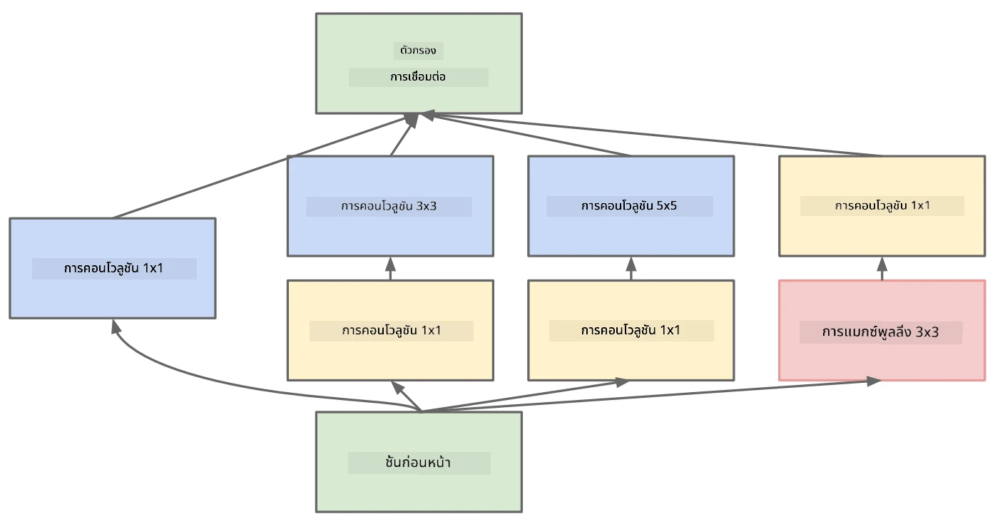

# สถาปัตยกรรม CNN ที่เป็นที่รู้จัก

### VGG-16

VGG-16 เป็นเครือข่ายที่ทำคะแนนความแม่นยำได้ถึง 92.7% ในการจัดประเภท ImageNet top-5 ในปี 2014 โดยมีโครงสร้างเลเยอร์ดังนี้:

ดังที่คุณเห็น VGG ใช้สถาปัตยกรรมแบบพีระมิดดั้งเดิม ซึ่งเป็นลำดับของเลเยอร์คอนโวลูชันและพูลลิ่ง

> ภาพจาก [Researchgate](https://www.researchgate.net/figure/Vgg16-model-structure-To-get-the-VGG-NIN-model-we-replace-the-2-nd-4-th-6-th-7-th_fig2_335194493)

### ResNet

ResNet เป็นตระกูลของโมเดลที่ถูกเสนอโดย Microsoft Research ในปี 2015 แนวคิดหลักของ ResNet คือการใช้ **residual blocks**:

> ภาพจาก [this paper](https://arxiv.org/pdf/1512.03385.pdf)

เหตุผลที่ใช้ identity pass-through คือเพื่อให้เลเยอร์ของเราทำนาย **ความแตกต่าง** ระหว่างผลลัพธ์ของเลเยอร์ก่อนหน้าและผลลัพธ์ของ residual block - จึงเป็นที่มาของชื่อ *residual* บล็อกเหล่านี้ฝึกได้ง่ายกว่า และสามารถสร้างเครือข่ายที่มีบล็อกเหล่านี้หลายร้อยบล็อก (ตัวแปรที่พบบ่อยที่สุดคือ ResNet-52, ResNet-101 และ ResNet-152)

คุณยังสามารถมองว่าเครือข่ายนี้สามารถปรับความซับซ้อนให้เหมาะสมกับชุดข้อมูลได้ ในช่วงเริ่มต้นของการฝึก น้ำหนักจะมีค่าน้อย และสัญญาณส่วนใหญ่จะผ่าน identity layers เมื่อการฝึกดำเนินไปและน้ำหนักมีค่ามากขึ้น ความสำคัญของพารามิเตอร์ในเครือข่ายจะเพิ่มขึ้น และเครือข่ายจะปรับตัวเพื่อรองรับพลังการแสดงผลที่จำเป็นสำหรับการจัดประเภทภาพฝึกได้อย่างถูกต้อง

### Google Inception

สถาปัตยกรรม Google Inception นำแนวคิดนี้ไปอีกขั้น โดยสร้างแต่ละเลเยอร์ของเครือข่ายเป็นการผสมผสานของหลายเส้นทาง:

> ภาพจาก [Researchgate](https://www.researchgate.net/figure/Inception-module-with-dimension-reductions-left-and-schema-for-Inception-ResNet-v1_fig2_355547454)

ที่นี่ เราต้องเน้นบทบาทของคอนโวลูชัน 1x1 เพราะในตอนแรกมันอาจดูไม่มีเหตุผล ทำไมเราต้องใช้ฟิลเตอร์ 1x1 กับภาพ? อย่างไรก็ตาม คุณต้องจำไว้ว่าฟิลเตอร์คอนโวลูชันทำงานกับหลายช่องความลึก (เริ่มต้นคือสี RGB ในเลเยอร์ถัดไปคือช่องสำหรับฟิลเตอร์ต่างๆ) และคอนโวลูชัน 1x1 ใช้เพื่อผสมช่องอินพุตเหล่านั้นเข้าด้วยกันโดยใช้น้ำหนักที่ฝึกได้ต่างกัน นอกจากนี้ยังสามารถมองว่าเป็นการลดขนาด (pooling) ในมิติช่องได้อีกด้วย

นี่คือ [บทความที่ดีเกี่ยวกับคอนโวลูชัน 1x1](https://medium.com/analytics-vidhya/talented-mr-1x1-comprehensive-look-at-1x1-convolution-in-deep-learning-f6b355825578) และ [งานวิจัยต้นฉบับ](https://arxiv.org/pdf/1312.4400.pdf)

### MobileNet

MobileNet เป็นตระกูลของโมเดลที่มีขนาดเล็กลง เหมาะสำหรับอุปกรณ์พกพา ใช้เมื่อคุณมีทรัพยากรจำกัด และสามารถยอมเสียความแม่นยำเล็กน้อยได้ แนวคิดหลักของมันคือ **depthwise separable convolution** ซึ่งช่วยให้สามารถแทนฟิลเตอร์คอนโวลูชันด้วยการผสมผสานของคอนโวลูชันเชิงพื้นที่และคอนโวลูชัน 1x1 ในมิติความลึกได้ สิ่งนี้ช่วยลดจำนวนพารามิเตอร์ลงอย่างมาก ทำให้เครือข่ายมีขนาดเล็กลง และฝึกได้ง่ายขึ้นด้วยข้อมูลที่น้อยลง

นี่คือ [บทความที่ดีเกี่ยวกับ MobileNet](https://medium.com/analytics-vidhya/image-classification-with-mobilenet-cc6fbb2cd470)

## สรุป

ในบทนี้ คุณได้เรียนรู้แนวคิดหลักเบื้องหลังเครือข่ายประสาทเทียมสำหรับการประมวลผลภาพ - เครือข่ายคอนโวลูชัน สถาปัตยกรรมในชีวิตจริงที่ใช้ในการจัดประเภทภาพ การตรวจจับวัตถุ และแม้กระทั่งเครือข่ายการสร้างภาพ ล้วนมีพื้นฐานมาจาก CNN เพียงแต่มีเลเยอร์มากขึ้นและมีเทคนิคการฝึกเพิ่มเติม

## 🚀 ความท้าทาย

ในโน้ตบุ๊กที่แนบมา มีบันทึกที่ด้านล่างเกี่ยวกับวิธีการเพิ่มความแม่นยำ ลองทำการทดลองเพื่อดูว่าคุณสามารถเพิ่มความแม่นยำได้หรือไม่

## [แบบทดสอบหลังการบรรยาย](https://ff-quizzes.netlify.app/en/ai/quiz/14)

## ทบทวนและศึกษาด้วยตนเอง

แม้ว่า CNN จะถูกใช้บ่อยที่สุดสำหรับงานด้านการประมวลผลภาพ แต่โดยทั่วไปแล้วมันเหมาะสำหรับการดึงรูปแบบที่มีขนาดคงที่ ตัวอย่างเช่น หากเรากำลังจัดการกับเสียง เราอาจต้องการใช้ CNN เพื่อค้นหารูปแบบเฉพาะในสัญญาณเสียง ซึ่งในกรณีนี้ฟิลเตอร์จะเป็นแบบ 1 มิติ (และ CNN นี้จะเรียกว่า 1D-CNN) นอกจากนี้ บางครั้งยังมีการใช้ 3D-CNN เพื่อดึงคุณลักษณะในพื้นที่หลายมิติ เช่น เหตุการณ์บางอย่างที่เกิดขึ้นในวิดีโอ - CNN สามารถจับรูปแบบบางอย่างของการเปลี่ยนแปลงคุณลักษณะเมื่อเวลาผ่านไปได้ ลองทบทวนและศึกษาด้วยตนเองเกี่ยวกับงานอื่นๆ ที่สามารถทำได้ด้วย CNN

## [งานที่ได้รับมอบหมาย](lab/README.md)

ในห้องปฏิบัติการนี้ คุณมีหน้าที่จัดประเภทสายพันธุ์แมวและสุนัขที่แตกต่างกัน ภาพเหล่านี้มีความซับซ้อนมากกว่าชุดข้อมูล MNIST และมีมิติที่สูงกว่า รวมถึงมีมากกว่า 10 คลาส

---

