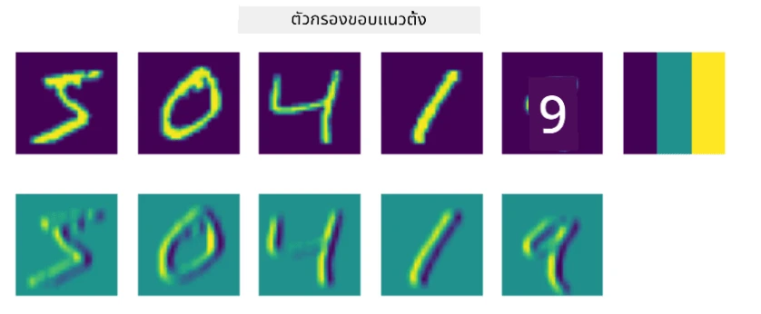
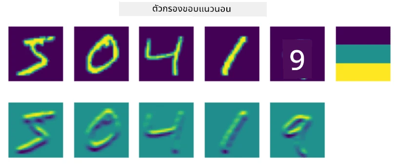
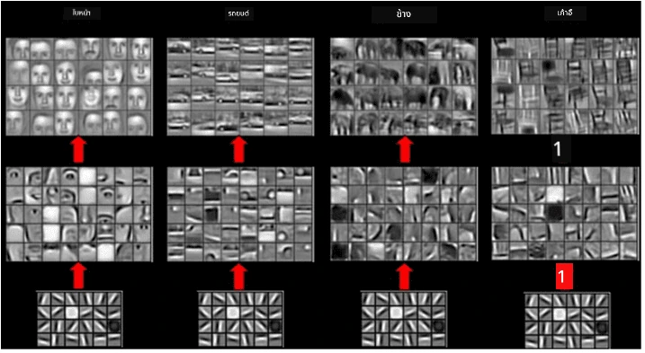
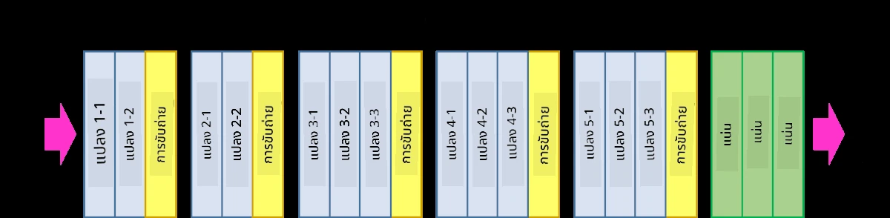
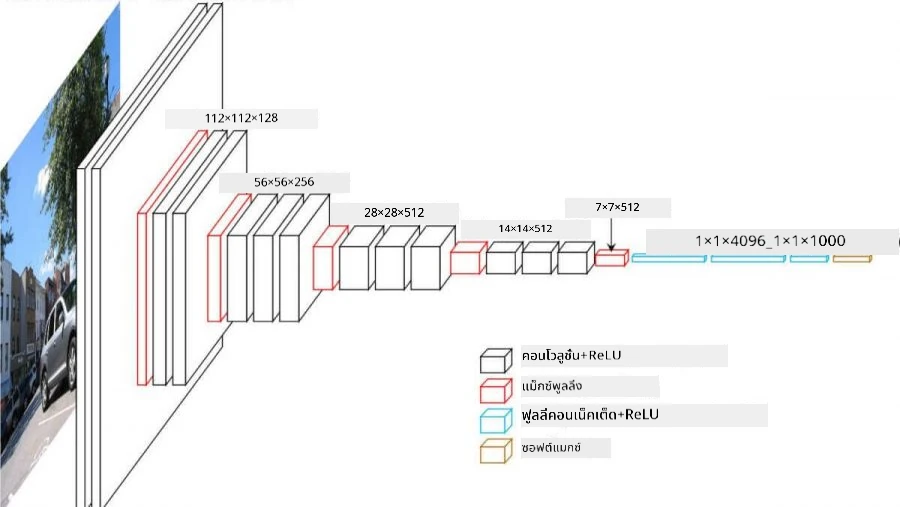

# เครือข่ายประสาทเทียมแบบคอนโวลูชัน

เราเคยเห็นมาก่อนว่าเครือข่ายประสาทเทียมมีความสามารถที่ดีในการจัดการกับภาพ และแม้แต่เพอร์เซปตรอนชั้นเดียวก็สามารถจดจำตัวเลขที่เขียนด้วยมือจากชุดข้อมูล MNIST ได้ด้วยความแม่นยำที่น่าพอใจ อย่างไรก็ตาม ชุดข้อมูล MNIST มีลักษณะพิเศษที่ตัวเลขทั้งหมดถูกจัดให้อยู่ตรงกลางของภาพ ซึ่งทำให้การจำแนกง่ายขึ้น

## [แบบทดสอบก่อนเรียน](https://ff-quizzes.netlify.app/en/ai/quiz/13)

ในชีวิตจริง เราต้องการความสามารถในการจดจำวัตถุในภาพโดยไม่คำนึงถึงตำแหน่งที่แน่นอนของวัตถุในภาพ การมองเห็นด้วยคอมพิวเตอร์แตกต่างจากการจำแนกประเภททั่วไป เพราะเมื่อเราพยายามค้นหาวัตถุเฉพาะในภาพ เราจะสแกนภาพเพื่อค้นหารูปแบบเฉพาะและการผสมผสานของรูปแบบเหล่านั้น ตัวอย่างเช่น เมื่อมองหาภาพแมว เราอาจเริ่มมองหาสายเส้นแนวนอนที่อาจเป็นหนวด และการผสมผสานของหนวดในลักษณะเฉพาะสามารถบอกเราได้ว่านี่คือภาพของแมว ตำแหน่งสัมพัทธ์และการมีอยู่ของรูปแบบบางอย่างมีความสำคัญ แต่ไม่ใช่ตำแหน่งที่แน่นอนในภาพ

เพื่อดึงรูปแบบเหล่านี้ออกมา เราจะใช้แนวคิดของ **ฟิลเตอร์คอนโวลูชัน** อย่างที่คุณทราบ ภาพถูกแสดงในรูปแบบเมทริกซ์ 2 มิติ หรือเทนเซอร์ 3 มิติที่มีความลึกของสี การใช้ฟิลเตอร์หมายถึงการนำเมทริกซ์ **ฟิลเตอร์เคอร์เนล** ขนาดเล็กมาใช้ และสำหรับแต่ละพิกเซลในภาพต้นฉบับ เราจะคำนวณค่าเฉลี่ยถ่วงน้ำหนักกับจุดที่อยู่ใกล้เคียง เราสามารถมองสิ่งนี้เหมือนหน้าต่างเล็ก ๆ ที่เลื่อนผ่านภาพทั้งหมด และเฉลี่ยค่าพิกเซลทั้งหมดตามน้ำหนักในเมทริกซ์ฟิลเตอร์เคอร์เนล

 | 
----|----

> ภาพโดย Dmitry Soshnikov

ตัวอย่างเช่น หากเราใช้ฟิลเตอร์ขอบแนวตั้งและแนวนอนขนาด 3x3 กับตัวเลขใน MNIST เราจะได้ไฮไลต์ (เช่น ค่าที่สูง) ในจุดที่มีขอบแนวตั้งและแนวนอนในภาพต้นฉบับ ดังนั้นฟิลเตอร์ทั้งสองนี้สามารถใช้เพื่อ "ค้นหา" ขอบได้ ในทำนองเดียวกัน เราสามารถออกแบบฟิลเตอร์ต่าง ๆ เพื่อค้นหารูปแบบระดับต่ำอื่น ๆ:

> ภาพจาก [Leung-Malik Filter Bank](https://www.robots.ox.ac.uk/~vgg/research/texclass/filters.html)

อย่างไรก็ตาม แม้ว่าเราจะสามารถออกแบบฟิลเตอร์เพื่อดึงรูปแบบบางอย่างออกมาได้ด้วยตนเอง เราก็สามารถออกแบบเครือข่ายในลักษณะที่มันจะเรียนรู้รูปแบบเหล่านี้โดยอัตโนมัติได้เช่นกัน นี่คือหนึ่งในแนวคิดหลักที่อยู่เบื้องหลัง CNN

## แนวคิดหลักของ CNN

วิธีการทำงานของ CNN อิงตามแนวคิดสำคัญดังต่อไปนี้:

* ฟิลเตอร์คอนโวลูชันสามารถดึงรูปแบบออกมาได้
* เราสามารถออกแบบเครือข่ายในลักษณะที่ฟิลเตอร์ถูกฝึกฝนโดยอัตโนมัติ
* เราสามารถใช้วิธีเดียวกันนี้เพื่อค้นหารูปแบบในคุณลักษณะระดับสูง ไม่ใช่แค่ในภาพต้นฉบับ ดังนั้นการดึงคุณลักษณะของ CNN จึงทำงานในลำดับชั้นของคุณลักษณะ โดยเริ่มจากการผสมผสานพิกเซลระดับต่ำไปจนถึงการผสมผสานระดับสูงของส่วนต่าง ๆ ของภาพ

> ภาพจาก [งานวิจัยโดย Hislop-Lynch](https://www.semanticscholar.org/paper/Computer-vision-based-pedestrian-trajectory-Hislop-Lynch/26e6f74853fc9bbb7487b06dc2cf095d36c9021d) ซึ่งอ้างอิงจาก [งานวิจัยของพวกเขา](https://dl.acm.org/doi/abs/10.1145/1553374.1553453)

## ✍️ แบบฝึกหัด: เครือข่ายประสาทเทียมแบบคอนโวลูชัน

มาสำรวจเพิ่มเติมว่าเครือข่ายประสาทเทียมแบบคอนโวลูชันทำงานอย่างไร และเราจะสร้างฟิลเตอร์ที่ฝึกฝนได้อย่างไร โดยทำงานผ่านโน้ตบุ๊กที่เกี่ยวข้อง:

* [เครือข่ายประสาทเทียมแบบคอนโวลูชัน - PyTorch](ConvNetsPyTorch.ipynb)
* [เครือข่ายประสาทเทียมแบบคอนโวลูชัน - TensorFlow](ConvNetsTF.ipynb)

## สถาปัตยกรรมแบบพีระมิด

CNN ส่วนใหญ่ที่ใช้สำหรับการประมวลผลภาพมักจะมีสถาปัตยกรรมแบบพีระมิด ชั้นคอนโวลูชันแรกที่ใช้กับภาพต้นฉบับมักจะมีจำนวนฟิลเตอร์ค่อนข้างต่ำ (8-16) ซึ่งสอดคล้องกับการผสมผสานพิกเซลต่าง ๆ เช่น เส้นแนวนอน/แนวตั้งของลายเส้น ในระดับถัดไป เราจะลดมิติของพื้นที่ในเครือข่าย และเพิ่มจำนวนฟิลเตอร์ ซึ่งสอดคล้องกับการผสมผสานที่เป็นไปได้มากขึ้นของคุณลักษณะง่าย ๆ ด้วยแต่ละชั้น เมื่อเราเคลื่อนไปยังตัวจำแนกขั้นสุดท้าย มิติของพื้นที่ในภาพจะลดลง และจำนวนฟิลเตอร์จะเพิ่มขึ้น

ตัวอย่างเช่น ลองดูสถาปัตยกรรมของ VGG-16 ซึ่งเป็นเครือข่ายที่ทำได้ถึงความแม่นยำ 92.7% ในการจัดอันดับ 5 อันดับแรกของ ImageNet ในปี 2014:

> ภาพจาก [Researchgate](https://www.researchgate.net/figure/Vgg16-model-structure-To-get-the-VGG-NIN-model-we-replace-the-2-nd-4-th-6-th-7-th_fig2_335194493)

## สถาปัตยกรรม CNN ที่เป็นที่รู้จักดีที่สุด

[ศึกษาต่อเกี่ยวกับสถาปัตยกรรม CNN ที่เป็นที่รู้จักดีที่สุด](CNN_Architectures.md)

---

