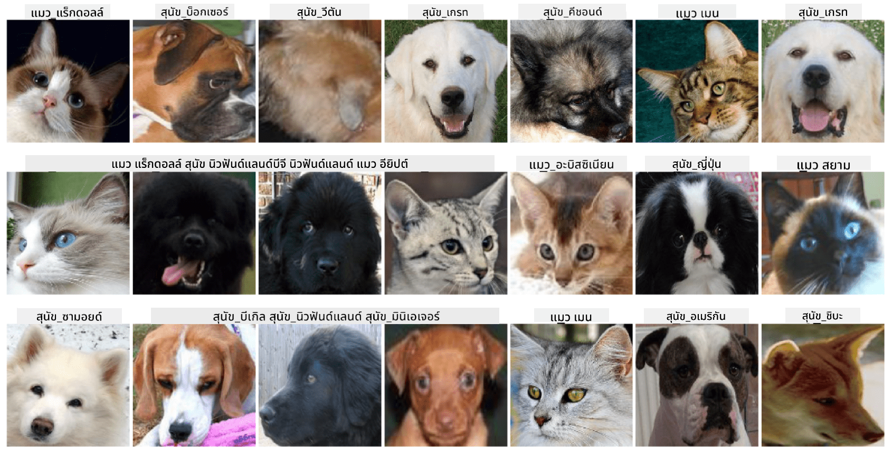

<!--
CO_OP_TRANSLATOR_METADATA:
{
  "original_hash": "b70fcf7fcee862990f848c679090943f",
  "translation_date": "2025-10-03T14:55:11+00:00",
  "source_file": "lessons/4-ComputerVision/07-ConvNets/lab/README.md",
  "language_code": "th"
}
-->
# การจำแนกใบหน้าสัตว์เลี้ยง

งานในห้องปฏิบัติการจาก [AI for Beginners Curriculum](https://github.com/microsoft/ai-for-beginners)

## งานที่ต้องทำ

ลองจินตนาการว่าคุณต้องพัฒนาแอปพลิเคชันสำหรับสถานรับเลี้ยงสัตว์เลี้ยงเพื่อจัดเก็บข้อมูลสัตว์เลี้ยงทั้งหมด หนึ่งในฟีเจอร์ที่ยอดเยี่ยมของแอปพลิเคชันนี้คือการค้นหาสายพันธุ์จากภาพถ่ายโดยอัตโนมัติ ซึ่งสามารถทำได้สำเร็จโดยใช้เครือข่ายประสาทเทียม

คุณต้องฝึกเครือข่ายประสาทเทียมแบบคอนโวลูชันเพื่อจำแนกสายพันธุ์ต่าง ๆ ของแมวและสุนัขโดยใช้ชุดข้อมูล **Pet Faces**

## ชุดข้อมูล

เราจะใช้ [Oxford-IIIT Pet Dataset](https://www.robots.ox.ac.uk/~vgg/data/pets/) ซึ่งมีภาพของสุนัขและแมวจาก 37 สายพันธุ์ที่แตกต่างกัน



เพื่อดาวน์โหลดชุดข้อมูล ให้ใช้โค้ดนี้:

```python
!wget https://thor.robots.ox.ac.uk/~vgg/data/pets/images.tar.gz
!tar xfz images.tar.gz
!rm images.tar.gz
```

**หมายเหตุ:** ภาพในชุดข้อมูล Oxford-IIIT Pet Dataset ถูกจัดเรียงตามชื่อไฟล์ (เช่น `Abyssinian_1.jpg`, `Bengal_2.jpg`) โน้ตบุ๊กนี้มีโค้ดสำหรับจัดระเบียบภาพเหล่านี้ลงในไดเรกทอรีเฉพาะสายพันธุ์เพื่อให้ง่ายต่อการจำแนก

## เริ่มต้นโน้ตบุ๊ก

เริ่มต้นงานในห้องปฏิบัติการโดยเปิด [PetFaces.ipynb](PetFaces.ipynb)

## สิ่งที่ได้เรียนรู้

คุณได้แก้ปัญหาที่ค่อนข้างซับซ้อนเกี่ยวกับการจำแนกภาพตั้งแต่เริ่มต้น! มีคลาสจำนวนมาก และคุณยังสามารถได้ความแม่นยำที่เหมาะสม! นอกจากนี้ยังสมเหตุสมผลที่จะวัดความแม่นยำแบบ top-k เพราะบางคลาสอาจสับสนได้ง่าย ซึ่งแม้แต่มนุษย์เองก็อาจแยกแยะไม่ชัดเจน

---

**ข้อจำกัดความรับผิดชอบ**:  
เอกสารนี้ได้รับการแปลโดยใช้บริการแปลภาษา AI [Co-op Translator](https://github.com/Azure/co-op-translator) แม้ว่าเราจะพยายามให้การแปลมีความถูกต้องมากที่สุด แต่โปรดทราบว่าการแปลอัตโนมัติอาจมีข้อผิดพลาดหรือความไม่ถูกต้อง เอกสารต้นฉบับในภาษาดั้งเดิมควรถือเป็นแหล่งข้อมูลที่เชื่อถือได้ สำหรับข้อมูลที่สำคัญ ขอแนะนำให้ใช้บริการแปลภาษามนุษย์ที่มีความเชี่ยวชาญ เราไม่รับผิดชอบต่อความเข้าใจผิดหรือการตีความผิดที่เกิดจากการใช้การแปลนี้