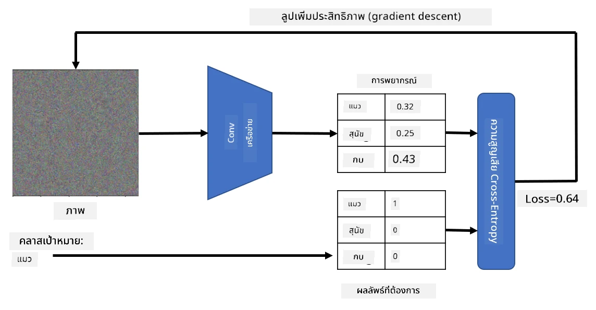

# เครือข่ายที่ผ่านการฝึกฝนล่วงหน้าและการเรียนรู้แบบถ่ายโอน

การฝึกฝน CNNs อาจใช้เวลานานและต้องการข้อมูลจำนวนมาก อย่างไรก็ตาม ส่วนใหญ่ของเวลานั้นถูกใช้ไปกับการเรียนรู้ตัวกรองระดับต่ำที่ดีที่สุดที่เครือข่ายสามารถใช้เพื่อดึงรูปแบบจากภาพ คำถามที่เกิดขึ้นตามธรรมชาติคือ - เราสามารถใช้เครือข่ายประสาทที่ฝึกฝนบนชุดข้อมูลหนึ่งและปรับให้เหมาะสมกับการจำแนกภาพที่แตกต่างกันโดยไม่ต้องฝึกฝนใหม่ทั้งหมดได้หรือไม่?

## [แบบทดสอบก่อนเรียน](https://ff-quizzes.netlify.app/en/ai/quiz/15)

วิธีการนี้เรียกว่า **การเรียนรู้แบบถ่ายโอน** (Transfer Learning) เพราะเราโอนความรู้บางส่วนจากโมเดลเครือข่ายประสาทหนึ่งไปยังอีกโมเดลหนึ่ง ในการเรียนรู้แบบถ่ายโอน เรามักเริ่มต้นด้วยโมเดลที่ผ่านการฝึกฝนล่วงหน้า ซึ่งได้รับการฝึกฝนบนชุดข้อมูลภาพขนาดใหญ่ เช่น **ImageNet** โมเดลเหล่านี้สามารถดึงคุณลักษณะต่างๆ จากภาพทั่วไปได้ดีอยู่แล้ว และในหลายกรณี เพียงแค่สร้างตัวจำแนกบนคุณลักษณะที่ดึงออกมาเหล่านั้นก็สามารถให้ผลลัพธ์ที่ดีได้

> ✅ การเรียนรู้แบบถ่ายโอนเป็นคำที่พบในสาขาวิชาการอื่นๆ เช่น การศึกษา หมายถึงกระบวนการนำความรู้จากโดเมนหนึ่งไปประยุกต์ใช้ในอีกโดเมนหนึ่ง

## โมเดลที่ผ่านการฝึกฝนล่วงหน้าในฐานะตัวดึงคุณลักษณะ

เครือข่ายคอนโวลูชันที่เราได้พูดถึงในส่วนก่อนหน้านี้ประกอบด้วยหลายเลเยอร์ แต่ละเลเยอร์มีหน้าที่ดึงคุณลักษณะบางอย่างจากภาพ เริ่มตั้งแต่การรวมพิกเซลระดับต่ำ (เช่น เส้นแนวนอน/แนวตั้ง หรือเส้นโค้ง) ไปจนถึงการรวมคุณลักษณะระดับสูงที่สอดคล้องกับสิ่งต่างๆ เช่น ดวงตาของเปลวไฟ หากเราฝึกฝน CNN บนชุดข้อมูลภาพที่หลากหลายและครอบคลุมเพียงพอ เครือข่ายควรจะเรียนรู้ที่จะดึงคุณลักษณะทั่วไปเหล่านั้นได้

ทั้ง Keras และ PyTorch มีฟังก์ชันที่ช่วยให้โหลดน้ำหนักเครือข่ายประสาทที่ผ่านการฝึกฝนล่วงหน้าสำหรับสถาปัตยกรรมทั่วไปได้ง่าย ซึ่งส่วนใหญ่ได้รับการฝึกฝนบนภาพจาก ImageNet โมเดลที่ใช้บ่อยที่สุดได้อธิบายไว้ในหน้า [สถาปัตยกรรม CNN](../07-ConvNets/CNN_Architectures.md) จากบทเรียนก่อนหน้า โดยเฉพาะอย่างยิ่ง คุณอาจพิจารณาใช้หนึ่งในตัวเลือกต่อไปนี้:

* **VGG-16/VGG-19** เป็นโมเดลที่ค่อนข้างเรียบง่ายแต่ยังคงให้ความแม่นยำที่ดี การใช้ VGG เป็นความพยายามแรกเพื่อดูว่าการเรียนรู้แบบถ่ายโอนทำงานอย่างไรเป็นตัวเลือกที่ดี
* **ResNet** เป็นตระกูลโมเดลที่เสนอโดย Microsoft Research ในปี 2015 มีเลเยอร์มากขึ้นและต้องการทรัพยากรมากขึ้น
* **MobileNet** เป็นตระกูลโมเดลที่มีขนาดเล็กลง เหมาะสำหรับอุปกรณ์พกพา ใช้เมื่อคุณมีทรัพยากรจำกัดและสามารถยอมรับความแม่นยำที่ลดลงเล็กน้อยได้

ตัวอย่างคุณลักษณะที่ดึงออกมาจากภาพแมวโดยเครือข่าย VGG-16:

## ชุดข้อมูลแมวและสุนัข

ในตัวอย่างนี้ เราจะใช้ชุดข้อมูล [แมวและสุนัข](https://www.microsoft.com/download/details.aspx?id=54765&WT.mc_id=academic-77998-cacaste) ซึ่งใกล้เคียงกับสถานการณ์การจำแนกภาพในชีวิตจริง

## ✍️ แบบฝึกหัด: การเรียนรู้แบบถ่ายโอน

มาดูการเรียนรู้แบบถ่ายโอนในทางปฏิบัติในสมุดบันทึกที่เกี่ยวข้อง:

* [การเรียนรู้แบบถ่ายโอน - PyTorch](TransferLearningPyTorch.ipynb)
* [การเรียนรู้แบบถ่ายโอน - TensorFlow](TransferLearningTF.ipynb)

## การสร้างภาพแมวเชิงรุก

เครือข่ายประสาทที่ผ่านการฝึกฝนล่วงหน้ามีรูปแบบต่างๆ อยู่ใน "สมอง" ของมัน รวมถึงแนวคิดของ **แมวในอุดมคติ** (รวมถึงสุนัขในอุดมคติ ม้าลายในอุดมคติ ฯลฯ) จะน่าสนใจถ้าสามารถ **สร้างภาพนี้** ได้ อย่างไรก็ตาม มันไม่ง่ายนัก เพราะรูปแบบเหล่านี้กระจายอยู่ทั่วน้ำหนักของเครือข่าย และยังจัดเรียงในโครงสร้างแบบลำดับชั้น

วิธีหนึ่งที่เราสามารถทำได้คือเริ่มต้นด้วยภาพสุ่ม และพยายามใช้เทคนิค **การปรับแต่งด้วยการลดเกรเดียนต์** เพื่อปรับภาพนั้นให้เครือข่ายเริ่มคิดว่ามันคือแมว

อย่างไรก็ตาม หากเราทำเช่นนี้ เราจะได้สิ่งที่คล้ายกับสัญญาณรบกวนแบบสุ่ม นั่นเป็นเพราะ *มีหลายวิธีที่จะทำให้เครือข่ายคิดว่าภาพอินพุตคือแมว* รวมถึงบางวิธีที่ไม่มีความหมายในเชิงภาพ แม้ว่าภาพเหล่านั้นจะมีรูปแบบที่เป็นลักษณะเฉพาะของแมว แต่ไม่มีอะไรบังคับให้มันดูโดดเด่นในเชิงภาพ

เพื่อปรับปรุงผลลัพธ์ เราสามารถเพิ่มคำศัพท์อีกคำหนึ่งในฟังก์ชันการสูญเสีย ซึ่งเรียกว่า **การสูญเสียความแปรปรวน** เป็นเมตริกที่แสดงให้เห็นว่าพิกเซลที่อยู่ใกล้เคียงในภาพมีความคล้ายคลึงกันเพียงใด การลดการสูญเสียความแปรปรวนทำให้ภาพเรียบขึ้นและกำจัดสัญญาณรบกวน - เผยให้เห็นรูปแบบที่น่าดึงดูดในเชิงภาพมากขึ้น นี่คือตัวอย่างของภาพ "ในอุดมคติ" ที่ถูกจัดประเภทว่าเป็นแมวและม้าลายด้วยความน่าจะเป็นสูง:

 | 
-----|-----
 *แมวในอุดมคติ* | *ม้าลายในอุดมคติ*

วิธีการที่คล้ายกันสามารถใช้เพื่อทำการโจมตีแบบ **adversarial** บนเครือข่ายประสาท สมมติว่าเราต้องการหลอกเครือข่ายประสาทและทำให้สุนัขดูเหมือนแมว หากเราใช้ภาพของสุนัขที่เครือข่ายจำแนกได้ว่าเป็นสุนัข เราสามารถปรับแต่งมันเล็กน้อยโดยใช้การลดเกรเดียนต์จนกว่าเครือข่ายจะเริ่มจำแนกมันว่าเป็นแมว:

 | 
-----|-----
*ภาพต้นฉบับของสุนัข* | *ภาพของสุนัขที่ถูกจัดประเภทว่าเป็นแมว*

ดูโค้ดเพื่อสร้างผลลัพธ์ข้างต้นในสมุดบันทึกต่อไปนี้:

* [แมวในอุดมคติและเชิงรุก - TensorFlow](AdversarialCat_TF.ipynb)

## สรุป

ด้วยการเรียนรู้แบบถ่ายโอน คุณสามารถสร้างตัวจำแนกสำหรับงานจำแนกวัตถุที่กำหนดเองได้อย่างรวดเร็วและได้ความแม่นยำสูง คุณจะเห็นว่างานที่ซับซ้อนมากขึ้นที่เรากำลังแก้ไขในตอนนี้ต้องการพลังการคำนวณที่สูงขึ้น และไม่สามารถแก้ไขได้ง่ายบน CPU ในหน่วยถัดไป เราจะพยายามใช้การปรับใช้งานที่เบากว่าเพื่อฝึกโมเดลเดียวกันโดยใช้ทรัพยากรการคำนวณที่ต่ำกว่า ซึ่งส่งผลให้ความแม่นยำลดลงเพียงเล็กน้อย

## 🚀 ความท้าทาย

ในสมุดบันทึกที่แนบมามีบันทึกที่ด้านล่างเกี่ยวกับวิธีที่การถ่ายโอนความรู้ทำงานได้ดีที่สุดกับข้อมูลการฝึกที่คล้ายกัน (เช่น สัตว์ชนิดใหม่) ลองทดลองกับภาพประเภทใหม่ทั้งหมดเพื่อดูว่าโมเดลการถ่ายโอนความรู้ของคุณทำงานได้ดีหรือแย่เพียงใด

## [แบบทดสอบหลังเรียน](https://ff-quizzes.netlify.app/en/ai/quiz/16)

## การทบทวนและการศึกษาด้วยตนเอง

อ่าน [TrainingTricks.md](TrainingTricks.md) เพื่อเพิ่มพูนความรู้เกี่ยวกับวิธีอื่นๆ ในการฝึกโมเดลของคุณ

## [การบ้าน](lab/README.md)

ในห้องปฏิบัติการนี้ เราจะใช้ชุดข้อมูลสัตว์เลี้ยง [Oxford-IIIT](https://www.robots.ox.ac.uk/~vgg/data/pets/) ที่มีแมวและสุนัข 35 สายพันธุ์ และเราจะสร้างตัวจำแนกการเรียนรู้แบบถ่ายโอน

---

