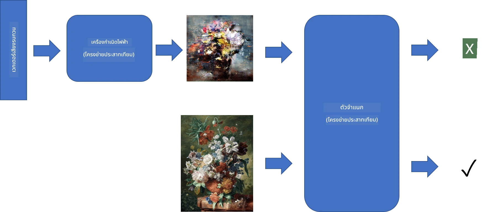
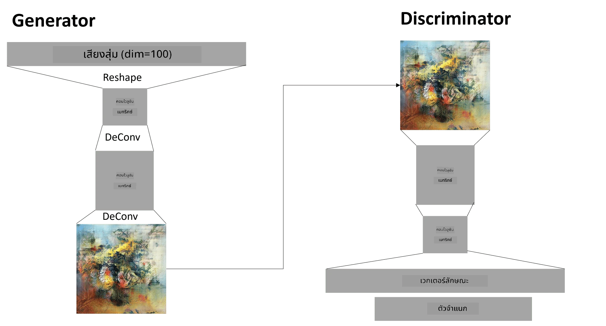

# เครือข่าย Generative Adversarial Networks

ในส่วนก่อนหน้า เราได้เรียนรู้เกี่ยวกับ **โมเดลการสร้างภาพ**: โมเดลที่สามารถสร้างภาพใหม่ที่คล้ายกับภาพในชุดข้อมูลการฝึกฝน VAE เป็นตัวอย่างที่ดีของโมเดลการสร้างภาพ

## [แบบทดสอบก่อนเรียน](https://ff-quizzes.netlify.app/en/ai/quiz/19)

อย่างไรก็ตาม หากเราพยายามสร้างสิ่งที่มีความหมายจริง ๆ เช่น ภาพวาดที่มีความละเอียดเหมาะสม ด้วย VAE เราจะพบว่าการฝึกฝนไม่สามารถบรรลุผลได้ดีนัก สำหรับกรณีนี้ เราควรเรียนรู้เกี่ยวกับสถาปัตยกรรมอีกแบบหนึ่งที่มุ่งเน้นไปที่โมเดลการสร้างภาพโดยเฉพาะ - **Generative Adversarial Networks** หรือ GANs

แนวคิดหลักของ GAN คือการมีเครือข่ายประสาทสองชุดที่ถูกฝึกฝนแข่งกัน:

> ภาพโดย [Dmitry Soshnikov](http://soshnikov.com)

> ✅ คำศัพท์เล็กน้อย:
> * **Generator** คือเครือข่ายที่รับเวกเตอร์สุ่ม และสร้างภาพเป็นผลลัพธ์
> * **Discriminator** คือเครือข่ายที่รับภาพ และต้องบอกได้ว่าภาพนั้นเป็นภาพจริง (จากชุดข้อมูลการฝึกฝน) หรือเป็นภาพที่ถูกสร้างโดย Generator ซึ่งเป็นตัวจำแนกภาพโดยพื้นฐาน

### Discriminator

สถาปัตยกรรมของ Discriminator ไม่แตกต่างจากเครือข่ายการจำแนกภาพทั่วไป ในกรณีที่ง่ายที่สุด มันสามารถเป็นตัวจำแนกแบบ fully-connected แต่ส่วนใหญ่จะเป็น [เครือข่ายคอนโวลูชัน](../07-ConvNets/README.md)

> ✅ GAN ที่ใช้เครือข่ายคอนโวลูชันเรียกว่า [DCGAN](https://arxiv.org/pdf/1511.06434.pdf)

Discriminator แบบ CNN ประกอบด้วยชั้นต่าง ๆ เช่น คอนโวลูชัน+การลดขนาด (พร้อมกับการลดขนาดเชิงพื้นที่) และชั้น fully-connected หนึ่งหรือมากกว่าเพื่อสร้าง "เวกเตอร์คุณลักษณะ" และตัวจำแนกแบบไบนารีสุดท้าย

> ✅ 'Pooling' ในบริบทนี้คือเทคนิคที่ลดขนาดของภาพ "Pooling layers ลดมิติของข้อมูลโดยการรวมผลลัพธ์ของกลุ่มนิวรอนในชั้นหนึ่งเป็นนิวรอนเดียวในชั้นถัดไป" - [แหล่งข้อมูล](https://wikipedia.org/wiki/Convolutional_neural_network#Pooling_layers)

### Generator

Generator มีความซับซ้อนมากกว่าเล็กน้อย คุณสามารถมองว่ามันเป็น Discriminator ที่กลับด้าน โดยเริ่มจากเวกเตอร์แฝง (แทนเวกเตอร์คุณลักษณะ) มันมีชั้น fully-connected เพื่อแปลงเป็นขนาด/รูปร่างที่ต้องการ ตามด้วย deconvolutions+การเพิ่มขนาด ซึ่งคล้ายกับส่วน *decoder* ของ [autoencoder](../09-Autoencoders/README.md)

> ✅ เนื่องจากชั้นคอนโวลูชันถูกนำมาใช้เป็นตัวกรองเชิงเส้นที่เคลื่อนผ่านภาพ การ deconvolution จึงคล้ายกับคอนโวลูชัน และสามารถนำมาใช้ด้วยตรรกะชั้นเดียวกัน

> ภาพโดย [Dmitry Soshnikov](http://soshnikov.com)

### การฝึกฝน GAN

GAN ถูกเรียกว่า **adversarial** เพราะมีการแข่งขันอย่างต่อเนื่องระหว่าง Generator และ Discriminator ในระหว่างการแข่งขันนี้ ทั้ง Generator และ Discriminator จะพัฒนาขึ้น ทำให้เครือข่ายเรียนรู้ที่จะสร้างภาพที่ดีขึ้นเรื่อย ๆ

การฝึกฝนเกิดขึ้นในสองขั้นตอน:

* **การฝึกฝน Discriminator** งานนี้ค่อนข้างตรงไปตรงมา: เราสร้างชุดภาพโดย Generator และติดป้ายกำกับว่า 0 ซึ่งหมายถึงภาพปลอม และนำชุดภาพจากชุดข้อมูลการป้อนเข้า (พร้อมป้ายกำกับ 1 ซึ่งหมายถึงภาพจริง) เราได้ *discriminator loss* และทำ backprop
* **การฝึกฝน Generator** ขั้นตอนนี้ซับซ้อนกว่าเล็กน้อย เพราะเราไม่ทราบผลลัพธ์ที่คาดหวังสำหรับ Generator โดยตรง เรานำเครือข่าย GAN ทั้งหมดที่ประกอบด้วย Generator ตามด้วย Discriminator ป้อนเวกเตอร์สุ่ม และคาดหวังผลลัพธ์เป็น 1 (ซึ่งสอดคล้องกับภาพจริง) จากนั้นเราจะตรึงพารามิเตอร์ของ Discriminator (เราไม่ต้องการให้มันถูกฝึกฝนในขั้นตอนนี้) และทำ backprop

ในกระบวนการนี้ ทั้ง Generator และ Discriminator loss จะไม่ลดลงอย่างมีนัยสำคัญ ในสถานการณ์ที่เหมาะสม พวกมันควรแกว่งไปมา ซึ่งแสดงถึงการปรับปรุงประสิทธิภาพของทั้งสองเครือข่าย

## ✍️ แบบฝึกหัด: GANs

* [สมุดบันทึก GAN ใน TensorFlow/Keras](GANTF.ipynb)
* [สมุดบันทึก GAN ใน PyTorch](GANPyTorch.ipynb)

### ปัญหาในการฝึกฝน GAN

GAN เป็นที่รู้กันว่าฝึกฝนได้ยากเป็นพิเศษ นี่คือปัญหาบางประการ:

* **Mode Collapse** หมายถึง Generator เรียนรู้ที่จะสร้างภาพหนึ่งภาพที่ประสบความสำเร็จในการหลอก Discriminator แต่ไม่สร้างภาพที่หลากหลาย
* **ความไวต่อ hyperparameters** บ่อยครั้งที่ GAN ไม่สามารถบรรลุผลได้เลย และจากนั้นการลดอัตราการเรียนรู้ก็ทำให้เกิดการบรรลุผล
* การรักษา **สมดุล** ระหว่าง Generator และ Discriminator ในหลายกรณี Discriminator loss อาจลดลงจนถึงศูนย์อย่างรวดเร็ว ซึ่งทำให้ Generator ไม่สามารถฝึกฝนต่อไปได้ เพื่อแก้ไขปัญหานี้ เราสามารถลองตั้งค่าอัตราการเรียนรู้ที่แตกต่างกันสำหรับ Generator และ Discriminator หรือข้ามการฝึกฝน Discriminator หาก loss ต่ำเกินไปแล้ว
* การฝึกฝนสำหรับ **ความละเอียดสูง** สะท้อนปัญหาเดียวกันกับ autoencoders ปัญหานี้เกิดขึ้นเพราะการสร้างชั้นคอนโวลูชันจำนวนมากเกินไปนำไปสู่สิ่งประดิษฐ์ ปัญหานี้มักถูกแก้ไขด้วย **progressive growing** โดยเริ่มจากการฝึกฝนชั้นไม่กี่ชั้นบนภาพความละเอียดต่ำ และจากนั้น "ปลดล็อก" หรือเพิ่มชั้น หรืออีกวิธีหนึ่งคือการเพิ่มการเชื่อมต่อระหว่างชั้นและฝึกฝนหลายความละเอียดพร้อมกัน - ดู [Multi-Scale Gradient GANs paper](https://arxiv.org/abs/1903.06048) สำหรับรายละเอียด

## การถ่ายโอนสไตล์

GAN เป็นวิธีที่ยอดเยี่ยมในการสร้างภาพศิลปะ อีกเทคนิคที่น่าสนใจคือ **การถ่ายโอนสไตล์** ซึ่งใช้ภาพ **content image** หนึ่งภาพ และวาดใหม่ในสไตล์ที่แตกต่าง โดยใช้ฟิลเตอร์จาก **style image**

วิธีการทำงานคือ:
* เราเริ่มต้นด้วยภาพสุ่ม (หรือภาพ content image แต่เพื่อความเข้าใจง่ายขึ้น เราเริ่มจากภาพสุ่ม)
* เป้าหมายของเราคือการสร้างภาพที่ใกล้เคียงกับทั้ง content image และ style image ซึ่งจะถูกกำหนดโดยฟังก์ชัน loss สองตัว:
   - **Content loss** คำนวณจากคุณลักษณะที่ถูกดึงออกโดย CNN ที่บางชั้นจากภาพปัจจุบันและ content image
   - **Style loss** คำนวณระหว่างภาพปัจจุบันและ style image ด้วยวิธีที่ชาญฉลาดโดยใช้ Gram matrices (รายละเอียดเพิ่มเติมใน [สมุดบันทึกตัวอย่าง](StyleTransfer.ipynb))
* เพื่อทำให้ภาพเรียบเนียนและลดเสียงรบกวน เราแนะนำ **Variation loss** ซึ่งคำนวณระยะทางเฉลี่ยระหว่างพิกเซลที่อยู่ติดกัน
* วงจรการปรับแต่งหลักปรับภาพปัจจุบันโดยใช้ gradient descent (หรืออัลกอริทึมการปรับแต่งอื่น ๆ) เพื่อลด total loss ซึ่งเป็นผลรวมแบบถ่วงน้ำหนักของ loss ทั้งสามตัว

## ✍️ ตัวอย่าง: [การถ่ายโอนสไตล์](StyleTransfer.ipynb)

## [แบบทดสอบหลังเรียน](https://ff-quizzes.netlify.app/en/ai/quiz/20)

## สรุป

ในบทเรียนนี้ คุณได้เรียนรู้เกี่ยวกับ GAN และวิธีการฝึกฝน นอกจากนี้คุณยังได้เรียนรู้เกี่ยวกับความท้าทายพิเศษที่เครือข่ายประสาทประเภทนี้อาจเผชิญ และกลยุทธ์บางอย่างในการแก้ไขปัญหาเหล่านั้น

## 🚀 ความท้าทาย

ลองทำ [สมุดบันทึกการถ่ายโอนสไตล์](StyleTransfer.ipynb) โดยใช้ภาพของคุณเอง

## การทบทวนและการศึกษาด้วยตนเอง

สำหรับการอ้างอิง อ่านเพิ่มเติมเกี่ยวกับ GAN จากแหล่งข้อมูลเหล่านี้:

* Marco Pasini, [10 บทเรียนที่ฉันได้เรียนรู้จากการฝึกฝน GAN เป็นเวลาหนึ่งปี](https://towardsdatascience.com/10-lessons-i-learned-training-generative-adversarial-networks-gans-for-a-year-c9071159628)
* [StyleGAN](https://en.wikipedia.org/wiki/StyleGAN) สถาปัตยกรรม GAN ที่ควรพิจารณา
* [การสร้างศิลปะเชิงสร้างสรรค์โดยใช้ GAN บน Azure ML](https://soshnikov.com/scienceart/creating-generative-art-using-gan-on-azureml/)

## งานที่ได้รับมอบหมาย

กลับไปที่หนึ่งในสองสมุดบันทึกที่เกี่ยวข้องกับบทเรียนนี้ และฝึกฝน GAN ด้วยภาพของคุณเอง คุณสามารถสร้างอะไรได้บ้าง?

---

