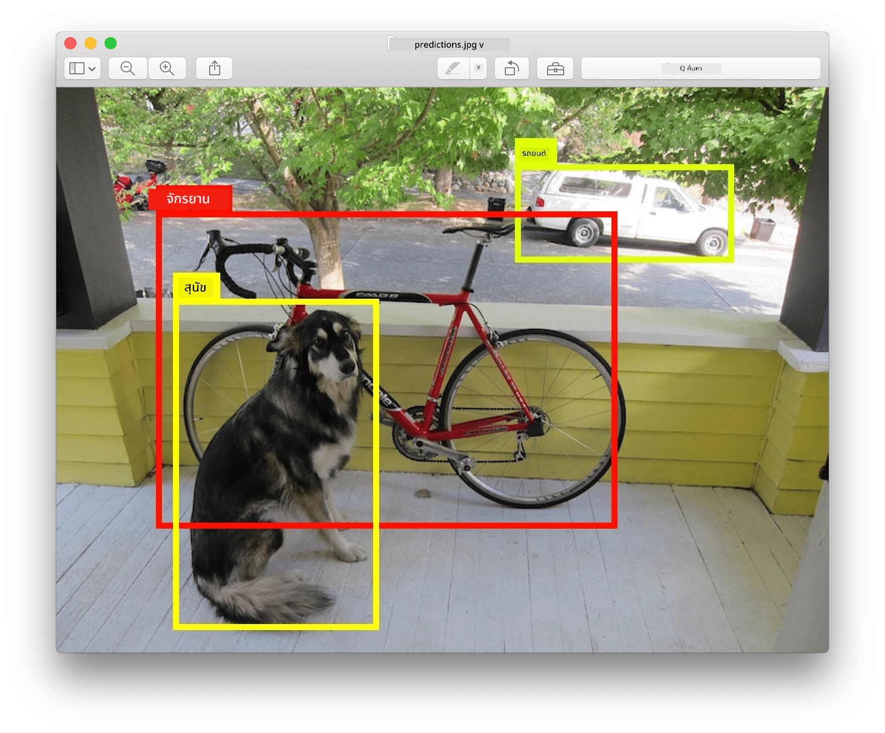
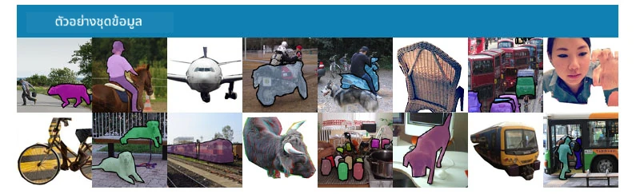
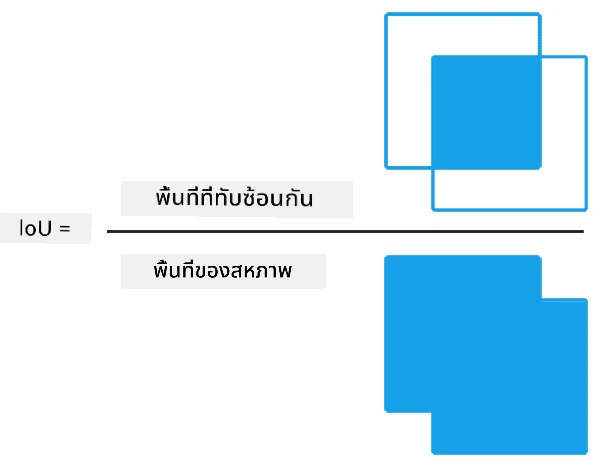
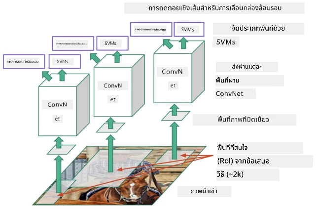
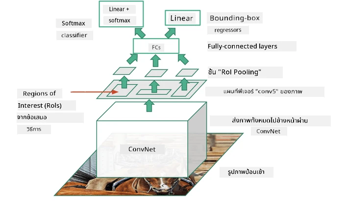
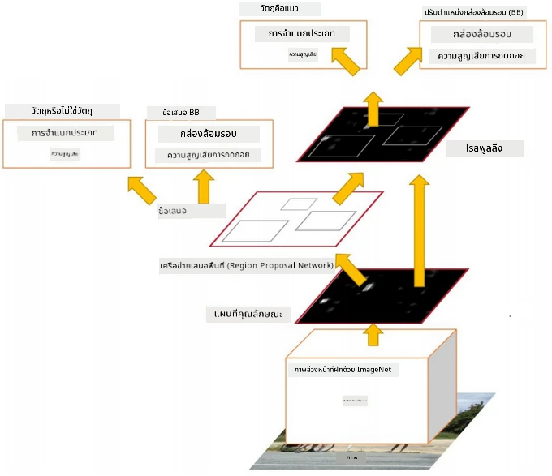
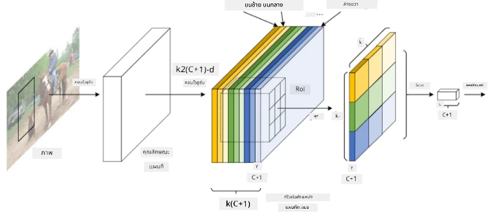
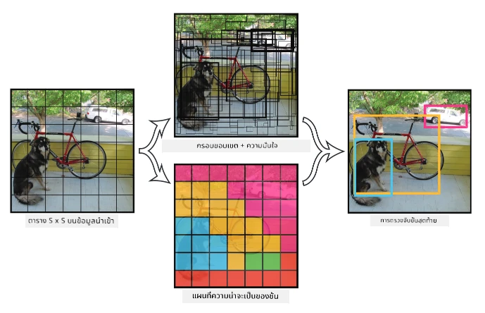

# การตรวจจับวัตถุ

โมเดลการจำแนกภาพที่เราได้ศึกษาไปก่อนหน้านี้จะรับภาพและให้ผลลัพธ์เป็นหมวดหมู่ เช่น คลาส 'ตัวเลข' ในปัญหา MNIST อย่างไรก็ตาม ในหลายกรณีเราไม่ได้ต้องการแค่รู้ว่าภาพนั้นมีวัตถุอะไรบ้าง แต่เราต้องการทราบตำแหน่งที่แน่นอนของวัตถุเหล่านั้นด้วย ซึ่งนี่คือจุดประสงค์ของ **การตรวจจับวัตถุ**

## [แบบทดสอบก่อนเรียน](https://ff-quizzes.netlify.app/en/ai/quiz/21)

> ภาพจาก [เว็บไซต์ YOLO v2](https://pjreddie.com/darknet/yolov2/)

## วิธีการพื้นฐานสำหรับการตรวจจับวัตถุ

สมมติว่าเราต้องการค้นหาแมวในภาพ วิธีการพื้นฐานที่ง่ายที่สุดสำหรับการตรวจจับวัตถุอาจเป็นดังนี้:

1. แบ่งภาพออกเป็นหลายๆ ส่วน
2. ใช้การจำแนกภาพในแต่ละส่วน
3. ส่วนที่มีการกระตุ้นสูงพอสมควรสามารถพิจารณาได้ว่ามีวัตถุที่เราต้องการอยู่

> *ภาพจาก [สมุดบันทึกการฝึกฝน](ObjectDetection-TF.ipynb)*

อย่างไรก็ตาม วิธีนี้ยังไม่เหมาะสม เพราะมันทำให้การระบุตำแหน่งกรอบของวัตถุไม่แม่นยำมากนัก หากต้องการตำแหน่งที่แม่นยำยิ่งขึ้น เราจำเป็นต้องใช้ **การถดถอย (regression)** เพื่อทำนายพิกัดของกรอบวัตถุ และสำหรับสิ่งนี้ เราต้องการชุดข้อมูลเฉพาะ

## การถดถอยสำหรับการตรวจจับวัตถุ

[บทความนี้](https://towardsdatascience.com/object-detection-with-neural-networks-a4e2c46b4491) มีการแนะนำเบื้องต้นเกี่ยวกับการตรวจจับรูปร่างที่เข้าใจง่าย

## ชุดข้อมูลสำหรับการตรวจจับวัตถุ

คุณอาจพบชุดข้อมูลต่อไปนี้สำหรับงานนี้:

* [PASCAL VOC](http://host.robots.ox.ac.uk/pascal/VOC/) - 20 คลาส
* [COCO](http://cocodataset.org/#home) - Common Objects in Context. มี 80 คลาส, กรอบวัตถุ และหน้ากากการแบ่งส่วน

## ตัวชี้วัดสำหรับการตรวจจับวัตถุ

### การซ้อนทับระหว่างพื้นที่ (Intersection over Union)

ในขณะที่การจำแนกภาพสามารถวัดผลได้ง่ายว่าประสิทธิภาพของอัลกอริทึมเป็นอย่างไร สำหรับการตรวจจับวัตถุ เราต้องวัดทั้งความถูกต้องของคลาส และความแม่นยำของตำแหน่งกรอบวัตถุที่คาดการณ์ได้ สำหรับอย่างหลัง เราใช้ตัวชี้วัดที่เรียกว่า **Intersection over Union** (IoU) ซึ่งวัดว่าพื้นที่สองส่วน (หรือพื้นที่ใดๆ) ซ้อนทับกันได้ดีเพียงใด

> *รูปที่ 2 จาก [บทความที่ยอดเยี่ยมเกี่ยวกับ IoU](https://pyimagesearch.com/2016/11/07/intersection-over-union-iou-for-object-detection/)*

แนวคิดง่ายๆ คือ เราแบ่งพื้นที่ที่ซ้อนทับกันระหว่างสองรูปด้วยพื้นที่รวมของทั้งสองรูป สำหรับพื้นที่ที่เหมือนกัน IoU จะเท่ากับ 1 ในขณะที่พื้นที่ที่ไม่ซ้อนทับกันเลย IoU จะเท่ากับ 0 ในกรณีอื่นๆ ค่า IoU จะอยู่ระหว่าง 0 ถึง 1 โดยปกติเราจะพิจารณาเฉพาะกรอบวัตถุที่มีค่า IoU สูงกว่าค่าที่กำหนด

### ความแม่นยำเฉลี่ย (Average Precision)

สมมติว่าเราต้องการวัดว่าคลาสของวัตถุ $C$ ถูกตรวจจับได้ดีเพียงใด เราใช้ตัวชี้วัด **Average Precision** ซึ่งคำนวณดังนี้:

1. พิจารณา Precision-Recall curve ที่แสดงความแม่นยำขึ้นอยู่กับค่าธรณีการตรวจจับ (threshold) (จาก 0 ถึง 1)
2. ขึ้นอยู่กับ threshold เราจะได้วัตถุที่ตรวจจับได้มากหรือน้อย และค่าความแม่นยำและการเรียกคืนที่แตกต่างกัน
3. กราฟจะมีลักษณะดังนี้:

> *ภาพจาก [NeuroWorkshop](http://github.com/shwars/NeuroWorkshop)*

ค่า Average Precision สำหรับคลาส $C$ คือพื้นที่ใต้กราฟนี้ โดยเฉพาะแกน Recall มักถูกแบ่งออกเป็น 10 ส่วน และค่า Precision จะถูกเฉลี่ยในทุกจุดเหล่านั้น:

$$
AP = {1\over11}\sum_{i=0}^{10}\mbox{Precision}(\mbox{Recall}={i\over10})
$$

### AP และ IoU

เราจะพิจารณาเฉพาะการตรวจจับที่มีค่า IoU สูงกว่าค่าที่กำหนด ตัวอย่างเช่น ในชุดข้อมูล PASCAL VOC มักจะกำหนด $\mbox{IoU Threshold} = 0.5$ ในขณะที่ใน COCO ค่า AP จะถูกวัดสำหรับค่าต่างๆ ของ $\mbox{IoU Threshold}$

> *ภาพจาก [NeuroWorkshop](http://github.com/shwars/NeuroWorkshop)*

### ความแม่นยำเฉลี่ยรวม (Mean Average Precision - mAP)

ตัวชี้วัดหลักสำหรับการตรวจจับวัตถุเรียกว่า **Mean Average Precision** หรือ **mAP** ซึ่งเป็นค่า Average Precision ที่เฉลี่ยในทุกคลาสของวัตถุ และบางครั้งยังเฉลี่ยในค่าของ $\mbox{IoU Threshold}$ ด้วย รายละเอียดเพิ่มเติมเกี่ยวกับกระบวนการคำนวณ **mAP** สามารถดูได้ใน
[บทความนี้](https://medium.com/@timothycarlen/understanding-the-map-evaluation-metric-for-object-detection-a07fe6962cf3) และ [ตัวอย่างโค้ดที่นี่](https://gist.github.com/tarlen5/008809c3decf19313de216b9208f3734)

## วิธีการตรวจจับวัตถุที่แตกต่างกัน

มีสองกลุ่มใหญ่ของอัลกอริทึมการตรวจจับวัตถุ:

* **Region Proposal Networks** (R-CNN, Fast R-CNN, Faster R-CNN) แนวคิดหลักคือการสร้าง **Regions of Interests** (ROI) และใช้ CNN กับ ROI เหล่านั้นเพื่อค้นหาการกระตุ้นสูงสุด วิธีนี้คล้ายกับวิธีพื้นฐาน แต่ ROI ถูกสร้างขึ้นอย่างชาญฉลาดมากขึ้น ข้อเสียหลักของวิธีนี้คือช้า เพราะต้องใช้ CNN หลายครั้งกับภาพ
* **One-pass** (YOLO, SSD, RetinaNet) วิธีการเหล่านี้ออกแบบเครือข่ายให้ทำนายทั้งคลาสและ ROI ในครั้งเดียว

### R-CNN: Region-Based CNN

[R-CNN](http://islab.ulsan.ac.kr/files/announcement/513/rcnn_pami.pdf) ใช้ [Selective Search](http://www.huppelen.nl/publications/selectiveSearchDraft.pdf) เพื่อสร้างโครงสร้างลำดับชั้นของ ROI ซึ่งจะถูกส่งผ่าน CNN เพื่อดึงคุณลักษณะ และใช้ SVM-classifiers เพื่อกำหนดคลาสของวัตถุ และการถดถอยเชิงเส้นเพื่อกำหนดพิกัดของ *กรอบวัตถุ* [เอกสารอย่างเป็นทางการ](https://arxiv.org/pdf/1506.01497v1.pdf)

> *ภาพจาก van de Sande et al. ICCV’11*

> *ภาพจาก [บทความนี้](https://towardsdatascience.com/r-cnn-fast-r-cnn-faster-r-cnn-yolo-object-detection-algorithms-36d53571365e)*

### F-RCNN - Fast R-CNN

วิธีนี้คล้ายกับ R-CNN แต่ ROI ถูกกำหนดหลังจากที่เลเยอร์คอนโวลูชันถูกประยุกต์ใช้แล้ว

> ภาพจาก [เอกสารอย่างเป็นทางการ](https://www.cv-foundation.org/openaccess/content_iccv_2015/papers/Girshick_Fast_R-CNN_ICCV_2015_paper.pdf), [arXiv](https://arxiv.org/pdf/1504.08083.pdf), 2015

### Faster R-CNN

แนวคิดหลักของวิธีนี้คือการใช้เครือข่ายประสาทเพื่อทำนาย ROI ที่เรียกว่า *Region Proposal Network* [เอกสาร](https://arxiv.org/pdf/1506.01497.pdf), 2016

> ภาพจาก [เอกสารอย่างเป็นทางการ](https://arxiv.org/pdf/1506.01497.pdf)

### R-FCN: Region-Based Fully Convolutional Network

อัลกอริทึมนี้เร็วกว่าวิธี Faster R-CNN แนวคิดหลักคือ:

1. ดึงคุณลักษณะโดยใช้ ResNet-101
2. คุณลักษณะถูกประมวลผลโดย **Position-Sensitive Score Map** วัตถุแต่ละตัวจาก $C$ คลาสถูกแบ่งออกเป็น $k\times k$ พื้นที่ และเราฝึกให้ทำนายส่วนต่างๆ ของวัตถุ
3. สำหรับแต่ละส่วนจาก $k\times k$ พื้นที่ เครือข่ายทั้งหมดจะโหวตให้คลาสของวัตถุ และคลาสที่มีคะแนนโหวตสูงสุดจะถูกเลือก

> ภาพจาก [เอกสารอย่างเป็นทางการ](https://arxiv.org/abs/1605.06409)

### YOLO - You Only Look Once

YOLO เป็นอัลกอริทึมแบบเรียลไทม์ที่ทำงานในครั้งเดียว แนวคิดหลักคือ:

 * ภาพถูกแบ่งออกเป็น $S\times S$ พื้นที่
 * สำหรับแต่ละพื้นที่ **CNN** ทำนายวัตถุ $n$ ชนิด, พิกัด *กรอบวัตถุ* และ *ความมั่นใจ*=*ความน่าจะเป็น* * IoU

 

> ภาพจาก [เอกสารอย่างเป็นทางการ](https://arxiv.org/abs/1506.02640)

### อัลกอริทึมอื่นๆ

* RetinaNet: [เอกสารอย่างเป็นทางการ](https://arxiv.org/abs/1708.02002)
   - [การใช้งาน PyTorch ใน Torchvision](https://pytorch.org/vision/stable/_modules/torchvision/models/detection/retinanet.html)
   - [การใช้งาน Keras](https://github.com/fizyr/keras-retinanet)
   - [การตรวจจับวัตถุด้วย RetinaNet](https://keras.io/examples/vision/retinanet/) ในตัวอย่าง Keras
* SSD (Single Shot Detector): [เอกสารอย่างเป็นทางการ](https://arxiv.org/abs/1512.02325)

## ✍️ แบบฝึกหัด: การตรวจจับวัตถุ

เรียนรู้เพิ่มเติมในสมุดบันทึกต่อไปนี้:

[ObjectDetection.ipynb](ObjectDetection.ipynb)

## สรุป

ในบทเรียนนี้ คุณได้สำรวจวิธีการต่างๆ ในการตรวจจับวัตถุอย่างรวดเร็ว!

## 🚀 ความท้าทาย

อ่านบทความและสมุดบันทึกเกี่ยวกับ YOLO และลองใช้งานด้วยตัวคุณเอง

* [บทความที่ดี](https://www.analyticsvidhya.com/blog/2018/12/practical-guide-object-detection-yolo-framewor-python/) ที่อธิบาย YOLO
 * [เว็บไซต์อย่างเป็นทางการ](https://pjreddie.com/darknet/yolo/)
 * Yolo: [การใช้งาน Keras](https://github.com/experiencor/keras-yolo2), [สมุดบันทึกแบบทีละขั้นตอน](https://github.com/experiencor/basic-yolo-keras/blob/master/Yolo%20Step-by-Step.ipynb)
 * Yolo v2: [การใช้งาน Keras](https://github.com/experiencor/keras-yolo2), [สมุดบันทึกแบบทีละขั้นตอน](https://github.com/experiencor/keras-yolo2/blob/master/Yolo%20Step-by-Step.ipynb)

## [แบบทดสอบหลังเรียน](https://ff-quizzes.netlify.app/en/ai/quiz/22)

## ทบทวนและศึกษาด้วยตนเอง

* [การตรวจจับวัตถุ](https://tjmachinelearning.com/lectures/1718/obj/) โดย Nikhil Sardana
* [การเปรียบเทียบอัลกอริทึมการตรวจจับวัตถุที่ดี](https://lilianweng.github.io/lil-log/2018/12/27/object-detection-part-4.html)
* [การทบทวนอัลกอริทึม Deep Learning สำหรับการตรวจจับวัตถุ](https://medium.com/comet-app/review-of-deep-learning-algorithms-for-object-detection-c1f3d437b852)
* [การแนะนำทีละขั้นตอนเกี่ยวกับอัลกอริทึมการตรวจจับวัตถุพื้นฐาน](https://www.analyticsvidhya.com/blog/2018/10/a-step-by-step-introduction-to-the-basic-object-detection-algorithms-part-1/)
* [การใช้งาน Faster R-CNN ใน Python สำหรับการตรวจจับวัตถุ](https://www.analyticsvidhya.com/blog/2018/11/implementation-faster-r-cnn-python-object-detection/)

## [งานที่ได้รับมอบหมาย: การตรวจจับวัตถุ](lab/README.md)

---

