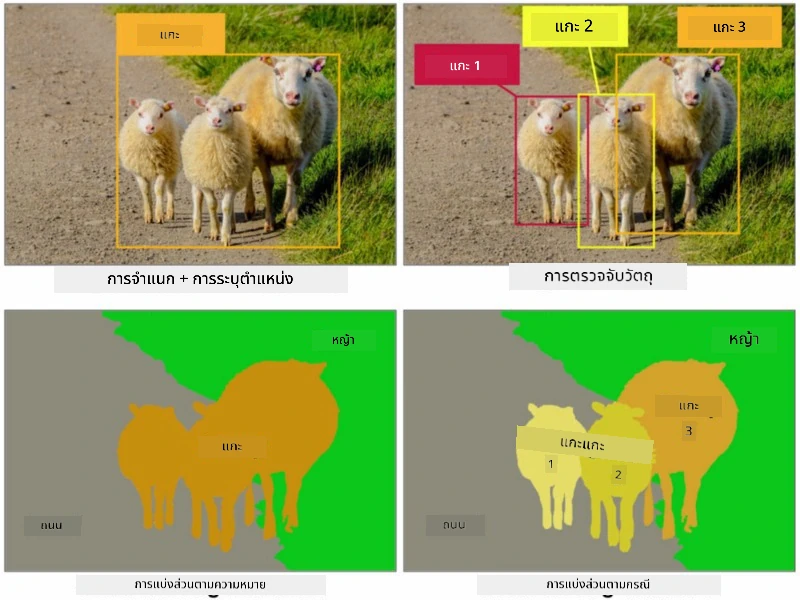
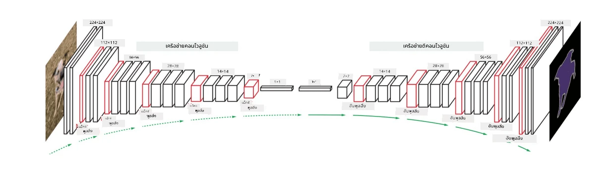
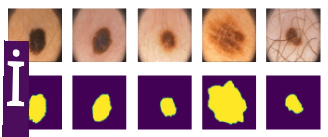

# การแบ่งส่วนภาพ

เราได้เรียนรู้เกี่ยวกับการตรวจจับวัตถุ (Object Detection) ซึ่งช่วยให้เราสามารถระบุตำแหน่งของวัตถุในภาพโดยการทำนาย *กรอบสี่เหลี่ยม* (bounding boxes) ของวัตถุ อย่างไรก็ตาม สำหรับบางงาน เราไม่ได้ต้องการแค่กรอบสี่เหลี่ยม แต่ต้องการการระบุตำแหน่งของวัตถุที่แม่นยำยิ่งขึ้น งานนี้เรียกว่า **การแบ่งส่วนภาพ** (segmentation)

## [แบบทดสอบก่อนเรียน](https://ff-quizzes.netlify.app/en/ai/quiz/23)

การแบ่งส่วนภาพสามารถมองว่าเป็น **การจำแนกพิกเซล** โดยที่เราต้องทำนายคลาสของ **แต่ละ** พิกเซลในภาพ (*พื้นหลัง* เป็นหนึ่งในคลาสด้วย) มีอัลกอริทึมการแบ่งส่วนภาพหลักสองประเภท:

* **Semantic segmentation** บอกเพียงคลาสของพิกเซล แต่ไม่แยกแยะวัตถุที่แตกต่างกันในคลาสเดียวกัน
* **Instance segmentation** แยกคลาสออกเป็นวัตถุแต่ละชิ้น

สำหรับ Instance segmentation แกะเหล่านี้ถือเป็นวัตถุที่แตกต่างกัน แต่สำหรับ Semantic segmentation แกะทั้งหมดจะถูกแทนด้วยคลาสเดียวกัน

> ภาพจาก [บทความนี้](https://nirmalamurali.medium.com/image-classification-vs-semantic-segmentation-vs-instance-segmentation-625c33a08d50)

มีสถาปัตยกรรมเครือข่ายประสาทเทียมที่หลากหลายสำหรับการแบ่งส่วนภาพ แต่ทั้งหมดมีโครงสร้างเดียวกัน ในบางแง่ มันคล้ายกับ Autoencoder ที่คุณเคยเรียนรู้มาก่อนหน้านี้ แต่แทนที่จะถอดรหัสภาพต้นฉบับ เป้าหมายของเราคือการถอดรหัส **หน้ากาก** (mask) ดังนั้น เครือข่ายการแบ่งส่วนภาพจะมีส่วนประกอบดังนี้:

* **Encoder** สกัดคุณลักษณะจากภาพต้นฉบับ
* **Decoder** แปลงคุณลักษณะเหล่านั้นให้เป็น **ภาพหน้ากาก** (mask image) ที่มีขนาดและจำนวนช่องสัญญาณเท่ากับจำนวนคลาส

> ภาพจาก [งานวิจัยนี้](https://arxiv.org/pdf/2001.05566.pdf)

เราควรกล่าวถึงฟังก์ชันการสูญเสีย (loss function) ที่ใช้สำหรับการแบ่งส่วนภาพโดยเฉพาะ เมื่อใช้ Autoencoder แบบดั้งเดิม เราต้องวัดความคล้ายคลึงกันระหว่างภาพสองภาพ และสามารถใช้ค่าเฉลี่ยกำลังสองของข้อผิดพลาด (MSE) เพื่อทำเช่นนั้น ในการแบ่งส่วนภาพ แต่ละพิกเซลในภาพหน้ากากเป้าหมายแสดงถึงหมายเลขคลาส (one-hot-encoded ในมิติที่สาม) ดังนั้นเราจำเป็นต้องใช้ฟังก์ชันการสูญเสียที่เฉพาะเจาะจงสำหรับการจำแนกประเภท เช่น cross-entropy loss ที่เฉลี่ยในทุกพิกเซล หากหน้ากากเป็นแบบไบนารี จะใช้ **binary cross-entropy loss** (BCE)

> ✅ การเข้ารหัสแบบ One-hot เป็นวิธีการเข้ารหัสป้ายกำกับคลาสให้เป็นเวกเตอร์ที่มีความยาวเท่ากับจำนวนคลาส ลองดู [บทความนี้](https://datagy.io/sklearn-one-hot-encode/) เพื่อเรียนรู้เทคนิคนี้

## การแบ่งส่วนภาพสำหรับการถ่ายภาพทางการแพทย์

ในบทเรียนนี้ เราจะเห็นการแบ่งส่วนภาพในทางปฏิบัติโดยการฝึกเครือข่ายให้รู้จักเนื้องอกผิวหนัง (nevi หรือไฝ) ในภาพทางการแพทย์ เราจะใช้ <a href="https://www.fc.up.pt/addi/ph2%20database.html">ฐานข้อมูล PH2</a> ของภาพถ่ายผิวหนังด้วยกล้อง Dermoscopy เป็นแหล่งข้อมูลภาพ ฐานข้อมูลนี้มีภาพ 200 ภาพที่แบ่งออกเป็นสามคลาส: เนื้องอกทั่วไป (typical nevus), เนื้องอกผิดปกติ (atypical nevus), และมะเร็งผิวหนัง (melanoma) ภาพทั้งหมดมี **หน้ากาก** ที่ระบุขอบเขตของเนื้องอกด้วย

> ✅ เทคนิคนี้เหมาะสมอย่างยิ่งสำหรับการถ่ายภาพทางการแพทย์ประเภทนี้ แต่คุณสามารถจินตนาการถึงการใช้งานในโลกจริงอื่น ๆ ได้หรือไม่?

> ภาพจากฐานข้อมูล PH2

เราจะฝึกโมเดลเพื่อแบ่งส่วนเนื้องอกออกจากพื้นหลัง

## ✍️ แบบฝึกหัด: การแบ่งส่วนภาพแบบ Semantic

เปิดโน้ตบุ๊กด้านล่างเพื่อเรียนรู้เพิ่มเติมเกี่ยวกับสถาปัตยกรรมการแบ่งส่วนภาพแบบ Semantic ฝึกการทำงานกับมัน และดูการใช้งานจริง

* [Semantic Segmentation Pytorch](SemanticSegmentationPytorch.ipynb)
* [Semantic Segmentation TensorFlow](SemanticSegmentationTF.ipynb)

## [แบบทดสอบหลังเรียน](https://ff-quizzes.netlify.app/en/ai/quiz/24)

## สรุป

การแบ่งส่วนภาพเป็นเทคนิคที่ทรงพลังมากสำหรับการจำแนกภาพ โดยก้าวข้ามกรอบสี่เหลี่ยมไปสู่การจำแนกในระดับพิกเซล เป็นเทคนิคที่ใช้ในภาพทางการแพทย์และการใช้งานอื่น ๆ

## 🚀 ความท้าทาย

การแบ่งส่วนร่างกายเป็นหนึ่งในงานทั่วไปที่เราสามารถทำได้กับภาพของคน งานสำคัญอื่น ๆ รวมถึง **การตรวจจับโครงกระดูก** และ **การตรวจจับท่าทาง** ลองใช้ไลบรารี [OpenPose](https://github.com/CMU-Perceptual-Computing-Lab/openpose) เพื่อดูว่าการตรวจจับท่าทางสามารถนำไปใช้ได้อย่างไร

## การทบทวนและการศึกษาด้วยตนเอง

บทความ [Wikipedia นี้](https://wikipedia.org/wiki/Image_segmentation) ให้ภาพรวมที่ดีเกี่ยวกับการใช้งานต่าง ๆ ของเทคนิคนี้ เรียนรู้เพิ่มเติมด้วยตัวเองเกี่ยวกับสาขาย่อยของ Instance segmentation และ Panoptic segmentation ในการศึกษานี้

## [งานที่มอบหมาย](lab/README.md)

ในห้องปฏิบัติการนี้ ลองทำ **การแบ่งส่วนร่างกายมนุษย์** โดยใช้ [Segmentation Full Body MADS Dataset](https://www.kaggle.com/datasets/tapakah68/segmentation-full-body-mads-dataset) จาก Kaggle

---

