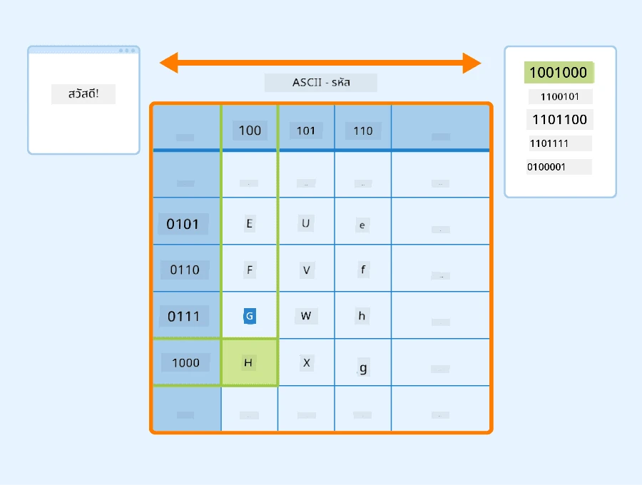
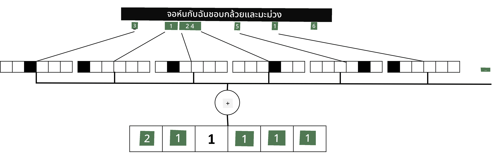

# การแสดงข้อความในรูปแบบเทนเซอร์

## [แบบทดสอบก่อนเรียน](https://ff-quizzes.netlify.app/en/ai/quiz/25)

## การจัดประเภทข้อความ

ในส่วนแรกของบทนี้ เราจะมุ่งเน้นไปที่งาน **การจัดประเภทข้อความ** โดยเราจะใช้ชุดข้อมูล [AG News](https://www.kaggle.com/amananandrai/ag-news-classification-dataset) ซึ่งประกอบด้วยบทความข่าว เช่นตัวอย่างต่อไปนี้:

* หมวดหมู่: วิทยาศาสตร์/เทคโนโลยี
* หัวข้อ: Ky. Company Wins Grant to Study Peptides (AP)
* เนื้อหา: AP - บริษัทที่ก่อตั้งโดยนักวิจัยเคมีจากมหาวิทยาลัย Louisville ได้รับทุนเพื่อพัฒนา...

เป้าหมายของเราคือการจัดประเภทข่าวให้อยู่ในหนึ่งในหมวดหมู่ที่กำหนดไว้โดยอิงจากข้อความ

## การแสดงข้อความ

หากเราต้องการแก้ปัญหาด้านการประมวลผลภาษาธรรมชาติ (NLP) ด้วยเครือข่ายประสาทเทียม เราจำเป็นต้องมีวิธีการแสดงข้อความในรูปแบบเทนเซอร์ คอมพิวเตอร์มีการแสดงตัวอักษรในรูปแบบตัวเลขอยู่แล้ว ซึ่งเชื่อมโยงกับฟอนต์บนหน้าจอของคุณโดยใช้การเข้ารหัส เช่น ASCII หรือ UTF-8

> [แหล่งที่มาของภาพ](https://www.seobility.net/en/wiki/ASCII)

ในฐานะมนุษย์ เราเข้าใจว่าตัวอักษรแต่ละตัว **แสดงถึงอะไร** และตัวอักษรทั้งหมดรวมกันเพื่อสร้างคำในประโยคอย่างไร อย่างไรก็ตาม คอมพิวเตอร์เองไม่มีความเข้าใจเช่นนั้น และเครือข่ายประสาทเทียมต้องเรียนรู้ความหมายระหว่างการฝึก

ดังนั้น เราสามารถใช้วิธีการต่าง ๆ ในการแสดงข้อความ:

* **การแสดงในระดับตัวอักษร** ซึ่งเราจะแสดงข้อความโดยการพิจารณาตัวอักษรแต่ละตัวเป็นตัวเลข หากเรามีตัวอักษร *C* ต่าง ๆ ในชุดข้อความ คำว่า *Hello* จะถูกแสดงในรูปแบบเทนเซอร์ขนาด 5x*C* โดยตัวอักษรแต่ละตัวจะสอดคล้องกับคอลัมน์ในเทนเซอร์ที่เข้ารหัสแบบ one-hot
* **การแสดงในระดับคำ** ซึ่งเราสร้าง **คำศัพท์** ของคำทั้งหมดในข้อความ และแสดงคำโดยใช้การเข้ารหัสแบบ one-hot วิธีนี้ดีกว่าในบางแง่ เพราะตัวอักษรแต่ละตัวไม่มีความหมายมากนัก ดังนั้นการใช้แนวคิดเชิงความหมายระดับสูง เช่นคำ จะช่วยลดความซับซ้อนของงานสำหรับเครือข่ายประสาทเทียม อย่างไรก็ตาม ด้วยขนาดของพจนานุกรมที่ใหญ่ เราต้องจัดการกับเทนเซอร์ที่มีมิติสูงและกระจัดกระจาย

ไม่ว่าจะใช้การแสดงแบบใด เราต้องแปลงข้อความเป็นลำดับของ **โทเค็น** ก่อน โดยโทเค็นหนึ่งอาจเป็นตัวอักษร คำ หรือแม้กระทั่งส่วนหนึ่งของคำ จากนั้นเราจะแปลงโทเค็นเป็นตัวเลข โดยทั่วไปใช้ **คำศัพท์** และตัวเลขนี้สามารถป้อนเข้าสู่เครือข่ายประสาทเทียมโดยใช้การเข้ารหัสแบบ one-hot

## N-Grams

ในภาษาธรรมชาติ ความหมายที่ชัดเจนของคำสามารถกำหนดได้เฉพาะในบริบทเท่านั้น ตัวอย่างเช่น ความหมายของ *neural network* และ *fishing network* แตกต่างกันโดยสิ้นเชิง วิธีหนึ่งในการคำนึงถึงสิ่งนี้คือการสร้างโมเดลของเราบนคู่คำ และพิจารณาคู่คำเป็นโทเค็นคำศัพท์แยกต่างหาก ด้วยวิธีนี้ ประโยค *I like to go fishing* จะถูกแสดงในรูปแบบลำดับของโทเค็นดังนี้: *I like*, *like to*, *to go*, *go fishing* ปัญหาของวิธีนี้คือขนาดของพจนานุกรมจะเพิ่มขึ้นอย่างมาก และการรวมกันเช่น *go fishing* และ *go shopping* จะถูกแสดงโดยโทเค็นที่แตกต่างกัน ซึ่งไม่มีความคล้ายคลึงกันทางความหมายแม้จะใช้คำกริยาเดียวกัน

ในบางกรณี เราอาจพิจารณาใช้ tri-grams -- การรวมกันของสามคำ -- ด้วยเช่นกัน ดังนั้นวิธีนี้จึงมักเรียกว่า **n-grams** นอกจากนี้ยังมีเหตุผลที่จะใช้ n-grams กับการแสดงในระดับตัวอักษร ซึ่งในกรณีนี้ n-grams จะสอดคล้องกับพยางค์ต่าง ๆ

## Bag-of-Words และ TF/IDF

เมื่อแก้ปัญหาเช่นการจัดประเภทข้อความ เราจำเป็นต้องสามารถแสดงข้อความในรูปแบบเวกเตอร์ขนาดคงที่ ซึ่งเราจะใช้เป็นอินพุตสำหรับตัวจัดประเภทแบบ dense วิธีที่ง่ายที่สุดวิธีหนึ่งคือการรวมการแสดงคำแต่ละคำ เช่นโดยการบวกกัน หากเราบวกการเข้ารหัสแบบ one-hot ของแต่ละคำ เราจะได้เวกเตอร์ที่แสดงความถี่ ซึ่งแสดงจำนวนครั้งที่แต่ละคำปรากฏในข้อความ การแสดงข้อความในรูปแบบนี้เรียกว่า **bag of words** (BoW)

> ภาพโดยผู้เขียน

BoW แสดงให้เห็นว่าคำใดปรากฏในข้อความและในปริมาณเท่าใด ซึ่งสามารถเป็นตัวบ่งชี้ที่ดีว่าข้อความเกี่ยวกับอะไร ตัวอย่างเช่น บทความข่าวเกี่ยวกับการเมืองมักจะมีคำเช่น *president* และ *country* ในขณะที่สิ่งพิมพ์ทางวิทยาศาสตร์อาจมีคำเช่น *collider*, *discovered* เป็นต้น ดังนั้นความถี่ของคำสามารถเป็นตัวบ่งชี้ที่ดีของเนื้อหาข้อความในหลายกรณี

ปัญหาของ BoW คือคำทั่วไปบางคำ เช่น *and*, *is* เป็นต้น ปรากฏในข้อความส่วนใหญ่ และมีความถี่สูงสุด ซึ่งบดบังคำที่สำคัญจริง ๆ เราอาจลดความสำคัญของคำเหล่านั้นโดยคำนึงถึงความถี่ที่คำปรากฏในชุดเอกสารทั้งหมด นี่คือแนวคิดหลักของวิธี TF/IDF ซึ่งมีการอธิบายรายละเอียดเพิ่มเติมในโน้ตบุ๊กที่แนบมากับบทเรียนนี้

อย่างไรก็ตาม วิธีเหล่านี้ไม่สามารถคำนึงถึง **ความหมาย** ของข้อความได้อย่างเต็มที่ เราจำเป็นต้องใช้โมเดลเครือข่ายประสาทเทียมที่ทรงพลังมากขึ้น ซึ่งเราจะพูดถึงในภายหลังในบทนี้

## ✍️ แบบฝึกหัด: การแสดงข้อความ

เรียนรู้เพิ่มเติมในโน้ตบุ๊กต่อไปนี้:

* [การแสดงข้อความด้วย PyTorch](TextRepresentationPyTorch.ipynb)
* [การแสดงข้อความด้วย TensorFlow](TextRepresentationTF.ipynb)

## สรุป

จนถึงตอนนี้ เราได้ศึกษาวิธีการที่สามารถเพิ่มน้ำหนักความถี่ให้กับคำต่าง ๆ อย่างไรก็ตาม วิธีเหล่านี้ไม่สามารถแสดงความหมายหรือลำดับได้ ดังที่นักภาษาศาสตร์ชื่อดัง J. R. Firth กล่าวไว้ในปี 1935 ว่า "ความหมายที่สมบูรณ์ของคำจะขึ้นอยู่กับบริบทเสมอ และการศึกษาความหมายที่แยกจากบริบทไม่สามารถถือเป็นเรื่องจริงจังได้" เราจะเรียนรู้ในภายหลังในหลักสูตรนี้เกี่ยวกับวิธีการจับข้อมูลบริบทจากข้อความโดยใช้การสร้างแบบจำลองภาษา

## 🚀 ความท้าทาย

ลองทำแบบฝึกหัดอื่น ๆ โดยใช้ bag-of-words และโมเดลข้อมูลต่าง ๆ คุณอาจได้รับแรงบันดาลใจจาก [การแข่งขันนี้บน Kaggle](https://www.kaggle.com/competitions/word2vec-nlp-tutorial/overview/part-1-for-beginners-bag-of-words)

## [แบบทดสอบหลังเรียน](https://ff-quizzes.netlify.app/en/ai/quiz/26)

## ทบทวนและศึกษาด้วยตนเอง

ฝึกฝนทักษะของคุณด้วยเทคนิคการฝังข้อความและ bag-of-words บน [Microsoft Learn](https://docs.microsoft.com/learn/modules/intro-natural-language-processing-pytorch/?WT.mc_id=academic-77998-cacaste)

## [งานที่ได้รับมอบหมาย: โน้ตบุ๊ก](assignment.md)

---

