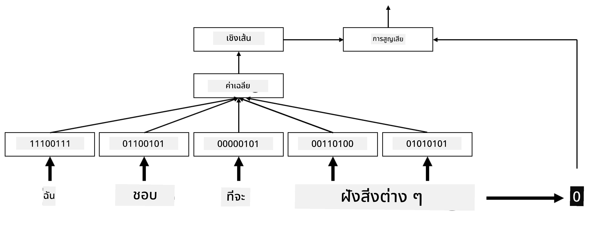
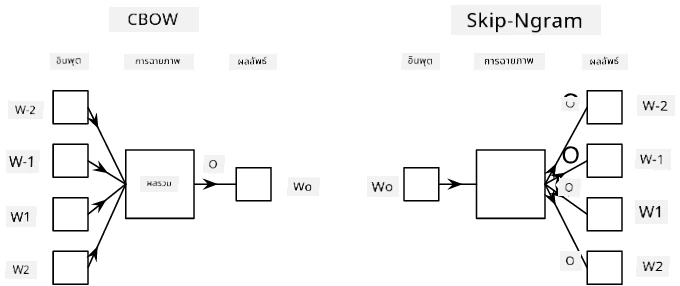

# การฝังข้อมูล

## [แบบทดสอบก่อนเรียน](https://ff-quizzes.netlify.app/en/ai/quiz/27)

เมื่อเราฝึกโมเดลจำแนกประเภทโดยใช้ BoW หรือ TF/IDF เราใช้เวกเตอร์แบบถุงคำที่มีมิติสูงซึ่งมีความยาวเท่ากับ `vocab_size` และเราทำการแปลงจากเวกเตอร์ที่มีมิติต่ำในรูปแบบตำแหน่งไปเป็นเวกเตอร์แบบ one-hot ที่มีความหนาแน่นต่ำ อย่างไรก็ตาม การแสดงผลแบบ one-hot นี้ไม่ประหยัดหน่วยความจำ นอกจากนี้ แต่ละคำยังถูกพิจารณาแยกจากกันโดยสิ้นเชิง กล่าวคือ เวกเตอร์แบบ one-hot ไม่ได้แสดงความคล้ายคลึงทางความหมายระหว่างคำต่างๆ

แนวคิดของ **การฝังข้อมูล** คือการแทนคำด้วยเวกเตอร์ที่มีมิติต่ำและมีความหนาแน่น ซึ่งสะท้อนถึงความหมายทางความหมายของคำ เราจะพูดถึงวิธีการสร้างการฝังคำที่มีความหมายในภายหลัง แต่ตอนนี้ให้คิดว่าการฝังข้อมูลเป็นวิธีลดมิติของเวกเตอร์คำ

ดังนั้น เลเยอร์การฝังข้อมูลจะรับคำเป็นอินพุต และสร้างเวกเตอร์เอาต์พุตที่มีขนาด `embedding_size` ในแง่หนึ่งมันคล้ายกับเลเยอร์ `Linear` แต่แทนที่จะรับเวกเตอร์แบบ one-hot เป็นอินพุต มันจะสามารถรับหมายเลขคำเป็นอินพุตได้ ซึ่งช่วยให้เราหลีกเลี่ยงการสร้างเวกเตอร์แบบ one-hot ที่มีขนาดใหญ่

โดยการใช้เลเยอร์การฝังข้อมูลเป็นเลเยอร์แรกในเครือข่ายจำแนกประเภทของเรา เราสามารถเปลี่ยนจากโมเดลถุงคำไปเป็น **embedding bag** ซึ่งเราจะเปลี่ยนคำแต่ละคำในข้อความของเราให้เป็นการฝังข้อมูลที่สอดคล้องกัน และคำนวณฟังก์ชันรวมบางอย่างจากการฝังข้อมูลเหล่านั้น เช่น `sum`, `average` หรือ `max`

> ภาพโดยผู้เขียน

## ✍️ แบบฝึกหัด: การฝังข้อมูล

เรียนรู้เพิ่มเติมในโน้ตบุ๊กต่อไปนี้:
* [การฝังข้อมูลด้วย PyTorch](EmbeddingsPyTorch.ipynb)
* [การฝังข้อมูลด้วย TensorFlow](EmbeddingsTF.ipynb)

## การฝังข้อมูลเชิงความหมาย: Word2Vec

แม้ว่าเลเยอร์การฝังข้อมูลจะเรียนรู้การแปลงคำเป็นเวกเตอร์ แต่การแปลงนี้ไม่ได้มีความหมายเชิงความหมายมากนัก จะดีมากหากเราเรียนรู้การแปลงเวกเตอร์ที่คำที่คล้ายกันหรือคำพ้องความหมายมีเวกเตอร์ที่อยู่ใกล้กันในแง่ของระยะทางเวกเตอร์บางประเภท (เช่น ระยะทาง Euclidean)

เพื่อทำเช่นนั้น เราจำเป็นต้องฝึกโมเดลการฝังข้อมูลล่วงหน้าบนชุดข้อความขนาดใหญ่ในวิธีเฉพาะ วิธีหนึ่งในการฝึกการฝังข้อมูลเชิงความหมายเรียกว่า [Word2Vec](https://en.wikipedia.org/wiki/Word2vec) ซึ่งมีพื้นฐานมาจากสองสถาปัตยกรรมหลักที่ใช้ในการสร้างการแสดงผลแบบกระจายของคำ:

 - **Continuous bag-of-words** (CBoW) — ในสถาปัตยกรรมนี้ เราฝึกโมเดลให้ทำนายคำจากบริบทโดยรอบ โดยให้ ngram $(W_{-2},W_{-1},W_0,W_1,W_2)$ เป้าหมายของโมเดลคือการทำนาย $W_0$ จาก $(W_{-2},W_{-1},W_1,W_2)$
 - **Continuous skip-gram** — ตรงกันข้ามกับ CBoW โมเดลใช้หน้าต่างบริบทของคำรอบๆ เพื่อทำนายคำปัจจุบัน

CBoW ทำงานได้เร็วกว่า ในขณะที่ skip-gram ทำงานช้ากว่า แต่สามารถแสดงคำที่ไม่ค่อยปรากฏได้ดีกว่า

> ภาพจาก [เอกสารนี้](https://arxiv.org/pdf/1301.3781.pdf)

การฝังข้อมูลที่ผ่านการฝึก Word2Vec ล่วงหน้า (รวมถึงโมเดลอื่นๆ ที่คล้ายกัน เช่น GloVe) สามารถนำมาใช้แทนเลเยอร์การฝังข้อมูลในเครือข่ายประสาทเทียมได้ อย่างไรก็ตาม เราจำเป็นต้องจัดการกับคำศัพท์ เนื่องจากคำศัพท์ที่ใช้ในการฝึก Word2Vec/GloVe ล่วงหน้าอาจแตกต่างจากคำศัพท์ในชุดข้อความของเรา ลองดูโน้ตบุ๊กด้านบนเพื่อดูวิธีแก้ปัญหานี้

## การฝังข้อมูลเชิงบริบท

ข้อจำกัดสำคัญของการแสดงผลการฝังข้อมูลที่ผ่านการฝึกล่วงหน้าแบบดั้งเดิม เช่น Word2Vec คือปัญหาการแยกความหมายของคำ ในขณะที่การฝังข้อมูลที่ผ่านการฝึกล่วงหน้าสามารถจับความหมายบางส่วนของคำในบริบทได้ แต่ทุกความหมายที่เป็นไปได้ของคำจะถูกเข้ารหัสในรูปแบบการฝังข้อมูลเดียวกัน สิ่งนี้อาจทำให้เกิดปัญหาในโมเดลที่ตามมา เนื่องจากคำหลายคำ เช่นคำว่า 'play' มีความหมายต่างกันขึ้นอยู่กับบริบทที่ใช้

ตัวอย่างเช่น คำว่า 'play' ในสองประโยคนี้มีความหมายที่แตกต่างกันอย่างมาก:

- ฉันไปดู **ละคร** ที่โรงละคร
- จอห์นอยาก **เล่น** กับเพื่อนๆ ของเขา

การฝังข้อมูลที่ผ่านการฝึกล่วงหน้าข้างต้นแสดงทั้งสองความหมายของคำว่า 'play' ในรูปแบบการฝังข้อมูลเดียวกัน เพื่อแก้ไขข้อจำกัดนี้ เราจำเป็นต้องสร้างการฝังข้อมูลโดยอิงจาก **โมเดลภาษา** ซึ่งได้รับการฝึกบนชุดข้อความขนาดใหญ่ และ *รู้* ว่าคำสามารถนำมารวมกันในบริบทต่างๆ ได้อย่างไร การพูดถึงการฝังข้อมูลเชิงบริบทอยู่นอกเหนือขอบเขตของบทเรียนนี้ แต่เราจะกลับมาพูดถึงเรื่องนี้เมื่อพูดถึงโมเดลภาษาในภายหลังในหลักสูตร

## สรุป

ในบทเรียนนี้ คุณได้เรียนรู้วิธีสร้างและใช้เลเยอร์การฝังข้อมูลใน TensorFlow และ PyTorch เพื่อสะท้อนความหมายเชิงความหมายของคำได้ดียิ่งขึ้น

## 🚀 ความท้าทาย

Word2Vec ถูกนำไปใช้ในแอปพลิเคชันที่น่าสนใจ เช่น การสร้างเนื้อเพลงและบทกวี ลองดู [บทความนี้](https://www.politetype.com/blog/word2vec-color-poems) ซึ่งอธิบายวิธีที่ผู้เขียนใช้ Word2Vec ในการสร้างบทกวี และดู [วิดีโอนี้โดย Dan Shiffmann](https://www.youtube.com/watch?v=LSS_bos_TPI&ab_channel=TheCodingTrain) เพื่อเรียนรู้คำอธิบายเทคนิคนี้ในรูปแบบที่แตกต่างกัน จากนั้นลองนำเทคนิคเหล่านี้ไปใช้กับชุดข้อความของคุณเอง ซึ่งอาจมาจาก Kaggle

## [แบบทดสอบหลังเรียน](https://ff-quizzes.netlify.app/en/ai/quiz/28)

## ทบทวนและศึกษาด้วยตนเอง

อ่านเอกสารนี้เกี่ยวกับ Word2Vec: [Efficient Estimation of Word Representations in Vector Space](https://arxiv.org/pdf/1301.3781.pdf)

## [งานที่ได้รับมอบหมาย: โน้ตบุ๊ก](assignment.md)

---

