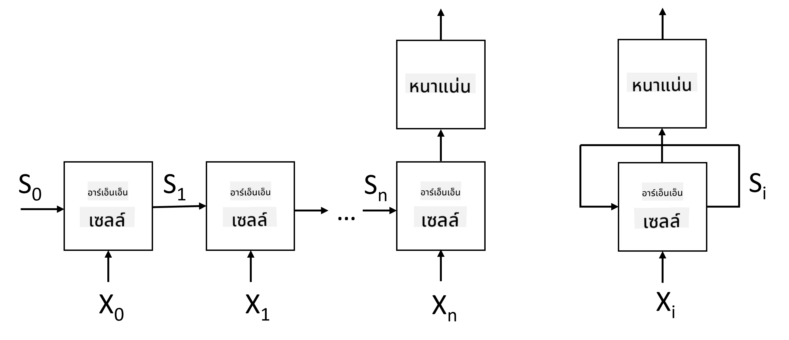

<!--
CO_OP_TRANSLATOR_METADATA:
{
  "original_hash": "58bf4adb210aab53e8f78c8082040e7c",
  "translation_date": "2025-08-29T09:24:48+00:00",
  "source_file": "lessons/5-NLP/16-RNN/README.md",
  "language_code": "th"
}
-->
# เครือข่ายประสาทเทียมแบบวนซ้ำ (Recurrent Neural Networks)

## [แบบทดสอบก่อนเรียน](https://red-field-0a6ddfd03.1.azurestaticapps.net/quiz/116)

ในส่วนก่อนหน้านี้ เราได้ใช้การแสดงผลเชิงความหมายที่ซับซ้อนของข้อความและตัวจำแนกเชิงเส้นแบบง่ายที่อยู่บน embeddings สถาปัตยกรรมนี้ช่วยจับความหมายรวมของคำในประโยค แต่ไม่ได้คำนึงถึง **ลำดับ** ของคำ เนื่องจากการดำเนินการรวมบน embeddings ได้ลบข้อมูลนี้ออกไปจากข้อความต้นฉบับ ด้วยเหตุนี้ โมเดลเหล่านี้จึงไม่สามารถจำลองลำดับของคำได้ และไม่สามารถแก้ปัญหาที่ซับซ้อนหรือคลุมเครือ เช่น การสร้างข้อความหรือการตอบคำถามได้

เพื่อจับความหมายของลำดับข้อความ เราจำเป็นต้องใช้สถาปัตยกรรมเครือข่ายประสาทเทียมอีกแบบหนึ่งที่เรียกว่า **เครือข่ายประสาทเทียมแบบวนซ้ำ** หรือ RNN ใน RNN เราจะส่งประโยคผ่านเครือข่ายทีละสัญลักษณ์ และเครือข่ายจะสร้าง **สถานะ** ซึ่งเราจะส่งกลับเข้าไปในเครือข่ายพร้อมกับสัญลักษณ์ถัดไป

> ภาพโดยผู้เขียน

เมื่อได้รับลำดับอินพุตของโทเค็น X0,...,Xn RNN จะสร้างลำดับของบล็อกเครือข่ายประสาทเทียม และฝึกฝนลำดับนี้แบบ end-to-end โดยใช้ backpropagation แต่ละบล็อกเครือข่ายจะรับคู่ (Xi,Si) เป็นอินพุต และสร้าง Si+1 เป็นผลลัพธ์ สถานะสุดท้าย Sn หรือ (ผลลัพธ์ Yn) จะถูกส่งไปยังตัวจำแนกเชิงเส้นเพื่อสร้างผลลัพธ์ บล็อกเครือข่ายทั้งหมดใช้เวทเดียวกัน และถูกฝึกแบบ end-to-end โดยใช้ backpropagation เพียงครั้งเดียว

เนื่องจากเวกเตอร์สถานะ S0,...,Sn ถูกส่งผ่านเครือข่าย มันจึงสามารถเรียนรู้ความสัมพันธ์เชิงลำดับระหว่างคำได้ ตัวอย่างเช่น เมื่อคำว่า *not* ปรากฏในลำดับ มันสามารถเรียนรู้ที่จะปฏิเสธองค์ประกอบบางอย่างในเวกเตอร์สถานะ ส่งผลให้เกิดการปฏิเสธ

> ✅ เนื่องจากเวทของบล็อก RNN ทั้งหมดในภาพด้านบนถูกแชร์ ภาพเดียวกันนี้สามารถแสดงเป็นบล็อกเดียว (ทางขวา) ที่มีลูปป้อนกลับ ซึ่งส่งสถานะผลลัพธ์ของเครือข่ายกลับไปยังอินพุต

## โครงสร้างของเซลล์ RNN

มาดูกันว่าเซลล์ RNN แบบง่าย ๆ ถูกจัดระเบียบอย่างไร มันรับสถานะก่อนหน้า Si-1 และสัญลักษณ์ปัจจุบัน Xi เป็นอินพุต และต้องสร้างสถานะผลลัพธ์ Si (และบางครั้งเราก็สนใจผลลัพธ์อื่น Yi ด้วย เช่นในกรณีของเครือข่ายแบบสร้าง)

เซลล์ RNN แบบง่ายมีเมทริกซ์เวทสองตัวภายใน: ตัวหนึ่งแปลงสัญลักษณ์อินพุต (เรียกว่า W) และอีกตัวหนึ่งแปลงสถานะอินพุต (H) ในกรณีนี้ ผลลัพธ์ของเครือข่ายคำนวณเป็น σ(W×Xi+H×Si-1+b) โดยที่ σ คือฟังก์ชันการกระตุ้น และ b คือ bias เพิ่มเติม

> ภาพโดยผู้เขียน

ในหลายกรณี โทเค็นอินพุตจะถูกส่งผ่านเลเยอร์ embedding ก่อนเข้าสู่ RNN เพื่อลดมิติข้อมูล ในกรณีนี้ หากมิติของเวกเตอร์อินพุตคือ *emb_size* และเวกเตอร์สถานะคือ *hid_size* - ขนาดของ W คือ *emb_size*×*hid_size* และขนาดของ H คือ *hid_size*×*hid_size*

## หน่วยความจำระยะยาวและระยะสั้น (LSTM)

หนึ่งในปัญหาหลักของ RNN แบบดั้งเดิมคือปัญหา **การหายไปของกราเดียนต์** เนื่องจาก RNN ถูกฝึกแบบ end-to-end ใน backpropagation ครั้งเดียว มันจึงมีความยากลำบากในการส่งผ่านข้อผิดพลาดไปยังเลเยอร์แรกของเครือข่าย และทำให้เครือข่ายไม่สามารถเรียนรู้ความสัมพันธ์ระหว่างโทเค็นที่อยู่ห่างไกลได้ วิธีหนึ่งในการหลีกเลี่ยงปัญหานี้คือการแนะนำ **การจัดการสถานะอย่างชัดเจน** โดยใช้สิ่งที่เรียกว่า **เกต** มีสถาปัตยกรรมที่เป็นที่รู้จักสองแบบในลักษณะนี้: **Long Short Term Memory** (LSTM) และ **Gated Relay Unit** (GRU)

> แหล่งที่มาของภาพ TBD

เครือข่าย LSTM ถูกจัดระเบียบในลักษณะที่คล้ายกับ RNN แต่มีสองสถานะที่ถูกส่งผ่านจากเลเยอร์หนึ่งไปยังอีกเลเยอร์หนึ่ง: สถานะจริง C และเวกเตอร์ซ่อน H ในแต่ละหน่วย เวกเตอร์ซ่อน Hi จะถูกเชื่อมต่อกับอินพุต Xi และพวกมันควบคุมสิ่งที่เกิดขึ้นกับสถานะ C ผ่าน **เกต** แต่ละเกตเป็นเครือข่ายประสาทเทียมที่มีฟังก์ชัน sigmoid (ผลลัพธ์ในช่วง [0,1]) ซึ่งสามารถคิดว่าเป็นหน้ากากแบบบิตเมื่อคูณกับเวกเตอร์สถานะ มีเกตดังต่อไปนี้ (จากซ้ายไปขวาในภาพด้านบน):

* **เกตลืม** รับเวกเตอร์ซ่อนและกำหนดว่าคอมโพเนนต์ใดของเวกเตอร์ C ที่เราต้องลืม และคอมโพเนนต์ใดที่ต้องส่งผ่าน
* **เกตอินพุต** รับข้อมูลบางส่วนจากอินพุตและเวกเตอร์ซ่อน และแทรกข้อมูลนั้นลงในสถานะ
* **เกตเอาต์พุต** แปลงสถานะผ่านเลเยอร์เชิงเส้นที่มีการกระตุ้นแบบ *tanh* จากนั้นเลือกคอมโพเนนต์บางส่วนโดยใช้เวกเตอร์ซ่อน Hi เพื่อสร้างสถานะใหม่ Ci+1

คอมโพเนนต์ของสถานะ C สามารถคิดว่าเป็นแฟล็กที่สามารถเปิดและปิดได้ ตัวอย่างเช่น เมื่อเราพบชื่อ *Alice* ในลำดับ เราอาจต้องการสมมติว่ามันหมายถึงตัวละครหญิง และยกแฟล็กในสถานะว่าเรามีคำนามเพศหญิงในประโยค เมื่อเราพบวลี *and Tom* ต่อไป เราจะยกแฟล็กว่ามีคำนามพหูพจน์ ดังนั้นโดยการจัดการสถานะ เราสามารถติดตามคุณสมบัติทางไวยากรณ์ของส่วนต่าง ๆ ของประโยคได้

> ✅ แหล่งข้อมูลที่ยอดเยี่ยมสำหรับการทำความเข้าใจภายในของ LSTM คือบทความที่ยอดเยี่ยมนี้ [Understanding LSTM Networks](https://colah.github.io/posts/2015-08-Understanding-LSTMs/) โดย Christopher Olah

## RNN แบบสองทิศทางและหลายเลเยอร์

เราได้พูดถึงเครือข่ายแบบวนซ้ำที่ทำงานในทิศทางเดียว จากจุดเริ่มต้นของลำดับไปจนถึงจุดสิ้นสุด ซึ่งดูเป็นธรรมชาติ เพราะมันคล้ายกับวิธีที่เราอ่านและฟังคำพูด อย่างไรก็ตาม เนื่องจากในหลายกรณีที่ใช้งานจริง เราสามารถเข้าถึงลำดับอินพุตแบบสุ่มได้ จึงอาจสมเหตุสมผลที่จะดำเนินการคำนวณแบบวนซ้ำในทั้งสองทิศทาง เครือข่ายดังกล่าวเรียกว่า **RNN แบบสองทิศทาง** เมื่อจัดการกับเครือข่ายแบบสองทิศทาง เราจะต้องมีเวกเตอร์สถานะซ่อนสองตัว หนึ่งตัวสำหรับแต่ละทิศทาง

เครือข่ายแบบวนซ้ำ ไม่ว่าจะเป็นแบบทิศทางเดียวหรือสองทิศทาง จะจับรูปแบบบางอย่างภายในลำดับ และสามารถเก็บรูปแบบเหล่านั้นไว้ในเวกเตอร์สถานะหรือส่งผ่านไปยังผลลัพธ์ เช่นเดียวกับเครือข่ายแบบคอนโวลูชัน เราสามารถสร้างเลเยอร์แบบวนซ้ำอีกเลเยอร์หนึ่งบนเลเยอร์แรกเพื่อจับรูปแบบระดับสูงและสร้างจากรูปแบบระดับต่ำที่สกัดโดยเลเยอร์แรก สิ่งนี้นำเราไปสู่แนวคิดของ **RNN แบบหลายเลเยอร์** ซึ่งประกอบด้วยเครือข่ายแบบวนซ้ำสองเลเยอร์หรือมากกว่า โดยที่ผลลัพธ์ของเลเยอร์ก่อนหน้าจะถูกส่งไปยังเลเยอร์ถัดไปเป็นอินพุต

*ภาพจาก [โพสต์ที่ยอดเยี่ยมนี้](https://towardsdatascience.com/from-a-lstm-cell-to-a-multilayer-lstm-network-with-pytorch-2899eb5696f3) โดย Fernando López*

## ✍️ แบบฝึกหัด: Embeddings

เรียนรู้เพิ่มเติมในโน้ตบุ๊กต่อไปนี้:

* [RNNs with PyTorch](RNNPyTorch.ipynb)
* [RNNs with TensorFlow](RNNTF.ipynb)

## สรุป

ในหน่วยนี้ เราได้เห็นว่า RNN สามารถใช้สำหรับการจัดประเภทลำดับได้ แต่ในความเป็นจริงแล้ว มันสามารถจัดการงานอื่น ๆ ได้อีกมากมาย เช่น การสร้างข้อความ การแปลภาษา และอื่น ๆ เราจะพิจารณางานเหล่านั้นในหน่วยถัดไป

## 🚀 ความท้าทาย

อ่านวรรณกรรมเกี่ยวกับ LSTM และพิจารณาการใช้งาน:

- [Grid Long Short-Term Memory](https://arxiv.org/pdf/1507.01526v1.pdf)
- [Show, Attend and Tell: Neural Image Caption
Generation with Visual Attention](https://arxiv.org/pdf/1502.03044v2.pdf)

## [แบบทดสอบหลังเรียน](https://red-field-0a6ddfd03.1.azurestaticapps.net/quiz/216)

## การทบทวนและการศึกษาด้วยตนเอง

- [Understanding LSTM Networks](https://colah.github.io/posts/2015-08-Understanding-LSTMs/) โดย Christopher Olah

## [การบ้าน: โน้ตบุ๊ก](assignment.md)

---

**ข้อจำกัดความรับผิดชอบ**:  
เอกสารนี้ได้รับการแปลโดยใช้บริการแปลภาษา AI [Co-op Translator](https://github.com/Azure/co-op-translator) แม้ว่าเราจะพยายามให้การแปลมีความถูกต้อง แต่โปรดทราบว่าการแปลโดยอัตโนมัติอาจมีข้อผิดพลาดหรือความไม่ถูกต้อง เอกสารต้นฉบับในภาษาดั้งเดิมควรถือเป็นแหล่งข้อมูลที่เชื่อถือได้ สำหรับข้อมูลที่สำคัญ ขอแนะนำให้ใช้บริการแปลภาษามืออาชีพ เราไม่รับผิดชอบต่อความเข้าใจผิดหรือการตีความผิดที่เกิดจากการใช้การแปลนี้