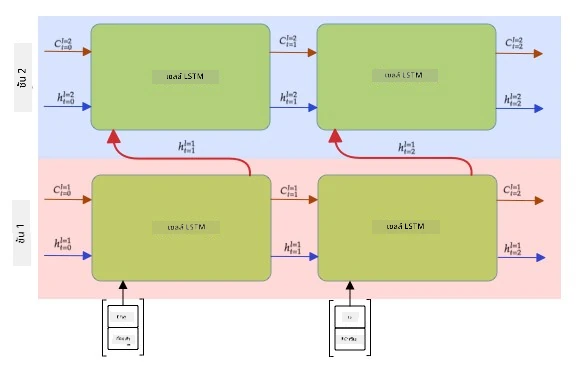

# เครือข่ายประสาทแบบวนซ้ำ

## [แบบทดสอบก่อนเรียน](https://ff-quizzes.netlify.app/en/ai/quiz/31)

ในส่วนก่อนหน้านี้ เราได้ใช้การแสดงผลเชิงความหมายที่หลากหลายของข้อความและตัวจำแนกเชิงเส้นแบบง่ายบน embeddings สิ่งที่สถาปัตยกรรมนี้ทำคือการจับความหมายรวมของคำในประโยค แต่ไม่ได้คำนึงถึง **ลำดับ** ของคำ เนื่องจากการดำเนินการรวมบน embeddings ได้ลบข้อมูลนี้ออกจากข้อความต้นฉบับ เนื่องจากโมเดลเหล่านี้ไม่สามารถจำลองลำดับของคำได้ จึงไม่สามารถแก้ปัญหาที่ซับซ้อนหรือคลุมเครือ เช่น การสร้างข้อความหรือการตอบคำถามได้

เพื่อจับความหมายของลำดับข้อความ เราจำเป็นต้องใช้สถาปัตยกรรมเครือข่ายประสาทอีกแบบหนึ่ง ซึ่งเรียกว่า **เครือข่ายประสาทแบบวนซ้ำ** หรือ RNN ใน RNN เราจะส่งประโยคผ่านเครือข่ายทีละสัญลักษณ์ และเครือข่ายจะสร้าง **สถานะ** ซึ่งเราจะส่งกลับเข้าเครือข่ายพร้อมกับสัญลักษณ์ถัดไป

> ภาพโดยผู้เขียน

เมื่อได้รับลำดับของโทเค็น X0,...,Xn RNN จะสร้างลำดับของบล็อกเครือข่ายประสาท และฝึกฝนลำดับนี้แบบ end-to-end โดยใช้ backpropagation แต่ละบล็อกเครือข่ายจะรับคู่ (Xi,Si) เป็นอินพุต และสร้าง Si+1 เป็นผลลัพธ์ สถานะสุดท้าย Sn หรือ (ผลลัพธ์ Yn) จะถูกส่งไปยังตัวจำแนกเชิงเส้นเพื่อสร้างผลลัพธ์ บล็อกเครือข่ายทั้งหมดใช้ weights เดียวกัน และถูกฝึกแบบ end-to-end โดยใช้การผ่าน backpropagation ครั้งเดียว

เนื่องจากเวกเตอร์สถานะ S0,...,Sn ถูกส่งผ่านเครือข่าย เครือข่ายจึงสามารถเรียนรู้ความสัมพันธ์เชิงลำดับระหว่างคำได้ ตัวอย่างเช่น เมื่อคำว่า *not* ปรากฏที่ใดที่หนึ่งในลำดับ เครือข่ายสามารถเรียนรู้ที่จะปฏิเสธองค์ประกอบบางอย่างในเวกเตอร์สถานะ ส่งผลให้เกิดการปฏิเสธ

> ✅ เนื่องจาก weights ของบล็อก RNN ทั้งหมดในภาพด้านบนถูกแชร์ ภาพเดียวกันสามารถแสดงเป็นบล็อกเดียว (ทางด้านขวา) พร้อมกับวงวนย้อนกลับ ซึ่งส่งสถานะผลลัพธ์ของเครือข่ายกลับไปยังอินพุต

## โครงสร้างของเซลล์ RNN

มาดูกันว่าเซลล์ RNN แบบง่ายมีการจัดระเบียบอย่างไร มันรับสถานะก่อนหน้า Si-1 และสัญลักษณ์ปัจจุบัน Xi เป็นอินพุต และต้องสร้างสถานะผลลัพธ์ Si (และบางครั้งเราสนใจผลลัพธ์อื่น Yi เช่นในกรณีของเครือข่าย generative)

เซลล์ RNN แบบง่ายมีเมทริกซ์ weights สองตัวภายใน: ตัวหนึ่งแปลงสัญลักษณ์อินพุต (เรียกว่า W) และอีกตัวหนึ่งแปลงสถานะอินพุต (H) ในกรณีนี้ ผลลัพธ์ของเครือข่ายจะถูกคำนวณเป็น &sigma;(W&times;Xi+H&times;Si-1+b) โดยที่ &sigma; คือฟังก์ชันการกระตุ้น และ b คือ bias เพิ่มเติม

> ภาพโดยผู้เขียน

ในหลายกรณี โทเค็นอินพุตจะถูกส่งผ่านเลเยอร์ embedding ก่อนเข้าสู่ RNN เพื่อลดมิติ ในกรณีนี้ หากมิติของเวกเตอร์อินพุตคือ *emb_size* และเวกเตอร์สถานะคือ *hid_size* - ขนาดของ W คือ *emb_size*&times;*hid_size* และขนาดของ H คือ *hid_size*&times;*hid_size*

## หน่วยความจำระยะยาวและระยะสั้น (LSTM)

หนึ่งในปัญหาหลักของ RNN แบบคลาสสิกคือปัญหา **vanishing gradients** เนื่องจาก RNN ถูกฝึกแบบ end-to-end ในการผ่าน backpropagation ครั้งเดียว มันจึงมีความยากลำบากในการส่งผ่านข้อผิดพลาดไปยังเลเยอร์แรกของเครือข่าย และทำให้เครือข่ายไม่สามารถเรียนรู้ความสัมพันธ์ระหว่างโทเค็นที่อยู่ห่างกันได้ วิธีหนึ่งในการหลีกเลี่ยงปัญหานี้คือการแนะนำ **การจัดการสถานะอย่างชัดเจน** โดยใช้สิ่งที่เรียกว่า **gates** มีสถาปัตยกรรมที่เป็นที่รู้จักสองแบบในลักษณะนี้: **Long Short Term Memory** (LSTM) และ **Gated Relay Unit** (GRU)

> แหล่งที่มาของภาพ TBD

เครือข่าย LSTM ถูกจัดระเบียบในลักษณะคล้ายกับ RNN แต่มีสองสถานะที่ถูกส่งผ่านจากเลเยอร์หนึ่งไปยังอีกเลเยอร์หนึ่ง: สถานะจริง C และเวกเตอร์ซ่อน H ในแต่ละหน่วย เวกเตอร์ซ่อน Hi จะถูกเชื่อมต่อกับอินพุต Xi และพวกมันควบคุมสิ่งที่เกิดขึ้นกับสถานะ C ผ่าน **gates** แต่ละ gate เป็นเครือข่ายประสาทที่มีการกระตุ้นแบบ sigmoid (ผลลัพธ์ในช่วง [0,1]) ซึ่งสามารถคิดได้ว่าเป็นหน้ากากบิตเมื่อคูณกับเวกเตอร์สถานะ มี gates ดังต่อไปนี้ (จากซ้ายไปขวาในภาพด้านบน):

* **forget gate** รับเวกเตอร์ซ่อนและกำหนดว่าคอมโพเนนต์ใดของเวกเตอร์ C ที่เราต้องลืม และคอมโพเนนต์ใดที่ต้องส่งผ่าน
* **input gate** รับข้อมูลบางส่วนจากอินพุตและเวกเตอร์ซ่อน และแทรกข้อมูลนั้นลงในสถานะ
* **output gate** แปลงสถานะผ่านเลเยอร์เชิงเส้นที่มีการกระตุ้นแบบ *tanh* จากนั้นเลือกคอมโพเนนต์บางส่วนโดยใช้เวกเตอร์ซ่อน Hi เพื่อสร้างสถานะใหม่ Ci+1

คอมโพเนนต์ของสถานะ C สามารถคิดได้ว่าเป็นธงบางอย่างที่สามารถเปิดและปิดได้ ตัวอย่างเช่น เมื่อเราพบชื่อ *Alice* ในลำดับ เราอาจต้องการสมมติว่ามันหมายถึงตัวละครหญิง และยกธงในสถานะว่าเรามีคำนามหญิงในประโยค เมื่อเราพบวลี *and Tom* ต่อไป เราจะยกธงว่ามีคำนามพหูพจน์ ดังนั้นโดยการจัดการสถานะ เราสามารถติดตามคุณสมบัติทางไวยากรณ์ของส่วนต่าง ๆ ของประโยคได้

> ✅ แหล่งข้อมูลที่ยอดเยี่ยมสำหรับการทำความเข้าใจภายในของ LSTM คือบทความที่ยอดเยี่ยมนี้ [Understanding LSTM Networks](https://colah.github.io/posts/2015-08-Understanding-LSTMs/) โดย Christopher Olah

## RNN แบบสองทิศทางและหลายเลเยอร์

เราได้พูดถึงเครือข่ายแบบวนซ้ำที่ทำงานในทิศทางเดียว จากจุดเริ่มต้นของลำดับไปยังจุดสิ้นสุด ซึ่งดูเป็นธรรมชาติ เพราะมันคล้ายกับวิธีที่เราอ่านและฟังคำพูด อย่างไรก็ตาม เนื่องจากในหลายกรณีที่ใช้งานจริง เราสามารถเข้าถึงลำดับอินพุตแบบสุ่มได้ อาจมีเหตุผลที่จะดำเนินการคำนวณแบบวนซ้ำในทั้งสองทิศทาง เครือข่ายดังกล่าวเรียกว่า **RNN แบบสองทิศทาง** เมื่อจัดการกับเครือข่ายแบบสองทิศทาง เราจะต้องมีเวกเตอร์สถานะซ่อนสองตัว หนึ่งตัวสำหรับแต่ละทิศทาง

เครือข่ายแบบวนซ้ำ ไม่ว่าจะเป็นแบบทิศทางเดียวหรือสองทิศทาง จะจับรูปแบบบางอย่างภายในลำดับ และสามารถเก็บรูปแบบเหล่านั้นไว้ในเวกเตอร์สถานะหรือส่งผ่านไปยังผลลัพธ์ เช่นเดียวกับเครือข่ายแบบ convolutional เราสามารถสร้างเลเยอร์แบบวนซ้ำอีกเลเยอร์หนึ่งบนเลเยอร์แรกเพื่อจับรูปแบบระดับสูงและสร้างจากรูปแบบระดับต่ำที่ถูกดึงออกโดยเลเยอร์แรก สิ่งนี้นำเราไปสู่แนวคิดของ **RNN หลายเลเยอร์** ซึ่งประกอบด้วยเครือข่ายแบบวนซ้ำสองหรือมากกว่า โดยที่ผลลัพธ์ของเลเยอร์ก่อนหน้าจะถูกส่งไปยังเลเยอร์ถัดไปเป็นอินพุต

*ภาพจาก [โพสต์ที่ยอดเยี่ยมนี้](https://towardsdatascience.com/from-a-lstm-cell-to-a-multilayer-lstm-network-with-pytorch-2899eb5696f3) โดย Fernando López*

## ✍️ แบบฝึกหัด: Embeddings

เรียนรู้เพิ่มเติมในโน้ตบุ๊กต่อไปนี้:

* [RNNs กับ PyTorch](RNNPyTorch.ipynb)
* [RNNs กับ TensorFlow](RNNTF.ipynb)

## สรุป

ในหน่วยนี้ เราได้เห็นว่า RNN สามารถใช้สำหรับการจัดประเภทลำดับได้ แต่ในความเป็นจริง มันสามารถจัดการงานอื่น ๆ ได้อีกมากมาย เช่น การสร้างข้อความ การแปลภาษา และอื่น ๆ เราจะพิจารณางานเหล่านั้นในหน่วยถัดไป

## 🚀 ความท้าทาย

อ่านวรรณกรรมเกี่ยวกับ LSTM และพิจารณาการใช้งาน:

- [Grid Long Short-Term Memory](https://arxiv.org/pdf/1507.01526v1.pdf)
- [Show, Attend and Tell: Neural Image Caption
Generation with Visual Attention](https://arxiv.org/pdf/1502.03044v2.pdf)

## [แบบทดสอบหลังเรียน](https://ff-quizzes.netlify.app/en/ai/quiz/32)

## ทบทวนและศึกษาด้วยตนเอง

- [Understanding LSTM Networks](https://colah.github.io/posts/2015-08-Understanding-LSTMs/) โดย Christopher Olah

## [งานที่ได้รับมอบหมาย: โน้ตบุ๊ก](assignment.md)

---

