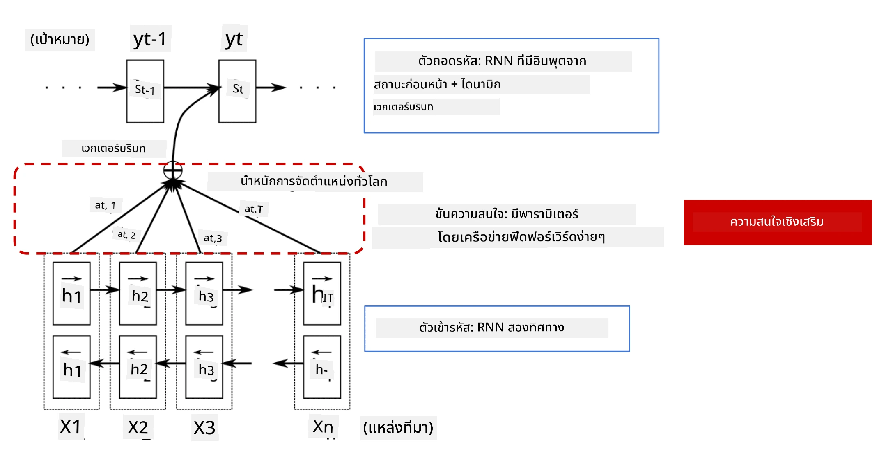
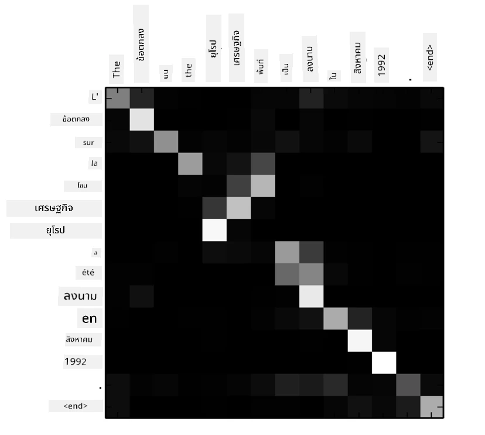
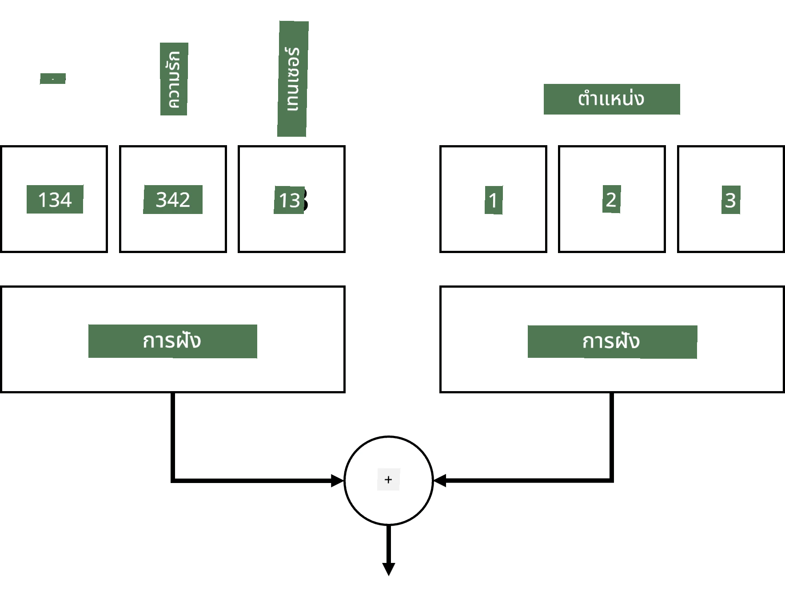
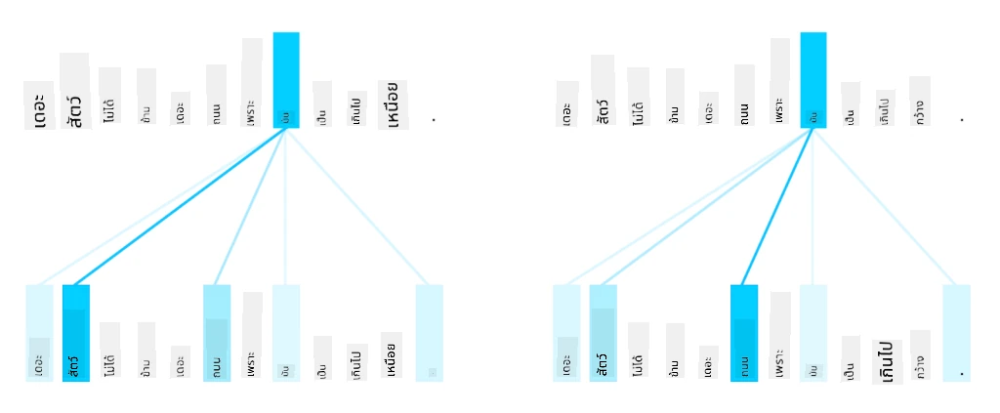
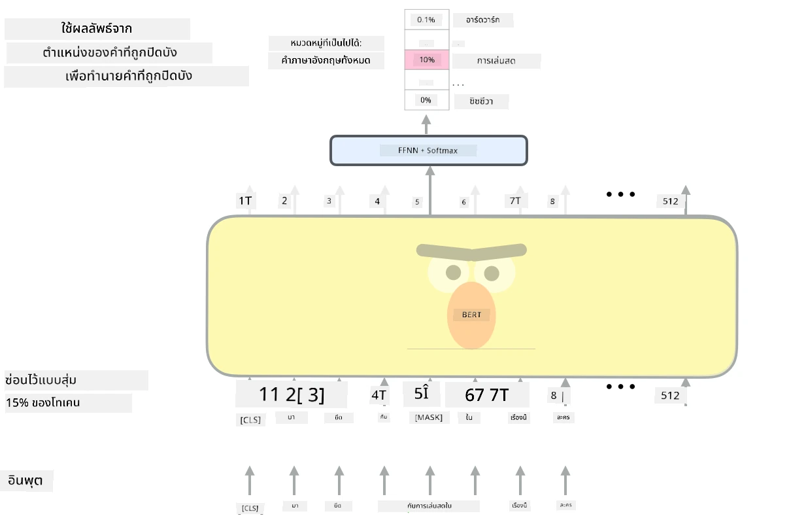

# กลไก Attention และ Transformers

## [แบบทดสอบก่อนเรียน](https://ff-quizzes.netlify.app/en/ai/quiz/35)

หนึ่งในปัญหาที่สำคัญที่สุดในด้าน NLP คือ **การแปลภาษาโดยเครื่อง** ซึ่งเป็นงานสำคัญที่อยู่เบื้องหลังเครื่องมืออย่าง Google Translate ในส่วนนี้ เราจะมุ่งเน้นไปที่การแปลภาษาโดยเครื่อง หรือในภาพรวมกว้างๆ คือ งาน *sequence-to-sequence* (ซึ่งเรียกอีกอย่างว่า **sentence transduction**)

ด้วย RNNs งาน sequence-to-sequence ถูกดำเนินการโดยเครือข่าย recurrent สองตัว โดยเครือข่ายหนึ่งคือ **encoder** ที่บีบอัดลำดับข้อมูลเข้าไปเป็น hidden state ในขณะที่อีกเครือข่ายหนึ่งคือ **decoder** ที่คลาย hidden state ออกมาเป็นผลลัพธ์ที่แปลแล้ว อย่างไรก็ตาม วิธีนี้มีปัญหาบางประการ:

* สถานะสุดท้ายของเครือข่าย encoder มีความยากลำบากในการจดจำจุดเริ่มต้นของประโยค ซึ่งส่งผลให้คุณภาพของโมเดลลดลงสำหรับประโยคที่ยาว
* คำทุกคำในลำดับมีผลกระทบต่อผลลัพธ์เท่ากัน ในความเป็นจริง คำบางคำในลำดับข้อมูลเข้าอาจมีผลกระทบต่อผลลัพธ์มากกว่าคำอื่นๆ

**กลไก Attention** ให้วิธีการในการถ่วงน้ำหนักผลกระทบเชิงบริบทของแต่ละเวกเตอร์ข้อมูลเข้าในแต่ละการทำนายผลลัพธ์ของ RNN วิธีการนี้ถูกดำเนินการโดยการสร้างทางลัดระหว่างสถานะกลางของ RNN ข้อมูลเข้าและ RNN ข้อมูลออก ด้วยวิธีนี้ เมื่อสร้างสัญลักษณ์ผลลัพธ์ yt เราจะพิจารณาสถานะ hidden ทั้งหมด hi ของข้อมูลเข้า โดยมีค่าสัมประสิทธิ์น้ำหนักที่แตกต่างกัน &alpha;t,i

> โมเดล encoder-decoder พร้อมกลไก attention แบบ additive ใน [Bahdanau et al., 2015](https://arxiv.org/pdf/1409.0473.pdf) อ้างอิงจาก [บล็อกโพสต์นี้](https://lilianweng.github.io/lil-log/2018/06/24/attention-attention.html)

เมทริกซ์ attention {&alpha;i,j} จะเป็นตัวแทนระดับที่คำบางคำในข้อมูลเข้ามีบทบาทในการสร้างคำที่กำหนดในลำดับผลลัพธ์ ด้านล่างเป็นตัวอย่างของเมทริกซ์ดังกล่าว:

> ภาพจาก [Bahdanau et al., 2015](https://arxiv.org/pdf/1409.0473.pdf) (Fig.3)

กลไก Attention มีบทบาทสำคัญในสถานะปัจจุบันหรือใกล้เคียงสถานะปัจจุบันของ NLP อย่างไรก็ตาม การเพิ่ม Attention ทำให้จำนวนพารามิเตอร์ของโมเดลเพิ่มขึ้นอย่างมาก ซึ่งนำไปสู่ปัญหาการปรับขนาดกับ RNNs ข้อจำกัดสำคัญของการปรับขนาด RNNs คือธรรมชาติของการทำงานแบบ recurrent ทำให้ยากต่อการ batch และ parallelize การฝึก ใน RNN แต่ละองค์ประกอบของลำดับต้องถูกประมวลผลตามลำดับ ซึ่งหมายความว่าไม่สามารถ parallelize ได้ง่าย

> ภาพจาก [บล็อกของ Google](https://research.googleblog.com/2016/09/a-neural-network-for-machine.html)

การนำกลไก Attention มาใช้ร่วมกับข้อจำกัดนี้นำไปสู่การสร้างโมเดล Transformer ซึ่งเป็นสถานะปัจจุบันของเทคโนโลยี เช่น BERT และ Open-GPT3 ที่เราใช้ในปัจจุบัน

## โมเดล Transformer

หนึ่งในแนวคิดหลักของ Transformers คือการหลีกเลี่ยงธรรมชาติการทำงานแบบลำดับของ RNNs และสร้างโมเดลที่สามารถ parallelize ได้ในระหว่างการฝึก สิ่งนี้ทำได้โดยการนำแนวคิดสองอย่างมาใช้:

* positional encoding
* การใช้กลไก self-attention เพื่อจับรูปแบบแทน RNNs (หรือ CNNs) (นั่นคือเหตุผลที่งานวิจัยที่แนะนำ Transformers มีชื่อว่า *[Attention is all you need](https://arxiv.org/abs/1706.03762)*)

### Positional Encoding/Embedding

แนวคิดของ positional encoding มีดังนี้:
1. เมื่อใช้ RNNs ตำแหน่งสัมพัทธ์ของ tokens ถูกแทนด้วยจำนวนขั้นตอน ดังนั้นจึงไม่จำเป็นต้องแสดงออกมาอย่างชัดเจน
2. อย่างไรก็ตาม เมื่อเราเปลี่ยนไปใช้ Attention เราจำเป็นต้องทราบตำแหน่งสัมพัทธ์ของ tokens ในลำดับ
3. เพื่อให้ได้ positional encoding เราเพิ่มลำดับ tokens ด้วยลำดับตำแหน่งของ tokens ในลำดับ (เช่น ลำดับตัวเลข 0,1,...)
4. จากนั้นเราผสมตำแหน่ง token กับเวกเตอร์ embedding ของ token เพื่อแปลงตำแหน่ง (จำนวนเต็ม) เป็นเวกเตอร์ เราสามารถใช้วิธีการต่างๆ:

* embedding ที่สามารถฝึกได้ คล้ายกับ embedding ของ token นี่คือวิธีที่เราพิจารณาในที่นี้ เราใช้ชั้น embedding กับทั้ง tokens และตำแหน่งของพวกมัน ซึ่งส่งผลให้ได้เวกเตอร์ embedding ที่มีมิติเดียวกัน จากนั้นเราจึงนำมาบวกกัน
* ฟังก์ชัน encoding ตำแหน่งแบบคงที่ ตามที่เสนอในงานวิจัยต้นฉบับ

> ภาพโดยผู้เขียน

ผลลัพธ์ที่เราได้จาก positional embedding จะฝังทั้ง token ดั้งเดิมและตำแหน่งของมันในลำดับ

### Multi-Head Self-Attention

ต่อไป เราจำเป็นต้องจับรูปแบบบางอย่างในลำดับของเรา เพื่อทำสิ่งนี้ Transformers ใช้กลไก **self-attention** ซึ่งเป็น Attention ที่นำไปใช้กับลำดับเดียวกันทั้งข้อมูลเข้าและข้อมูลออก การใช้ self-attention ช่วยให้เราพิจารณา **บริบท** ภายในประโยค และดูว่าคำใดมีความสัมพันธ์กัน ตัวอย่างเช่น มันช่วยให้เราเห็นว่าคำใดถูกอ้างถึงโดยคำสรรพนาม เช่น *it* และยังพิจารณาบริบทด้วย:

> ภาพจาก [บล็อกของ Google](https://research.googleblog.com/2017/08/transformer-novel-neural-network.html)

ใน Transformers เราใช้ **Multi-Head Attention** เพื่อให้เครือข่ายมีพลังในการจับความสัมพันธ์หลายประเภท เช่น ความสัมพันธ์ระยะยาวกับระยะสั้น ความสัมพันธ์แบบ co-reference กับอย่างอื่น เป็นต้น

[TensorFlow Notebook](TransformersTF.ipynb) มีรายละเอียดเพิ่มเติมเกี่ยวกับการดำเนินการของชั้น Transformer

### Encoder-Decoder Attention

ใน Transformers กลไก Attention ถูกใช้ในสองที่:

* เพื่อจับรูปแบบภายในข้อความข้อมูลเข้าโดยใช้ self-attention
* เพื่อดำเนินการแปลลำดับ - ซึ่งเป็นชั้น Attention ระหว่าง encoder และ decoder

Encoder-decoder attention มีความคล้ายคลึงกับกลไก Attention ที่ใช้ใน RNNs ตามที่อธิบายในตอนต้นของส่วนนี้ แผนภาพแบบเคลื่อนไหวนี้อธิบายบทบาทของ encoder-decoder attention

เนื่องจากตำแหน่งข้อมูลเข้าแต่ละตำแหน่งถูกแมปอย่างอิสระไปยังตำแหน่งข้อมูลออกแต่ละตำแหน่ง Transformers สามารถ parallelize ได้ดีกว่า RNNs ซึ่งช่วยให้สร้างโมเดลภาษาที่ใหญ่ขึ้นและแสดงออกได้มากขึ้น หัว Attention แต่ละหัวสามารถใช้เพื่อเรียนรู้ความสัมพันธ์ระหว่างคำที่แตกต่างกัน ซึ่งช่วยปรับปรุงงานประมวลผลภาษาธรรมชาติในขั้นตอนต่อไป

## BERT

**BERT** (Bidirectional Encoder Representations from Transformers) เป็นเครือข่าย Transformer ขนาดใหญ่มากที่มีหลายชั้น โดยมี 12 ชั้นสำหรับ *BERT-base* และ 24 ชั้นสำหรับ *BERT-large* โมเดลนี้ถูกฝึกเบื้องต้นด้วยชุดข้อมูลข้อความขนาดใหญ่ (WikiPedia + หนังสือ) โดยใช้การฝึกแบบไม่ต้องมีการกำกับดูแล (การทำนายคำที่ถูกปิดบังในประโยค) ในระหว่างการฝึกเบื้องต้น โมเดลจะดูดซับความเข้าใจภาษาระดับสูง ซึ่งสามารถนำไปใช้กับชุดข้อมูลอื่นๆ ผ่านการปรับแต่งเพิ่มเติม กระบวนการนี้เรียกว่า **transfer learning**

> ภาพ [แหล่งที่มา](http://jalammar.github.io/illustrated-bert/)

## ✍️ แบบฝึกหัด: Transformers

เรียนรู้เพิ่มเติมในโน้ตบุ๊กต่อไปนี้:

* [Transformers ใน PyTorch](TransformersPyTorch.ipynb)
* [Transformers ใน TensorFlow](TransformersTF.ipynb)

## สรุป

ในบทเรียนนี้คุณได้เรียนรู้เกี่ยวกับ Transformers และกลไก Attention ซึ่งเป็นเครื่องมือสำคัญในชุดเครื่องมือ NLP มีสถาปัตยกรรม Transformer หลากหลายรูปแบบ เช่น BERT, DistilBERT, BigBird, OpenGPT3 และอื่นๆ ที่สามารถปรับแต่งได้ [แพ็กเกจ HuggingFace](https://github.com/huggingface/) มีที่เก็บสำหรับการฝึกสถาปัตยกรรมเหล่านี้หลายแบบด้วย PyTorch และ TensorFlow

## 🚀 ความท้าทาย

## [แบบทดสอบหลังเรียน](https://ff-quizzes.netlify.app/en/ai/quiz/36)

## การทบทวนและการศึกษาด้วยตนเอง

* [บล็อกโพสต์](https://mchromiak.github.io/articles/2017/Sep/12/Transformer-Attention-is-all-you-need/) อธิบายงานวิจัยคลาสสิก [Attention is all you need](https://arxiv.org/abs/1706.03762) เกี่ยวกับ Transformers
* [ชุดบล็อกโพสต์](https://towardsdatascience.com/transformers-explained-visually-part-1-overview-of-functionality-95a6dd460452) เกี่ยวกับ Transformers อธิบายสถาปัตยกรรมอย่างละเอียด

## [งานที่ได้รับมอบหมาย](assignment.md)

---

