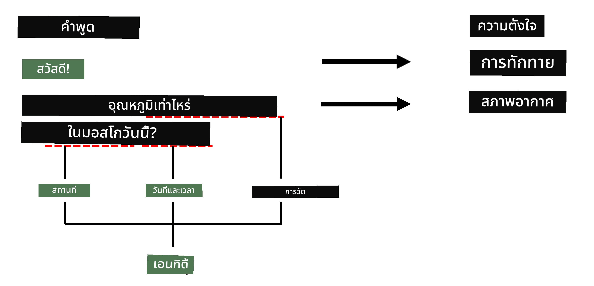
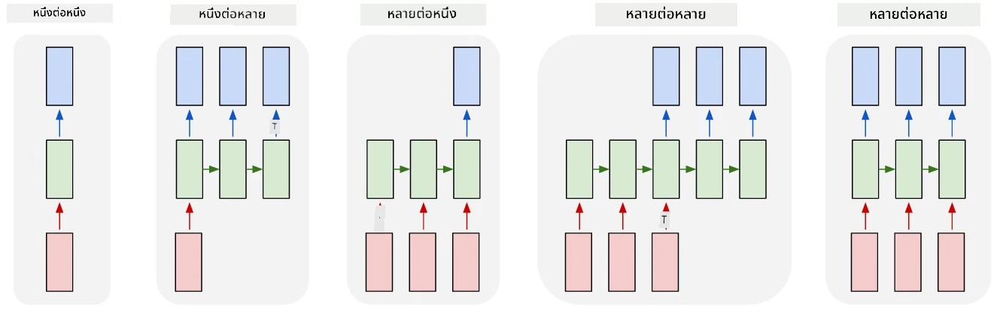

# การรู้จำชื่อเอนทิตี

จนถึงตอนนี้ เราได้มุ่งเน้นไปที่งาน NLP อย่างหนึ่งเป็นหลัก นั่นคือการจัดประเภท อย่างไรก็ตาม ยังมีงาน NLP อื่นๆ ที่สามารถทำได้ด้วยเครือข่ายประสาทเทียม หนึ่งในงานเหล่านั้นคือ **[การรู้จำชื่อเอนทิตี](https://wikipedia.org/wiki/Named-entity_recognition)** (NER) ซึ่งเกี่ยวข้องกับการระบุเอนทิตีเฉพาะในข้อความ เช่น สถานที่ ชื่อบุคคล ช่วงเวลา สูตรเคมี และอื่นๆ

## [แบบทดสอบก่อนเรียน](https://ff-quizzes.netlify.app/en/ai/quiz/37)

## ตัวอย่างการใช้ NER

สมมติว่าคุณต้องการพัฒนาช่องสนทนาภาษาธรรมชาติ เช่น Amazon Alexa หรือ Google Assistant วิธีการทำงานของช่องสนทนาอัจฉริยะคือการ *เข้าใจ* สิ่งที่ผู้ใช้ต้องการโดยการจัดประเภทข้อความในประโยคที่ป้อน ผลลัพธ์ของการจัดประเภทนี้เรียกว่า **เจตนา** ซึ่งกำหนดสิ่งที่ช่องสนทนาควรทำ

> ภาพโดยผู้เขียน

อย่างไรก็ตาม ผู้ใช้อาจให้พารามิเตอร์บางอย่างเป็นส่วนหนึ่งของวลี ตัวอย่างเช่น เมื่อถามเกี่ยวกับสภาพอากาศ ผู้ใช้อาจระบุสถานที่หรือวันที่ ช่องสนทนาควรสามารถเข้าใจเอนทิตีเหล่านั้น และเติมช่องพารามิเตอร์ให้ถูกต้องก่อนดำเนินการ นี่คือจุดที่ NER เข้ามามีบทบาท

> ✅ อีกตัวอย่างหนึ่งคือ [การวิเคราะห์เอกสารทางการแพทย์เชิงวิทยาศาสตร์](https://soshnikov.com/science/analyzing-medical-papers-with-azure-and-text-analytics-for-health/) สิ่งสำคัญที่เราต้องค้นหาคือคำศัพท์ทางการแพทย์เฉพาะ เช่น โรคและสารทางการแพทย์ แม้ว่าโรคจำนวนเล็กน้อยอาจถูกดึงออกมาโดยการค้นหาส่วนย่อยของข้อความ แต่เอนทิตีที่ซับซ้อนมากขึ้น เช่น สารประกอบเคมีและชื่อยาต้องการวิธีการที่ซับซ้อนกว่า

## NER ในฐานะการจัดประเภทโทเค็น

โมเดล NER โดยพื้นฐานแล้วคือ **โมเดลการจัดประเภทโทเค็น** เพราะสำหรับแต่ละโทเค็นที่ป้อนเข้ามา เราต้องตัดสินใจว่าโทเค็นนั้นเป็นส่วนหนึ่งของเอนทิตีหรือไม่ และถ้าใช่ - เป็นเอนทิตีประเภทใด

ลองพิจารณาชื่อเอกสารต่อไปนี้:

**Tricuspid valve regurgitation** และ **lithium carbonate** **toxicity** ในทารกแรกเกิด

เอนทิตีในที่นี้คือ:

* Tricuspid valve regurgitation เป็นโรค (`DIS`)
* Lithium carbonate เป็นสารเคมี (`CHEM`)
* Toxicity ก็เป็นโรค (`DIS`)

สังเกตว่าเอนทิตีหนึ่งสามารถครอบคลุมหลายโทเค็น และในกรณีนี้ เราต้องแยกแยะระหว่างเอนทิตีสองตัวที่ต่อเนื่องกัน ดังนั้นจึงเป็นเรื่องปกติที่จะใช้สองคลาสสำหรับแต่ละเอนทิตี - หนึ่งคลาสระบุโทเค็นแรกของเอนทิตี (มักใช้คำนำหน้า `B-` สำหรับ **b**eginning) และอีกคลาสสำหรับโทเค็นที่ต่อเนื่องของเอนทิตี (`I-` สำหรับ **i**nner token) เราใช้ `O` เป็นคลาสเพื่อแทนโทเค็นอื่นๆ ทั้งหมด (**o**ther tokens) การแท็กโทเค็นแบบนี้เรียกว่า [BIO tagging](https://en.wikipedia.org/wiki/Inside%E2%80%93outside%E2%80%93beginning_(tagging)) (หรือ IOB) เมื่อแท็กแล้ว ชื่อเอกสารของเราจะมีลักษณะดังนี้:

Token | Tag
------|-----
Tricuspid | B-DIS
valve | I-DIS
regurgitation | I-DIS
and | O
lithium | B-CHEM
carbonate | I-CHEM
toxicity | B-DIS
in | O
a | O
newborn | O
infant | O
. | O

เนื่องจากเราต้องสร้างความสัมพันธ์แบบหนึ่งต่อหนึ่งระหว่างโทเค็นและคลาส เราสามารถฝึกโมเดลเครือข่ายประสาทเทียมแบบ **many-to-many** ที่เหมาะสมจากภาพนี้:

> *ภาพจาก [บล็อกโพสต์นี้](http://karpathy.github.io/2015/05/21/rnn-effectiveness/) โดย [Andrej Karpathy](http://karpathy.github.io/) โมเดลการจัดประเภทโทเค็น NER สอดคล้องกับสถาปัตยกรรมเครือข่ายที่อยู่ทางขวาสุดในภาพนี้*

## การฝึกโมเดล NER

เนื่องจากโมเดล NER โดยพื้นฐานแล้วคือโมเดลการจัดประเภทโทเค็น เราสามารถใช้ RNN ที่เราเคยเรียนรู้มาแล้วสำหรับงานนี้ ในกรณีนี้ แต่ละบล็อกของเครือข่าย recurrent จะคืนค่า ID ของโทเค็น ตัวอย่างโน้ตบุ๊กต่อไปนี้แสดงวิธีการฝึก LSTM สำหรับการจัดประเภทโทเค็น

## ✍️ ตัวอย่างโน้ตบุ๊ก: NER

เรียนรู้เพิ่มเติมในโน้ตบุ๊กต่อไปนี้:

* [NER ด้วย TensorFlow](NER-TF.ipynb)

## สรุป

โมเดล NER คือ **โมเดลการจัดประเภทโทเค็น** ซึ่งหมายความว่าสามารถใช้เพื่อทำการจัดประเภทโทเค็นได้ นี่เป็นงานที่พบได้บ่อยใน NLP ซึ่งช่วยในการระบุเอนทิตีเฉพาะในข้อความ เช่น สถานที่ ชื่อ วันที่ และอื่นๆ

## 🚀 ความท้าทาย

ทำแบบฝึกหัดที่ลิงก์ด้านล่างเพื่อฝึกโมเดลการรู้จำชื่อเอนทิตีสำหรับคำศัพท์ทางการแพทย์ จากนั้นลองใช้กับชุดข้อมูลอื่น

## [แบบทดสอบหลังเรียน](https://ff-quizzes.netlify.app/en/ai/quiz/38)

## ทบทวนและศึกษาด้วยตนเอง

อ่านบล็อก [The Unreasonable Effectiveness of Recurrent Neural Networks](http://karpathy.github.io/2015/05/21/rnn-effectiveness/) และติดตามส่วน Further Reading ในบทความนั้นเพื่อเพิ่มพูนความรู้ของคุณ

## [แบบฝึกหัด](lab/README.md)

ในแบบฝึกหัดสำหรับบทเรียนนี้ คุณจะต้องฝึกโมเดลการรู้จำเอนทิตีทางการแพทย์ คุณสามารถเริ่มต้นด้วยการฝึกโมเดล LSTM ตามที่อธิบายไว้ในบทเรียนนี้ และดำเนินการต่อด้วยการใช้โมเดล BERT transformer อ่าน [คำแนะนำ](lab/README.md) เพื่อดูรายละเอียดทั้งหมด

---

