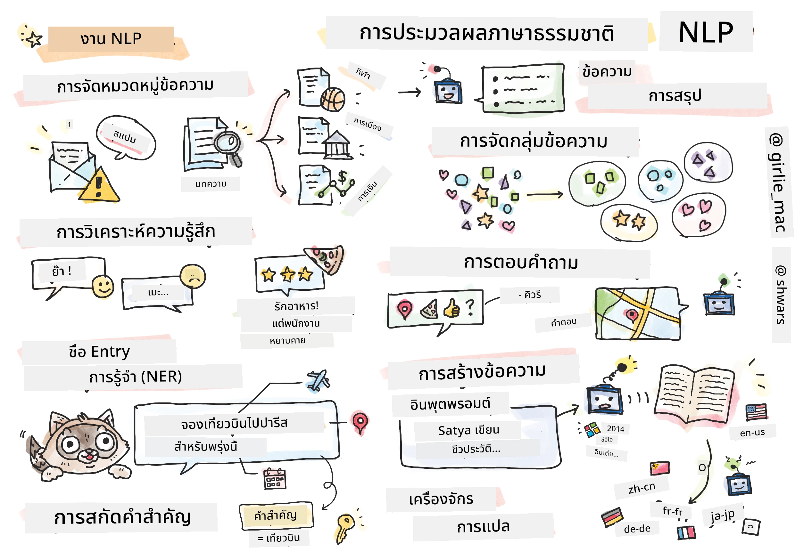

# การประมวลผลภาษาธรรมชาติ



ในส่วนนี้ เราจะเน้นการใช้โครงข่ายประสาทเทียมเพื่อจัดการกับงานที่เกี่ยวข้องกับ **การประมวลผลภาษาธรรมชาติ (NLP)** มีปัญหา NLP มากมายที่เราต้องการให้คอมพิวเตอร์สามารถแก้ไขได้:

* **การจัดหมวดหมู่ข้อความ** เป็นปัญหาการจัดหมวดหมู่ทั่วไปที่เกี่ยวข้องกับลำดับข้อความ ตัวอย่างเช่น การจัดอีเมลเป็นสแปมหรือไม่ใช่สแปม หรือจัดหมวดหมู่บทความเป็นกีฬา ธุรกิจ การเมือง ฯลฯ นอกจากนี้ เมื่อพัฒนาแชทบอท เรามักจะต้องเข้าใจว่าสิ่งที่ผู้ใช้ต้องการจะสื่อคืออะไร — ในกรณีนี้เรากำลังจัดการกับ **การจัดหมวดหมู่เจตนา** บ่อยครั้งในการจัดหมวดหมู่เจตนา เราต้องจัดการกับหลายหมวดหมู่
* **การวิเคราะห์ความรู้สึก** เป็นปัญหาการถดถอยทั่วไป ที่เราต้องกำหนดตัวเลข (ความรู้สึก) ที่สอดคล้องกับว่าประโยคนั้นมีความหมายเชิงบวกหรือลบมากน้อยเพียงใด เวอร์ชันขั้นสูงของการวิเคราะห์ความรู้สึกคือ **การวิเคราะห์ความรู้สึกตามแง่มุม** (ABSA) ที่เรากำหนดความรู้สึกไม่ใช่กับทั้งประโยค แต่ให้กับส่วนต่าง ๆ ของประโยค (แง่มุม) เช่น *ในร้านอาหารแห่งนี้ ฉันชอบอาหาร แต่บรรยากาศแย่มาก*
* **การจดจำเอนทิตีเฉพาะ** (NER) หมายถึงปัญหาการดึงเอนทิตีบางอย่างออกจากข้อความ เช่น เราอาจต้องเข้าใจว่าในวลี *ฉันต้องการบินไปปารีสวันพรุ่งนี้* คำว่า *วันพรุ่งนี้* หมายถึง DATE และ *ปารีส* คือ LOCATION  
* **การดึงคำสำคัญ** คล้ายกับ NER แต่เราต้องดึงคำที่สำคัญต่อความหมายของประโยคโดยอัตโนมัติโดยไม่ต้องผ่านการฝึกล่วงหน้าสำหรับประเภทเอนทิตีเฉพาะ
* **การจัดกลุ่มข้อความ** สามารถใช้ได้เมื่อต้องการจัดกลุ่มประโยคที่คล้ายคลึงกัน เช่น คำร้องขอที่คล้ายกันในบทสนทนาการสนับสนุนทางเทคนิค
* **การตอบคำถาม** หมายถึงความสามารถของแบบจำลองในการตอบคำถามเฉพาะ แบบจำลองจะได้รับข้อความและคำถามเป็นอินพุต และต้องให้ตำแหน่งในข้อความที่มีคำตอบของคำถามอยู่ (หรือบางครั้งอาจสร้างข้อความคำตอบ)
* **การสร้างข้อความ** คือความสามารถของแบบจำลองในการสร้างข้อความใหม่ สามารถมองได้ว่าเป็นงานการจัดหมวดหมู่ที่ทำนายตัวอักษร/คำถัดไปโดยอิงตาม *ข้อความตัวอย่าง* แบบจำลองการสร้างข้อความขั้นสูง เช่น GPT-3 สามารถแก้งาน NLP อื่นๆ เช่น การจัดหมวดหมู่โดยใช้เทคนิคที่เรียกว่า [prompt programming](https://towardsdatascience.com/software-3-0-how-prompting-will-change-the-rules-of-the-game-a982fbfe1e0) หรือ [prompt engineering](https://medium.com/swlh/openai-gpt-3-and-prompt-engineering-dcdc2c5fcd29)
* **การสรุปข้อความ** เป็นเทคนิคที่ต้องการให้คอมพิวเตอร์ "อ่าน" ข้อความยาวและสรุปให้อยู่ในไม่กี่ประโยค
* **การแปลภาษาเครื่อง** สามารถมองว่าเป็นการรวมการเข้าใจข้อความในภาษาหนึ่ง และการสร้างข้อความในอีกภาษาหนึ่งเข้าด้วยกัน

ในตอนแรก งาน NLP ส่วนใหญ่ถูกแก้โดยใช้วิธีดั้งเดิม เช่น ไวยากรณ์ ตัวอย่างเช่น ในการแปลภาษาใช้การวิเคราะห์ประโยคเพื่อแปลงประโยคเริ่มต้นเป็นต้นไม้ไวยากรณ์ จากนั้นดึงโครงสร้างความหมายระดับสูงเพื่อแทนความหมายของประโยค และอิงจากความหมายนั้นและไวยากรณ์ของภาษาเป้าหมายก็จะสร้างผลลัพธ์ ในปัจจุบัน งาน NLP จำนวนมากได้รับการแก้ไขอย่างมีประสิทธิภาพมากขึ้นด้วยโครงข่ายประสาทเทียม

> วิธี NLP แบบดั้งเดิมมากมายถูกใช้ในไลบรารี Python [Natural Language Processing Toolkit (NLTK)](https://www.nltk.org) มีหนังสือ [NLTK Book](https://www.nltk.org/book/) ที่ยอดเยี่ยมให้เรียนออนไลน์ซึ่งครอบคลุมวิธีแก้ปัญหา NLP ต่างๆ ด้วย NLTK

ในหลักสูตรนี้ เราจะมุ่งเน้นการใช้โครงข่ายประสาทเทียมสำหรับ NLP เป็นหลัก และจะใช้ NLTK เมื่อจำเป็น

เราได้เรียนรู้การใช้โครงข่ายประสาทเทียมสำหรับจัดการข้อมูลตารางและภาพแล้ว ความแตกต่างหลักระหว่างข้อมูลเหล่านั้นกับข้อความคือ ข้อความเป็นลำดับความยาวที่เปลี่ยนแปลงได้ ขณะที่ขนาดอินพุตของภาพเป็นค่าคงที่ล่วงหน้า ขณะที่โครงข่ายคอนโวลูชันสามารถดึงรูปแบบจากข้อมูลอินพุต รูปแบบในข้อความมีความซับซ้อนกว่า เช่น เราอาจมีการปฏิเสธซึ่งห่างจากประธานได้โดยไม่จำกัดจำนวนคำ (เช่น *ฉันไม่ชอบส้ม* เทียบกับ *ฉันไม่ชอบส้มใหญ่สีสันสดใสนั้น*) และควรถูกตีความเป็นรูปแบบเดียว ดังนั้น เพื่อจัดการกับภาษา เราต้องนำเสนอประเภทโครงข่ายประสาทเทียมใหม่ เช่น *เครือข่ายวนซ้ำ* และ *ทรานส์ฟอร์มเมอร์*

## การติดตั้งไลบรารี

หากคุณใช้ Python ติดตั้งในเครื่องเพื่อรันหลักสูตรนี้ คุณอาจต้องติดตั้งไลบรารีที่จำเป็นทั้งหมดสำหรับ NLP โดยใช้คำสั่งต่อไปนี้:

**สำหรับ PyTorch**
```bash
pip install -r requirements-pytorch.txt
```
**สำหรับ TensorFlow**
```bash
pip install -r requirements-tf.txt
```

> คุณสามารถทดลองใช้ NLP กับ TensorFlow ได้ที่ [Microsoft Learn](https://docs.microsoft.com/learn/modules/intro-natural-language-processing-tensorflow/?WT.mc_id=academic-77998-cacaste)

## คำเตือนเกี่ยวกับ GPU

ในส่วนนี้ ในบางตัวอย่างเราจะฝึกฝนแบบจำลองขนาดใหญ่มาก
* **ใช้คอมพิวเตอร์ที่รองรับ GPU**: แนะนำให้รันโน้ตบุ๊กของคุณบนคอมพิวเตอร์ที่มี GPU เพื่อช่วยลดเวลารอเมื่อทำงานกับแบบจำลองขนาดใหญ่
* **ข้อจำกัดหน่วยความจำ GPU**: การรันบน GPU อาจทำให้เกิดสถานการณ์ที่หน่วยความจำ GPU หมดโดยเฉพาะเมื่อฝึกแบบจำลองขนาดใหญ่
* **การใช้หน่วยความจำ GPU**: ปริมาณหน่วยความจำ GPU ที่ใช้ during การฝึกขึ้นอยู่กับหลายปัจจัย รวมถึงขนาดมินิบแซต
* **ลดขนาดมินิบแซต**: หากพบปัญหาหน่วยความจำ GPU ให้ลดขนาดมินิบแซตในโค้ดของคุณเป็นแนวทางแก้ไขที่เป็นไปได้
* **การปล่อยหน่วยความจำ GPU ของ TensorFlow**: เวอร์ชันเก่าของ TensorFlow อาจไม่ปล่อยหน่วยความจำ GPU อย่างถูกต้องเมื่อฝึกแบบจำลองหลายตัวในเคอร์เนล Python เดียว เพื่อจัดการการใช้หน่วยความจำ GPU อย่างมีประสิทธิภาพ คุณสามารถตั้งค่า TensorFlow ให้จัดสรรหน่วยความจำ GPU เมื่อจำเป็นเท่านั้น
* **การใส่โค้ด**: เพื่อกำหนดให้ TensorFlow เพิ่มการจัดสรรหน่วยความจำ GPU เมื่อจำเป็นเท่านั้น ให้ใส่โค้ดต่อไปนี้ในโน้ตบุ๊กของคุณ:

```python
physical_devices = tf.config.list_physical_devices('GPU') 
if len(physical_devices)>0:
    tf.config.experimental.set_memory_growth(physical_devices[0], True) 
```

หากคุณสนใจเรียนรู้เกี่ยวกับ NLP จากมุมมองคลาสสิกของ ML ให้ไปที่ [ชุดบทเรียนนี้](https://github.com/microsoft/ML-For-Beginners/tree/main/6-NLP)

## ในส่วนนี้
ในส่วนนี้เราจะเรียนรู้เกี่ยวกับ:

* [การแทนข้อความเป็นเทนเซอร์](13-TextRep/README.md)
* [การฝังคำ](14-Embeddings/README.md)
* [การทำแบบจำลองภาษา](15-LanguageModeling/README.md)
* [โครงข่ายประสาทเทียมวนซ้ำ](16-RNN/README.md)
* [โครงข่ายสร้างสรรค์](17-GenerativeNetworks/README.md)
* [ทรานส์ฟอร์มเมอร์](18-Transformers/README.md)

---

<!-- CO-OP TRANSLATOR DISCLAIMER START -->
**ปฏิเสธความรับผิดชอบ**:
เอกสารนี้ได้รับการแปลโดยใช้บริการแปลภาษา AI [Co-op Translator](https://github.com/Azure/co-op-translator) ขณะที่เราพยายามให้ความถูกต้อง โปรดทราบว่าการแปลโดยอัตโนมัติอาจมีข้อผิดพลาดหรือความไม่ถูกต้อง เอกสารต้นฉบับในภาษาต้นทางควรถูกพิจารณาเป็นแหล่งข้อมูลที่เชื่อถือได้ สำหรับข้อมูลที่สำคัญ แนะนำให้ใช้การแปลโดยมนุษย์มืออาชีพ เราไม่รับผิดชอบต่อความเข้าใจผิดหรือการตีความที่ผิดพลาดที่เกิดขึ้นจากการใช้การแปลนี้
<!-- CO-OP TRANSLATOR DISCLAIMER END -->