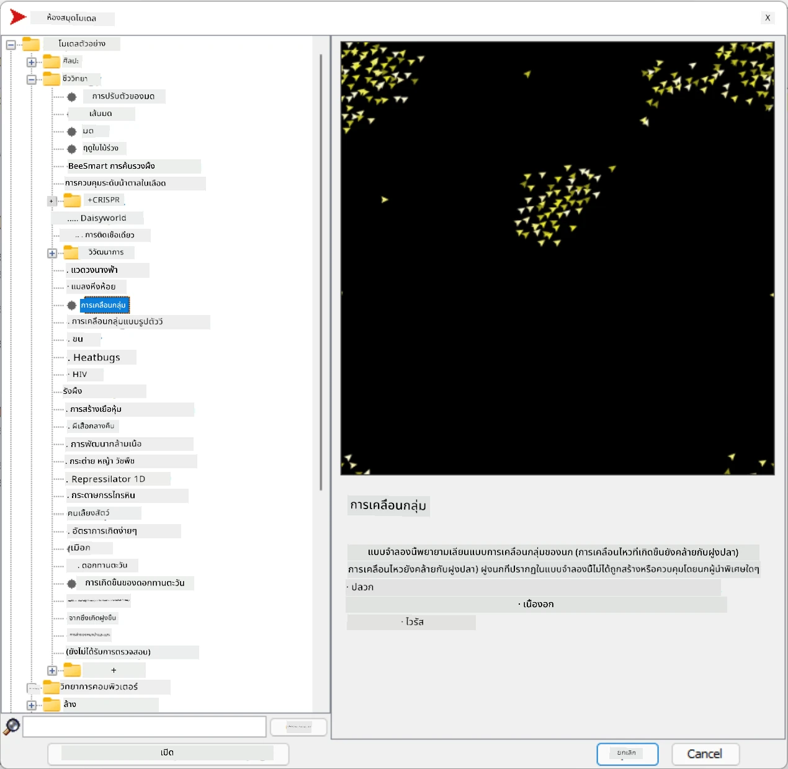
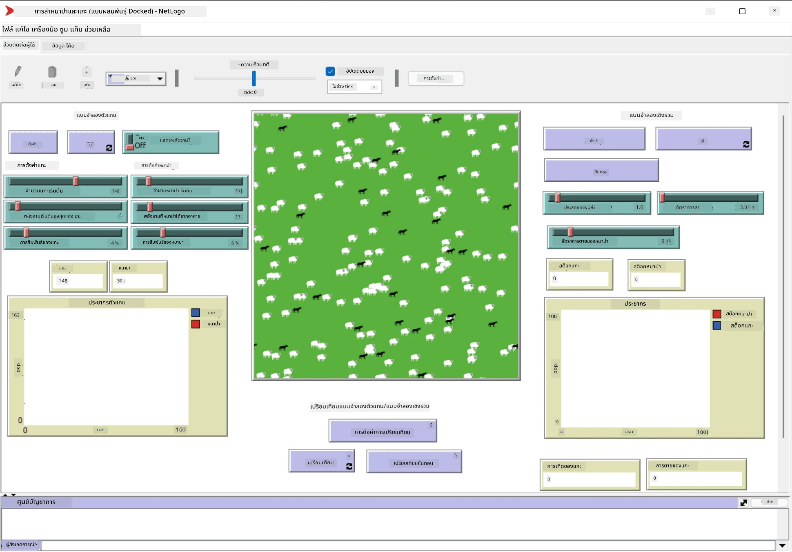

# ระบบหลายตัวแทน

หนึ่งในวิธีที่เป็นไปได้ในการสร้างความฉลาดคือวิธีที่เรียกว่า **การเกิดขึ้นเอง** (หรือ **การทำงานร่วมกัน**) ซึ่งอิงจากข้อเท็จจริงที่ว่าพฤติกรรมรวมของตัวแทนที่ค่อนข้างเรียบง่ายจำนวนมากสามารถนำไปสู่พฤติกรรมที่ซับซ้อน (หรือฉลาด) มากขึ้นของระบบโดยรวมได้ ในเชิงทฤษฎี วิธีนี้อิงจากหลักการของ [ปัญญาร่วม](https://en.wikipedia.org/wiki/Collective_intelligence), [Emergentism](https://en.wikipedia.org/wiki/Global_brain) และ [Evolutionary Cybernetics](https://en.wikipedia.org/wiki/Global_brain) ซึ่งระบุว่าระบบระดับสูงจะได้รับคุณค่าเพิ่มเติมบางอย่างเมื่อมีการรวมกันอย่างเหมาะสมจากระบบระดับต่ำ (เรียกว่า *หลักการเปลี่ยนผ่านของเมตาซิสเต็ม*)

## [แบบทดสอบก่อนเรียน](https://ff-quizzes.netlify.app/en/ai/quiz/45)

แนวทางของ **ระบบหลายตัวแทน** เกิดขึ้นใน AI ในช่วงปี 1990s เพื่อตอบสนองต่อการเติบโตของอินเทอร์เน็ตและระบบกระจาย หนึ่งในตำรา AI คลาสสิก [Artificial Intelligence: A Modern Approach](https://en.wikipedia.org/wiki/Artificial_Intelligence:_A_Modern_Approach) มุ่งเน้นมุมมองของ AI คลาสสิกจากมุมมองของระบบหลายตัวแทน

หัวใจสำคัญของแนวทางระบบหลายตัวแทนคือแนวคิดของ **ตัวแทน** - หน่วยงานที่อาศัยอยู่ใน **สภาพแวดล้อม** ซึ่งมันสามารถรับรู้และกระทำต่อสิ่งนั้นได้ นี่เป็นคำจำกัดความที่กว้างมาก และตัวแทนสามารถมีหลายประเภทและการจำแนกประเภทที่แตกต่างกัน:

* ตามความสามารถในการใช้เหตุผล:
   - **ตัวแทนตอบสนอง** มักมีพฤติกรรมแบบคำขอ-ตอบสนองที่เรียบง่าย
   - **ตัวแทนที่มีการไตร่ตรอง** ใช้เหตุผลเชิงตรรกะและ/หรือความสามารถในการวางแผนบางอย่าง
* ตามสถานที่ที่ตัวแทนดำเนินการโค้ด:
   - **ตัวแทนแบบคงที่** ทำงานบนโหนดเครือข่ายเฉพาะ
   - **ตัวแทนแบบเคลื่อนที่** สามารถย้ายโค้ดระหว่างโหนดเครือข่าย
* ตามพฤติกรรม:
   - **ตัวแทนแบบพาสซีฟ** ไม่มีเป้าหมายเฉพาะ ตัวแทนเหล่านี้สามารถตอบสนองต่อสิ่งกระตุ้นภายนอก แต่จะไม่เริ่มต้นการกระทำใดๆ ด้วยตัวเอง
   - **ตัวแทนแบบแอคทีฟ** มีเป้าหมายที่พวกเขาต้องการบรรลุ
   - **ตัวแทนแบบมีความคิด** มีการวางแผนและการใช้เหตุผลที่ซับซ้อน

ระบบหลายตัวแทนในปัจจุบันถูกนำมาใช้ในหลายแอปพลิเคชัน:

* ในเกม ตัวละครที่ไม่ใช่ผู้เล่นหลายตัวใช้ AI บางรูปแบบ และสามารถถือว่าเป็นตัวแทนที่ฉลาด
* ในการผลิตวิดีโอ การเรนเดอร์ฉาก 3D ที่ซับซ้อนซึ่งเกี่ยวข้องกับฝูงชนมักทำโดยใช้การจำลองระบบหลายตัวแทน
* ในการสร้างแบบจำลองระบบ แนวทางระบบหลายตัวแทนถูกใช้เพื่อจำลองพฤติกรรมของแบบจำลองที่ซับซ้อน ตัวอย่างเช่น แนวทางระบบหลายตัวแทนถูกใช้สำเร็จในการทำนายการแพร่กระจายของโรค COVID-19 ทั่วโลก วิธีการที่คล้ายกันสามารถใช้ในการจำลองการจราจรในเมือง และดูว่ามันตอบสนองต่อการเปลี่ยนแปลงกฎจราจรอย่างไร
* ในระบบอัตโนมัติที่ซับซ้อน อุปกรณ์แต่ละชิ้นสามารถทำหน้าที่เป็นตัวแทนอิสระ ซึ่งทำให้ระบบทั้งหมดมีความเป็นโมดูลและมีความแข็งแกร่งมากขึ้น

เราจะไม่ใช้เวลามากในการเจาะลึกระบบหลายตัวแทน แต่จะพิจารณาตัวอย่างหนึ่งของ **การสร้างแบบจำลองระบบหลายตัวแทน**

## NetLogo

[NetLogo](https://ccl.northwestern.edu/netlogo/) เป็นสภาพแวดล้อมการสร้างแบบจำลองระบบหลายตัวแทนที่อิงจากเวอร์ชันปรับปรุงของ [Logo](https://en.wikipedia.org/wiki/Logo_(programming_language)) ภาษาการเขียนโปรแกรม ภาษานี้ถูกพัฒนาขึ้นเพื่อสอนแนวคิดการเขียนโปรแกรมให้กับเด็ก และช่วยให้คุณควบคุมตัวแทนที่เรียกว่า **เต่า** ซึ่งสามารถเคลื่อนที่และทิ้งร่องรอยไว้เบื้องหลัง สิ่งนี้ช่วยให้สร้างรูปทรงเรขาคณิตที่ซับซ้อน ซึ่งเป็นวิธีที่มองเห็นได้ชัดเจนในการทำความเข้าใจพฤติกรรมของตัวแทน

ใน NetLogo เราสามารถสร้างเต่าหลายตัวโดยใช้คำสั่ง `create-turtles` จากนั้นเราสามารถสั่งให้เต่าทั้งหมดทำบางอย่าง (ในตัวอย่างด้านล่าง - เคลื่อนที่ไปข้างหน้า 10 จุด):

```
create-turtles 10
ask turtles [
  forward 10
]
```

แน่นอนว่ามันไม่สนุกเมื่อเต่าทั้งหมดทำสิ่งเดียวกัน ดังนั้นเราสามารถใช้คำสั่ง `ask` กับกลุ่มเต่า เช่น เต่าที่อยู่ใกล้จุดใดจุดหนึ่ง เราสามารถสร้างเต่าที่มี *สายพันธุ์* ต่างกันโดยใช้คำสั่ง `breed [cats cat]` ที่นี่ `cat` เป็นชื่อของสายพันธุ์ และเราต้องระบุทั้งคำเอกพจน์และพหูพจน์ เพราะคำสั่งต่างๆ ใช้รูปแบบที่แตกต่างกันเพื่อความชัดเจน

> ✅ เราจะไม่ลงลึกในการเรียนรู้ภาษา NetLogo เอง - คุณสามารถเยี่ยมชมแหล่งข้อมูลที่ยอดเยี่ยม [Beginner's Interactive NetLogo Dictionary](https://ccl.northwestern.edu/netlogo/bind/) หากคุณสนใจเรียนรู้เพิ่มเติม

คุณสามารถ [ดาวน์โหลด](https://ccl.northwestern.edu/netlogo/download.shtml) และติดตั้ง NetLogo เพื่อทดลองใช้งาน

### ห้องสมุดโมเดล

สิ่งที่ยอดเยี่ยมเกี่ยวกับ NetLogo คือมันมีห้องสมุดโมเดลที่ใช้งานได้ซึ่งคุณสามารถทดลองได้ ไปที่ **File &rightarrow; Models Library** และคุณมีหมวดหมู่โมเดลมากมายให้เลือก



> ภาพหน้าจอของห้องสมุดโมเดลโดย Dmitry Soshnikov

คุณสามารถเปิดหนึ่งในโมเดล เช่น **Biology &rightarrow; Flocking**

### หลักการสำคัญ

หลังจากเปิดโมเดล คุณจะเข้าสู่หน้าจอหลักของ NetLogo นี่คือตัวอย่างโมเดลที่อธิบายประชากรของหมาป่าและแกะ โดยมีทรัพยากรจำกัด (หญ้า)



> ภาพหน้าจอโดย Dmitry Soshnikov

บนหน้าจอนี้ คุณจะเห็น:

* ส่วน **Interface** ซึ่งประกอบด้วย:
  - สนามหลักที่ตัวแทนทั้งหมดอาศัยอยู่
  - ตัวควบคุมต่างๆ: ปุ่ม, สไลเดอร์ ฯลฯ
  - กราฟที่คุณสามารถใช้แสดงพารามิเตอร์ของการจำลอง
* แท็บ **Code** ซึ่งมีตัวแก้ไขที่คุณสามารถพิมพ์โปรแกรม NetLogo

ในกรณีส่วนใหญ่ อินเทอร์เฟซจะมีปุ่ม **Setup** ซึ่งเริ่มต้นสถานะการจำลอง และปุ่ม **Go** ที่เริ่มการดำเนินการ สิ่งเหล่านี้ถูกจัดการโดยตัวจัดการที่เกี่ยวข้องในโค้ดที่มีลักษณะดังนี้:

```
to go [
...
]
```

โลกของ NetLogo ประกอบด้วยวัตถุต่อไปนี้:

* **ตัวแทน** (เต่า) ที่สามารถเคลื่อนที่ข้ามสนามและทำบางสิ่ง คุณสามารถสั่งตัวแทนโดยใช้ไวยากรณ์ `ask turtles [...]` และโค้ดในวงเล็บจะถูกดำเนินการโดยตัวแทนทั้งหมดใน *โหมดเต่า*
* **แพทช์** เป็นพื้นที่สี่เหลี่ยมของสนามที่ตัวแทนอาศัยอยู่ คุณสามารถอ้างถึงตัวแทนทั้งหมดบนแพทช์เดียวกัน หรือคุณสามารถเปลี่ยนสีแพทช์และคุณสมบัติอื่นๆ คุณยังสามารถ `ask patches` ให้ทำบางสิ่งได้
* **ผู้สังเกตการณ์** เป็นตัวแทนที่ไม่ซ้ำกันที่ควบคุมโลก ตัวจัดการปุ่มทั้งหมดจะถูกดำเนินการใน *โหมดผู้สังเกตการณ์*

> ✅ ความงดงามของสภาพแวดล้อมระบบหลายตัวแทนคือโค้ดที่ทำงานในโหมดเต่าหรือโหมดแพทช์จะถูกดำเนินการพร้อมกันโดยตัวแทนทั้งหมดแบบขนาน ดังนั้นโดยการเขียนโค้ดเล็กน้อยและการเขียนโปรแกรมพฤติกรรมของตัวแทนแต่ละตัว คุณสามารถสร้างพฤติกรรมที่ซับซ้อนของระบบจำลองโดยรวมได้

### การบินเป็นฝูง

ตัวอย่างหนึ่งของพฤติกรรมระบบหลายตัวแทนคือ **[การบินเป็นฝูง](https://en.wikipedia.org/wiki/Flocking_(behavior))** การบินเป็นฝูงเป็นรูปแบบที่ซับซ้อนซึ่งคล้ายกับวิธีที่ฝูงนกบิน เมื่อดูพวกมันบิน คุณอาจคิดว่าพวกมันปฏิบัติตามอัลกอริทึมร่วมกัน หรือว่าพวกมันมีรูปแบบของ *ปัญญาร่วม* อย่างไรก็ตาม พฤติกรรมที่ซับซ้อนนี้เกิดขึ้นเมื่อแต่ละตัวแทน (ในกรณีนี้คือนก) สังเกตตัวแทนอื่นๆ ในระยะใกล้ และปฏิบัติตามกฎง่ายๆ สามข้อ:

* **การปรับแนว** - มันจะเคลื่อนไปในทิศทางเฉลี่ยของตัวแทนที่อยู่ใกล้เคียง
* **การรวมตัว** - มันพยายามเคลื่อนไปยังตำแหน่งเฉลี่ยของตัวแทนที่อยู่ใกล้ (*แรงดึงดูดระยะไกล*)
* **การแยกตัว** - เมื่อเข้าใกล้นกตัวอื่นมากเกินไป มันจะพยายามเคลื่อนตัวออกไป (*แรงผลักระยะใกล้*)

คุณสามารถเรียกใช้ตัวอย่างการบินเป็นฝูงและสังเกตพฤติกรรม คุณยังสามารถปรับพารามิเตอร์ เช่น *ระดับการแยกตัว* หรือ *ระยะการมองเห็น* ซึ่งกำหนดว่านกแต่ละตัวสามารถมองเห็นได้ไกลแค่ไหน โปรดทราบว่าหากคุณลดระยะการมองเห็นเป็น 0 นกทั้งหมดจะกลายเป็นตาบอด และการบินเป็นฝูงจะหยุด หากคุณลดการแยกตัวเป็น 0 นกทั้งหมดจะรวมตัวกันเป็นเส้นตรง

> ✅ สลับไปที่แท็บ **Code** และดูว่ากฎสามข้อของการบินเป็นฝูง (การปรับแนว, การรวมตัว และการแยกตัว) ถูกนำไปใช้ในโค้ดอย่างไร โปรดสังเกตว่าเราอ้างถึงเฉพาะตัวแทนที่อยู่ในสายตาเท่านั้น

### โมเดลอื่นๆ ที่ควรดู

มีโมเดลที่น่าสนใจอีกสองสามโมเดลที่คุณสามารถทดลองได้:

* **Art &rightarrow; Fireworks** แสดงให้เห็นว่าดอกไม้ไฟสามารถถือว่าเป็นพฤติกรรมร่วมกันของกระแสไฟแต่ละสายได้อย่างไร
* **Social Science &rightarrow; Traffic Basic** และ **Social Science &rightarrow; Traffic Grid** แสดงโมเดลการจราจรในเมืองใน 1D และ 2D Grid โดยมีหรือไม่มีไฟจราจร รถแต่ละคันในจำลองจะปฏิบัติตามกฎต่อไปนี้:
   - หากพื้นที่ด้านหน้าว่าง - เร่งความเร็ว (จนถึงความเร็วสูงสุดที่กำหนด)
   - หากเห็นสิ่งกีดขวางด้านหน้า - เบรก (และคุณสามารถปรับระยะที่คนขับสามารถมองเห็นได้)
* **Social Science &rightarrow; Party** แสดงให้เห็นว่าผู้คนรวมตัวกันอย่างไรในงานเลี้ยงค็อกเทล คุณสามารถค้นหาการรวมกันของพารามิเตอร์ที่นำไปสู่การเพิ่มความสุขของกลุ่มได้เร็วที่สุด

จากตัวอย่างเหล่านี้ คุณจะเห็นว่าการจำลองระบบหลายตัวแทนสามารถเป็นวิธีที่มีประโยชน์ในการทำความเข้าใจพฤติกรรมของระบบที่ซับซ้อนซึ่งประกอบด้วยบุคคลที่ปฏิบัติตามตรรกะเดียวกันหรือคล้ายกัน นอกจากนี้ยังสามารถใช้ควบคุมตัวแทนเสมือน เช่น [NPCs](https://en.wikipedia.org/wiki/NPC) ในเกมคอมพิวเตอร์ หรือในโลกแอนิเมชัน 3D

## ตัวแทนที่มีการไตร่ตรอง

ตัวแทนที่อธิบายข้างต้นมีความเรียบง่ายมาก โดยตอบสนองต่อการเปลี่ยนแปลงในสภาพแวดล้อมโดยใช้อัลกอริทึมบางอย่าง ดังนั้นพวกเขาจึงเป็น **ตัวแทนตอบสนอง** อย่างไรก็ตาม บางครั้งตัวแทนสามารถใช้เหตุผลและวางแผนการกระทำของพวกเขาได้ ซึ่งในกรณีนี้พวกเขาจะเรียกว่า **ตัวแทนที่มีการไตร่ตรอง**

ตัวอย่างทั่วไปคือตัวแทนส่วนบุคคลที่ได้รับคำสั่งจากมนุษย์ให้จองทัวร์พักผ่อน สมมติว่ามีตัวแทนจำนวนมากที่อาศัยอยู่บนอินเทอร์เน็ตซึ่งสามารถช่วยเหลือมันได้ มันควรติดต่อกับตัวแทนอื่นๆ เพื่อดูว่าเที่ยวบินใดที่มีอยู่ ราคาของโรงแรมในวันที่ต่างๆ เป็นอย่างไร และพยายามเจรจาราคาที่ดีที่สุด เมื่อแผนการพักผ่อนเสร็จสมบูรณ์และได้รับการยืนยันจากเจ้าของแล้ว มันสามารถดำเนินการจองได้

เพื่อให้ทำเช่นนั้นได้ ตัวแทนจำเป็นต้อง **สื่อสาร** เพื่อการสื่อสารที่ประสบความสำเร็จพวกเขาต้องการ:

* **ภาษามาตรฐานในการแลกเปลี่ยนความรู้** เช่น [Knowledge Interchange Format](https://en.wikipedia.org/wiki/Knowledge_Interchange_Format) (KIF) และ [Knowledge Query and Manipulation Language](https://en.wikipedia.org/wiki/Knowledge_Query_and_Manipulation_Language) (KQML) ภาษาดังกล่าวได้รับการออกแบบตาม [ทฤษฎีการกระทำทางภาษา](https://en.wikipedia.org/wiki/Speech_act)
* ภาษาดังกล่าวควรรวมถึง **โปรโตคอลสำหรับการเจรจา** โดยอิงจาก **ประเภทการประมูล** ต่างๆ
* **ออนโทโลยีร่วมกัน** เพื่อใช้งาน เพื่อให้พวกเขาอ้างถึงแนวคิดเดียวกันโดยรู้ความหมายของแนวคิดนั้น
* วิธีการ **ค้นพบ** ว่าตัวแทนต่างๆ สามารถทำอะไรได้บ้าง โดยอิงจากออนโทโลยีบางรูปแบบ

ตัวแทนที่มีการไตร่ตรองมีความซับซ้อนมากกว่าตัวแทนตอบสนอง เพราะพวกเขาไม่ได้เพียงแค่ตอบสนองต่อการเปลี่ยนแปลงในสภาพแวดล้อมเท่านั้น แต่ยังต้องสามารถ *เริ่มต้น* การกระทำได้ หนึ่งในสถาปัตยกรรมที่เสนอสำหรับตัวแทนที่มีการไตร่ตรองคือ ตัวแทนแบบ Belief-Desire-Intention (BDI):

* **Beliefs** เป็นชุดความรู้เกี่ยวกับสภาพแวดล้อมของตัวแทน มันสามารถจัดโครงสร้างเป็นฐานความรู้หรือชุดกฎที่ตัวแทนสามารถนำไปใช้กับสถานการณ์เฉพาะในสภาพแวดล้อม
* **Desires** กำหนดสิ่งที่ตัวแทนต้องการทำ เช่น เป้าหมายของมัน ตัวอย่างเช่น เป้าหมายของตัวแทนผู้ช่วยส่วนตัวข้างต้นคือการจองทัวร์ และเป้าหมายของตัวแทนโรงแรมคือการเพิ่มผลกำไรสูงสุด
* **Intentions** เป็นการกระทำเฉพาะที่ตัวแทนวางแผนเพื่อบรรลุเป้าหมาย การกระทำมักเปลี่ยนแปลงสภาพแวดล้อมและทำให้เกิดการสื่อสารกับตัวแทนอื่นๆ

มีแพลตฟอร์มบางอย่างที่พร้อมใช้งานสำหรับการสร้างระบบหลายตัวแทน เช่น [JADE](https://jade.tilab.com/) [เอกสารนี้](https://arxiv.org/ftp/arxiv/papers/2007/2007.08961.pdf) มีการทบทวนแพลตฟอร์มระบบหลายตัวแทน พร้อมกับประวัติย่อของระบบหลายตัวแทนและสถานการณ์การใช้งานที่แตกต่างกัน

## สรุป

ระบบหลายตัวแทนสามารถมีรูปแบบที่แตกต่างกันมากและถูกใช้ในแอปพลิเคชันที่หลากหลาย 
พวกมันมักมุ่งเน้นไปที่พฤติกรรมที่เรียบง่ายของตัวแทนแต่ละตัว และบรรลุพฤติกรรมที่ซับซ้อนมากขึ้นของระบบโดยรวมเน

---

