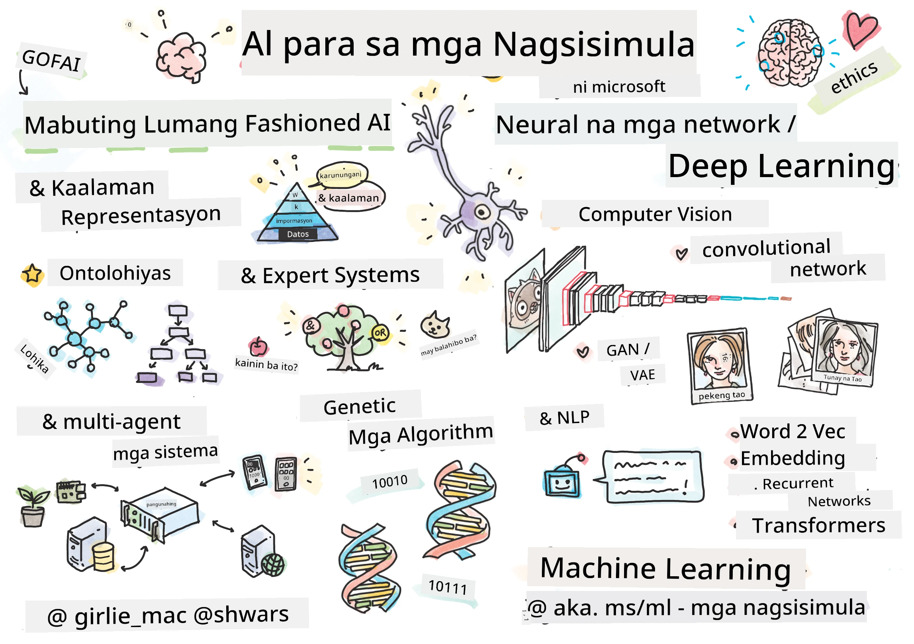

[](https://github.com/microsoft/AI-For-Beginners/blob/main/LICENSE)
[](https://GitHub.com/microsoft/AI-For-Beginners/graphs/contributors/)
[](https://GitHub.com/microsoft/AI-For-Beginners/issues/)
[](https://GitHub.com/microsoft/AI-For-Beginners/pulls/)
[](http://makeapullrequest.com)

[](https://GitHub.com/microsoft/AI-For-Beginners/watchers/)
[](https://GitHub.com/microsoft/AI-For-Beginners/network/)
[](https://GitHub.com/microsoft/AI-For-Beginners/stargazers/)
[](https://mybinder.org/v2/gh/microsoft/ai-for-beginners/HEAD)
[](https://gitter.im/Microsoft/ai-for-beginners?utm_source=badge&utm_medium=badge&utm_campaign=pr-badge)

[](https://discord.gg/nTYy5BXMWG)

# Artificial Intelligence for Beginners - Isang Kurikulum

||
|:---:|
| AI For Beginners - _Sketchnote ni [@girlie_mac](https://twitter.com/girlie_mac)_ |

Tuklasin ang mundo ng **Artificial Intelligence** (AI) sa aming 12-linggong, 24-araling kurikulum! Kabilang dito ang mga praktikal na aralin, pagsusulit, at mga laboratoryo. Ang kurikulum ay angkop para sa mga nagsisimula at sumasaklaw sa mga kasangkapan tulad ng TensorFlow at PyTorch, pati na rin ang etika sa AI


### 🌐 Suporta sa Maramihang Wika

#### Sinusuportahan sa pamamagitan ng GitHub Action (Awtomatik at Laging Napapanahon)

<!-- CO-OP TRANSLATOR LANGUAGES TABLE START -->
[Arabic](../ar/README.md) | [Bengali](../bn/README.md) | [Bulgarian](../bg/README.md) | [Burmese (Myanmar)](../my/README.md) | [Chinese (Simplified)](../zh-CN/README.md) | [Chinese (Traditional, Hong Kong)](../zh-HK/README.md) | [Chinese (Traditional, Macau)](../zh-MO/README.md) | [Chinese (Traditional, Taiwan)](../zh-TW/README.md) | [Croatian](../hr/README.md) | [Czech](../cs/README.md) | [Danish](../da/README.md) | [Dutch](../nl/README.md) | [Estonian](../et/README.md) | [Finnish](../fi/README.md) | [French](../fr/README.md) | [German](../de/README.md) | [Greek](../el/README.md) | [Hebrew](../he/README.md) | [Hindi](../hi/README.md) | [Hungarian](../hu/README.md) | [Indonesian](../id/README.md) | [Italian](../it/README.md) | [Japanese](../ja/README.md) | [Kannada](../kn/README.md) | [Korean](../ko/README.md) | [Lithuanian](../lt/README.md) | [Malay](../ms/README.md) | [Malayalam](../ml/README.md) | [Marathi](../mr/README.md) | [Nepali](../ne/README.md) | [Nigerian Pidgin](../pcm/README.md) | [Norwegian](../no/README.md) | [Persian (Farsi)](../fa/README.md) | [Polish](../pl/README.md) | [Portuguese (Brazil)](../pt-BR/README.md) | [Portuguese (Portugal)](../pt-PT/README.md) | [Punjabi (Gurmukhi)](../pa/README.md) | [Romanian](../ro/README.md) | [Russian](../ru/README.md) | [Serbian (Cyrillic)](../sr/README.md) | [Slovak](../sk/README.md) | [Slovenian](../sl/README.md) | [Spanish](../es/README.md) | [Swahili](../sw/README.md) | [Swedish](../sv/README.md) | [Tagalog (Filipino)](./README.md) | [Tamil](../ta/README.md) | [Telugu](../te/README.md) | [Thai](../th/README.md) | [Turkish](../tr/README.md) | [Ukrainian](../uk/README.md) | [Urdu](../ur/README.md) | [Vietnamese](../vi/README.md)

> **Mas gusto mo bang Mag-clone Lokally?**

> Ang repository na ito ay mayroong 50+ na mga pagsasalin ng wika na malaki ang dagdag sa laki ng pag-download. Para mag-clone nang walang mga pagsasalin, gamitin ang sparse checkout:
> ```bash
> git clone --filter=blob:none --sparse https://github.com/microsoft/AI-For-Beginners.git
> cd AI-For-Beginners
> git sparse-checkout set --no-cone '/*' '!translations' '!translated_images'
> ```
> Bibigyan ka nito ng lahat ng kailangan mo para matapos ang kurso nang mas mabilis ang pag-download.
<!-- CO-OP TRANSLATOR LANGUAGES TABLE END -->

**Kung nais mong magkaroon ng karagdagang soportadong mga wika ng pagsasalin na nakalista [dito](https://github.com/Azure/co-op-translator/blob/main/getting_started/supported-languages.md)**

## Sumali sa Komunidad
[](https://discord.gg/nTYy5BXMWG)

## Ano ang iyong Matututuhan

**[Mindmap ng Kurso](http://soshnikov.com/courses/ai-for-beginners/mindmap.html)**

Sa kurikulum na ito, matututunan mo:

* Iba’t ibang mga lapit sa Artificial Intelligence, kabilang ang "good old" na simbolikong lapit gamit ang **Knowledge Representation** at reasoning ([GOFAI](https://en.wikipedia.org/wiki/Symbolic_artificial_intelligence)).
* **Neural Networks** at **Deep Learning**, na nasa puso ng modernong AI. Ipapakita namin ang mga konsepto sa likod ng mga mahalagang paksang ito gamit ang code sa dalawang pinakapopular na frameworks - [TensorFlow](http://Tensorflow.org) at [PyTorch](http://pytorch.org).
* **Neural Architectures** para sa pagtatrabaho gamit ang mga larawan at teksto. Tatalakayin namin ang mga bagong modelo ngunit maaaring medyo kulang sa pinakabagong estado ng sining.
* Mga hindi gaanong popular na lapit sa AI, tulad ng **Genetic Algorithms** at **Multi-Agent Systems**.

Ano ang hindi namin tatalakayin sa kurikulum na ito:

> [Hanapin ang lahat ng karagdagang mga resources para sa kursong ito sa aming Microsoft Learn collection](https://learn.microsoft.com/en-us/collections/7w28iy2xrqzdj0?WT.mc_id=academic-77998-bethanycheum)

* Mga kaso sa negosyo ng paggamit ng **AI sa Negosyo**. Isaalang-alang ang pagkuha ng [Introduction to AI for business users](https://docs.microsoft.com/learn/paths/introduction-ai-for-business-users/?WT.mc_id=academic-77998-bethanycheum) learning path sa Microsoft Learn, o [AI Business School](https://www.microsoft.com/ai/ai-business-school/?WT.mc_id=academic-77998-bethanycheum), na binuo kasama ang [INSEAD](https://www.insead.edu/).
* **Classic Machine Learning**, na mahusay na inilarawan sa aming [Machine Learning for Beginners Curriculum](http://github.com/Microsoft/ML-for-Beginners).
* Praktikal na mga aplikasyon ng AI na binuo gamit ang **[Cognitive Services](https://azure.microsoft.com/services/cognitive-services/?WT.mc_id=academic-77998-bethanycheum)**. Para dito, inirerekumenda naming magsimula ka sa mga module sa Microsoft Learn para sa [vision](https://docs.microsoft.com/learn/paths/create-computer-vision-solutions-azure-cognitive-services/?WT.mc_id=academic-77998-bethanycheum), [natural language processing](https://docs.microsoft.com/learn/paths/explore-natural-language-processing/?WT.mc_id=academic-77998-bethanycheum), **[Generative AI with Azure OpenAI Service](https://learn.microsoft.com/en-us/training/paths/develop-ai-solutions-azure-openai/?WT.mc_id=academic-77998-bethanycheum)** at iba pa.
* Mga specific na ML **Cloud Frameworks**, tulad ng [Azure Machine Learning](https://azure.microsoft.com/services/machine-learning/?WT.mc_id=academic-77998-bethanycheum), [Microsoft Fabric](https://learn.microsoft.com/en-us/training/paths/get-started-fabric/?WT.mc_id=academic-77998-bethanycheum), o [Azure Databricks](https://docs.microsoft.com/learn/paths/data-engineer-azure-databricks?WT.mc_id=academic-77998-bethanycheum). Isaalang-alang ang paggamit ng [Build and operate machine learning solutions with Azure Machine Learning](https://docs.microsoft.com/learn/paths/build-ai-solutions-with-azure-ml-service/?WT.mc_id=academic-77998-bethanycheum) at [Build and Operate Machine Learning Solutions with Azure Databricks](https://docs.microsoft.com/learn/paths/build-operate-machine-learning-solutions-azure-databricks/?WT.mc_id=academic-77998-bethanycheum) learning paths.
* **Conversational AI** at **Chat Bots**. May hiwalay na [Create conversational AI solutions](https://docs.microsoft.com/learn/paths/create-conversational-ai-solutions/?WT.mc_id=academic-77998-bethanycheum) learning path, at maaari mo ring tingnan ang [blog post na ito](https://soshnikov.com/azure/hello-bot-conversational-ai-on-microsoft-platform/) para sa mas detalyadong impormasyon.
* **Deep Mathematics** sa likod ng deep learning. Para dito, nirerekomenda namin ang [Deep Learning](https://www.amazon.com/Deep-Learning-Adaptive-Computation-Machine/dp/0262035618) ni Ian Goodfellow, Yoshua Bengio at Aaron Courville, na available din online sa [https://www.deeplearningbook.org/](https://www.deeplearningbook.org/).

Para sa malumanay na pagpapakilala sa mga paksa ng _AI sa Cloud_ maaari mong isaalang-alang ang pagkuha ng [Get started with artificial intelligence on Azure](https://docs.microsoft.com/learn/paths/get-started-with-artificial-intelligence-on-azure/?WT.mc_id=academic-77998-bethanycheum) Learning Path.

# Nilalaman

|     |                                                                 Lesson Link                                                                  |                                           PyTorch/Keras/TensorFlow                                          | Lab                                                            |
| :-: | :------------------------------------------------------------------------------------------------------------------------------------------: | :---------------------------------------------------------------------------------------------: | ------------------------------------------------------------------------------ |
| 0  |                                 [Course Setup](./lessons/0-course-setup/setup.md)                                 |                      [Setup Your Development Environment](./lessons/0-course-setup/how-to-run.md)                       |   |
| I  |               [**Panimula sa AI**](./lessons/1-Intro/README.md)      | | |
| 01  |       [Panimula at Kasaysayan ng AI](./lessons/1-Intro/README.md)       |           -                            | -  |
| II |              **Simbolikong AI**              |
| 02  |       [Knowledge Representation and Expert Systems](./lessons/2-Symbolic/README.md)       |            [Expert Systems](./lessons/2-Symbolic/Animals.ipynb) /  [Ontology](./lessons/2-Symbolic/FamilyOntology.ipynb) /[Concept Graph](./lessons/2-Symbolic/MSConceptGraph.ipynb)                             |  |
| III |                        [**Panimula sa Neural Networks**](./lessons/3-NeuralNetworks/README.md) |||
| 03  |                [Perceptron](./lessons/3-NeuralNetworks/03-Perceptron/README.md)                 |                       [Notebook](./lessons/3-NeuralNetworks/03-Perceptron/Perceptron.ipynb)                      | [Lab](./lessons/3-NeuralNetworks/03-Perceptron/lab/README.md) |
| 04  |                   [Multi-Layered Perceptron at Paggawa ng Sariling Framework](./lessons/3-NeuralNetworks/04-OwnFramework/README.md)                   |        [Notebook](./lessons/3-NeuralNetworks/04-OwnFramework/OwnFramework.ipynb)        | [Lab](./lessons/3-NeuralNetworks/04-OwnFramework/lab/README.md) |
| 05  |            [Panimula sa Frameworks (PyTorch/TensorFlow) at Overfitting](./lessons/3-NeuralNetworks/05-Frameworks/README.md)             |           [PyTorch](./lessons/3-NeuralNetworks/05-Frameworks/IntroPyTorch.ipynb) / [Keras](./lessons/3-NeuralNetworks/05-Frameworks/IntroKeras.ipynb) / [TensorFlow](./lessons/3-NeuralNetworks/05-Frameworks/IntroKerasTF.ipynb)             | [Lab](./lessons/3-NeuralNetworks/05-Frameworks/lab/README.md) |
| IV  |            [**Computer Vision**](./lessons/4-ComputerVision/README.md)             | [PyTorch](https://docs.microsoft.com/learn/modules/intro-computer-vision-pytorch/?WT.mc_id=academic-77998-cacaste) / [TensorFlow](https://docs.microsoft.com/learn/modules/intro-computer-vision-TensorFlow/?WT.mc_id=academic-77998-cacaste)| [Galugarin ang Computer Vision sa Microsoft Azure](https://learn.microsoft.com/en-us/collections/7w28iy2xrqzdj0?WT.mc_id=academic-77998-bethanycheum) |
| 06  |            [Panimula sa Computer Vision. OpenCV](./lessons/4-ComputerVision/06-IntroCV/README.md)             |           [Notebook](./lessons/4-ComputerVision/06-IntroCV/OpenCV.ipynb)         | [Lab](./lessons/4-ComputerVision/06-IntroCV/lab/README.md) |
| 07  |            [Convolutional Neural Networks](./lessons/4-ComputerVision/07-ConvNets/README.md) &  [Mga Arkitektura ng CNN](./lessons/4-ComputerVision/07-ConvNets/CNN_Architectures.md)             |           [PyTorch](./lessons/4-ComputerVision/07-ConvNets/ConvNetsPyTorch.ipynb) /[TensorFlow](./lessons/4-ComputerVision/07-ConvNets/ConvNetsTF.ipynb)             | [Lab](./lessons/4-ComputerVision/07-ConvNets/lab/README.md) |
| 08  |            [Pre-trained Networks at Transfer Learning](./lessons/4-ComputerVision/08-TransferLearning/README.md) at [Mga Trik sa Pagsasanay](./lessons/4-ComputerVision/08-TransferLearning/TrainingTricks.md)             |           [PyTorch](./lessons/4-ComputerVision/08-TransferLearning/TransferLearningPyTorch.ipynb) / [TensorFlow](./lessons/3-NeuralNetworks/05-Frameworks/IntroKerasTF.ipynb)             | [Lab](./lessons/4-ComputerVision/08-TransferLearning/lab/README.md) |
| 09  |            [Autoencoders at VAEs](./lessons/4-ComputerVision/09-Autoencoders/README.md)             |           [PyTorch](./lessons/4-ComputerVision/09-Autoencoders/AutoEncodersPyTorch.ipynb) / [TensorFlow](./lessons/4-ComputerVision/09-Autoencoders/AutoencodersTF.ipynb)             |  |
| 10  |            [Generative Adversarial Networks at Artistic Style Transfer](./lessons/4-ComputerVision/10-GANs/README.md)             |           [PyTorch](./lessons/4-ComputerVision/10-GANs/GANPyTorch.ipynb) / [TensorFlow](./lessons/4-ComputerVision/10-GANs/GANTF.ipynb)             |  |
| 11  |            [Object Detection](./lessons/4-ComputerVision/11-ObjectDetection/README.md)             |         [TensorFlow](./lessons/4-ComputerVision/11-ObjectDetection/ObjectDetection.ipynb)             | [Lab](./lessons/4-ComputerVision/11-ObjectDetection/lab/README.md) |
| 12  |            [Semantic Segmentation. U-Net](./lessons/4-ComputerVision/12-Segmentation/README.md)             |           [PyTorch](./lessons/4-ComputerVision/12-Segmentation/SemanticSegmentationPytorch.ipynb) / [TensorFlow](./lessons/4-ComputerVision/12-Segmentation/SemanticSegmentationTF.ipynb)             |  |
| V  |            [**Natural Language Processing**](./lessons/5-NLP/README.md)             | [PyTorch](https://docs.microsoft.com/learn/modules/intro-natural-language-processing-pytorch/?WT.mc_id=academic-77998-cacaste) /[TensorFlow](https://docs.microsoft.com/learn/modules/intro-natural-language-processing-TensorFlow/?WT.mc_id=academic-77998-cacaste) | [Galugarin ang Natural Language Processing sa Microsoft Azure](https://learn.microsoft.com/en-us/collections/7w28iy2xrqzdj0?WT.mc_id=academic-77998-bethanycheum)|
| 13  |            [Presentasyon ng Teksto. Bow/TF-IDF](./lessons/5-NLP/13-TextRep/README.md)             |           [PyTorch](https://github.com/microsoft/AI-For-Beginners/blob/main/lessons/5-NLP/13-TextRep/TextRepresentationPyTorch.ipynb) / [TensorFlow](https://github.com/microsoft/AI-For-Beginners/blob/main/lessons/5-NLP/13-TextRep/TextRepresentationTF.ipynb)             | |
| 14  |            [Mga Semantikong pag-embed ng salita. Word2Vec at GloVe](./lessons/5-NLP/14-Embeddings/README.md)             |           [PyTorch](https://github.com/microsoft/AI-For-Beginners/blob/main/lessons/5-NLP/14-Embeddings/EmbeddingsPyTorch.ipynb) / [TensorFlow](https://github.com/microsoft/AI-For-Beginners/blob/main/lessons/5-NLP/14-Embeddings/EmbeddingsTF.ipynb)             |  |
| 15  |            [Pagsasanay ng Wika. Pagsasanay ng sariling embeddings](./lessons/5-NLP/15-LanguageModeling/README.md)             |           [PyTorch](https://github.com/microsoft/AI-For-Beginners/blob/main/lessons/5-NLP/15-LanguageModeling/CBoW-PyTorch.ipynb) / [TensorFlow](https://github.com/microsoft/AI-For-Beginners/blob/main/lessons/5-NLP/15-LanguageModeling/CBoW-TF.ipynb)             | [Lab](./lessons/5-NLP/15-LanguageModeling/lab/README.md) |
| 16  |            [Recurrent Neural Networks](./lessons/5-NLP/16-RNN/README.md)             |           [PyTorch](https://github.com/microsoft/AI-For-Beginners/blob/main/lessons/5-NLP/16-RNN/RNNPyTorch.ipynb) / [TensorFlow](https://github.com/microsoft/AI-For-Beginners/blob/main/lessons/5-NLP/16-RNN/RNNTF.ipynb)             |  |
| 17  |            [Generative Recurrent Networks](./lessons/5-NLP/17-GenerativeNetworks/README.md)             |           [PyTorch](https://github.com/microsoft/AI-For-Beginners/blob/main/lessons/5-NLP/17-GenerativeNetworks/GenerativePyTorch.ipynb) / [TensorFlow](https://github.com/microsoft/AI-For-Beginners/blob/main/lessons/5-NLP/17-GenerativeNetworks/GenerativeTF.ipynb)             | [Lab](./lessons/5-NLP/17-GenerativeNetworks/lab/README.md) |
| 18  |            [Transformers. BERT.](./lessons/5-NLP/18-Transformers/README.md)             |           [PyTorch](https://github.com/microsoft/AI-For-Beginners/blob/main/lessons/5-NLP/18-Transformers/TransformersPyTorch.ipynb) /[TensorFlow](https://github.com/microsoft/AI-For-Beginners/blob/main/lessons/5-NLP/18-Transformers/TransformersTF.ipynb)             |  |
| 19  |            [Named Entity Recognition](./lessons/5-NLP/19-NER/README.md)             |           [TensorFlow](https://microsoft.github.io/AI-For-Beginners/lessons/5-NLP/19-NER/NER-TF.ipynb)             | [Lab](./lessons/5-NLP/19-NER/lab/README.md) |
| 20  |            [Malalaking Modelong Pangwika, Prompt Programming at Mga Few-Shot na Gawain](./lessons/5-NLP/20-LangModels/README.md)             |           [PyTorch](https://microsoft.github.io/AI-For-Beginners/lessons/5-NLP/20-LangModels/GPT-PyTorch.ipynb) | |
| VI |            **Ibang Mga Teknik sa AI** || |
| 21  |            [Genetic Algorithms](./lessons/6-Other/21-GeneticAlgorithms/README.md)             |           [Notebook](./lessons/6-Other/21-GeneticAlgorithms/Genetic.ipynb) | |
| 22  |            [Deep Reinforcement Learning](./lessons/6-Other/22-DeepRL/README.md)             |           [PyTorch](./lessons/6-Other/22-DeepRL/CartPole-RL-PyTorch.ipynb) /[TensorFlow](./lessons/6-Other/22-DeepRL/CartPole-RL-TF.ipynb)             | [Lab](./lessons/6-Other/22-DeepRL/lab/README.md) |
| 23  |            [Multi-Agent Systems](./lessons/6-Other/23-MultiagentSystems/README.md)             |  | |
| VII |            **AI Ethics** | | |
| 24  |            [AI Ethics at Responsible AI](./lessons/7-Ethics/README.md)             |           [Microsoft Learn: Responsible AI Principles](https://docs.microsoft.com/learn/paths/responsible-ai-business-principles/?WT.mc_id=academic-77998-cacaste) | |
| IX  |            **Extra** | | |
| 25  |            [Multi-Modal Networks, CLIP at VQGAN](./lessons/X-Extras/X1-MultiModal/README.md)             |           [Notebook](./lessons/X-Extras/X1-MultiModal/Clip.ipynb)    | |

## Bawat leksyon ay naglalaman ng

* Materyal para sa pre-reading
* Mga executable na Jupyter Notebook, na madalas ay partikular sa framework (**PyTorch** o **TensorFlow**). Ang executable na notebook ay naglalaman din ng maraming teoretikal na materyal, kaya upang maunawaan ang paksa kailangan mong dumaan sa kahit isang bersyon ng notebook (PyTorch o TensorFlow).
* Mga **Lab** na available sa ilang mga paksa, na nagbibigay ng pagkakataon upang subukang i-apply ang natutunang materyal sa isang partikular na problema.
* Ilang seksyon ay may mga link sa mga module ng [**MS Learn**](https://learn.microsoft.com/en-us/collections/7w28iy2xrqzdj0?WT.mc_id=academic-77998-bethanycheum) na sumasaklaw sa kaugnay na mga paksa.

## Pagsisimula

### 🎯 Bago ka sa AI? Magsimula Dito!

Kung ganap kang bago sa AI at gusto mo ng mabilis at praktikal na mga halimbawa, tingnan ang aming [**Mga Halimbawa na Pang-Baguhan**](./examples/README.md)! Kasama dito ang:

- 🌟 **Hello AI World** - Ang iyong unang programa sa AI (pagkilala ng pattern)
- 🧠 **Simpleng Neural Network** - Gumawa ng isang neural network mula sa simula  

- 🖼️ **Tagaklasipika ng Larawan** - Iklasipika ang mga larawan na may detalyadong mga komento
- 💬 **Sentimyento ng Teksto** - Suriin ang positibo/negatibong teksto

Ang mga halimbawa na ito ay dinisenyo upang tulungan kang maunawaan ang mga konsepto ng AI bago sumabak sa buong kurikulum.

### 📚 Buong Setup ng Kurikulum

- Nilikha namin ang isang [lesson sa setup](./lessons/0-course-setup/setup.md) upang tulungan ka sa pagsasaayos ng iyong development environment.
- Para sa mga Guro, may ginawa rin kaming [lesson sa setup ng kurikulum](./lessons/0-course-setup/for-teachers.md) para sa inyo!
- Paano [Patakbuhin ang code sa VSCode o Codespace](./lessons/0-course-setup/how-to-run.md)

Sundin ang mga hakbang na ito:

I-fork ang Repositoryo: I-click ang "Fork" button sa kanang itaas ng pahinang ito.

I-clone ang Repositoryo: `git clone https://github.com/microsoft/AI-For-Beginners.git`

Huwag kalimutang i-star (🌟) ang repo na ito para madali mo itong mahanap sa susunod.

## Makipagkita sa Ibang Mga Nag-aaral

Sumali sa aming [opisyal na AI Discord server](https://aka.ms/genai-discord?WT.mc_id=academic-105485-bethanycheum) upang makilala at makipag-network sa ibang mga nag-aaral na kumukuha ng kursong ito at makatanggap ng suporta.

Kung mayroon kang feedback sa produkto o mga tanong habang nagbuo, bisitahin ang aming [Azure AI Foundry Developer Forum](https://aka.ms/foundry/forum)

## Mga Pagsusulit

> **Isang paalala tungkol sa mga pagsusulit**: Lahat ng pagsusulit ay nakapaloob sa Quiz-app folder sa etc\quiz-app, o [Online dito](https://ff-quizzes.netlify.app/) Naka-link ang mga ito mula sa loob ng mga leksyon, ang quiz app ay maaaring patakbuhin nang lokal o ideploy sa Azure; sundin ang mga tagubilin sa `quiz-app` folder. Unti-unti rin itong nilalokalisa.

## Naghahanap ng Tulong

Mayroon ka bang suhestiyon o nakakita ng mga typo o error sa code? Mag-raise ng isyu o gumawa ng pull request.

## Espesyal na Pasasalamat

* **✍️ Pangunahing May-akda:** [Dmitry Soshnikov](http://soshnikov.com), PhD
* **🔥 Editor:** [Jen Looper](https://twitter.com/jenlooper), PhD
* **🎨 Tagapaglalarawan ng Sketchnote:** [Tomomi Imura](https://twitter.com/girlie_mac)
* **✅ Tagalikha ng Pagsusulit:** [Lateefah Bello](https://github.com/CinnamonXI), [MLSA](https://studentambassadors.microsoft.com/)
* **🙏 Pangunahing Nag-ambag:** [Evgenii Pishchik](https://github.com/Pe4enIks)

## Iba Pang Kurikulum

Gumagawa rin ang aming koponan ng iba pang mga kurikulum! Tingnan:

<!-- CO-OP TRANSLATOR OTHER COURSES START -->
### LangChain
[](https://aka.ms/langchain4j-for-beginners)
[](https://aka.ms/langchainjs-for-beginners?WT.mc_id=m365-94501-dwahlin)
[](https://github.com/microsoft/langchain-for-beginners?WT.mc_id=m365-94501-dwahlin)
---

### Azure / Edge / MCP / Agents
[](https://github.com/microsoft/AZD-for-beginners?WT.mc_id=academic-105485-koreyst)
[](https://github.com/microsoft/edgeai-for-beginners?WT.mc_id=academic-105485-koreyst)
[](https://github.com/microsoft/mcp-for-beginners?WT.mc_id=academic-105485-koreyst)
[](https://github.com/microsoft/ai-agents-for-beginners?WT.mc_id=academic-105485-koreyst)

---
 
### Generative AI Series
[](https://github.com/microsoft/generative-ai-for-beginners?WT.mc_id=academic-105485-koreyst)
[-9333EA?style=for-the-badge&labelColor=E5E7EB&color=9333EA)](https://github.com/microsoft/Generative-AI-for-beginners-dotnet?WT.mc_id=academic-105485-koreyst)
[-C084FC?style=for-the-badge&labelColor=E5E7EB&color=C084FC)](https://github.com/microsoft/generative-ai-for-beginners-java?WT.mc_id=academic-105485-koreyst)
[-E879F9?style=for-the-badge&labelColor=E5E7EB&color=E879F9)](https://github.com/microsoft/generative-ai-with-javascript?WT.mc_id=academic-105485-koreyst)

---
 
### Core Learning
[](https://aka.ms/ml-beginners?WT.mc_id=academic-105485-koreyst)
[](https://aka.ms/datascience-beginners?WT.mc_id=academic-105485-koreyst)
[](https://aka.ms/ai-beginners?WT.mc_id=academic-105485-koreyst)
[](https://github.com/microsoft/Security-101?WT.mc_id=academic-96948-sayoung)
[](https://aka.ms/webdev-beginners?WT.mc_id=academic-105485-koreyst)
[](https://aka.ms/iot-beginners?WT.mc_id=academic-105485-koreyst)
[](https://github.com/microsoft/xr-development-for-beginners?WT.mc_id=academic-105485-koreyst)

---
 
### Copilot Series
[](https://aka.ms/GitHubCopilotAI?WT.mc_id=academic-105485-koreyst)
[](https://github.com/microsoft/mastering-github-copilot-for-dotnet-csharp-developers?WT.mc_id=academic-105485-koreyst)
[](https://github.com/microsoft/CopilotAdventures?WT.mc_id=academic-105485-koreyst)
<!-- CO-OP TRANSLATOR OTHER COURSES END -->

## Pagkuha ng Tulong

Kung ikaw ay natigil o may mga tanong tungkol sa paggawa ng AI apps, sumali sa mga kapwa nag-aaral at bihasang developer sa mga talakayan tungkol sa MCP. Isang suporta na komunidad ito kung saan malugod na tinatanggap ang mga katanungan at malayang ibinabahagi ang kaalaman.

[](https://discord.gg/nTYy5BXMWG)

Kung mayroon kang feedback sa produkto o error habang gumagawa, bisitahin:

[](https://aka.ms/foundry/forum)

---

<!-- CO-OP TRANSLATOR DISCLAIMER START -->
**Paalala**:
Ang dokumentong ito ay isinalin gamit ang serbisyo ng AI na pagsasalin na [Co-op Translator](https://github.com/Azure/co-op-translator). Bagama't aming pinagsisikapang maging tumpak ang salin, pakatandaan na ang mga awtomatikong pagsasalin ay maaaring maglaman ng mga pagkakamali o kamalian. Ang orihinal na dokumento sa orihinal nitong wika ang dapat ituring na pangunahing sanggunian. Para sa mahahalagang impormasyon, inirerekomenda ang propesyonal na pagsasalin ng tao. Hindi kami mananagot sa anumang hindi pagkakaunawaan o maling interpretasyon na maaaring magmula sa paggamit ng pagsasaling ito.
<!-- CO-OP TRANSLATOR DISCLAIMER END -->