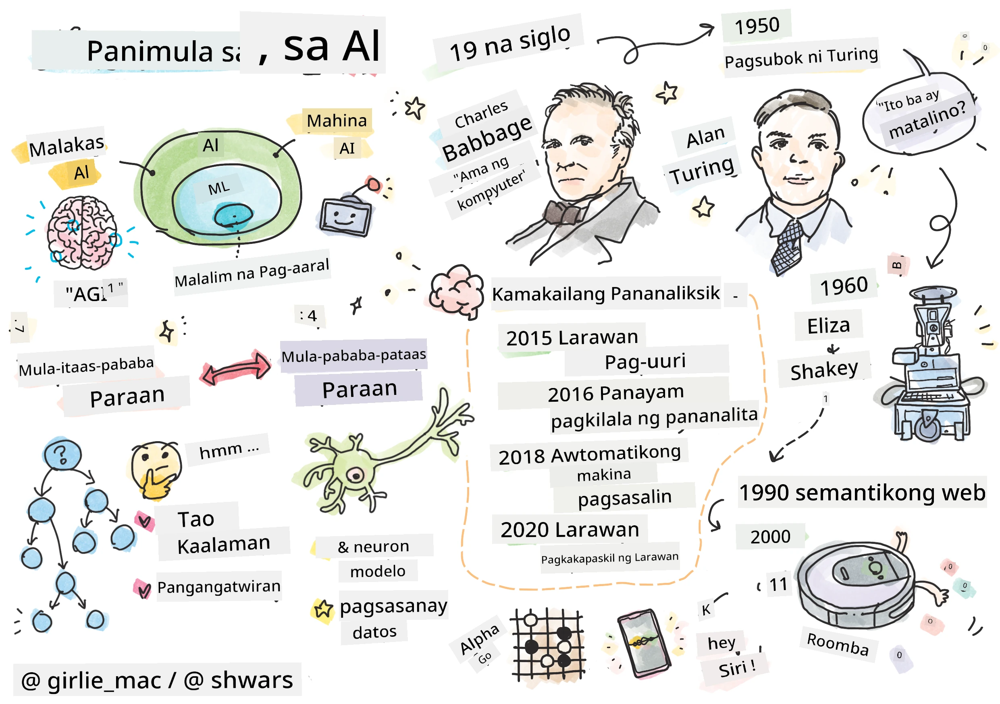
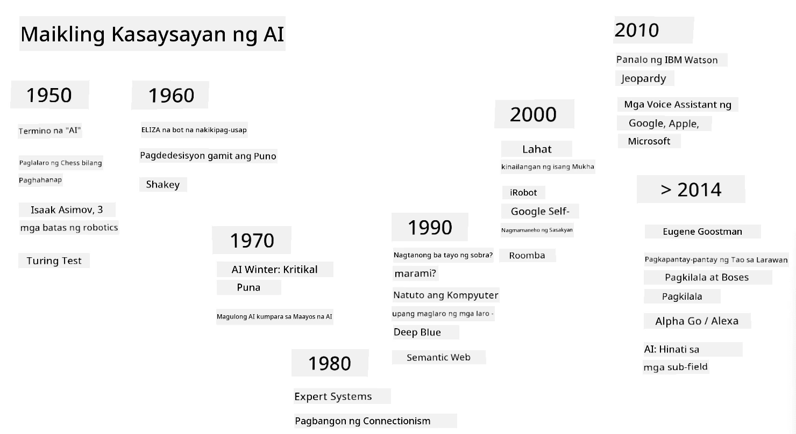
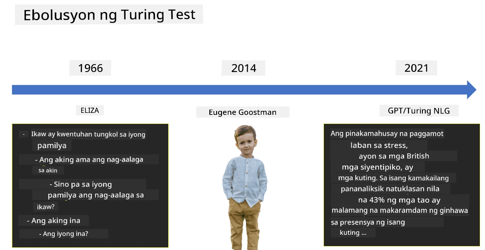

# Panimula sa AI

> Sketchnote ni [Tomomi Imura](https://twitter.com/girlie_mac)

## [Pre-lecture quiz](https://ff-quizzes.netlify.app/en/ai/quiz/1)

**Artificial Intelligence** ay isang kapanapanabik na larangan ng agham na nag-aaral kung paano natin magagawang magpakita ng matalinong pag-uugali ang mga computer, halimbawa, gawin ang mga bagay na mahusay gawin ng tao.

Noong una, ang mga computer ay naimbento ni [Charles Babbage](https://en.wikipedia.org/wiki/Charles_Babbage) upang mag-operate sa mga numero gamit ang isang malinaw na proseso - isang algorithm. Ang mga modernong computer, kahit na mas advanced kaysa sa orihinal na modelo noong ika-19 na siglo, ay sumusunod pa rin sa parehong ideya ng kontroladong pagkalkula. Kaya't posible na i-program ang isang computer upang gawin ang isang bagay kung alam natin ang eksaktong pagkakasunod-sunod ng mga hakbang na kailangan upang makamit ang layunin.

> Larawan ni [Vickie Soshnikova](http://twitter.com/vickievalerie)

> ✅ Ang pagtukoy sa edad ng isang tao mula sa kanyang larawan ay isang gawain na hindi maaaring i-program nang malinaw, dahil hindi natin alam kung paano natin nagagawa ang numero sa ating isipan kapag ginagawa natin ito.

---

May mga gawain, gayunpaman, na hindi natin alam kung paano eksaktong lutasin. Isipin ang pagtukoy sa edad ng isang tao mula sa kanyang larawan. Natutunan natin itong gawin dahil nakakita na tayo ng maraming halimbawa ng mga tao sa iba't ibang edad, ngunit hindi natin maipaliwanag nang malinaw kung paano natin ito nagagawa, o ma-program ang computer upang gawin ito. Ito ang eksaktong uri ng gawain na interesado ang **Artificial Intelligence** (AI).

✅ Mag-isip ng ilang gawain na maaari mong ipasa sa isang computer na makikinabang mula sa AI. Isaalang-alang ang mga larangan ng pananalapi, medisina, at sining - paano nakikinabang ang mga larangang ito sa AI ngayon?

## Mahinang AI vs. Malakas na AI

Mahinang AI | Malakas na AI
---------------------------------------|-------------------------------------
Ang Mahinang AI ay tumutukoy sa mga sistema ng AI na idinisenyo at sinanay para sa isang tiyak na gawain o isang makitid na hanay ng mga gawain.|Ang Malakas na AI, o Artificial General Intelligence (AGI), ay tumutukoy sa mga sistema ng AI na may antas ng katalinuhan at pag-unawa na katulad ng tao.
Ang mga sistemang ito ng AI ay hindi pangkalahatang matalino; mahusay sila sa pagsasagawa ng isang paunang natukoy na gawain ngunit kulang sa tunay na pag-unawa o kamalayan.|Ang mga sistemang ito ng AI ay may kakayahang magsagawa ng anumang intelektwal na gawain na kayang gawin ng tao, umangkop sa iba't ibang larangan, at nagtataglay ng anyo ng kamalayan o sariling kamalayan.
Halimbawa ng Mahinang AI ay ang mga virtual assistant tulad ng Siri o Alexa, mga algorithm ng rekomendasyon na ginagamit ng mga streaming service, at mga chatbot na idinisenyo para sa mga tiyak na gawain sa customer service.|Ang pagkamit ng Malakas na AI ay isang pangmatagalang layunin ng pananaliksik sa AI at mangangailangan ng pagbuo ng mga sistema ng AI na kayang mag-isip, matuto, umunawa, at umangkop sa iba't ibang gawain at konteksto.
Ang Mahinang AI ay lubos na dalubhasa at walang kakayahan sa kognitibong katulad ng tao o pangkalahatang kakayahan sa paglutas ng problema sa labas ng makitid nitong larangan.|Ang Malakas na AI ay kasalukuyang isang teoretikal na konsepto, at wala pang sistema ng AI ang umabot sa antas na ito ng pangkalahatang katalinuhan.

Para sa karagdagang impormasyon, tingnan ang **[Artificial General Intelligence](https://en.wikipedia.org/wiki/Artificial_general_intelligence)** (AGI).

## Ang Depinisyon ng Katalinuhan at ang Turing Test

Isa sa mga problema sa pagharap sa terminong **[Katalinuhan](https://en.wikipedia.org/wiki/Intelligence)** ay walang malinaw na depinisyon ng terminong ito. Maaaring sabihin ng iba na ang katalinuhan ay konektado sa **abstraktong pag-iisip**, o sa **sariling kamalayan**, ngunit hindi natin ito maipaliwanag nang maayos.

> [Larawan](https://unsplash.com/photos/75715CVEJhI) ni [Amber Kipp](https://unsplash.com/@sadmax) mula sa Unsplash

Upang makita ang kalabuan ng terminong *katalinuhan*, subukang sagutin ang tanong: "Ang pusa ba ay matalino?". Iba't ibang tao ang may iba't ibang sagot sa tanong na ito, dahil walang pangkalahatang tinatanggap na pagsusulit upang patunayan kung totoo o hindi ang pahayag. At kung sa tingin mo meron - subukang ipasa ang iyong pusa sa isang IQ test...

✅ Mag-isip ng isang minuto kung paano mo idinedefine ang katalinuhan. Ang uwak ba na kayang lutasin ang isang maze upang makakuha ng pagkain ay matalino? Ang bata ba ay matalino?

---

Kapag pinag-uusapan ang AGI, kailangan natin ng paraan upang matukoy kung nakalikha tayo ng tunay na matalinong sistema. [Alan Turing](https://en.wikipedia.org/wiki/Alan_Turing) ay nagmungkahi ng isang paraan na tinatawag na **[Turing Test](https://en.wikipedia.org/wiki/Turing_test)**, na nagsisilbi ring depinisyon ng katalinuhan. Ang pagsusulit ay naghahambing ng isang sistema sa isang bagay na likas na matalino - isang tunay na tao, at dahil ang anumang awtomatikong paghahambing ay maaaring lampasan ng isang programa ng computer, gumagamit tayo ng isang tao bilang tagapagtanong. Kaya, kung ang isang tao ay hindi makilala ang pagkakaiba sa pagitan ng isang tunay na tao at isang sistema ng computer sa text-based na pag-uusap - ang sistema ay itinuturing na matalino.

> Ang isang chat-bot na tinatawag na [Eugene Goostman](https://en.wikipedia.org/wiki/Eugene_Goostman), na binuo sa St. Petersburg, ay halos pumasa sa Turing test noong 2014 gamit ang isang matalinong personalidad na trick. Inanunsyo nito na ito ay isang 13-taong gulang na batang Ukrainian, na magpapaliwanag sa kakulangan ng kaalaman at ilang mga pagkakaiba sa teksto. Ang bot ay nakumbinsi ang 30% ng mga hukom na ito ay tao pagkatapos ng 5 minutong pag-uusap, isang sukatan na pinaniniwalaan ni Turing na maaaring maabot ng isang makina pagsapit ng 2000. Gayunpaman, dapat maunawaan na hindi ito nagpapahiwatig na nakalikha tayo ng matalinong sistema, o na ang sistema ng computer ay nalinlang ang tagapagtanong na tao - hindi nalinlang ng sistema ang mga tao, kundi ang mga tagalikha ng bot!

✅ Nalinlang ka na ba ng isang chat bot na iniisip mong nakikipag-usap ka sa isang tao? Paano ka nito nakumbinsi?

## Iba't Ibang Diskarte sa AI

Kung nais nating ang isang computer ay kumilos tulad ng tao, kailangan nating i-modelo sa loob ng computer ang paraan ng ating pag-iisip. Dahil dito, kailangan nating subukang maunawaan kung ano ang nagpapatalino sa isang tao.

> Upang ma-program ang katalinuhan sa isang makina, kailangan nating maunawaan kung paano gumagana ang ating sariling proseso ng paggawa ng desisyon. Kung mag-iisip ka ng kaunti, mapapansin mo na may ilang proseso na nangyayari nang hindi natin namamalayan – halimbawa, kaya nating makilala ang pusa mula sa aso nang hindi iniisip ito - habang ang iba ay nangangailangan ng pangangatwiran.

May dalawang posibleng diskarte sa problemang ito:

Diskarteng Top-down (Symbolic Reasoning) | Diskarteng Bottom-up (Neural Networks)
---------------------------------------|-------------------------------------
Ang diskarte ng top-down ay nagmo-modelo sa paraan ng pangangatwiran ng isang tao upang lutasin ang problema. Kasama rito ang pagkuha ng **kaalaman** mula sa tao, at pagrepresenta nito sa isang porma na mababasa ng computer. Kailangan din nating bumuo ng paraan upang i-modelo ang **pangangatwiran** sa loob ng computer. | Ang diskarte ng bottom-up ay nagmo-modelo sa istruktura ng utak ng tao, na binubuo ng napakaraming simpleng unit na tinatawag na **neurons**. Ang bawat neuron ay kumikilos tulad ng isang weighted average ng mga input nito, at maaari nating sanayin ang isang network ng neurons upang lutasin ang mga kapaki-pakinabang na problema sa pamamagitan ng pagbibigay ng **training data**.

Mayroon ding ilang iba pang posibleng diskarte sa katalinuhan:

* Ang **Emergent**, **Synergetic** o **multi-agent approach** ay batay sa katotohanan na ang kumplikadong matalinong pag-uugali ay maaaring makuha sa pamamagitan ng interaksyon ng maraming simpleng ahente. Ayon sa [evolutionary cybernetics](https://en.wikipedia.org/wiki/Global_brain#Evolutionary_cybernetics), ang katalinuhan ay maaaring *lumitaw* mula sa mas simpleng, reaktibong pag-uugali sa proseso ng *metasystem transition*.

* Ang **Evolutionary approach**, o **genetic algorithm** ay isang proseso ng pag-optimize batay sa mga prinsipyo ng ebolusyon.

Pag-aaralan natin ang mga diskarteng ito sa susunod na bahagi ng kurso, ngunit sa ngayon ay magtutuon tayo sa dalawang pangunahing direksyon: top-down at bottom-up.

### Ang Diskarteng Top-Down

Sa isang **top-down approach**, sinusubukan nating i-modelo ang ating pangangatwiran. Dahil kaya nating sundan ang ating mga iniisip kapag tayo ay nangangatwiran, maaari nating subukang gawing pormal ang prosesong ito at i-program ito sa loob ng computer. Ito ay tinatawag na **symbolic reasoning**.

Ang mga tao ay may mga patakaran sa kanilang isipan na gumagabay sa kanilang proseso ng paggawa ng desisyon. Halimbawa, kapag ang isang doktor ay nag-diagnose ng pasyente, maaaring mapansin niya na ang tao ay may lagnat, kaya't maaaring may pamamaga sa loob ng katawan. Sa pamamagitan ng paglalapat ng malaking hanay ng mga patakaran sa isang tiyak na problema, maaaring makabuo ang doktor ng panghuling diagnosis.

Ang diskarteng ito ay lubos na nakasalalay sa **knowledge representation** at **reasoning**. Ang pagkuha ng kaalaman mula sa isang eksperto ay maaaring ang pinakamahirap na bahagi, dahil sa maraming kaso, ang doktor ay hindi eksaktong alam kung bakit siya nakabuo ng partikular na diagnosis. Minsan ang solusyon ay basta na lang lumilitaw sa kanyang isipan nang walang malinaw na pag-iisip. Ang ilang mga gawain, tulad ng pagtukoy sa edad ng isang tao mula sa larawan, ay hindi maaaring bawasan sa simpleng pagmamanipula ng kaalaman.

### Diskarteng Bottom-Up

Sa kabilang banda, maaari nating subukang i-modelo ang pinakasimpleng elemento sa loob ng ating utak – ang neuron. Maaari tayong bumuo ng tinatawag na **artificial neural network** sa loob ng computer, at pagkatapos ay subukang turuan ito na lutasin ang mga problema sa pamamagitan ng pagbibigay ng mga halimbawa. Ang prosesong ito ay katulad ng kung paano natututo ang isang bagong silang na sanggol tungkol sa kanyang paligid sa pamamagitan ng pagmamasid.

✅ Mag-research ng kaunti kung paano natututo ang mga sanggol. Ano ang mga pangunahing elemento ng utak ng sanggol?

> | Paano naman ang ML?         |      |
> |--------------|-----------|
> | Ang bahagi ng Artificial Intelligence na batay sa pag-aaral ng computer upang lutasin ang problema batay sa ilang data ay tinatawag na **Machine Learning**. Hindi natin tatalakayin ang klasikong machine learning sa kursong ito - tinutukoy namin kayo sa hiwalay na [Machine Learning for Beginners](http://aka.ms/ml-beginners) na kurikulum. |       |

## Maikling Kasaysayan ng AI

Ang Artificial Intelligence ay nagsimula bilang isang larangan noong kalagitnaan ng ikadalawampung siglo. Sa simula, ang symbolic reasoning ay isang pangunahing diskarte, at nagresulta ito sa ilang mahahalagang tagumpay, tulad ng mga expert systems – mga programang computer na kayang kumilos bilang eksperto sa ilang limitadong larangan ng problema. Gayunpaman, kalaunan ay naging malinaw na ang ganitong diskarte ay hindi masyadong epektibo. Ang pagkuha ng kaalaman mula sa isang eksperto, pagrepresenta nito sa computer, at pagpapanatili ng kaalaman na tumpak ay naging napakakomplikado at masyadong mahal upang maging praktikal sa maraming kaso. Ito ang nagresulta sa tinatawag na [AI Winter](https://en.wikipedia.org/wiki/AI_winter) noong dekada 1970.

> Larawan ni [Dmitry Soshnikov](http://soshnikov.com)

Habang lumilipas ang panahon, ang mga mapagkukunan ng computing ay naging mas mura, at mas maraming data ang naging magagamit, kaya't ang mga diskarte sa neural network ay nagsimulang magpakita ng mahusay na pagganap sa pakikipagkumpitensya sa mga tao sa maraming larangan, tulad ng computer vision o pag-unawa sa pagsasalita. Sa nakaraang dekada, ang terminong Artificial Intelligence ay kadalasang ginagamit bilang kasingkahulugan ng Neural Networks, dahil karamihan sa mga tagumpay ng AI na naririnig natin ay batay dito.

Makikita natin kung paano nagbago ang mga diskarte, halimbawa, sa paglikha ng programang computer na naglalaro ng chess:

* Ang mga maagang programa sa chess ay batay sa paghahanap – ang programa ay tahasang sinusubukang tantyahin ang mga posibleng galaw ng kalaban para sa isang tiyak na bilang ng mga susunod na galaw, at pinipili ang pinakamainam na galaw batay sa pinakamainam na posisyon na maaaring makamit sa ilang galaw. Nagresulta ito sa pagbuo ng tinatawag na [alpha-beta pruning](https://en.wikipedia.org/wiki/Alpha%E2%80%93beta_pruning) search algorithm.
* Ang mga diskarte sa paghahanap ay mahusay sa pagtatapos ng laro, kung saan ang search space ay limitado sa maliit na bilang ng mga posibleng galaw. Gayunpaman, sa simula ng laro, ang search space ay napakalaki, at ang algorithm ay maaaring mapabuti sa pamamagitan ng pag-aaral mula sa mga umiiral na laban sa pagitan ng mga manlalaro ng tao. Ang mga kasunod na eksperimento ay gumamit ng tinatawag na [case-based reasoning](https://en.wikipedia.org/wiki/Case-based_reasoning), kung saan ang programa ay naghahanap ng mga kaso sa knowledge base na katulad ng kasalukuyang posisyon sa laro.
* Ang mga modernong programa na nananalo laban sa mga manlalaro ng tao ay batay sa neural networks at [reinforcement learning](https://en.wikipedia.org/wiki/Reinforcement_learning), kung saan natututo ang mga programa na maglaro sa pamamagitan lamang ng paglalaro ng mahabang panahon laban sa kanilang sarili at pag-aaral mula sa kanilang sariling mga pagkakamali – tulad ng ginagawa ng tao kapag natututo maglaro ng chess. Gayunpaman, ang isang programang computer ay maaaring maglaro ng mas maraming laro sa mas maikling panahon, kaya't mas mabilis itong natututo.

✅ Mag-research ng kaunti tungkol sa iba pang mga laro na nilalaro ng AI.

Katulad nito, makikita natin kung paano nagbago ang diskarte sa paglikha ng “mga programang nagsasalita” (na maaaring pumasa sa Turing test):

* Ang mga maagang programa ng ganitong uri tulad ng [Eliza](https://en.wikipedia.org/wiki/ELIZA), ay batay sa napakasimpleng mga panuntunan sa gramatika at ang muling pagbuo ng input na pangungusap sa isang tanong.
* Ang mga modernong assistant, tulad ng Cortana, Siri o Google Assistant ay lahat ng hybrid systems na gumagamit ng Neural networks upang i-convert ang pagsasalita sa teksto at kilalanin ang ating intensyon, at pagkatapos ay gumamit ng ilang pangangatwiran o tahasang algorithm upang maisagawa ang mga kinakailangang aksyon.
* Sa hinaharap, maaari nating asahan ang isang kumpletong neural-based na modelo upang pangasiwaan ang pag-uusap nang mag-isa. Ang kamakailang GPT at [Turing-NLG](https://www.microsoft.com/research/blog/turing-nlg-a-17-billion-parameter-language-model-by-microsoft) na pamilya ng neural networks ay nagpapakita ng mahusay na tagumpay sa larangang ito.

> Larawan ni Dmitry Soshnikov, [larawan](https://unsplash.com/photos/r8LmVbUKgns) ni [Marina Abrosimova](https://unsplash.com/@abrosimova_marina_foto), Unsplash

## Kamakailang Pananaliksik sa AI

Ang malaking pag-usbong ng pananaliksik sa neural network ay nagsimula noong 2010, nang ang malalaking pampublikong dataset ay nagsimulang maging available. Isang malaking koleksyon ng mga larawan na tinatawag na [ImageNet](https://en.wikipedia.org/wiki/ImageNet), na naglalaman ng humigit-kumulang 14 milyong annotated na mga larawan, ang nagbigay-daan sa [ImageNet Large Scale Visual Recognition Challenge](https://image-net.org/challenges/LSVRC/).

> Larawan ni [Dmitry Soshnikov](http://soshnikov.com)

Noong 2012, unang ginamit ang [Convolutional Neural Networks](../4-ComputerVision/07-ConvNets/README.md) sa image classification, na nagresulta sa malaking pagbaba ng mga error sa classification (mula halos 30% hanggang 16.4%). Noong 2015, ang ResNet architecture mula sa Microsoft Research ay [nakamit ang human-level accuracy](https://doi.org/10.1109/ICCV.2015.123).

Simula noon, ang Neural Networks ay nagpakita ng napakagandang resulta sa maraming gawain:

---

Taon | Naabot ang Human Parity
-----|--------
2015 | [Image Classification](https://doi.org/10.1109/ICCV.2015.123)
2016 | [Conversational Speech Recognition](https://arxiv.org/abs/1610.05256)
2018 | [Automatic Machine Translation](https://arxiv.org/abs/1803.05567) (Chinese-to-English)
2020 | [Image Captioning](https://arxiv.org/abs/2009.13682)

Sa nakalipas na ilang taon, nasaksihan natin ang malalaking tagumpay sa malalaking language models, tulad ng BERT at GPT-3. Nangyari ito dahil sa dami ng pangkalahatang text data na available na nagbibigay-daan sa atin na mag-train ng mga modelo upang ma-capture ang istruktura at kahulugan ng mga teksto, i-pre-train ang mga ito sa pangkalahatang koleksyon ng teksto, at pagkatapos ay i-specialize ang mga modelong ito para sa mas tiyak na mga gawain. Matututo pa tayo tungkol sa [Natural Language Processing](../5-NLP/README.md) sa susunod na bahagi ng kursong ito.

## 🚀 Hamon

Maglibot sa internet upang tukuyin kung saan, sa iyong opinyon, ang AI ay pinaka-epektibong ginagamit. Ito ba ay sa isang Mapping app, o sa isang speech-to-text service, o sa isang video game? Saliksikin kung paano binuo ang sistema.

## [Post-lecture quiz](https://ff-quizzes.netlify.app/en/ai/quiz/2)

## Review at Pag-aaral sa Sarili

Balikan ang kasaysayan ng AI at ML sa pamamagitan ng pagbabasa ng [araling ito](https://github.com/microsoft/ML-For-Beginners/tree/main/1-Introduction/2-history-of-ML). Pumili ng isang elemento mula sa sketchnote sa itaas ng araling iyon o sa araling ito at saliksikin ito nang mas malalim upang maunawaan ang kontekstong kultural na nagbigay-hugis sa ebolusyon nito.

**Takdang-Aralin**: [Game Jam](assignment.md)

---

<!-- CO-OP TRANSLATOR DISCLAIMER START -->
**Paunawa**:  
Ang dokumentong ito ay isinalin gamit ang AI translation service na [Co-op Translator](https://github.com/Azure/co-op-translator). Bagama't sinisikap naming maging tumpak, pakitandaan na ang mga awtomatikong pagsasalin ay maaaring maglaman ng mga pagkakamali o hindi pagkakatugma. Ang orihinal na dokumento sa orihinal nitong wika ang dapat ituring na opisyal na sanggunian. Para sa mahalagang impormasyon, inirerekomenda ang propesyonal na pagsasalin ng tao. Hindi kami mananagot sa anumang hindi pagkakaunawaan o maling interpretasyon na dulot ng paggamit ng pagsasaling ito.
<!-- CO-OP TRANSLATOR DISCLAIMER END -->