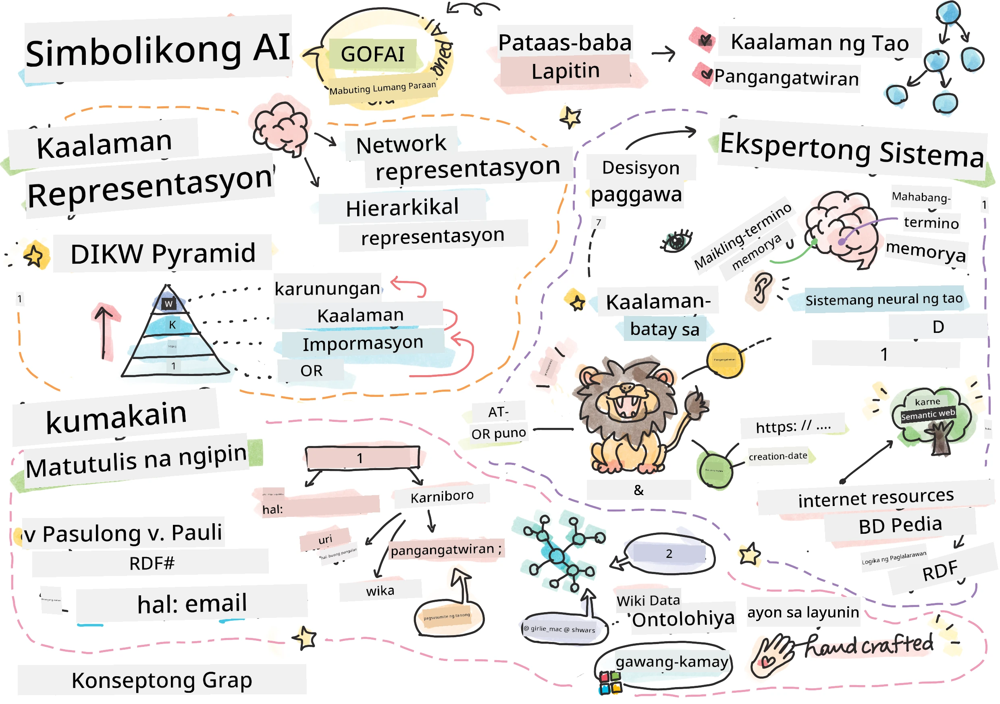
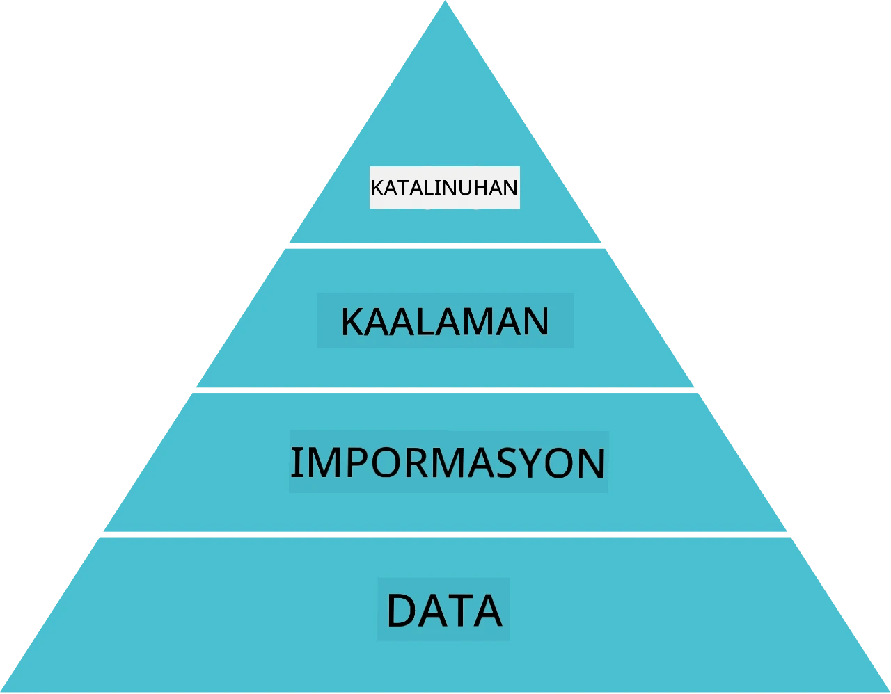
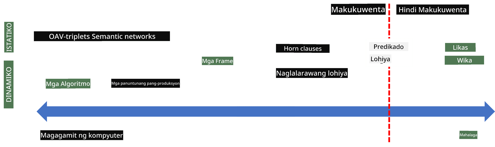
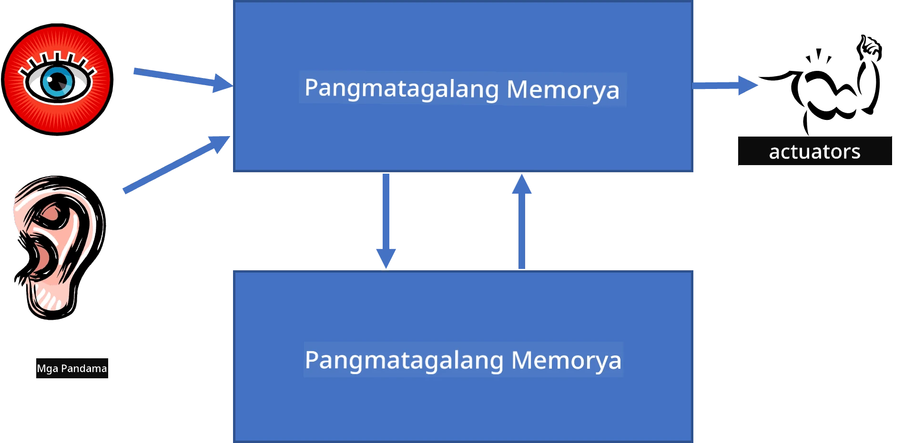
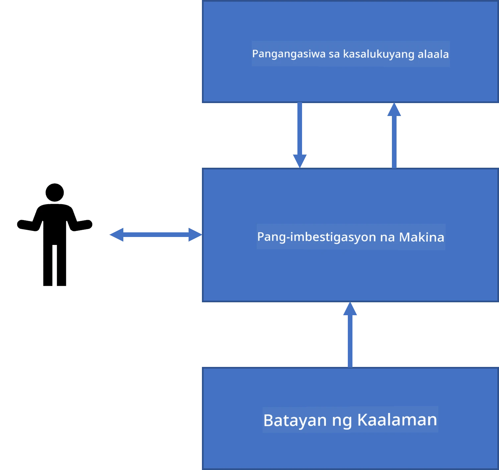
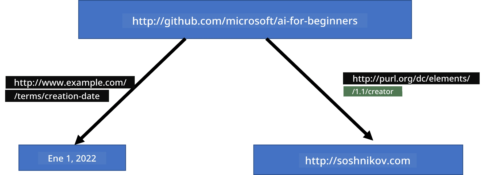
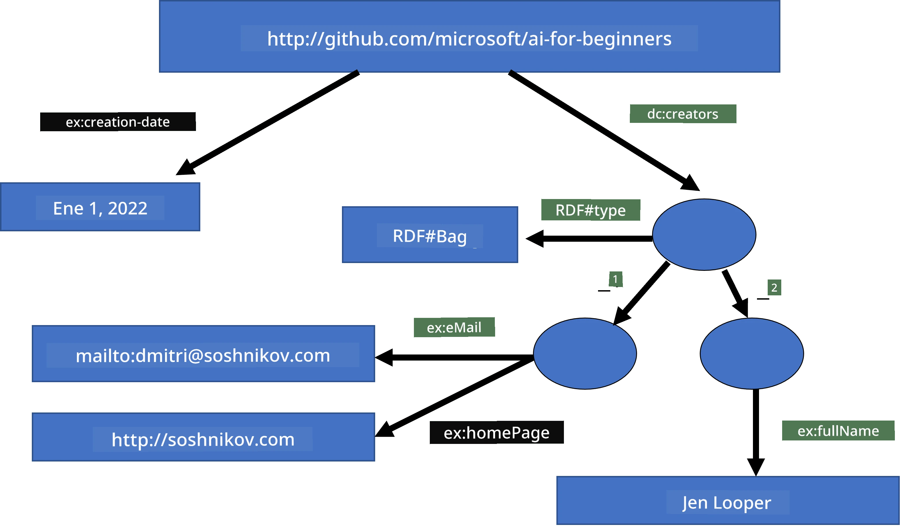
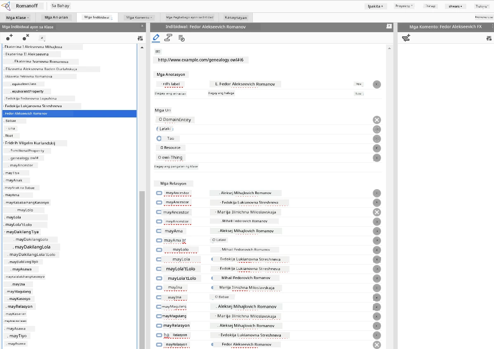

# Knowledge Representation and Expert Systems



> Sketchnote by [Tomomi Imura](https://twitter.com/girlie_mac)

Ang paghahanap para sa artificial intelligence ay batay sa paghahanap ng kaalaman, upang maintindihan ang mundo na katulad ng tao. Pero paano mo ito gagawin?

## [Pre-lecture quiz](https://ff-quizzes.netlify.app/en/ai/quiz/3)

Noong mga unang araw ng AI, ang top-down approach sa paglikha ng mga matatalinong sistema (tinalakay sa nakaraang leksiyon) ay popular. Ang ideya ay kunin ang kaalaman mula sa mga tao sa isang anyo na mababasa ng makina, at gamitin ito upang awtomatikong malutas ang mga problema. Ang approach na ito ay nakabatay sa dalawang malalaking ideya:

* Knowledge Representation
* Reasoning

## Knowledge Representation

Isa sa mga mahalagang konsepto sa Symbolic AI ay ang **kaalaman**. Mahalaga na pag-ibahin ang kaalaman mula sa *impormasyon* o *data*. Halimbawa, masasabi na ang mga libro ay naglalaman ng kaalaman, dahil maaari kang mag-aral mula sa mga libro at maging eksperto. Gayunpaman, ang laman ng mga libro ay tinatawag na *data*, at sa pagbasa ng mga libro at pagsasama ng data na ito sa ating modelo ng mundo, binabago natin ang data na ito sa kaalaman.

> ✅ **Kaalaman** ay isang bagay na nasa ating isip at nagrerepresenta ng ating pagkaunawa sa mundo. Nakukuha ito sa isang aktibong proseso ng **pagkatuto**, na nagsasama ng mga piraso ng impormasyon na natatanggap natin sa ating aktibong modelo ng mundo.

Kadalasan, hindi natin mahigpit na tinutukoy ang kaalaman, ngunit nirerespeto ito kasabay ng mga kaugnay na konsepto gamit ang [DIKW Pyramid](https://en.wikipedia.org/wiki/DIKW_pyramid). Nilalaman nito ang mga sumusunod na konsepto:

* **Data** ay isang bagay na ginawang representasyon sa pisikal na media, gaya ng nakasulat na teksto o mga salitang binigkas. Ang data ay umiiral nang hiwalay sa mga tao at maaaring ipasa sa pagitan ng mga tao.
* **Information** ay kung paano natin iniintindi ang data sa ating isip. Halimbawa, kapag narinig natin ang salitang *computer*, may ideya tayo kung ano ito.
* **Knowledge** ay ang impormasyon na isinama sa ating modelo ng mundo. Halimbawa, kapag natutunan natin ang tungkol sa computer, nagsisimula tayong magkaroon ng mga ideya kung paano ito gumagana, magkano ito, at para saan ito ginagamit. Ang network ng magkakaugnay na mga konseptong ito ang bumubuo ng ating kaalaman.
* **Wisdom** ay isa pang antas ng ating pagkaunawa sa mundo, at ito ay nagrerepresenta ng *meta-knowledge*, hal. isang ideya kung paano at kailan dapat gamitin ang kaalaman.



*Larawan [mula sa Wikipedia](https://commons.wikimedia.org/w/index.php?curid=37705247), Ni Longlivetheux - Own work, CC BY-SA 4.0*

Kaya, ang problema ng **knowledge representation** ay ang paghahanap ng epektibong paraan upang ipakita ang kaalaman sa loob ng computer sa anyo ng data, upang magamit ito nang awtomatiko. Makikita ito bilang isang spectrum:



> Image by [Dmitry Soshnikov](http://soshnikov.com)

* Sa kaliwa, may mga napakasimpleng uri ng representasyon ng kaalaman na maaaring gamitin nang epektibo ng mga computer. Ang pinakasimple ay algorithmic, kung saan ang kaalaman ay kinakatawan ng isang programa sa computer. Ngunit ito ay hindi ang pinakamahusay na paraan upang ipakita ang kaalaman, dahil hindi ito flexible. Ang kaalaman sa ating isip ay madalas na hindi algorithmic.
* Sa kanan, may mga representasyon gaya ng natural na teksto. Ito ang pinakamakapangyarihan, ngunit hindi maaaring gamitin sa awtomatikong pangangatwiran.

> ✅ Mag-isip nang sandali kung paano mo nirerepresenta ang kaalaman sa iyong isip at kino-convert ito sa mga tala. Mayroon bang partikular na format na epektibo sa'yo para makatulong sa pag-alala?

## Pag-uuri ng Mga Representasyon ng Kaalaman sa Computer

Maaari nating uriin ang iba't ibang paraan ng representasyon ng kaalaman sa computer sa mga sumusunod na kategorya:

* **Network representations** ay nakabatay sa katotohanan na mayroon tayong network ng magkakaugnay na konsepto sa ating isip. Maaari nating subukang ulitin ang parehong mga network bilang isang grap sa loob ng computer - isang tinatawag na **semantic network**.

1. **Object-Attribute-Value triplets** o **attribute-value pairs**. Dahil ang isang graph ay maaaring ipakita sa loob ng computer bilang listahan ng mga nodes at edges, maaari nating ipakita ang isang semantic network gamit ang listahan ng tatlong bahagi, na naglalaman ng mga bagay, katangian, at mga halaga. Halimbawa, ginagawa natin ang mga sumusunod na triplets tungkol sa mga programming language:

Object | Attribute | Value
-------|-----------|------
Python | is | Untyped-Language
Python | invented-by | Guido van Rossum
Python | block-syntax | indentation
Untyped-Language | doesn't have | type definitions

> ✅ Isipin kung paano magagamit ang mga triplet upang ipakita ang ibang uri ng kaalaman.

2. **Hierarchical representations** ay binibigyang-diin ang katotohanan na madalas tayong lumikha ng hierarchy ng mga bagay sa ating isip. Halimbawa, alam natin na ang kanaryo ay isang ibon, at lahat ng mga ibon ay may mga pakpak. Mayroon din tayong ideya kung anong kulay karaniwang kanaryo at kung ano ang bilis ng kanilang paglipad.

   - **Frame representation** ay nakabatay sa pagrepresenta ng bawat bagay o klase ng mga bagay bilang isang **frame** na naglalaman ng mga **slots**. Ang mga slot ay may mga posibleng default values, mga limitasyon sa halaga, o mga nakaimbak na pamamaraan na maaaring tawagin upang makuha ang halaga ng isang slot. Ang lahat ng frame ay bumubuo ng isang hierarchy na katulad ng object hierarchy sa object-oriented programming languages.
   - **Scenarios** ay espesyal na uri ng frames na nagrerepresenta ng mga kumplikadong sitwasyon na maaaring maganap sa paglipas ng panahon.

**Python**

Slot | Value | Default value | Interval |
-----|-------|---------------|----------|
Name | Python | | |
Is-A | Untyped-Language | | |
Variable Case | | CamelCase | |
Program Length | | | 5-5000 lines |
Block Syntax | Indent | | |

3. **Procedural representations** ay nakabatay sa pagrepresenta ng kaalaman gamit ang listahan ng mga aksyon na maaaring isagawa kapag may isang partikular na kondisyon.
   - Ang production rules ay mga if-then na pahayag na nagbibigay-daan sa atin upang makabuo ng mga konklusyon. Halimbawa, ang doktor ay maaaring magkaroon ng panuntunan na nagsasabing **KUNG** ang pasyente ay may mataas na lagnat **O** mataas na antas ng C-reactive protein sa pagsusuri ng dugo **KAYON** siya ay may pamamaga. Kapag naranasan natin ang isa sa mga kondisyong ito, maaari tayong gumawa ng konklusyon tungkol sa pamamaga, at gamitin ito sa karagdagang pangangatwiran.
   - Ang mga algorithm ay maaaring ituring na isa pang anyo ng procedural representation, bagaman halos hindi ito direktang ginagamit sa mga knowledge-based systems.

4. **Logic** ay unang iminungkahi ni Aristotle bilang isang paraan upang ipakita ang unibersal na kaalaman ng tao.
   - Ang Predicate Logic bilang isang teoryang matematikal ay masyadong masagana upang maging computable, kaya ginagamit ang ilang bahagi lamang nito, tulad ng mga Horn clauses na ginagamit sa Prolog.
   - Ang Descriptive Logic ay isang pamilya ng mga sistemang lohikal na ginagamit upang ipakita at mangangatwiran tungkol sa hierarchies ng mga bagay na nakakalat sa mga knowledge representations tulad ng *semantic web*.

## Expert Systems

Isa sa mga unang tagumpay ng symbolic AI ay ang tinatawag na **expert systems** - mga computer system na idinisenyo upang kumilos bilang eksperto sa isang limitado na domain ng problema. Nakabatay ito sa isang **knowledge base** na nakuha mula sa isa o higit pang mga human expert, at naglalaman ng isang **inference engine** na nagsasagawa ng pangangatwiran dito.

 | 
---------------------------------------------|------------------------------------------------
Pinadaling istruktura ng neural system ng tao | Arkitektura ng knowledge-based system

Ang mga expert system ay ginawa katulad ng sistema ng pag-iisip ng tao, na naglalaman ng **short-term memory** at **long-term memory**. Katulad nito, sa knowledge-based systems ay tinutukoy natin ang mga sumusunod na bahagi:

* **Problem memory**: naglalaman ng kaalaman tungkol sa problemang kasalukuyang nilulutas, hal. ang temperatura o presyon ng dugo ng pasyente, kung siya ay may pamamaga o wala, atbp. Ang kaalamang ito ay tinatawag ding **static knowledge**, dahil naglalaman ito ng isang snapshot ng kung ano ang kasalukuyan nating alam tungkol sa problema - ang tinatawag na *problem state*.
* **Knowledge base**: nagrerepresenta ng pangmatagalang kaalaman tungkol sa domain ng problema. Kinukuha ito nang manu-mano mula sa mga human expert, at hindi nagbabago mula sa konsultasyon sa konsultasyon. Dahil pinapayagan nito tayo na mag-navigate mula sa isang problem state patungo sa iba pa, tinatawag din itong **dynamic knowledge**.
* **Inference engine**: pinamamahalaan ang buong proseso ng paghahanap sa problem state space, nagtatanong sa gumagamit kung kinakailangan. Responsable rin ito sa paghahanap ng tamang mga panuntunan na dapat ilapat sa bawat estado.

Bilang halimbawa, isaalang-alang natin ang sumusunod na expert system para matukoy ang isang hayop base sa mga pisikal na katangian nito:


> Image by [Dmitry Soshnikov](http://soshnikov.com)

Ang diagram na ito ay tinatawag na **AND-OR tree**, at ito ay isang grapikal na representasyon ng isang set ng mga production rules. Ang pagguhit ng puno ay kapaki-pakinabang sa simula ng pagkuha ng kaalaman mula sa eksperto. Upang ipakita ang kaalaman sa loob ng computer, mas praktikal na gamitin ang mga panuntunan:

```
IF the animal eats meat
OR (animal has sharp teeth
    AND animal has claws
    AND animal has forward-looking eyes
) 
THEN the animal is a carnivore
```

Mapapansin mo na bawat kondisyon sa kaliwang bahagi ng panuntunan at ang aksyon ay mga object-attribute-value (OAV) triplets. Ang **working memory** ay naglalaman ng set ng OAV triplets na tumutugma sa problemang kasalukuyang nilulutas. Ang isang **rules engine** ay naghahanap ng mga panuntunan kung saan ang isang kondisyon ay nasusunod at inilalapat ang mga ito, nagdaragdag ng isa pang triplet sa working memory.

> ✅ Gumawa ng sarili mong AND-OR tree sa isang paksang gusto mo!

### Forward vs. Backward Inference

Ang prosesong inilarawan sa itaas ay tinatawag na **forward inference**. Nagsisimula ito sa ilang panimulang data tungkol sa problema na nasa working memory, at pagkatapos ay isinasagawa ang sumusunod na reasoning loop:

1. Kung ang target attribute ay naroroon sa working memory - huminto at ibigay ang resulta
2. Hanapin ang lahat ng panuntunan na ang kondisyon ay kasalukuyang nasusunod - kunin ang **conflict set** ng panuntunan.
3. Isagawa ang **conflict resolution** - piliin ang isang panuntunan na isasakatuparan sa hakbang na ito. Maaaring may iba't ibang estratehiya sa conflict resolution:
   - Piliin ang unang naaangkop na panuntunan sa knowledge base
   - Piliin ang isang random na panuntunan
   - Piliin ang *mas partikular* na panuntunan, ibig sabihin ang sumasapat sa pinakamaraming kondisyon sa "kaliwang bahagi" (LHS)
4. Ipatupad ang piniling panuntunan at ipasok ang bagong piraso ng kaalaman sa problem state
5. Ulitin mula sa hakbang 1.

Gayunpaman, sa ilang mga kaso nais nating magsimula nang walang kaalaman tungkol sa problema, at magtanong ng mga katanungan na makakatulong sa atin na makabuo ng konklusyon. Halimbawa, kapag gumagawa ng medikal na diagnosis, karaniwang hindi natin ginagawa lahat ng medikal na pagsusuri bago simulan ang pagsusuri sa pasyente. Mas gusto nating gawin ang pagsusuri kapag kailangan na magpasya.

Ang prosesong ito ay maaaring imodelo gamit ang **backward inference**. Pinapatakbo ito ng **layunin** - ang halaga ng attribute na nais nating matuklasan:

1. Piliin ang lahat ng panuntunan na makapagbibigay sa atin ng halaga ng layunin (ibig sabihin na ang layunin ay nasa RHS ("right-hand-side")) - isang conflict set
1. Kung walang panuntunan para sa attributeang ito, o may panuntunan na nagsasabing tanungin ang gumagamit para sa halaga - itanong ito, kung hindi:
1. Gamitin ang conflict resolution strategy para pumili ng isang panuntunan na gagamitin bilang *hypothesis* - susubukan nating patunayan ito
1. Ulitin ang proseso para sa lahat ng attribute sa LHS ng panuntunan, sinusubukang patunayan ito bilang mga layunin
1. Kung sa anumang punto nabigo ang proseso - gamitin ang ibang panuntunan sa hakbang 3.

> ✅ Saang mga sitwasyon mas angkop ang forward inference? Paano naman ang backward inference?

### Pagsasagawa ng Expert Systems

Maaaring ipatupad ang mga expert system gamit ang iba't ibang mga kagamitan:

* Direktang pagprograma gamit ang ilang mataas na antas na wika sa programming. Hindi ito ang pinakamahusay na ideya, dahil ang pangunahing bentahe ng isang knowledge-based system ay naihihiwalay ang kaalaman mula sa inference, at posibleng ang isang eksperto sa domain ng problema ay dapat makapag-sulat ng mga panuntunan nang hindi naiintindihan ang mga detalye ng proseso ng inference
* Paggamit ng **expert systems shell**, ibig sabihin isang sistema na partikular na dinisenyo upang mapunuan ng kaalaman gamit ang isang wika sa representasyon ng kaalaman.

## ✍️ Exercise: Animal Inference

Tingnan ang [Animals.ipynb](https://github.com/microsoft/AI-For-Beginners/blob/main/lessons/2-Symbolic/Animals.ipynb) para sa halimbawa ng pagsasagawa ng forward at backward inference expert system.

> **Note**: Ang halimbawang ito ay medyo simple lamang, at nagbibigay lang ng ideya kung paano ang hitsura ng isang expert system. Kapag nagsimula kang gumawa ng ganitong sistema, mapapansin mo ang ilang *matalinong* pag-uugali mula rito kapag umabot ka sa isang tiyak na bilang ng mga panuntunan, mga 200+. Sa isang punto, nagiging komplikado na ang mga panuntunan upang maalala lahat ito, at sa puntong ito, maaaring matagpuan mo ang iyong sarili na nagtatanong kung bakit ang isang sistema ay gumawa ng ilang mga desisyon. Gayunpaman, ang mahalagang katangian ng mga knowledge-based system ay palagi mong maaaring *ipaliwanag* nang eksakto kung paano ginawa ang alinman sa mga desisyon.

## Ontologies and the Semantic Web

Sa huling bahagi ng ika-20 siglo, may inisyatibo upang gamitin ang representasyon ng kaalaman upang lagyan ng anote ang mga mapagkukunan sa Internet, upang posible na makahanap ng mga mapagkukunan na tumutugma sa napaka-partikular na mga query. Ang kilusang ito ay tinawag na **Semantic Web**, at ito ay nakasalalay sa ilang mga konsepto:

- Isang espesyal na representasyon ng kaalaman batay sa **[description logics](https://en.wikipedia.org/wiki/Description_logic)** (DL). Katulad ito ng frame knowledge representation, dahil bumubuo ito ng hierarchy ng mga bagay na may mga katangian, ngunit mayroon itong pormal na lohikal na semantika at inference. May buong pamilya ng DLs na nagpapanatili ng balanse sa pagitan ng pagka-makapangyarihan at algorithmic na kumplikadong inference.
- Distributed knowledge representation, kung saan lahat ng konsepto ay kinakatawan ng isang global URI identifier, na nagpapahintulot na lumikha ng mga hierarchy ng kaalaman na sumasaklaw sa internet.
- Isang pamilya ng mga lengguwaheng nakabase sa XML para sa paglalarawan ng kaalaman: RDF (Resource Description Framework), RDFS (RDF Schema), OWL (Ontology Web Language).

Isang pangunahing konsepto sa Semantic Web ay ang konsepto ng **Ontology**. Ito ay tumutukoy sa isang tiyak na pagtutukoy ng isang larangan ng problema gamit ang isang pormal na representasyon ng kaalaman. Ang pinakasimpleng ontology ay maaaring isang hierarkiya lamang ng mga bagay sa larangan ng problema, ngunit ang mas kumplikadong mga ontology ay maglalaman ng mga patakaran na maaaring gamitin para sa pangangatwiran.

Sa semantic web, lahat ng representasyon ay nakabase sa mga triplet. Bawat bagay at bawat relasyon ay natatanging kinikilala gamit ang URI. Halimbawa, kung nais nating ipahayag ang katotohanang ang AI Curriculum na ito ay ginawa ni Dmitry Soshnikov noong Enero 1, 2022 - narito ang mga triplet na maaari nating gamitin:



```
http://github.com/microsoft/ai-for-beginners http://www.example.com/terms/creation-date “Jan 1, 2022”
http://github.com/microsoft/ai-for-beginners http://purl.org/dc/elements/1.1/creator http://soshnikov.com
```

> ✅ Dito ang `http://www.example.com/terms/creation-date` at `http://purl.org/dc/elements/1.1/creator` ay ilang kilala at unibersal na tinatanggap na mga URI upang ipahayag ang mga konsepto ng *creator* at *creation date*.

Sa mas kumplikadong kaso, kung nais nating tukuyin ang isang listahan ng mga tagalikha, maaari tayong gumamit ng ilang mga estruktura ng datos na nilikha sa RDF.



> Mga diagram sa itaas ni [Dmitry Soshnikov](http://soshnikov.com)

Ang pag-unlad ng Semantic Web ay medyo naantala dahil sa tagumpay ng mga search engine at mga teknik sa natural language processing, na nagpapahintulot ng pagkuha ng istrukturadong datos mula sa teksto. Gayunpaman, sa ilang mga larangan ay may mga makabuluhang pagsisikap pa rin upang mapanatili ang mga ontology at mga base ng kaalaman. Ilang proyekto na karapat-dapat pansinin:

* [WikiData](https://wikidata.org/) ay isang koleksyon ng machine readable knowledge bases na kaugnay ng Wikipedia. Karamihan ng datos ay hinango mula sa Wikipedia *InfoBoxes*, mga piraso ng istrukturadong nilalaman sa loob ng mga pahina ng Wikipedia. Maaari mong [itanong](https://query.wikidata.org/) ang wikidata gamit ang SPARQL, isang espesyal na wika ng query para sa Semantic Web. Narito ang isang halimbawa ng query na nagpapakita ng mga pinakasikat na kulay ng mata ng mga tao:

```sparql
#defaultView:BubbleChart
SELECT ?eyeColorLabel (COUNT(?human) AS ?count)
WHERE
{
  ?human wdt:P31 wd:Q5.       # human instance-of homo sapiens
  ?human wdt:P1340 ?eyeColor. # human eye-color ?eyeColor
  SERVICE wikibase:label { bd:serviceParam wikibase:language "en". }
}
GROUP BY ?eyeColorLabel
```

* [DBpedia](https://www.dbpedia.org/) ay isa pang pagsisikap na katulad ng WikiData.

> ✅ Kung nais mong mag-eksperimento sa paggawa ng sarili mong mga ontology, o buksan ang mga umiiral na, mayroong isang mahusay na visual ontology editor na tinatawag na [Protégé](https://protege.stanford.edu/). I-download ito, o gamitin ito online.



*Web Protégé editor na bukas gamit ang Romanov Family ontology. Screenshot ni Dmitry Soshnikov*

## ✍️ Ehersisyo: Isang Ontology ng Pamilya

Tingnan ang [FamilyOntology.ipynb](https://github.com/Ezana135/AI-For-Beginners/blob/main/lessons/2-Symbolic/FamilyOntology.ipynb) para sa isang halimbawa ng paggamit ng mga teknik ng Semantic Web upang magpaliwanag tungkol sa mga relasyon sa pamilya. Gagamitin natin ang isang family tree na kinakatawan sa karaniwang format na GEDCOM at isang ontology ng mga relasyon sa pamilya at gagawa ng isang graph ng lahat ng relasyon ng pamilya para sa isang ibinigay na set ng mga indibidwal.

## Microsoft Concept Graph

Sa karamihan ng mga kaso, ang mga ontology ay maingat na nilikha ng kamay. Gayunpaman, posible rin na **mahukay** ang mga ontology mula sa hindi istrukturadong datos, halimbawa, mula sa mga teksto sa natural na wika.

Isang ganitong pagtatangka ay ginawa ng Microsoft Research, at nagresulta sa [Microsoft Concept Graph](https://blogs.microsoft.com/ai/microsoft-researchers-release-graph-that-helps-machines-conceptualize/?WT.mc_id=academic-77998-cacaste).

Ito ay isang malaking koleksyon ng mga entity na pinagsama gamit ang relasyon ng `is-a` na inhinyeriya. Pinapayagan nitong sagutin ang mga tanong tulad ng "Ano ang Microsoft?" - ang sagot ay tulad ng "isang kumpanya na may probabilidad na 0.87, at isang tatak na may probabilidad na 0.75".

Ang Graph ay available bilang REST API, o bilang isang malaking downloadable na text file na naglalaman ng lahat ng pares ng entity.

## ✍️ Ehersisyo: Isang Concept Graph

Subukan ang [MSConceptGraph.ipynb](https://github.com/microsoft/AI-For-Beginners/blob/main/lessons/2-Symbolic/MSConceptGraph.ipynb) notebook upang makita kung paano natin magagamit ang Microsoft Concept Graph upang pangkatin ang mga balita sa ilang mga kategorya.

## Konklusyon

Sa kasalukuyan, madalas na itinuturing ang AI bilang sinalitang para sa *Machine Learning* o *Neural Networks*. Gayunpaman, nagpapakita rin ang tao ng tahasang pangangatwiran, na isang bagay na kasalukuyang hindi nalalampasan ng neural networks. Sa mga totoong proyekto, ang tahasang pangangatwiran ay ginagamit pa rin upang magawa ang mga gawain na nangangailangan ng mga paliwanag, o upang mabago ang kilos ng sistema sa kontroladong paraan.

## 🚀 Hamon

Sa Family Ontology notebook na kaugnay ng leksyong ito, may pagkakataon upang mag-eksperimento sa iba pang mga relasyon sa pamilya. Subukang tuklasin ang mga bagong koneksyon sa pagitan ng mga tao sa family tree.

## [Post-lecture quiz](https://ff-quizzes.netlify.app/en/ai/quiz/4)

## Review & Self Study

Magsaliksik sa internet upang tuklasin ang mga larangan kung saan sinubukan ng mga tao na kwantipikahin at kodigo ang kaalaman. Tingnan ang Bloom's Taxonomy, at balikan ang kasaysayan upang matutunan kung paano sinubukang unawain ng mga tao ang kanilang mundo. Suriin ang gawa ni Linnaeus sa paglikha ng isang taxonomy ng mga organismo, at obserbahan ang paraan kung paano nilikha ni Dmitri Mendeleev ang isang paraan upang ilarawan at pangkatin ang mga elementong kemikal. Anong iba pang mga kawili-wiling halimbawa ang maaari mong makita?

**Assignment**: [Build an Ontology](assignment.md)

---

<!-- CO-OP TRANSLATOR DISCLAIMER START -->
**Paunawa**:
Ang dokumentong ito ay isinalin gamit ang AI translation service na [Co-op Translator](https://github.com/Azure/co-op-translator). Bagamat aming pinagsisikapang maging tumpak ang pagsasalin, pakatandaan na ang mga awtomatikong pagsasalin ay maaaring maglaman ng mga pagkakamali o hindi pagkakatugma. Ang orihinal na dokumento sa orihinal nitong wika ang dapat ituring na pangunahing sanggunian. Para sa mahahalagang impormasyon, inirerekomenda ang propesyonal na pagsasalin ng tao. Hindi kami mananagot sa anumang hindi pagkakaunawaan o maling interpretasyon na maaaring magmula sa paggamit ng pagsasaling ito.
<!-- CO-OP TRANSLATOR DISCLAIMER END -->