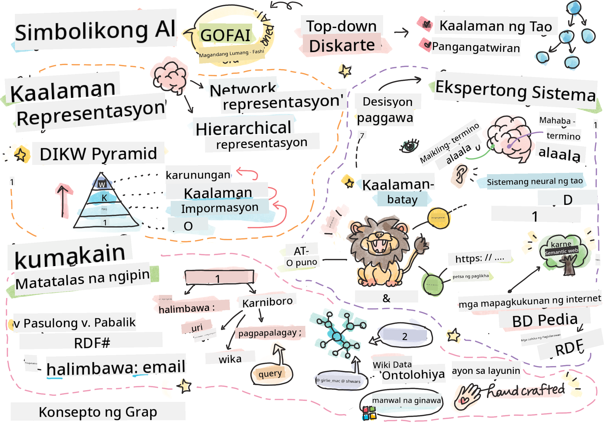
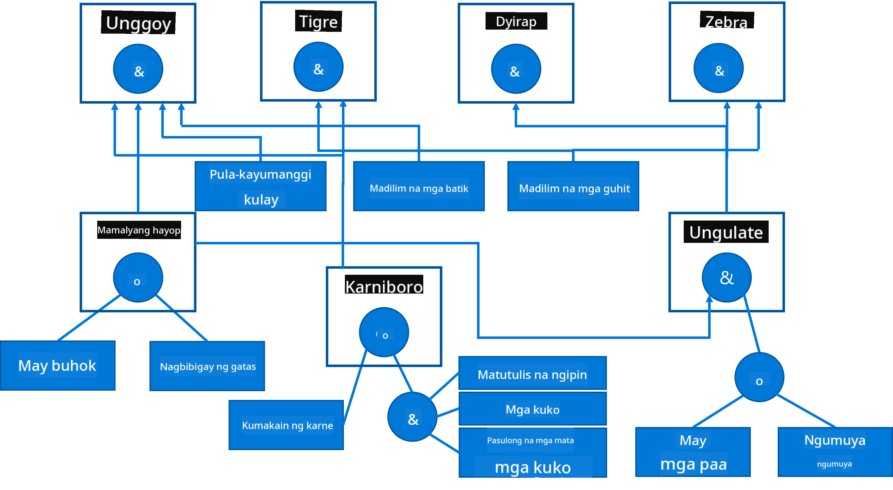

<!--
CO_OP_TRANSLATOR_METADATA:
{
  "original_hash": "7d097f7fda9166ead615e4c34552381b",
  "translation_date": "2025-09-23T06:56:14+00:00",
  "source_file": "lessons/2-Symbolic/README.md",
  "language_code": "tl"
}
-->
# Representasyon ng Kaalaman at Mga Ekspertong Sistema



> Sketchnote ni [Tomomi Imura](https://twitter.com/girlie_mac)

Ang layunin ng artipisyal na intelihensiya ay nakabatay sa paghahanap ng kaalaman, upang maunawaan ang mundo katulad ng ginagawa ng tao. Pero paano mo ito magagawa?

## [Pre-lecture quiz](https://ff-quizzes.netlify.app/en/ai/quiz/3)

Sa mga unang araw ng AI, ang top-down na paraan ng paglikha ng mga intelligent na sistema (tinalakay sa nakaraang aralin) ay popular. Ang ideya ay kunin ang kaalaman mula sa mga tao sa isang anyong nababasa ng makina, at pagkatapos ay gamitin ito upang awtomatikong lutasin ang mga problema. Ang pamamaraang ito ay nakabatay sa dalawang malalaking ideya:

* Representasyon ng Kaalaman
* Pangangatwiran

## Representasyon ng Kaalaman

Isa sa mga mahalagang konsepto sa Symbolic AI ay ang **kaalaman**. Mahalagang maiba ang kaalaman mula sa *impormasyon* o *data*. Halimbawa, maaaring sabihin na ang mga libro ay naglalaman ng kaalaman, dahil maaaring mag-aral mula sa mga libro at maging eksperto. Gayunpaman, ang nilalaman ng mga libro ay tinatawag na *data*, at sa pamamagitan ng pagbabasa ng mga libro at pagsasama ng data na ito sa ating modelo ng mundo, nagiging kaalaman ang data na ito.

> ✅ **Kaalaman** ay isang bagay na nasa ating isipan at kumakatawan sa ating pag-unawa sa mundo. Ito ay nakukuha sa pamamagitan ng aktibong **proseso ng pag-aaral**, na nag-iintegrate ng mga piraso ng impormasyon na natatanggap natin sa ating aktibong modelo ng mundo.

Kadalasan, hindi natin mahigpit na tinutukoy ang kaalaman, ngunit iniuugnay natin ito sa iba pang kaugnay na konsepto gamit ang [DIKW Pyramid](https://en.wikipedia.org/wiki/DIKW_pyramid). Naglalaman ito ng mga sumusunod na konsepto:

* **Data** ay isang bagay na kinakatawan sa pisikal na media, tulad ng nakasulat na teksto o binigkas na mga salita. Ang data ay umiiral nang hiwalay sa mga tao at maaaring ipasa sa pagitan ng mga tao.
* **Impormasyon** ay kung paano natin ini-interpret ang data sa ating isipan. Halimbawa, kapag narinig natin ang salitang *kompyuter*, mayroon tayong ilang pag-unawa kung ano ito.
* **Kaalaman** ay impormasyon na isinama sa ating modelo ng mundo. Halimbawa, kapag natutunan natin kung ano ang kompyuter, nagsisimula tayong magkaroon ng mga ideya kung paano ito gumagana, magkano ang halaga nito, at kung para saan ito magagamit. Ang network ng magkakaugnay na konsepto ay bumubuo ng ating kaalaman.
* **Karunungan** ay isa pang antas ng ating pag-unawa sa mundo, at kumakatawan ito sa *meta-kaalaman*, halimbawa, ilang ideya kung paano at kailan dapat gamitin ang kaalaman.


*Larawan [mula sa Wikipedia](https://commons.wikimedia.org/w/index.php?curid=37705247), Ni Longlivetheux - Sariling gawa, CC BY-SA 4.0*

Kaya, ang problema ng **representasyon ng kaalaman** ay ang paghahanap ng epektibong paraan upang kumatawan sa kaalaman sa loob ng isang kompyuter sa anyo ng data, upang magamit ito nang awtomatiko. Ito ay maaaring makita bilang isang spectrum:


> Larawan ni [Dmitry Soshnikov](http://soshnikov.com)

* Sa kaliwa, mayroong napakasimpleng uri ng representasyon ng kaalaman na maaaring epektibong magamit ng mga kompyuter. Ang pinakasimple ay algorithmic, kung saan ang kaalaman ay kinakatawan ng isang programa ng kompyuter. Gayunpaman, hindi ito ang pinakamahusay na paraan upang kumatawan sa kaalaman, dahil hindi ito flexible. Ang kaalaman sa ating isipan ay kadalasang hindi algorithmic.
* Sa kanan, mayroong mga representasyon tulad ng natural na teksto. Ito ang pinakamakapangyarihan, ngunit hindi magagamit para sa awtomatikong pangangatwiran.

> ✅ Mag-isip ng isang minuto kung paano mo kinakatawan ang kaalaman sa iyong isipan at isinasalin ito sa mga tala. Mayroon bang partikular na format na epektibo para sa iyo upang matulungan ang pag-alala?

## Pag-uuri ng Representasyon ng Kaalaman ng Kompyuter

Maaari nating uriin ang iba't ibang paraan ng representasyon ng kaalaman ng kompyuter sa mga sumusunod na kategorya:

* **Network representations** ay nakabatay sa katotohanan na mayroon tayong network ng magkakaugnay na konsepto sa ating isipan. Maaari nating subukang muling likhain ang parehong mga network bilang isang graph sa loob ng isang kompyuter - ang tinatawag na **semantic network**.

1. **Object-Attribute-Value triplets** o **attribute-value pairs**. Dahil ang isang graph ay maaaring kumatawan sa loob ng isang kompyuter bilang isang listahan ng mga nodes at edges, maaari nating kumatawan sa isang semantic network sa pamamagitan ng isang listahan ng mga triplets, na naglalaman ng mga object, attribute, at value. Halimbawa, bumuo tayo ng mga sumusunod na triplets tungkol sa mga programming language:

Object | Attribute | Value
-------|-----------|------
Python | ay | Untyped-Language
Python | imbento-ni | Guido van Rossum
Python | block-syntax | indentation
Untyped-Language | wala | type definitions

> ✅ Mag-isip kung paano maaaring gamitin ang mga triplets upang kumatawan sa iba pang uri ng kaalaman.

2. **Hierarchical representations** binibigyang-diin ang katotohanan na madalas tayong lumikha ng hierarchy ng mga object sa ating isipan. Halimbawa, alam natin na ang canary ay isang ibon, at lahat ng ibon ay may pakpak. Mayroon din tayong ideya kung anong kulay ang karaniwang canary, at kung ano ang bilis ng kanilang paglipad.

   - **Frame representation** ay nakabatay sa pagrepresenta ng bawat object o klase ng mga object bilang isang **frame** na naglalaman ng **slots**. Ang mga slots ay may posibleng default na mga value, mga limitasyon ng value, o mga nakaimbak na proseso na maaaring tawagin upang makuha ang value ng isang slot. Ang lahat ng mga frame ay bumubuo ng isang hierarchy na katulad ng object hierarchy sa mga object-oriented programming language.
   - **Scenarios** ay espesyal na uri ng mga frame na kumakatawan sa mga kumplikadong sitwasyon na maaaring maganap sa paglipas ng panahon.

**Python**

Slot | Value | Default value | Interval |
-----|-------|---------------|----------|
Name | Python | | |
Is-A | Untyped-Language | | |
Variable Case | | CamelCase | |
Program Length | | | 5-5000 lines |
Block Syntax | Indent | | |

3. **Procedural representations** ay nakabatay sa pagrepresenta ng kaalaman sa pamamagitan ng isang listahan ng mga aksyon na maaaring isagawa kapag naganap ang isang tiyak na kondisyon.
   - Production rules ay mga if-then na pahayag na nagpapahintulot sa atin na gumawa ng mga konklusyon. Halimbawa, maaaring magkaroon ng rule ang isang doktor na nagsasabing **KUNG** ang isang pasyente ay may mataas na lagnat **O** mataas na antas ng C-reactive protein sa blood test **KUNG GAYON** siya ay may impeksyon. Kapag nakatagpo tayo ng isa sa mga kondisyon, maaari tayong gumawa ng konklusyon tungkol sa impeksyon, at pagkatapos ay gamitin ito sa karagdagang pangangatwiran.
   - Algorithms ay maaaring ituring na isa pang anyo ng procedural representation, bagaman halos hindi ito direktang ginagamit sa mga knowledge-based system.

4. **Logic** ay orihinal na iminungkahi ni Aristotle bilang isang paraan upang kumatawan sa unibersal na kaalaman ng tao.
   - Predicate Logic bilang isang mathematical theory ay masyadong mayaman upang maging computable, kaya't ang ilang subset nito ang karaniwang ginagamit, tulad ng Horn clauses na ginagamit sa Prolog.
   - Descriptive Logic ay isang pamilya ng mga logical system na ginagamit upang kumatawan at magbigay ng pangangatwiran tungkol sa mga hierarchy ng mga object na ipinamamahagi sa mga representasyon ng kaalaman tulad ng *semantic web*.

## Mga Ekspertong Sistema

Isa sa mga maagang tagumpay ng symbolic AI ay ang tinatawag na **mga ekspertong sistema** - mga sistema ng kompyuter na idinisenyo upang kumilos bilang isang eksperto sa ilang limitadong domain ng problema. Ang mga ito ay nakabatay sa isang **knowledge base** na kinuha mula sa isa o higit pang mga eksperto, at naglalaman ng isang **inference engine** na gumagawa ng pangangatwiran sa ibabaw nito.

 | 
---------------------------------------------|------------------------------------------------
Pinadaling istruktura ng neural system ng tao | Arkitektura ng sistema na batay sa kaalaman

Ang mga ekspertong sistema ay binuo tulad ng sistema ng pangangatwiran ng tao, na naglalaman ng **short-term memory** at **long-term memory**. Katulad nito, sa mga sistema na batay sa kaalaman, tinutukoy natin ang mga sumusunod na bahagi:

* **Problem memory**: naglalaman ng kaalaman tungkol sa problemang kasalukuyang nilulutas, halimbawa, ang temperatura o presyon ng dugo ng isang pasyente, kung siya ay may impeksyon o wala, atbp. Ang kaalamang ito ay tinatawag ding **static knowledge**, dahil naglalaman ito ng snapshot ng kung ano ang kasalukuyang alam natin tungkol sa problema - ang tinatawag na *problem state*.
* **Knowledge base**: kumakatawan sa pangmatagalang kaalaman tungkol sa isang domain ng problema. Ito ay manu-manong kinuha mula sa mga eksperto, at hindi nagbabago mula sa konsultasyon hanggang konsultasyon. Dahil pinapayagan nitong mag-navigate mula sa isang problem state patungo sa isa pa, tinatawag din itong **dynamic knowledge**.
* **Inference engine**: nag-oorganisa ng buong proseso ng paghahanap sa problem state space, nagtatanong sa user kung kinakailangan. Responsable rin ito sa paghahanap ng tamang mga rules na dapat ilapat sa bawat estado.

Bilang halimbawa, isaalang-alang natin ang sumusunod na ekspertong sistema ng pagtukoy ng isang hayop batay sa mga pisikal na katangian nito:



> Larawan ni [Dmitry Soshnikov](http://soshnikov.com)

Ang diagram na ito ay tinatawag na **AND-OR tree**, at ito ay isang graphical na representasyon ng isang set ng production rules. Ang pagguhit ng tree ay kapaki-pakinabang sa simula ng pagkuha ng kaalaman mula sa eksperto. Upang kumatawan sa kaalaman sa loob ng kompyuter, mas maginhawa ang paggamit ng mga rules:

```
IF the animal eats meat
OR (animal has sharp teeth
    AND animal has claws
    AND animal has forward-looking eyes
) 
THEN the animal is a carnivore
```

Mapapansin mo na ang bawat kondisyon sa kaliwang bahagi ng rule at ang aksyon ay mahalagang object-attribute-value (OAV) triplets. **Working memory** ay naglalaman ng set ng OAV triplets na tumutugma sa problemang kasalukuyang nilulutas. Ang **rules engine** ay naghahanap ng mga rules kung saan ang kondisyon ay nasisiyahan at inilalapat ang mga ito, nagdaragdag ng isa pang triplet sa working memory.

> ✅ Gumuhit ng sarili mong AND-OR tree sa isang paksang gusto mo!

### Forward vs. Backward Inference

Ang prosesong inilarawan sa itaas ay tinatawag na **forward inference**. Nagsisimula ito sa ilang paunang data tungkol sa problema na magagamit sa working memory, at pagkatapos ay isinasagawa ang sumusunod na reasoning loop:

1. Kung ang target na attribute ay naroroon sa working memory - huminto at ibigay ang resulta
2. Hanapin ang lahat ng mga rules kung saan ang kondisyon ay kasalukuyang nasisiyahan - makuha ang **conflict set** ng mga rules.
3. Isagawa ang **conflict resolution** - pumili ng isang rule na isasagawa sa hakbang na ito. Maaaring may iba't ibang conflict resolution strategies:
   - Piliin ang unang applicable na rule sa knowledge base
   - Piliin ang random na rule
   - Piliin ang *mas tiyak* na rule, halimbawa, ang isa na tumutugma sa pinakamaraming kondisyon sa "left-hand-side" (LHS)
4. Ilapat ang napiling rule at ipasok ang bagong piraso ng kaalaman sa problem state
5. Ulitin mula sa hakbang 1.

Gayunpaman, sa ilang mga kaso maaaring gusto nating magsimula sa walang kaalaman tungkol sa problema, at magtanong ng mga tanong na makakatulong sa atin na makarating sa konklusyon. Halimbawa, kapag gumagawa ng medikal na diagnosis, karaniwang hindi natin isinasagawa ang lahat ng medikal na pagsusuri nang maaga bago simulan ang pag-diagnose sa pasyente. Sa halip, gusto nating magsagawa ng pagsusuri kapag kailangang gumawa ng desisyon.

Ang prosesong ito ay maaaring i-modelo gamit ang **backward inference**. Ito ay hinihimok ng **goal** - ang value ng attribute na hinahanap natin:

1. Piliin ang lahat ng mga rules na maaaring magbigay sa atin ng value ng goal (halimbawa, may goal sa RHS ("right-hand-side")) - isang conflict set
1. Kung walang mga rules para sa attribute na ito, o mayroong rule na nagsasabing dapat nating tanungin ang value mula sa user - tanungin ito, kung hindi:
1. Gumamit ng conflict resolution strategy upang pumili ng isang rule na gagamitin bilang *hypothesis* - susubukan natin itong patunayan
1. Paulit-ulit na ulitin ang proseso para sa lahat ng mga attribute sa LHS ng rule, sinusubukang patunayan ang mga ito bilang mga goal
1. Kung sa anumang punto ang proseso ay nabigo - gumamit ng ibang rule sa hakbang 3.

> ✅ Sa anong mga sitwasyon mas angkop ang forward inference? Paano naman ang backward inference?

### Pagpapatupad ng Mga Ekspertong Sistema

Ang mga ekspertong sistema ay maaaring ipatupad gamit ang iba't ibang mga tool:

* Pagprograma ng mga ito nang direkta sa ilang high-level programming language. Hindi ito ang pinakamahusay na ideya, dahil ang pangunahing bentahe ng isang sistema na batay sa kaalaman ay ang kaalaman ay hiwalay sa inference, at potensyal na ang eksperto sa domain ng problema ay dapat na makapagsulat ng mga rules nang hindi nauunawaan ang mga detalye ng proseso ng inference.
* Paggamit ng **expert systems shell**, halimbawa, isang sistema na partikular na idinisenyo upang mapunan ng kaalaman gamit ang ilang knowledge representation language.

## ✍️ Ehersisyo: Animal Inference

Tingnan ang [Animals.ipynb](https://github.com/microsoft/AI-For-Beginners/blob/main/lessons/2-Symbolic/Animals.ipynb) para sa isang halimbawa ng pagpapatupad ng forward at backward inference expert system.

> **Note**: Ang halimbawang ito ay medyo simple, at nagbibigay lamang ng ideya kung paano ang hitsura ng isang ekspertong sistema. Kapag nagsimula kang lumikha ng ganitong sistema, mapapansin mo lamang ang ilang *intelligent* na pag-uugali mula rito kapag umabot ka sa tiyak na bilang ng mga rules, mga 200+. Sa ilang punto, ang mga rules ay nagiging masyadong kumplikado upang mapanatili ang lahat ng mga ito sa isipan, at sa puntong ito maaari kang magsimulang magtaka kung bakit gumagawa ang sistema ng ilang mga desisyon. Gayunpaman, ang mahalagang katangian ng mga sistema na batay sa kaalaman ay palagi mong maipapaliwanag nang eksakto kung paano ginawa ang alinman sa mga desisyon.

## Ontolohiya at Semantic Web

Sa pagtatapos ng ika-20 siglo, mayroong isang inisyatibo upang gamitin ang representasyon ng kaalaman upang i-annotate ang mga mapagkukunan sa Internet, upang posible na makahanap ng mga mapagkukunan na tumutugma sa napaka-espesipikong mga query. Ang kilusang ito ay tinawag na **Semantic Web**, at ito ay nakabatay sa ilang mga konsepto:

- Isang espesyal na representasyon ng kaalaman na nakabatay sa **[description logics](https://en.wikipedia.org/wiki/Description_logic)** (DL). Katulad ito ng frame knowledge representation, dahil bumubuo ito ng hierarchy ng mga object na may mga properties, ngunit mayroon itong pormal na logical semantics at inference. Mayroong buong pamilya ng mga DL na nagbabalanse sa pagitan ng expressiveness at algorithmic complexity ng inference.
- Distributed knowledge representation, kung saan ang lahat ng mga konsepto ay kinakatawan ng isang global URI identifier, na ginagawang posible na lumikha ng mga hierarchy ng kaalaman na sumasaklaw sa internet.
- Isang pamilya ng mga XML-based na wika para sa paglalarawan ng kaalaman: RDF (Resource Description Framework), RDFS (RDF Schema), OWL (Ontology Web Language).

Ang pangunahing konsepto sa Semantic Web ay ang konsepto ng **Ontology**. Tumutukoy ito sa isang malinaw na espesipikasyon ng isang problem domain gamit ang pormal na representasyon ng kaalaman. Ang pinakasimpleng ontology ay maaaring isang hierarchy ng mga bagay sa problem domain, ngunit ang mas kumplikadong mga ontology ay may kasamang mga patakaran na maaaring gamitin para sa inference.

Sa Semantic Web, lahat ng representasyon ay batay sa triplets. Ang bawat bagay at bawat relasyon ay natatanging kinikilala ng URI. Halimbawa, kung nais nating ipahayag ang katotohanan na ang AI Curriculum na ito ay binuo ni Dmitry Soshnikov noong Enero 1, 2022 - narito ang mga triplets na maaari nating gamitin:


```
http://github.com/microsoft/ai-for-beginners http://www.example.com/terms/creation-date “Jan 13, 2007”
http://github.com/microsoft/ai-for-beginners http://purl.org/dc/elements/1.1/creator http://soshnikov.com
```

> ✅ Dito, ang `http://www.example.com/terms/creation-date` at `http://purl.org/dc/elements/1.1/creator` ay ilan sa mga kilala at pangkalahatang tinatanggap na URI para ipahayag ang mga konsepto ng *creator* at *creation date*.

Sa mas kumplikadong kaso, kung nais nating tukuyin ang isang listahan ng mga creator, maaari tayong gumamit ng ilang data structures na tinukoy sa RDF.


> Ang mga diagram sa itaas ay mula kay [Dmitry Soshnikov](http://soshnikov.com)

Ang progreso ng pagbuo ng Semantic Web ay medyo bumagal dahil sa tagumpay ng mga search engine at mga teknolohiya ng natural language processing, na nagpapahintulot sa pagkuha ng structured data mula sa teksto. Gayunpaman, sa ilang mga lugar, may mga makabuluhang pagsisikap pa rin upang mapanatili ang mga ontology at mga knowledge base. Ilang proyekto na dapat banggitin:

* [WikiData](https://wikidata.org/) ay isang koleksyon ng machine-readable knowledge bases na konektado sa Wikipedia. Karamihan sa data ay minina mula sa Wikipedia *InfoBoxes*, mga piraso ng structured content sa loob ng mga pahina ng Wikipedia. Maaari mong [i-query](https://query.wikidata.org/) ang WikiData gamit ang SPARQL, isang espesyal na query language para sa Semantic Web. Narito ang isang sample query na nagpapakita ng pinakapopular na kulay ng mata sa mga tao:

```sparql
#defaultView:BubbleChart
SELECT ?eyeColorLabel (COUNT(?human) AS ?count)
WHERE
{
  ?human wdt:P31 wd:Q5.       # human instance-of homo sapiens
  ?human wdt:P1340 ?eyeColor. # human eye-color ?eyeColor
  SERVICE wikibase:label { bd:serviceParam wikibase:language "en". }
}
GROUP BY ?eyeColorLabel
```

* [DBpedia](https://www.dbpedia.org/) ay isa pang pagsisikap na katulad ng WikiData.

> ✅ Kung nais mong mag-eksperimento sa pagbuo ng sarili mong mga ontology, o pagbubukas ng mga umiiral na, mayroong mahusay na visual ontology editor na tinatawag na [Protégé](https://protege.stanford.edu/). I-download ito, o gamitin online.


*Web Protégé editor na bukas gamit ang Romanov Family ontology. Screenshot ni Dmitry Soshnikov*

## ✍️ Ehersisyo: Isang Family Ontology

Tingnan ang [FamilyOntology.ipynb](https://github.com/Ezana135/AI-For-Beginners/blob/main/lessons/2-Symbolic/FamilyOntology.ipynb) para sa isang halimbawa ng paggamit ng mga teknik ng Semantic Web upang magbigay ng lohikal na pag-unawa sa mga relasyon sa pamilya. Kukunin natin ang isang family tree na kinakatawan sa karaniwang GEDCOM format at isang ontology ng mga relasyon sa pamilya upang bumuo ng isang graph ng lahat ng relasyon sa pamilya para sa ibinigay na hanay ng mga indibidwal.

## Microsoft Concept Graph

Sa karamihan ng mga kaso, ang mga ontology ay maingat na nilikha ng kamay. Gayunpaman, posible rin na **minahin** ang mga ontology mula sa unstructured data, halimbawa, mula sa mga natural language texts.

Isa sa mga ganitong pagsisikap ay ginawa ng Microsoft Research, na nagresulta sa [Microsoft Concept Graph](https://blogs.microsoft.com/ai/microsoft-researchers-release-graph-that-helps-machines-conceptualize/?WT.mc_id=academic-77998-cacaste).

Ito ay isang malaking koleksyon ng mga entity na pinagsama-sama gamit ang `is-a` inheritance relationship. Pinapayagan nitong sagutin ang mga tanong tulad ng "Ano ang Microsoft?" - ang sagot ay maaaring tulad ng "isang kumpanya na may probability na 0.87, at isang brand na may probability na 0.75".

Ang Graph ay magagamit bilang REST API, o bilang isang malaking downloadable text file na naglilista ng lahat ng entity pairs.

## ✍️ Ehersisyo: Isang Concept Graph

Subukan ang [MSConceptGraph.ipynb](https://github.com/microsoft/AI-For-Beginners/blob/main/lessons/2-Symbolic/MSConceptGraph.ipynb) notebook upang makita kung paano natin magagamit ang Microsoft Concept Graph upang i-grupo ang mga balita sa ilang kategorya.

## Konklusyon

Sa kasalukuyan, ang AI ay madalas na itinuturing na kasingkahulugan ng *Machine Learning* o *Neural Networks*. Gayunpaman, ang tao ay nagpapakita rin ng malinaw na pangangatwiran, na isang bagay na kasalukuyang hindi hinahawakan ng neural networks. Sa mga totoong proyekto, ang malinaw na pangangatwiran ay ginagamit pa rin upang magsagawa ng mga gawain na nangangailangan ng paliwanag, o kakayahang baguhin ang pag-uugali ng sistema sa isang kontroladong paraan.

## 🚀 Hamon

Sa Family Ontology notebook na konektado sa araling ito, may pagkakataon kang mag-eksperimento sa iba pang mga relasyon sa pamilya. Subukang tuklasin ang mga bagong koneksyon sa pagitan ng mga tao sa family tree.

## [Post-lecture quiz](https://ff-quizzes.netlify.app/en/ai/quiz/4)

## Review at Pag-aaral sa Sarili

Mag-research sa internet upang matuklasan ang mga lugar kung saan sinubukan ng tao na i-quantify at i-codify ang kaalaman. Tingnan ang Bloom's Taxonomy, at bumalik sa kasaysayan upang matutunan kung paano sinubukan ng tao na unawain ang kanilang mundo. Suriin ang gawa ni Linnaeus sa paglikha ng taxonomy ng mga organismo, at obserbahan ang paraan kung paano nilikha ni Dmitri Mendeleev ang paraan para maipaliwanag at ma-grupo ang mga chemical elements. Anong iba pang mga kawili-wiling halimbawa ang maaari mong makita?

**Takdang Aralin**: [Bumuo ng Ontology](assignment.md)

---

