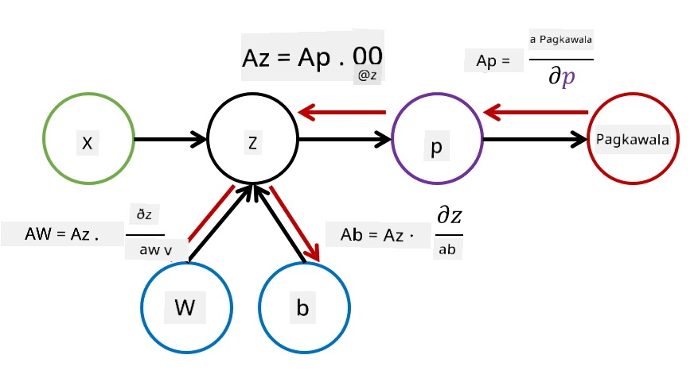

# Panimula sa Neural Networks. Multi-Layered Perceptron

Sa nakaraang seksyon, natutunan mo ang tungkol sa pinakasimpleng modelo ng neural network - ang one-layered perceptron, isang linear na modelo para sa two-class classification.

Sa seksyong ito, palalawakin natin ang modelong ito sa isang mas flexible na framework, na magbibigay-daan sa atin na:

* magsagawa ng **multi-class classification** bukod sa two-class
* lutasin ang **regression problems** bukod sa classification
* paghiwalayin ang mga klase na hindi linear na maihihiwalay

Bubuo rin tayo ng sarili nating modular framework sa Python na magpapahintulot sa atin na magdisenyo ng iba't ibang neural network architectures.

## [Pre-lecture quiz](https://ff-quizzes.netlify.app/en/ai/quiz/7)

## Pormalisasyon ng Machine Learning

Magsimula tayo sa pormalisasyon ng problema sa Machine Learning. Ipagpalagay na mayroon tayong training dataset **X** na may labels **Y**, at kailangan nating bumuo ng modelong *f* na gagawa ng pinakatumpak na prediksyon. Ang kalidad ng prediksyon ay sinusukat gamit ang **Loss function** &lagran;. Ang mga sumusunod na loss functions ay madalas gamitin:

* Para sa regression problem, kung saan kailangan nating magpredikta ng numero, maaari nating gamitin ang **absolute error** &sum;i|f(x(i))-y(i)|, o **squared error** &sum;i(f(x(i))-y(i))2
* Para sa classification, ginagamit natin ang **0-1 loss** (na mahalagang katumbas ng **accuracy** ng modelo), o **logistic loss**.

Para sa one-level perceptron, ang function *f* ay tinukoy bilang isang linear function *f(x)=wx+b* (dito, *w* ay ang weight matrix, *x* ay ang vector ng input features, at *b* ay bias vector). Para sa iba't ibang neural network architectures, ang function na ito ay maaaring magkaroon ng mas kumplikadong anyo.

> Sa kaso ng classification, madalas na mas kanais-nais na makuha ang probabilities ng mga kaukulang klase bilang output ng network. Para gawing probabilities ang arbitrary numbers (halimbawa, para i-normalize ang output), madalas nating ginagamit ang **softmax** function &sigma;, at ang function *f* ay nagiging *f(x)=&sigma;(wx+b)*

Sa depinisyon ng *f* sa itaas, ang *w* at *b* ay tinatawag na **parameters** &theta;=⟨*w,b*⟩. Sa ibinigay na dataset ⟨**X**,**Y**⟩, maaari nating kalkulahin ang kabuuang error sa buong dataset bilang isang function ng parameters &theta;.

> ✅ **Ang layunin ng neural network training ay bawasan ang error sa pamamagitan ng pagbabago ng parameters &theta;**

## Gradient Descent Optimization

May isang kilalang paraan ng pag-optimize ng function na tinatawag na **gradient descent**. Ang ideya ay maaari nating kalkulahin ang derivative (sa multi-dimensional na kaso tinatawag na **gradient**) ng loss function kaugnay ng parameters, at baguhin ang parameters sa paraang bababa ang error. Ito ay maaaring pormalisahin tulad ng sumusunod:

* I-initialize ang parameters gamit ang ilang random na values w(0), b(0)
* Ulitin ang sumusunod na hakbang nang maraming beses:
    - w(i+1) = w(i)-&eta;&part;&lagran;/&part;w
    - b(i+1) = b(i)-&eta;&part;&lagran;/&part;b

Sa panahon ng training, ang optimization steps ay dapat kalkulahin gamit ang buong dataset (tandaan na ang loss ay kinakalkula bilang kabuuan sa lahat ng training samples). Gayunpaman, sa totoong buhay, kumukuha tayo ng maliliit na bahagi ng dataset na tinatawag na **minibatches**, at kinakalkula ang gradients batay sa subset ng data. Dahil ang subset ay random na kinukuha sa bawat pagkakataon, ang ganitong paraan ay tinatawag na **stochastic gradient descent** (SGD).

## Multi-Layered Perceptrons at Backpropagation

Ang one-layer network, tulad ng nakita natin sa itaas, ay may kakayahang mag-classify ng mga klase na linear na maihihiwalay. Para makabuo ng mas mayamang modelo, maaari nating pagsamahin ang ilang layers ng network. Matematika, nangangahulugan ito na ang function *f* ay magkakaroon ng mas kumplikadong anyo, at kakalkulahin sa ilang hakbang:
* z1=w1x+b1
* z2=w2&alpha;(z1)+b2
* f = &sigma;(z2)

Dito, ang &alpha; ay isang **non-linear activation function**, ang &sigma; ay isang softmax function, at ang parameters &theta;=<*w1,b1,w2,b2*>.

Mananatili ang gradient descent algorithm, ngunit magiging mas mahirap kalkulahin ang gradients. Gamit ang chain differentiation rule, maaari nating kalkulahin ang derivatives tulad ng:

* &part;&lagran;/&part;w2 = (&part;&lagran;/&part;&sigma;)(&part;&sigma;/&part;z2)(&part;z2/&part;w2)
* &part;&lagran;/&part;w1 = (&part;&lagran;/&part;&sigma;)(&part;&sigma;/&part;z2)(&part;z2/&part;&alpha;)(&part;&alpha;/&part;z1)(&part;z1/&part;w1)

> ✅ Ang chain differentiation rule ay ginagamit para kalkulahin ang derivatives ng loss function kaugnay ng parameters.

Pansinin na ang kaliwang bahagi ng lahat ng mga ekspresyon ay pareho, kaya't maaari nating epektibong kalkulahin ang derivatives simula sa loss function at magpatuloy "pabalik" sa computational graph. Kaya't ang paraan ng pag-train ng multi-layered perceptron ay tinatawag na **backpropagation**, o 'backprop'.

> TODO: citation ng imahe

> ✅ Tatalakayin natin ang backprop nang mas detalyado sa ating notebook na halimbawa.  

## Konklusyon

Sa araling ito, bumuo tayo ng sarili nating neural network library, at ginamit natin ito para sa isang simpleng two-dimensional classification task.

## 🚀 Hamon

Sa kasamang notebook, mag-iimplementa ka ng sarili mong framework para sa pagbuo at pag-train ng multi-layered perceptrons. Makikita mo nang detalyado kung paano gumagana ang mga modernong neural networks.

Pumunta sa [OwnFramework](OwnFramework.ipynb) notebook at gawin ito.

## [Post-lecture quiz](https://ff-quizzes.netlify.app/en/ai/quiz/8)

## Review at Pag-aaral sa Sarili

Ang backpropagation ay isang karaniwang algorithm na ginagamit sa AI at ML, kaya't sulit itong pag-aralan [nang mas detalyado](https://wikipedia.org/wiki/Backpropagation)

## [Assignment](lab/README.md)

Sa lab na ito, hinihiling sa iyo na gamitin ang framework na binuo mo sa araling ito upang lutasin ang MNIST handwritten digit classification.

* [Mga Instruksyon](lab/README.md)
* [Notebook](lab/MyFW_MNIST.ipynb)

---

