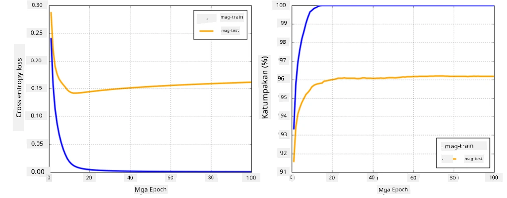

# Neural Network Frameworks

Tulad ng natutunan na natin, upang ma-train ang neural networks nang epektibo, kailangan nating gawin ang dalawang bagay:

* Mag-operate sa tensors, halimbawa, mag-multiply, mag-add, at mag-compute ng ilang mga function tulad ng sigmoid o softmax
* Mag-compute ng gradients ng lahat ng expressions, upang maisagawa ang gradient descent optimization

## [Pre-lecture quiz](https://ff-quizzes.netlify.app/en/ai/quiz/9)

Bagama't magagawa ng `numpy` library ang unang bahagi, kailangan natin ng mekanismo upang mag-compute ng gradients. Sa [ating framework](../04-OwnFramework/OwnFramework.ipynb) na dinevelop natin sa nakaraang seksyon, kailangan nating manual na i-program ang lahat ng derivative functions sa loob ng `backward` method, na gumagawa ng backpropagation. Sa ideal na sitwasyon, ang isang framework ay dapat magbigay sa atin ng kakayahang mag-compute ng gradients ng *anumang expression* na maaari nating i-define.

Isa pang mahalagang bagay ay ang kakayahang mag-perform ng computations sa GPU, o anumang iba pang specialized compute units, tulad ng [TPU](https://en.wikipedia.org/wiki/Tensor_Processing_Unit). Ang training ng deep neural networks ay nangangailangan ng *napakaraming* computations, at ang kakayahang i-parallelize ang mga computations na ito sa GPUs ay napakahalaga.

> ✅ Ang terminong 'parallelize' ay nangangahulugang ipamahagi ang computations sa maraming devices.

Sa kasalukuyan, ang dalawang pinakasikat na neural frameworks ay: [TensorFlow](http://TensorFlow.org) at [PyTorch](https://pytorch.org/). Pareho silang nagbibigay ng low-level API upang mag-operate gamit ang tensors sa parehong CPU at GPU. Bukod sa low-level API, mayroon ding higher-level API, na tinatawag na [Keras](https://keras.io/) at [PyTorch Lightning](https://pytorchlightning.ai/) ayon sa pagkakabanggit.

Low-Level API | [TensorFlow](http://TensorFlow.org) | [PyTorch](https://pytorch.org/)
--------------|-------------------------------------|--------------------------------
High-level API| [Keras](https://keras.io/) | [PyTorch Lightning](https://pytorchlightning.ai/)

**Low-level APIs** sa parehong frameworks ay nagbibigay-daan sa iyo na bumuo ng tinatawag na **computational graphs**. Ang graph na ito ay nagde-define kung paano i-compute ang output (karaniwang loss function) gamit ang mga input parameters, at maaaring i-push para sa computation sa GPU, kung available ito. May mga function upang i-differentiate ang computational graph na ito at mag-compute ng gradients, na maaaring gamitin para sa pag-optimize ng model parameters.

**High-level APIs** ay itinuturing ang neural networks bilang isang **sequence ng layers**, at ginagawang mas madali ang pagbuo ng karamihan sa mga neural networks. Ang pag-train ng model ay karaniwang nangangailangan ng paghahanda ng data at pagkatapos ay pagtawag sa `fit` function upang gawin ang trabaho.

Ang high-level API ay nagbibigay-daan sa iyo na bumuo ng karaniwang neural networks nang mabilis nang hindi iniintindi ang maraming detalye. Sa parehong pagkakataon, ang low-level API ay nag-aalok ng mas maraming kontrol sa proseso ng training, kaya't madalas itong ginagamit sa research, lalo na kung ikaw ay gumagawa ng bagong neural network architectures.

Mahalaga ring maunawaan na maaari mong gamitin ang parehong APIs nang magkasama, halimbawa, maaari kang mag-develop ng sarili mong network layer architecture gamit ang low-level API, at pagkatapos ay gamitin ito sa loob ng mas malaking network na ginawa at na-train gamit ang high-level API. O maaari kang mag-define ng network gamit ang high-level API bilang isang sequence ng layers, at pagkatapos ay gamitin ang sarili mong low-level training loop upang magsagawa ng optimization. Parehong APIs ay gumagamit ng parehong pangunahing konsepto, at sila ay dinisenyo upang magtrabaho nang maayos nang magkasama.

## Learning

Sa kursong ito, inaalok namin ang karamihan ng content para sa PyTorch at TensorFlow. Maaari mong piliin ang iyong preferred framework at dumaan lamang sa mga kaukulang notebooks. Kung hindi ka sigurado kung aling framework ang pipiliin, magbasa ng ilang diskusyon sa internet tungkol sa **PyTorch vs. TensorFlow**. Maaari mo ring tingnan ang parehong frameworks upang magkaroon ng mas mahusay na pag-unawa.

Kung maaari, gagamit tayo ng High-Level APIs para sa kasimplehan. Gayunpaman, naniniwala kami na mahalagang maunawaan kung paano gumagana ang neural networks mula sa simula, kaya sa simula ay magsisimula tayo sa low-level API at tensors. Gayunpaman, kung nais mong magsimula nang mabilis at ayaw mong gumugol ng maraming oras sa pag-aaral ng mga detalyeng ito, maaari mong laktawan ang mga ito at dumiretso sa high-level API notebooks.

## ✍️ Exercises: Frameworks

Ipagpatuloy ang iyong pag-aaral sa mga sumusunod na notebooks:

Low-Level API | [TensorFlow+Keras Notebook](IntroKerasTF.ipynb) | [PyTorch](IntroPyTorch.ipynb)
--------------|-------------------------------------|--------------------------------
High-level API| [Keras](IntroKeras.ipynb) | *PyTorch Lightning*

Pagkatapos ma-master ang frameworks, balikan natin ang konsepto ng overfitting.

# Overfitting

Ang overfitting ay isang napakahalagang konsepto sa machine learning, at napakahalaga na maunawaan ito nang tama!

Isaalang-alang ang sumusunod na problema ng pag-aapproximate sa 5 puntos (na kinakatawan ng `x` sa mga graph sa ibaba):

 | 
-------------------------|--------------------------
**Linear model, 2 parameters** | **Non-linear model, 7 parameters**
Training error = 5.3 | Training error = 0
Validation error = 5.1 | Validation error = 20

* Sa kaliwa, makikita natin ang isang magandang straight line approximation. Dahil ang bilang ng parameters ay sapat, nakuha ng model ang tamang ideya sa likod ng point distribution.
* Sa kanan, masyadong malakas ang model. Dahil mayroon lamang tayong 5 puntos at ang model ay may 7 parameters, maaari itong mag-adjust upang dumaan sa lahat ng puntos, na nagiging sanhi ng training error na maging 0. Gayunpaman, pinipigilan nito ang model na maunawaan ang tamang pattern sa likod ng data, kaya't napakataas ng validation error.

Napakahalaga na mahanap ang tamang balanse sa pagitan ng dami ng parameters ng model at ng bilang ng training samples.

## Bakit nangyayari ang overfitting

  * Kulang ang training data
  * Masyadong malakas ang model
  * Masyadong maraming noise sa input data

## Paano matukoy ang overfitting

Tulad ng makikita mula sa graph sa itaas, ang overfitting ay maaaring matukoy sa pamamagitan ng napakababang training error, at mataas na validation error. Karaniwan sa panahon ng training, makikita natin ang parehong training at validation errors na nagsisimulang bumaba, at pagkatapos ay sa isang punto maaaring tumigil ang validation error sa pagbaba at magsimulang tumaas. Ito ang magiging senyales ng overfitting, at indikasyon na dapat nating itigil ang training sa puntong ito (o kahit papaano gumawa ng snapshot ng model).

## Paano maiwasan ang overfitting

Kung nakikita mong nangyayari ang overfitting, maaari mong gawin ang isa sa mga sumusunod:

 * Dagdagan ang dami ng training data
 * Bawasan ang complexity ng model
 * Gumamit ng ilang [regularization technique](../../4-ComputerVision/08-TransferLearning/TrainingTricks.md), tulad ng [Dropout](../../4-ComputerVision/08-TransferLearning/TrainingTricks.md#Dropout), na tatalakayin natin sa susunod.

## Overfitting at Bias-Variance Tradeoff

Ang overfitting ay talagang isang kaso ng mas pangkalahatang problema sa statistics na tinatawag na [Bias-Variance Tradeoff](https://en.wikipedia.org/wiki/Bias%E2%80%93variance_tradeoff). Kung isasaalang-alang natin ang mga posibleng pinagmumulan ng error sa ating model, makikita natin ang dalawang uri ng errors:

* **Bias errors** ay sanhi ng ating algorithm na hindi ma-capture nang tama ang relasyon sa pagitan ng training data. Maaari itong magmula sa katotohanang ang ating model ay hindi sapat na malakas (**underfitting**).
* **Variance errors**, na sanhi ng model na inaapproximate ang noise sa input data sa halip na ang makabuluhang relasyon (**overfitting**).

Sa panahon ng training, bumababa ang bias error (habang natututo ang ating model na i-approximate ang data), at tumataas ang variance error. Mahalagang itigil ang training - alinman sa manual (kapag natukoy ang overfitting) o awtomatiko (sa pamamagitan ng pag-introduce ng regularization) - upang maiwasan ang overfitting.

## Konklusyon

Sa araling ito, natutunan mo ang mga pagkakaiba sa pagitan ng iba't ibang APIs para sa dalawang pinakasikat na AI frameworks, TensorFlow at PyTorch. Bukod dito, natutunan mo ang isang napakahalagang paksa, ang overfitting.

## 🚀 Hamon

Sa mga kasamang notebooks, makakakita ka ng 'tasks' sa ibaba; gawin ang mga notebooks at kumpletuhin ang mga tasks.

## [Post-lecture quiz](https://ff-quizzes.netlify.app/en/ai/quiz/10)

## Review & Self Study

Mag-research sa mga sumusunod na paksa:

- TensorFlow
- PyTorch
- Overfitting

Tanungin ang iyong sarili ng mga sumusunod na tanong:

- Ano ang pagkakaiba ng TensorFlow at PyTorch?
- Ano ang pagkakaiba ng overfitting at underfitting?

## [Assignment](lab/README.md)

Sa lab na ito, hinihiling sa iyo na lutasin ang dalawang classification problems gamit ang single- at multi-layered fully-connected networks gamit ang PyTorch o TensorFlow.

* [Instructions](lab/README.md)
* [Notebook](lab/LabFrameworks.ipynb)

---

