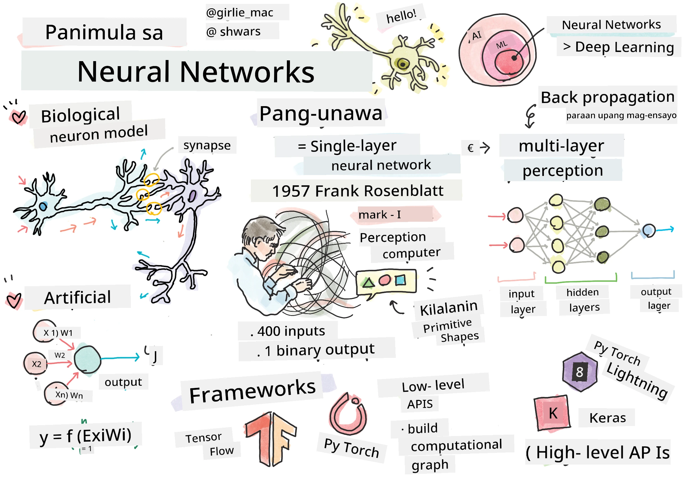
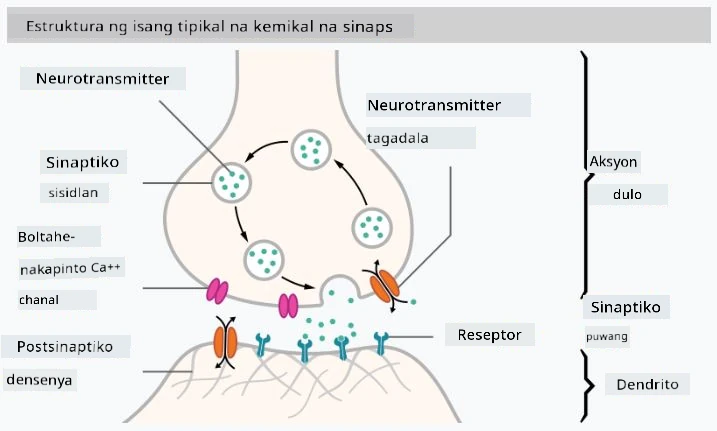

# Panimula sa Neural Networks

Tulad ng tinalakay natin sa panimula, isa sa mga paraan upang makamit ang katalinuhan ay ang pagsasanay ng isang **modelo ng computer** o isang **artipisyal na utak**. Simula noong kalagitnaan ng ika-20 siglo, sinubukan ng mga mananaliksik ang iba't ibang mga matematikal na modelo, hanggang sa mga nakaraang taon kung saan ang direksyong ito ay napatunayang napaka-epektibo. Ang ganitong mga matematikal na modelo ng utak ay tinatawag na **neural networks**.

> Minsan ang neural networks ay tinatawag na *Artificial Neural Networks* o ANNs, upang ipahiwatig na pinag-uusapan natin ang tungkol sa mga modelo, hindi ang tunay na mga network ng neurons.

## Machine Learning

Ang Neural Networks ay bahagi ng mas malawak na disiplina na tinatawag na **Machine Learning**, na ang layunin ay gamitin ang datos upang sanayin ang mga modelo ng computer na kayang lutasin ang mga problema. Ang Machine Learning ay bumubuo ng malaking bahagi ng Artificial Intelligence, gayunpaman, hindi natin saklaw ang klasikong ML sa kurikulum na ito.

> Bisitahin ang aming hiwalay na **[Machine Learning for Beginners](http://github.com/microsoft/ml-for-beginners)** na kurikulum upang matuto pa tungkol sa klasikong Machine Learning.

Sa Machine Learning, ipinapalagay natin na mayroon tayong dataset ng mga halimbawa **X**, at mga kaukulang output na halaga **Y**. Ang mga halimbawa ay madalas na N-dimensional na mga vector na binubuo ng **features**, at ang mga output ay tinatawag na **labels**.

Tatalakayin natin ang dalawang pinakakaraniwang problema sa machine learning:

* **Classification**, kung saan kailangan nating uriin ang isang input na bagay sa dalawa o higit pang mga klase.
* **Regression**, kung saan kailangan nating hulaan ang isang numerikal na halaga para sa bawat input na sample.

> Kapag kinakatawan ang mga input at output bilang tensors, ang input dataset ay isang matrix na may sukat na M&times;N, kung saan ang M ay ang bilang ng mga sample at ang N ay ang bilang ng mga features. Ang output labels Y ay ang vector na may sukat na M.

Sa kurikulum na ito, magtutuon lamang tayo sa mga modelo ng neural network.

## Modelo ng Isang Neuron

Mula sa biology, alam natin na ang ating utak ay binubuo ng mga neural cells (neurons), bawat isa ay may maraming "inputs" (dendrites) at isang "output" (axon). Parehong dendrites at axons ay maaaring magdala ng mga signal na elektrikal, at ang mga koneksyon sa pagitan nila — na kilala bilang synapses — ay maaaring magpakita ng iba't ibang antas ng conductivity, na kinokontrol ng mga neurotransmitters.

 | 
----|----
Tunay na Neuron *([Larawan](https://en.wikipedia.org/wiki/Synapse#/media/File:SynapseSchematic_lines.svg) mula sa Wikipedia)* | Artipisyal na Neuron *(Larawan ng May-akda)*

Kaya, ang pinakasimpleng matematikal na modelo ng isang neuron ay naglalaman ng ilang inputs X1, ..., XN at isang output Y, at isang serye ng mga weights W1, ..., WN. Ang output ay kinakalkula bilang:

kung saan ang f ay isang non-linear na **activation function**.

> Ang mga unang modelo ng neuron ay inilarawan sa klasikong papel na [A logical calculus of the ideas immanent in nervous activity](https://www.cs.cmu.edu/~./epxing/Class/10715/reading/McCulloch.and.Pitts.pdf) nina Warren McCullock at Walter Pitts noong 1943. Si Donald Hebb sa kanyang aklat na "[The Organization of Behavior: A Neuropsychological Theory](https://books.google.com/books?id=VNetYrB8EBoC)" ay nagmungkahi ng paraan kung paano maaaring sanayin ang mga network na ito.

## Sa Seksyong Ito

Sa seksyong ito, matututo tayo tungkol sa:
* [Perceptron](03-Perceptron/README.md), isa sa mga pinakaunang modelo ng neural network para sa two-class classification
* [Multi-layered networks](04-OwnFramework/README.md) na may kasamang notebook [kung paano bumuo ng sarili nating framework](04-OwnFramework/OwnFramework.ipynb)
* [Neural Network Frameworks](05-Frameworks/README.md), kasama ang mga notebook na ito: [PyTorch](05-Frameworks/IntroPyTorch.ipynb) at [Keras/Tensorflow](05-Frameworks/IntroKerasTF.ipynb)
* [Overfitting](../../../../lessons/3-NeuralNetworks/05-Frameworks)

---

**Paunawa**:  
Ang dokumentong ito ay isinalin gamit ang AI translation service na [Co-op Translator](https://github.com/Azure/co-op-translator). Bagama't sinisikap naming maging tumpak, mangyaring tandaan na ang mga awtomatikong pagsasalin ay maaaring maglaman ng mga pagkakamali o hindi pagkakatugma. Ang orihinal na dokumento sa kanyang katutubong wika ang dapat ituring na opisyal na sanggunian. Para sa mahalagang impormasyon, inirerekomenda ang propesyonal na pagsasalin ng tao. Hindi kami mananagot sa anumang hindi pagkakaunawaan o maling interpretasyon na dulot ng paggamit ng pagsasaling ito.