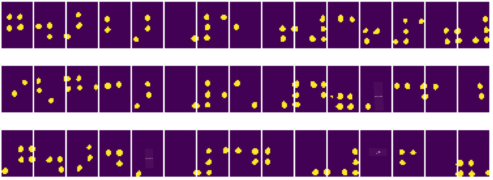
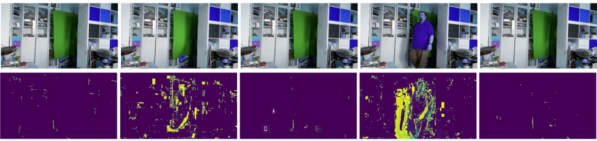

# Panimula sa Computer Vision

[Computer Vision](https://wikipedia.org/wiki/Computer_vision) ay isang disiplina na ang layunin ay bigyan ang mga computer ng kakayahang maunawaan ang mga digital na imahe sa mataas na antas. Medyo malawak ang depinisyon na ito dahil ang *pag-unawa* ay maaaring mangahulugan ng iba't ibang bagay, tulad ng paghahanap ng isang bagay sa larawan (**object detection**), pag-unawa sa nangyayari (**event detection**), paglalarawan ng larawan gamit ang teksto, o pagbuo ng eksena sa 3D. Mayroon ding mga espesyal na gawain na may kaugnayan sa mga larawan ng tao: pagtatantiya ng edad at emosyon, pagtuklas at pagkilala sa mukha, at pagtatantiya ng 3D pose, upang pangalanan ang ilan.

## [Pre-lecture quiz](https://ff-quizzes.netlify.app/en/ai/quiz/11)

Isa sa mga pinakasimpleng gawain ng computer vision ay ang **image classification**.

Ang computer vision ay madalas itinuturing na isang sangay ng AI. Sa kasalukuyan, karamihan sa mga gawain sa computer vision ay nalulutas gamit ang neural networks. Matututo tayo nang higit pa tungkol sa espesyal na uri ng neural networks na ginagamit para sa computer vision, [convolutional neural networks](../07-ConvNets/README.md), sa buong seksyon na ito.

Gayunpaman, bago mo ipasa ang imahe sa isang neural network, sa maraming kaso ay may kabuluhan na gumamit ng ilang algorithmic techniques upang mapahusay ang imahe.

Mayroong ilang mga Python libraries na magagamit para sa image processing:

* **[imageio](https://imageio.readthedocs.io/en/stable/)** maaaring gamitin para sa pagbabasa/pagsulat ng iba't ibang format ng imahe. Sinusuportahan din nito ang ffmpeg, isang kapaki-pakinabang na tool para sa pag-convert ng mga video frame sa mga imahe.
* **[Pillow](https://pillow.readthedocs.io/en/stable/index.html)** (kilala rin bilang PIL) ay mas makapangyarihan, at sinusuportahan din ang ilang manipulasyon ng imahe tulad ng morphing, pag-aayos ng palette, at iba pa.
* **[OpenCV](https://opencv.org/)** ay isang makapangyarihang library para sa image processing na isinulat sa C++, na naging *de facto* standard para sa image processing. Mayroon itong maginhawang Python interface.
* **[dlib](http://dlib.net/)** ay isang C++ library na naglalaman ng maraming machine learning algorithms, kabilang ang ilan sa mga Computer Vision algorithms. Mayroon din itong Python interface, at maaaring gamitin para sa mga hamon tulad ng pagtuklas ng mukha at facial landmark detection.

## OpenCV

[OpenCV](https://opencv.org/) ay itinuturing na *de facto* standard para sa image processing. Naglalaman ito ng maraming kapaki-pakinabang na algorithm na isinulat sa C++. Maaari mo ring tawagin ang OpenCV mula sa Python.

Isang magandang lugar upang matutunan ang OpenCV ay [ang Learn OpenCV course na ito](https://learnopencv.com/getting-started-with-opencv/). Sa ating kurikulum, ang layunin natin ay hindi matutunan ang OpenCV, kundi ipakita ang ilang mga halimbawa kung kailan ito maaaring gamitin, at paano.

### Pag-load ng Mga Imahe

Ang mga imahe sa Python ay maaaring maginhawang irepresenta gamit ang NumPy arrays. Halimbawa, ang grayscale images na may sukat na 320x200 pixels ay maiimbak sa isang 200x320 array, at ang color images na may parehong dimensyon ay magkakaroon ng hugis na 200x320x3 (para sa 3 color channels). Upang mag-load ng imahe, maaari mong gamitin ang sumusunod na code:

```python
import cv2
import matplotlib.pyplot as plt

im = cv2.imread('image.jpeg')
plt.imshow(im)
```

Tradisyonal, ang OpenCV ay gumagamit ng BGR (Blue-Green-Red) encoding para sa mga color images, habang ang iba pang Python tools ay gumagamit ng mas tradisyunal na RGB (Red-Green-Blue). Para magmukhang tama ang imahe, kailangan mo itong i-convert sa RGB color space, alinman sa pamamagitan ng pagpapalit ng mga dimensyon sa NumPy array, o sa pamamagitan ng pagtawag sa isang OpenCV function:

```python
im = cv2.cvtColor(im,cv2.COLOR_BGR2RGB)
```

Ang parehong `cvtColor` function ay maaaring gamitin upang magsagawa ng iba pang mga color space transformations tulad ng pag-convert ng imahe sa grayscale o sa HSV (Hue-Saturation-Value) color space.

Maaari mo ring gamitin ang OpenCV upang mag-load ng video frame-by-frame - isang halimbawa ay ibinigay sa exercise [OpenCV Notebook](OpenCV.ipynb).

### Image Processing

Bago ipasa ang isang imahe sa isang neural network, maaaring gusto mong mag-apply ng ilang pre-processing steps. Maraming magagawa ang OpenCV, kabilang ang:

* **Pag-resize** ng imahe gamit ang `im = cv2.resize(im, (320,200),interpolation=cv2.INTER_LANCZOS)`
* **Pag-blur** ng imahe gamit ang `im = cv2.medianBlur(im,3)` o `im = cv2.GaussianBlur(im, (3,3), 0)`
* Pagbabago ng **liwanag at contrast** ng imahe ay maaaring gawin sa pamamagitan ng NumPy array manipulations, tulad ng inilarawan [sa Stackoverflow note na ito](https://stackoverflow.com/questions/39308030/how-do-i-increase-the-contrast-of-an-image-in-python-opencv).
* Paggamit ng [thresholding](https://docs.opencv.org/4.x/d7/d4d/tutorial_py_thresholding.html) sa pamamagitan ng pagtawag sa `cv2.threshold`/`cv2.adaptiveThreshold` functions, na madalas mas mainam kaysa sa pag-aayos ng liwanag o contrast.
* Pag-aapply ng iba't ibang [transformations](https://docs.opencv.org/4.5.5/da/d6e/tutorial_py_geometric_transformations.html) sa imahe:
    - **[Affine transformations](https://docs.opencv.org/4.5.5/d4/d61/tutorial_warp_affine.html)** ay maaaring maging kapaki-pakinabang kung kailangan mong pagsamahin ang rotation, resizing, at skewing sa imahe at alam mo ang source at destination location ng tatlong puntos sa imahe. Ang affine transformations ay nagpapanatili ng parallel lines na parallel.
    - **[Perspective transformations](https://medium.com/analytics-vidhya/opencv-perspective-transformation-9edffefb2143)** ay maaaring maging kapaki-pakinabang kapag alam mo ang source at destination positions ng 4 na puntos sa imahe. Halimbawa, kung kukuha ka ng larawan ng isang rectangular na dokumento gamit ang smartphone camera mula sa isang anggulo, at gusto mong gawing rectangular ang imahe ng dokumento mismo.
* Pag-unawa sa galaw sa loob ng imahe gamit ang **[optical flow](https://docs.opencv.org/4.5.5/d4/dee/tutorial_optical_flow.html)**.

## Mga Halimbawa ng Paggamit ng Computer Vision

Sa aming [OpenCV Notebook](OpenCV.ipynb), nagbibigay kami ng ilang mga halimbawa kung kailan maaaring gamitin ang computer vision upang magsagawa ng mga partikular na gawain:

* **Pre-processing ng larawan ng isang Braille book**. Nakatuon kami sa kung paano namin magagamit ang thresholding, feature detection, perspective transformation, at NumPy manipulations upang paghiwalayin ang mga indibidwal na Braille symbols para sa karagdagang classification ng isang neural network.

 |  | 
----|-----|-----

> Imahe mula sa [OpenCV.ipynb](OpenCV.ipynb)

* **Pagtuklas ng galaw sa video gamit ang frame difference**. Kung ang camera ay nakapirmi, ang mga frame mula sa camera feed ay dapat medyo magkatulad sa isa't isa. Dahil ang mga frame ay kinakatawan bilang arrays, sa pamamagitan lamang ng pagbabawas ng mga arrays para sa dalawang magkasunod na frame ay makakakuha tayo ng pixel difference, na dapat mababa para sa static frames, at magiging mas mataas kapag may makabuluhang galaw sa imahe.



> Imahe mula sa [OpenCV.ipynb](OpenCV.ipynb)

* **Pagtuklas ng galaw gamit ang Optical Flow**. [Optical flow](https://docs.opencv.org/3.4/d4/dee/tutorial_optical_flow.html) ay nagbibigay-daan sa atin upang maunawaan kung paano gumagalaw ang mga indibidwal na pixels sa video frames. Mayroong dalawang uri ng optical flow:

   - **Dense Optical Flow** ay kinakalkula ang vector field na nagpapakita kung saan gumagalaw ang bawat pixel
   - **Sparse Optical Flow** ay batay sa pagkuha ng ilang natatanging features sa imahe (hal. edges), at pagbuo ng kanilang trajectory mula frame to frame.


> Imahe mula sa [OpenCV.ipynb](OpenCV.ipynb)

## ✍️ Mga Halimbawa ng Notebook: OpenCV [subukan ang OpenCV in Action](OpenCV.ipynb)

Gumawa tayo ng ilang eksperimento gamit ang OpenCV sa pamamagitan ng pag-explore sa [OpenCV Notebook](OpenCV.ipynb)

## Konklusyon

Minsan, ang mga medyo komplikadong gawain tulad ng pagtuklas ng galaw o pagtuklas ng dulo ng daliri ay maaaring malutas gamit lamang ang computer vision. Kaya, napakahalaga na malaman ang mga pangunahing teknika ng computer vision, at kung ano ang magagawa ng mga library tulad ng OpenCV.

## 🚀 Hamon

Panoorin ang [video na ito](https://docs.microsoft.com/shows/ai-show/ai-show--2021-opencv-ai-competition--grand-prize-winners--cortic-tigers--episode-32?WT.mc_id=academic-77998-cacaste) mula sa AI show upang matutunan ang tungkol sa proyekto ng Cortic Tigers at kung paano nila binuo ang isang block-based solution upang gawing mas accessible ang mga gawain sa computer vision gamit ang isang robot. Mag-research tungkol sa iba pang mga proyekto tulad nito na tumutulong sa mga bagong mag-aaral na makapasok sa larangan.

## [Post-lecture quiz](https://ff-quizzes.netlify.app/en/ai/quiz/12)

## Review at Pag-aaral sa Sarili

Magbasa pa tungkol sa optical flow [sa mahusay na tutorial na ito](https://learnopencv.com/optical-flow-in-opencv/).

## [Assignment](lab/README.md)

Sa lab na ito, kukuha ka ng video na may simpleng gestures, at ang layunin mo ay kunin ang mga galaw na pataas/pababa/kaliwa/kanan gamit ang optical flow.


---

