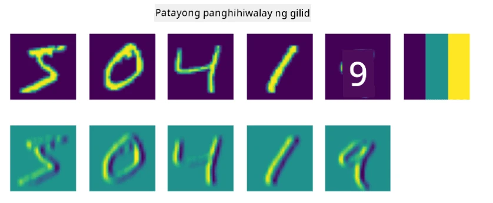
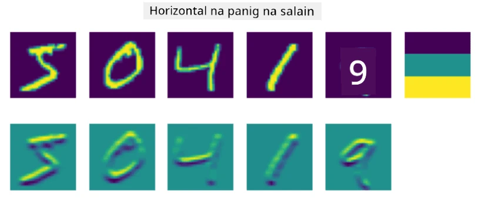
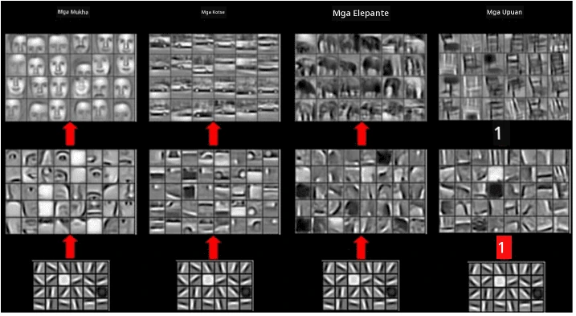
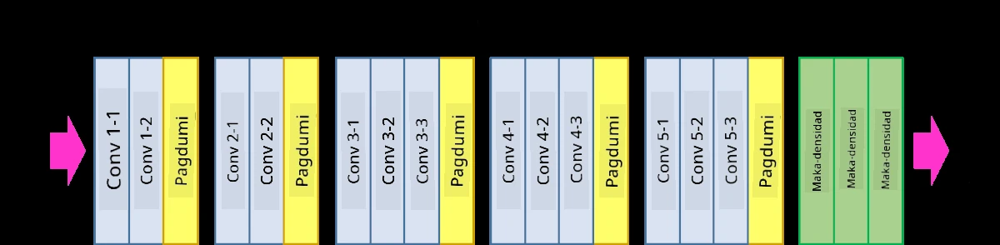

# Convolutional Neural Networks

Nakita na natin dati na ang neural networks ay mahusay sa pagproseso ng mga imahe, at kahit ang isang layer na perceptron ay kayang kilalanin ang mga handwritten digits mula sa MNIST dataset na may makatwirang katumpakan. Gayunpaman, ang MNIST dataset ay espesyal, dahil lahat ng digits ay nakasentro sa loob ng imahe, na nagpapadali sa gawain.

## [Pre-lecture quiz](https://ff-quizzes.netlify.app/en/ai/quiz/13)

Sa totoong buhay, gusto nating makilala ang mga bagay sa isang larawan kahit saan man ang eksaktong lokasyon nito sa imahe. Ang computer vision ay naiiba sa pangkalahatang classification, dahil kapag sinusubukan nating hanapin ang isang partikular na bagay sa larawan, ini-scan natin ang imahe upang hanapin ang mga tiyak na **pattern** at ang kanilang mga kombinasyon. Halimbawa, kapag naghahanap ng pusa, maaaring una nating hanapin ang mga horizontal lines na maaaring bumuo ng mga bigote, at pagkatapos ay ang tiyak na kombinasyon ng mga bigote ang magsasabi sa atin na ito ay larawan ng isang pusa. Ang relatibong posisyon at presensya ng mga tiyak na pattern ay mahalaga, hindi ang eksaktong posisyon nito sa imahe.

Upang makuha ang mga pattern, gagamit tayo ng konsepto ng **convolutional filters**. Tulad ng alam mo, ang isang imahe ay kinakatawan ng isang 2D-matrix, o isang 3D-tensor na may color depth. Ang pag-aapply ng filter ay nangangahulugan na kukuha tayo ng medyo maliit na **filter kernel** matrix, at para sa bawat pixel sa orihinal na imahe, kinakalkula natin ang weighted average kasama ang mga kalapit na puntos. Maaari nating tingnan ito bilang isang maliit na bintana na gumagalaw sa buong imahe, at ina-average ang lahat ng pixels ayon sa mga weights sa filter kernel matrix.

 | 
----|----

> Larawan ni Dmitry Soshnikov

Halimbawa, kung mag-aapply tayo ng 3x3 vertical edge at horizontal edge filters sa MNIST digits, makakakuha tayo ng mga highlight (hal. mataas na values) kung saan may mga vertical at horizontal edges sa orihinal na imahe. Kaya ang dalawang filters na ito ay maaaring gamitin upang "hanapin" ang mga edges. Katulad nito, maaari tayong magdisenyo ng iba't ibang filters upang hanapin ang iba pang low-level patterns:

> Larawan ng [Leung-Malik Filter Bank](https://www.robots.ox.ac.uk/~vgg/research/texclass/filters.html)

Gayunpaman, habang maaari nating i-disensyo ang mga filters upang manu-manong makuha ang ilang mga pattern, maaari rin nating i-disensyo ang network sa paraang matututo ito ng mga pattern nang awtomatiko. Ito ang isa sa mga pangunahing ideya sa likod ng CNN.

## Pangunahing ideya sa likod ng CNN

Ang paraan ng paggana ng CNN ay batay sa mga sumusunod na mahalagang ideya:

* Ang convolutional filters ay maaaring kumuha ng mga pattern
* Maaari nating i-disensyo ang network sa paraang ang filters ay matututo nang awtomatiko
* Maaari nating gamitin ang parehong paraan upang hanapin ang mga pattern sa high-level features, hindi lamang sa orihinal na imahe. Kaya ang feature extraction ng CNN ay gumagana sa isang hierarchy ng features, simula sa low-level pixel combinations, hanggang sa mas mataas na level na kombinasyon ng mga bahagi ng larawan.

> Larawan mula sa [isang papel ni Hislop-Lynch](https://www.semanticscholar.org/paper/Computer-vision-based-pedestrian-trajectory-Hislop-Lynch/26e6f74853fc9bbb7487b06dc2cf095d36c9021d), batay sa [kanilang pananaliksik](https://dl.acm.org/doi/abs/10.1145/1553374.1553453)

## ✍️ Mga Gawain: Convolutional Neural Networks

Ipagpatuloy natin ang pag-aaral kung paano gumagana ang convolutional neural networks, at kung paano natin makakamit ang trainable filters, sa pamamagitan ng pagtrabaho sa mga kaukulang notebooks:

* [Convolutional Neural Networks - PyTorch](ConvNetsPyTorch.ipynb)
* [Convolutional Neural Networks - TensorFlow](ConvNetsTF.ipynb)

## Pyramid Architecture

Karamihan sa mga CNN na ginagamit para sa pagproseso ng imahe ay sumusunod sa tinatawag na pyramid architecture. Ang unang convolutional layer na ina-apply sa orihinal na mga imahe ay karaniwang may medyo mababang bilang ng filters (8-16), na tumutugma sa iba't ibang pixel combinations, tulad ng horizontal/vertical lines ng strokes. Sa susunod na level, binabawasan natin ang spatial dimension ng network, at pinapataas ang bilang ng filters, na tumutugma sa mas maraming posibleng kombinasyon ng simpleng features. Sa bawat layer, habang papalapit tayo sa final classifier, bumababa ang spatial dimensions ng imahe, at tumataas ang bilang ng filters.

Halimbawa, tingnan natin ang arkitektura ng VGG-16, isang network na nakamit ang 92.7% accuracy sa ImageNet's top-5 classification noong 2014:

> Larawan mula sa [Researchgate](https://www.researchgate.net/figure/Vgg16-model-structure-To-get-the-VGG-NIN-model-we-replace-the-2-nd-4-th-6-th-7-th_fig2_335194493)

## Pinakamahusay na Kilalang CNN Architectures

[Ipagpatuloy ang pag-aaral tungkol sa pinakamahusay na kilalang CNN architectures](CNN_Architectures.md)

---

