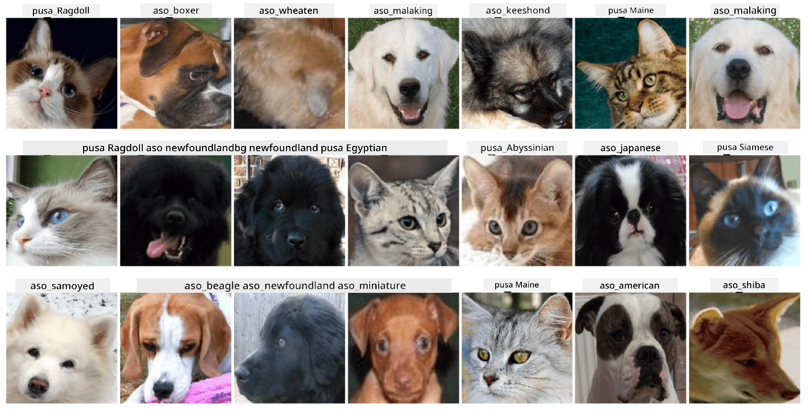

# Pag-uuri ng Mukha ng Alagang Hayop

Takdang-Aralin mula sa [AI for Beginners Curriculum](https://github.com/microsoft/ai-for-beginners).

## Gawain

Isipin na kailangan mong gumawa ng isang aplikasyon para sa nursery ng mga alagang hayop upang i-catalog ang lahat ng mga alaga. Isa sa mga magagandang tampok ng ganitong aplikasyon ay ang awtomatikong pagtukoy ng lahi mula sa isang litrato. Magagawa ito nang matagumpay gamit ang neural networks.

Kailangan mong sanayin ang isang convolutional neural network upang uriin ang iba't ibang lahi ng pusa at aso gamit ang **Pet Faces** dataset.

## Ang Dataset

Gagamitin natin ang [Oxford-IIIT Pet Dataset](https://www.robots.ox.ac.uk/~vgg/data/pets/), na naglalaman ng mga larawan ng 37 iba't ibang lahi ng aso at pusa.



Upang i-download ang dataset, gamitin ang code snippet na ito:

```python
!wget https://thor.robots.ox.ac.uk/~vgg/data/pets/images.tar.gz
!tar xfz images.tar.gz
!rm images.tar.gz
```

**Tandaan:** Ang mga larawan sa Oxford-IIIT Pet Dataset ay nakaayos ayon sa filename (hal., `Abyssinian_1.jpg`, `Bengal_2.jpg`). Ang notebook ay may kasamang code upang ayusin ang mga larawang ito sa mga subdirectory na partikular sa lahi para sa mas madaling pag-uuri.

## Simula ng Notebook

Simulan ang lab sa pamamagitan ng pagbukas ng [PetFaces.ipynb](PetFaces.ipynb)

## Aral

Nalutas mo ang isang medyo komplikadong problema ng pag-uuri ng imahe mula sa simula! Maraming klase, ngunit nagawa mo pa rin makamit ang makatwirang katumpakan! Makatuwiran din na sukatin ang top-k accuracy, dahil madali itong malito sa ilang mga klase na hindi malinaw na magkaiba kahit sa mga tao.

---

**Paunawa**:  
Ang dokumentong ito ay isinalin gamit ang AI translation service na [Co-op Translator](https://github.com/Azure/co-op-translator). Bagama't sinisikap naming maging tumpak, mangyaring tandaan na ang mga awtomatikong pagsasalin ay maaaring maglaman ng mga pagkakamali o hindi pagkakatugma. Ang orihinal na dokumento sa kanyang katutubong wika ang dapat ituring na opisyal na sanggunian. Para sa mahalagang impormasyon, inirerekomenda ang propesyonal na pagsasalin ng tao. Hindi kami mananagot sa anumang hindi pagkakaunawaan o maling interpretasyon na dulot ng paggamit ng pagsasaling ito.