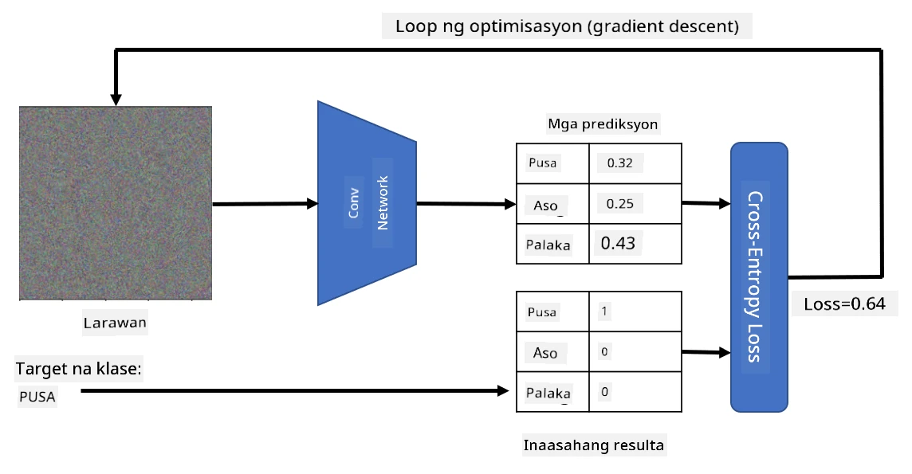

# Pre-trained Networks at Transfer Learning

Ang pag-train ng CNNs ay maaaring tumagal ng mahabang oras, at nangangailangan ng maraming data para sa gawain na ito. Gayunpaman, karamihan sa oras ay ginugugol sa pag-aaral ng pinakamahusay na low-level filters na magagamit ng network upang makuha ang mga pattern mula sa mga imahe. Isang natural na tanong ang lumalabas - maaari ba nating gamitin ang isang neural network na na-train na sa isang dataset at i-adapt ito upang mag-classify ng ibang mga imahe nang hindi kinakailangan ang buong proseso ng pag-train?

## [Pre-lecture quiz](https://ff-quizzes.netlify.app/en/ai/quiz/15)

Ang approach na ito ay tinatawag na **transfer learning**, dahil inililipat natin ang ilang kaalaman mula sa isang neural network model patungo sa iba. Sa transfer learning, karaniwang nagsisimula tayo sa isang pre-trained model, na na-train na sa isang malaking image dataset, tulad ng **ImageNet**. Ang mga modelong ito ay magaling na sa pagkuha ng iba't ibang features mula sa mga generic na imahe, at sa maraming kaso, ang pagbuo ng classifier sa ibabaw ng mga extracted features na ito ay maaaring magbigay ng magandang resulta.

> ✅ Ang Transfer Learning ay isang termino na makikita mo rin sa ibang larangan ng akademya, tulad ng Edukasyon. Tumutukoy ito sa proseso ng pagkuha ng kaalaman mula sa isang domain at pag-aapply nito sa iba.

## Pre-Trained Models bilang Feature Extractors

Ang mga convolutional networks na tinalakay natin sa nakaraang seksyon ay naglalaman ng ilang layers, bawat isa ay inaasahang mag-extract ng mga features mula sa imahe, simula sa low-level pixel combinations (tulad ng horizontal/vertical line o stroke), hanggang sa mas mataas na level na kombinasyon ng mga features, na tumutukoy sa mga bagay tulad ng mata ng isang apoy. Kung mag-train tayo ng CNN sa sapat na malaking dataset ng mga generic at diverse na imahe, dapat matutunan ng network na i-extract ang mga karaniwang features na ito.

Parehong Keras at PyTorch ay may mga function upang madaling ma-load ang pre-trained neural network weights para sa ilang karaniwang architectures, karamihan sa mga ito ay na-train sa mga ImageNet images. Ang mga madalas gamitin ay nakalista sa [CNN Architectures](../07-ConvNets/CNN_Architectures.md) page mula sa nakaraang aralin. Partikular, maaaring gusto mong gamitin ang isa sa mga sumusunod:

* **VGG-16/VGG-19** na mga simpleng modelo ngunit nagbibigay pa rin ng magandang accuracy. Madalas gamitin ang VGG bilang unang subok upang makita kung paano gumagana ang transfer learning.
* **ResNet** ay isang pamilya ng mga modelo na iminungkahi ng Microsoft Research noong 2015. Mas maraming layers ang mga ito, kaya nangangailangan ng mas maraming resources.
* **MobileNet** ay isang pamilya ng mga modelo na may mas maliit na sukat, angkop para sa mga mobile devices. Gamitin ito kung kulang ka sa resources at handang magsakripisyo ng kaunting accuracy.

Narito ang mga sample features na na-extract mula sa larawan ng isang pusa gamit ang VGG-16 network:

## Dataset ng Cats vs. Dogs

Sa halimbawang ito, gagamit tayo ng dataset ng [Cats and Dogs](https://www.microsoft.com/download/details.aspx?id=54765&WT.mc_id=academic-77998-cacaste), na malapit sa isang real-life image classification scenario.

## ✍️ Ehersisyo: Transfer Learning

Tingnan natin ang transfer learning sa aksyon sa mga kaukulang notebooks:

* [Transfer Learning - PyTorch](TransferLearningPyTorch.ipynb)
* [Transfer Learning - TensorFlow](TransferLearningTF.ipynb)

## Pag-visualize ng Adversarial Cat

Ang pre-trained neural network ay naglalaman ng iba't ibang patterns sa loob ng "utak" nito, kabilang ang mga konsepto ng **ideal cat** (pati na rin ang ideal dog, ideal zebra, atbp.). Magiging interesante kung paano natin maipapakita ang imahe na ito. Gayunpaman, hindi ito simple, dahil ang mga patterns ay nakakalat sa buong network weights, at naka-organize din sa hierarchical structure.

Isang approach na maaari nating gawin ay magsimula sa isang random na imahe, at pagkatapos ay subukang gamitin ang **gradient descent optimization** technique upang i-adjust ang imahe na iyon sa paraang magsisimula ang network na isipin na ito ay isang pusa.

Gayunpaman, kung gagawin natin ito, makakakuha tayo ng isang bagay na halos katulad ng random noise. Ito ay dahil *maraming paraan upang mag-isip ang network na ang input image ay isang pusa*, kabilang ang ilan na hindi makatuwiran sa visual. Bagama't ang mga imahe ay naglalaman ng maraming patterns na tipikal para sa isang pusa, walang anumang constraint upang maging visually distinctive ang mga ito.

Upang mapabuti ang resulta, maaari tayong magdagdag ng isa pang term sa loss function, na tinatawag na **variation loss**. Ito ay isang metric na nagpapakita kung gaano kahawig ang mga magkatabing pixels ng imahe. Ang pag-minimize ng variation loss ay nagpapakinis sa imahe, at nag-aalis ng noise - kaya mas naipapakita ang mas visually appealing patterns. Narito ang halimbawa ng mga "ideal" na imahe, na na-classify bilang pusa at zebra na may mataas na probability:

 | 
-----|-----
 *Ideal Cat* | *Ideal Zebra*

Ang parehong approach ay maaaring gamitin upang magsagawa ng tinatawag na **adversarial attacks** sa isang neural network. Halimbawa, gusto nating linlangin ang isang neural network at gawing mukhang pusa ang isang aso. Kung kukunin natin ang imahe ng aso, na kinikilala ng network bilang aso, maaari natin itong i-tweak nang kaunti gamit ang gradient descent optimization, hanggang sa magsimulang i-classify ito ng network bilang pusa:

 | 
-----|-----
*Orihinal na larawan ng aso* | *Larawan ng aso na na-classify bilang pusa*

Tingnan ang code upang ma-reproduce ang mga resulta sa itaas sa sumusunod na notebook:

* [Ideal and Adversarial Cat - TensorFlow](AdversarialCat_TF.ipynb)

## Konklusyon

Sa paggamit ng transfer learning, mabilis kang makakagawa ng classifier para sa isang custom object classification task at makakamit ang mataas na accuracy. Makikita mo na ang mas kumplikadong mga gawain na tinutugunan natin ngayon ay nangangailangan ng mas mataas na computational power, at hindi madaling masolusyunan gamit ang CPU. Sa susunod na unit, susubukan nating gumamit ng mas magaan na implementasyon upang i-train ang parehong modelo gamit ang mas mababang compute resources, na nagreresulta sa bahagyang mas mababang accuracy.

## 🚀 Hamon

Sa mga kasamang notebooks, may mga tala sa ibaba tungkol sa kung paano pinakamahusay gumagana ang transfer knowledge sa medyo magkatulad na training data (halimbawa, isang bagong uri ng hayop). Subukan ang pag-eksperimento sa ganap na bagong uri ng mga imahe upang makita kung gaano kahusay o kahina ang performance ng iyong transfer knowledge models.

## [Post-lecture quiz](https://ff-quizzes.netlify.app/en/ai/quiz/16)

## Review at Pag-aaral sa Sarili

Basahin ang [TrainingTricks.md](TrainingTricks.md) upang palalimin ang iyong kaalaman sa iba pang paraan ng pag-train ng iyong mga modelo.

## [Assignment](lab/README.md)

Sa lab na ito, gagamit tayo ng real-life [Oxford-IIIT](https://www.robots.ox.ac.uk/~vgg/data/pets/) pets dataset na may 35 breeds ng pusa at aso, at magtatayo tayo ng transfer learning classifier.

---

