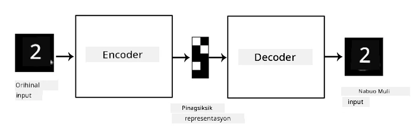
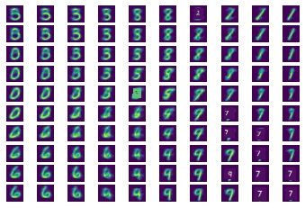

# Autoencoders

Kapag nagte-train ng CNNs, isa sa mga problema ay kailangan natin ng maraming labeled na data. Sa kaso ng image classification, kailangan nating paghiwalayin ang mga imahe sa iba't ibang klase, na isang manu-manong gawain.

## [Pre-lecture quiz](https://ff-quizzes.netlify.app/en/ai/quiz/17)

Gayunpaman, maaaring gusto nating gamitin ang raw (unlabeled) na data para sa pagte-train ng CNN feature extractors, na tinatawag na **self-supervised learning**. Sa halip na labels, gagamitin natin ang mga training images bilang parehong input at output ng network. Ang pangunahing ideya ng **autoencoder** ay magkakaroon tayo ng **encoder network** na nagko-convert ng input image sa isang **latent space** (karaniwan itong isang vector na mas maliit ang sukat), at pagkatapos ay ang **decoder network**, na ang layunin ay i-reconstruct ang orihinal na imahe.

> ✅ Ang [autoencoder](https://wikipedia.org/wiki/Autoencoder) ay "isang uri ng artificial neural network na ginagamit upang matutunan ang epektibong pag-encode ng unlabeled na data."

Dahil tina-train natin ang autoencoder upang makuha ang pinakamaraming impormasyon mula sa orihinal na imahe para sa tumpak na reconstruction, sinusubukan ng network na hanapin ang pinakamahusay na **embedding** ng input images upang makuha ang kahulugan nito.

> Imahe mula sa [Keras blog](https://blog.keras.io/building-autoencoders-in-keras.html)

## Mga Scenario para sa Paggamit ng Autoencoders

Habang ang pag-reconstruct ng orihinal na mga imahe ay maaaring hindi mukhang kapaki-pakinabang sa sarili nito, may ilang mga scenario kung saan ang autoencoders ay partikular na kapaki-pakinabang:

* **Pagbaba ng dimensyon ng mga imahe para sa visualization** o **pagte-train ng image embeddings**. Karaniwang mas maganda ang resulta ng autoencoders kaysa sa PCA, dahil isinasaalang-alang nito ang spatial na kalikasan ng mga imahe at hierarchical na mga feature.
* **Pag-aalis ng ingay**, ibig sabihin, pagtanggal ng noise mula sa imahe. Dahil ang noise ay nagdadala ng maraming walang kwentang impormasyon, hindi ito kayang i-fit ng autoencoder sa maliit na latent space, kaya't kinukuha lamang nito ang mahalagang bahagi ng imahe. Kapag nagte-train ng denoisers, nagsisimula tayo sa orihinal na mga imahe, at ginagamit ang mga imahe na may artipisyal na idinagdag na noise bilang input para sa autoencoder.
* **Super-resolution**, pagtaas ng resolusyon ng imahe. Nagsisimula tayo sa high-resolution na mga imahe, at ginagamit ang imahe na may mas mababang resolusyon bilang input ng autoencoder.
* **Generative models**. Kapag na-train na ang autoencoder, ang bahagi ng decoder ay maaaring gamitin upang lumikha ng mga bagong bagay simula sa random na latent vectors.

## Variational Autoencoders (VAE)

Ang tradisyunal na autoencoders ay binabawasan ang dimensyon ng input data sa isang paraan, na natutukoy ang mahahalagang feature ng input images. Gayunpaman, ang latent vectors ay kadalasang hindi masyadong makabuluhan. Sa madaling salita, gamit ang MNIST dataset bilang halimbawa, ang pagtukoy kung aling mga digit ang tumutugma sa iba't ibang latent vectors ay hindi madaling gawain, dahil ang magkalapit na latent vectors ay hindi kinakailangang tumutugma sa parehong digit.

Sa kabilang banda, upang mag-train ng *generative* models, mas mabuti na magkaroon ng kaunting pag-unawa sa latent space. Ang ideyang ito ang nagdadala sa atin sa **variational auto-encoder** (VAE).

Ang VAE ay isang autoencoder na natututo upang mahulaan ang *statistical distribution* ng latent parameters, na tinatawag na **latent distribution**. Halimbawa, maaaring gusto natin na ang latent vectors ay ma-distribute nang normal na may mean zmean at standard deviation zsigma (parehong mean at standard deviation ay vectors ng ilang dimensionality d). Ang encoder sa VAE ay natututo upang mahulaan ang mga parameter na ito, at pagkatapos ay ang decoder ay kumukuha ng random na vector mula sa distribution na ito upang i-reconstruct ang object.

Sa kabuuan:

 * Mula sa input vector, hinuhulaan natin ang `z_mean` at `z_log_sigma` (sa halip na hulaan ang standard deviation mismo, hinuhulaan natin ang logarithm nito)
 * Kumukuha tayo ng vector `sample` mula sa distribution N(zmean,exp(zlog\_sigma))
 * Sinusubukan ng decoder na i-decode ang orihinal na imahe gamit ang `sample` bilang input vector

 

> Imahe mula sa [blog post na ito](https://ijdykeman.github.io/ml/2016/12/21/cvae.html) ni Isaak Dykeman

Ang Variational auto-encoders ay gumagamit ng isang komplikadong loss function na binubuo ng dalawang bahagi:

* **Reconstruction loss** ay ang loss function na nagpapakita kung gaano kalapit ang na-reconstruct na imahe sa target (maaari itong Mean Squared Error, o MSE). Ito ang parehong loss function tulad ng sa normal na autoencoders.
* **KL loss**, na tinitiyak na ang latent variable distributions ay nananatiling malapit sa normal distribution. Ito ay batay sa konsepto ng [Kullback-Leibler divergence](https://www.countbayesie.com/blog/2017/5/9/kullback-leibler-divergence-explained) - isang metric upang tantyahin kung gaano kahalintulad ang dalawang statistical distributions.

Isang mahalagang bentahe ng VAEs ay pinapayagan tayo nitong madaling makabuo ng mga bagong imahe, dahil alam natin kung aling distribution ang dapat pagkunan ng latent vectors. Halimbawa, kung magte-train tayo ng VAE na may 2D latent vector sa MNIST, maaari nating baguhin ang mga component ng latent vector upang makakuha ng iba't ibang digit:

> Imahe ni [Dmitry Soshnikov](http://soshnikov.com)

Pansinin kung paano nagbiblend ang mga imahe sa isa't isa, habang nagsisimula tayong kumuha ng latent vectors mula sa iba't ibang bahagi ng latent parameter space. Maaari rin nating i-visualize ang space na ito sa 2D:

 

> Imahe ni [Dmitry Soshnikov](http://soshnikov.com)

## ✍️ Mga Ehersisyo: Autoencoders

Matuto pa tungkol sa autoencoders sa mga kaukulang notebooks na ito:

* [Autoencoders sa TensorFlow](AutoencodersTF.ipynb)
* [Autoencoders sa PyTorch](AutoEncodersPyTorch.ipynb)

## Mga Katangian ng Autoencoders

* **Data Specific** - gumagana lamang nang maayos sa uri ng mga imahe na kanilang na-train. Halimbawa, kung magte-train tayo ng super-resolution network sa mga bulaklak, hindi ito gagana nang maayos sa mga portrait. Ito ay dahil ang network ay maaaring makagawa ng mas mataas na resolusyon na imahe sa pamamagitan ng pagkuha ng mga detalyeng natutunan mula sa training dataset.
* **Lossy** - ang na-reconstruct na imahe ay hindi pareho sa orihinal na imahe. Ang likas na katangian ng loss ay tinutukoy ng *loss function* na ginamit sa training.
* Gumagana sa **unlabeled data**

## [Post-lecture quiz](https://ff-quizzes.netlify.app/en/ai/quiz/18)

## Konklusyon

Sa araling ito, natutunan mo ang iba't ibang uri ng autoencoders na magagamit ng AI scientist. Natutunan mo kung paano ito buuin, at kung paano ito gamitin upang i-reconstruct ang mga imahe. Natutunan mo rin ang tungkol sa VAE at kung paano ito gamitin upang makabuo ng mga bagong imahe.

## 🚀 Hamon

Sa araling ito, natutunan mo ang paggamit ng autoencoders para sa mga imahe. Ngunit maaari rin itong gamitin para sa musika! Tingnan ang proyekto ng Magenta na [MusicVAE](https://magenta.tensorflow.org/music-vae) project, na gumagamit ng autoencoders upang matutunan ang pag-reconstruct ng musika. Subukan ang ilang [eksperimento](https://colab.research.google.com/github/magenta/magenta-demos/blob/master/colab-notebooks/Multitrack_MusicVAE.ipynb) gamit ang library na ito upang makita kung ano ang maaari mong malikha.

## [Post-lecture quiz](https://ff-quizzes.netlify.app/en/ai/quiz/16)

## Review & Self Study

Para sa karagdagang impormasyon, basahin ang tungkol sa autoencoders sa mga sumusunod na resources:

* [Pagbuo ng Autoencoders sa Keras](https://blog.keras.io/building-autoencoders-in-keras.html)
* [Blog post sa NeuroHive](https://neurohive.io/ru/osnovy-data-science/variacionnyj-avtojenkoder-vae/)
* [Paliwanag sa Variational Autoencoders](https://kvfrans.com/variational-autoencoders-explained/)
* [Conditional Variational Autoencoders](https://ijdykeman.github.io/ml/2016/12/21/cvae.html)

## Takdang Aralin

Sa dulo ng [notebook na ito gamit ang TensorFlow](AutoencodersTF.ipynb), makikita mo ang isang 'task' - gamitin ito bilang iyong takdang aralin.

---

