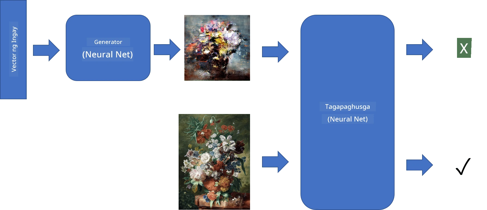
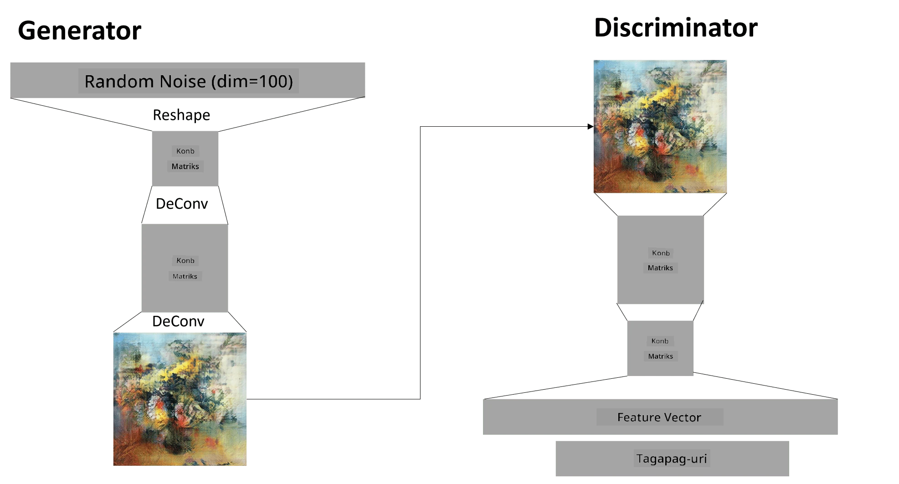

# Generative Adversarial Networks

Sa nakaraang seksyon, natutunan natin ang tungkol sa **generative models**: mga modelo na maaaring lumikha ng mga bagong imahe na kahawig ng mga nasa training dataset. Ang VAE ay isang magandang halimbawa ng generative model.

## [Pre-lecture quiz](https://ff-quizzes.netlify.app/en/ai/quiz/19)

Gayunpaman, kung susubukan nating lumikha ng isang bagay na talagang makabuluhan, tulad ng isang painting na may makatwirang resolusyon, gamit ang VAE, makikita natin na hindi maayos ang convergence ng training. Para sa ganitong kaso, dapat nating matutunan ang isa pang arkitektura na partikular na nakatuon sa generative models - **Generative Adversarial Networks**, o GANs.

Ang pangunahing ideya ng GAN ay ang pagkakaroon ng dalawang neural networks na magsasanay laban sa isa't isa:

> Larawan mula kay [Dmitry Soshnikov](http://soshnikov.com)

> ✅ Kaunting bokabularyo:
> * **Generator** ay isang network na kumukuha ng random na vector, at gumagawa ng imahe bilang resulta
> * **Discriminator** ay isang network na kumukuha ng imahe, at dapat nitong matukoy kung ito ay tunay na imahe (mula sa training dataset), o kung ito ay nilikha ng generator. Ito ay mahalagang isang image classifier.

### Discriminator

Ang arkitektura ng discriminator ay hindi naiiba sa karaniwang image classification network. Sa pinakasimpleng kaso, maaari itong maging fully-connected classifier, ngunit kadalasan ito ay magiging isang [convolutional network](../07-ConvNets/README.md).

> ✅ Ang GAN na nakabatay sa convolutional networks ay tinatawag na [DCGAN](https://arxiv.org/pdf/1511.06434.pdf)

Ang CNN discriminator ay binubuo ng mga sumusunod na layer: ilang convolutions+poolings (na may pababang spatial size) at isa-o-higit pang fully-connected layers upang makuha ang "feature vector", at ang panghuling binary classifier.

> ✅ Ang 'pooling' sa kontekstong ito ay isang teknik na nagpapaliit sa sukat ng imahe. "Ang pooling layers ay nagpapababa sa dimensyon ng data sa pamamagitan ng pagsasama-sama ng mga output ng neuron clusters sa isang layer sa isang neuron sa susunod na layer." - [source](https://wikipedia.org/wiki/Convolutional_neural_network#Pooling_layers)

### Generator

Ang Generator ay medyo mas komplikado. Maaari mo itong ituring na baliktad na discriminator. Simula sa isang latent vector (sa halip na feature vector), mayroon itong fully-connected layer upang i-convert ito sa kinakailangang sukat/hugis, na sinusundan ng deconvolutions+upscaling. Katulad ito ng *decoder* na bahagi ng [autoencoder](../09-Autoencoders/README.md).

> ✅ Dahil ang convolution layer ay ipinatutupad bilang isang linear filter na naglalakbay sa imahe, ang deconvolution ay mahalagang katulad ng convolution, at maaaring ipatupad gamit ang parehong layer logic.

> Larawan mula kay [Dmitry Soshnikov](http://soshnikov.com)

### Pagsasanay sa GAN

Ang GANs ay tinatawag na **adversarial** dahil may patuloy na kompetisyon sa pagitan ng generator at discriminator. Sa kompetisyong ito, parehong nagiging mas mahusay ang generator at discriminator, kaya natututo ang network na lumikha ng mas magagandang larawan.

Ang pagsasanay ay nangyayari sa dalawang yugto:

* **Pagsasanay sa discriminator**. Ang gawaing ito ay medyo simple: gumagawa tayo ng batch ng mga imahe gamit ang generator, na may label na 0, na nangangahulugang pekeng imahe, at kumukuha ng batch ng mga imahe mula sa input dataset (na may label na 1, tunay na imahe). Nakakakuha tayo ng *discriminator loss*, at nagsasagawa ng backprop.
* **Pagsasanay sa generator**. Ito ay medyo mas mahirap, dahil hindi natin direktang alam ang inaasahang output para sa generator. Kinukuha natin ang buong GAN network na binubuo ng generator na sinusundan ng discriminator, pinapakain ito ng ilang random vectors, at inaasahan ang resulta na maging 1 (na tumutukoy sa tunay na mga imahe). Pagkatapos ay i-freeze natin ang mga parameter ng discriminator (ayaw natin itong masanay sa hakbang na ito), at nagsasagawa ng backprop.

Sa prosesong ito, ang parehong generator at discriminator losses ay hindi masyadong bumababa. Sa ideal na sitwasyon, dapat silang mag-oscillate, na tumutukoy sa parehong network na nagpapabuti ng kanilang performance.

## ✍️ Mga Ehersisyo: GANs

* [GAN Notebook sa TensorFlow/Keras](GANTF.ipynb)
* [GAN Notebook sa PyTorch](GANPyTorch.ipynb)

### Mga Problema sa Pagsasanay ng GAN

Ang GANs ay kilala na mahirap sanayin. Narito ang ilang mga problema:

* **Mode Collapse**. Ang ibig sabihin nito ay natututo ang generator na lumikha ng isang matagumpay na imahe na nakakaloko sa discriminator, at hindi iba't ibang mga imahe.
* **Sensitivity sa hyperparameters**. Madalas mong makikita na ang GAN ay hindi nagko-converge, at pagkatapos biglang bumaba ang learning rate na nagdudulot ng convergence.
* Pagpapanatili ng **balanse** sa pagitan ng generator at discriminator. Sa maraming kaso, ang discriminator loss ay maaaring bumaba sa zero nang mabilis, na nagreresulta sa generator na hindi na makapagpatuloy sa pagsasanay. Upang malampasan ito, maaari nating subukang magtakda ng iba't ibang learning rates para sa generator at discriminator, o laktawan ang pagsasanay ng discriminator kung masyado nang mababa ang loss.
* Pagsasanay para sa **mataas na resolusyon**. Katulad ng problema sa autoencoders, ang problemang ito ay nangyayari dahil ang pag-reconstruct ng masyadong maraming layers ng convolutional network ay nagdudulot ng artifacts. Ang problemang ito ay karaniwang nalulutas gamit ang tinatawag na **progressive growing**, kung saan ang unang ilang layers ay sinasanay sa low-res images, at pagkatapos ay "ina-unblock" o idinadagdag ang mga layers. Ang isa pang solusyon ay ang pagdaragdag ng extra connections sa pagitan ng mga layers at pagsasanay ng ilang resolusyon nang sabay-sabay - tingnan ang [Multi-Scale Gradient GANs paper](https://arxiv.org/abs/1903.06048) para sa mga detalye.

## Style Transfer

Ang GANs ay isang mahusay na paraan upang lumikha ng mga artistic images. Isa pang kawili-wiling teknik ay ang tinatawag na **style transfer**, na kumukuha ng isang **content image**, at muling iginuguhit ito sa ibang estilo, gamit ang mga filter mula sa **style image**.

Ganito ang paraan ng paggawa nito:
* Nagsisimula tayo sa isang random noise image (o sa isang content image, ngunit para sa mas madaling pag-unawa, mas mabuting magsimula sa random noise)
* Ang layunin natin ay lumikha ng isang imahe na malapit sa parehong content image at style image. Ito ay matutukoy ng dalawang loss functions:
   - **Content loss** ay kinakalkula batay sa mga features na nakuha ng CNN sa ilang layers mula sa kasalukuyang imahe at content image
   - **Style loss** ay kinakalkula sa pagitan ng kasalukuyang imahe at style image sa isang matalinong paraan gamit ang Gram matrices (mas maraming detalye sa [example notebook](StyleTransfer.ipynb))
* Upang gawing mas makinis ang imahe at alisin ang noise, nagdaragdag din tayo ng **Variation loss**, na kinakalkula ang average na distansya sa pagitan ng magkatabing pixels
* Ang pangunahing optimization loop ay ina-adjust ang kasalukuyang imahe gamit ang gradient descent (o ibang optimization algorithm) upang mabawasan ang kabuuang loss, na isang weighted sum ng lahat ng tatlong losses.

## ✍️ Halimbawa: [Style Transfer](StyleTransfer.ipynb)

## [Post-lecture quiz](https://ff-quizzes.netlify.app/en/ai/quiz/20)

## Konklusyon

Sa araling ito, natutunan mo ang tungkol sa GANs at kung paano ito sanayin. Natutunan mo rin ang mga espesyal na hamon na maaaring harapin ng ganitong uri ng Neural Network, at ilang mga estratehiya kung paano ito malalampasan.

## 🚀 Hamon

Subukan ang [Style Transfer notebook](StyleTransfer.ipynb) gamit ang sarili mong mga imahe.

## Review & Self Study

Para sa karagdagang impormasyon, basahin ang tungkol sa GANs sa mga sumusunod na resources:

* Marco Pasini, [10 Lessons I Learned Training GANs for one Year](https://towardsdatascience.com/10-lessons-i-learned-training-generative-adversarial-networks-gans-for-a-year-c9071159628)
* [StyleGAN](https://en.wikipedia.org/wiki/StyleGAN), isang *de facto* GAN architecture na dapat isaalang-alang
* [Creating Generative Art using GANs on Azure ML](https://soshnikov.com/scienceart/creating-generative-art-using-gan-on-azureml/)

## Takdang-Aralin

Balikan ang isa sa dalawang notebook na nauugnay sa araling ito at sanayin muli ang GAN gamit ang sarili mong mga imahe. Ano ang kaya mong likhain?

---

