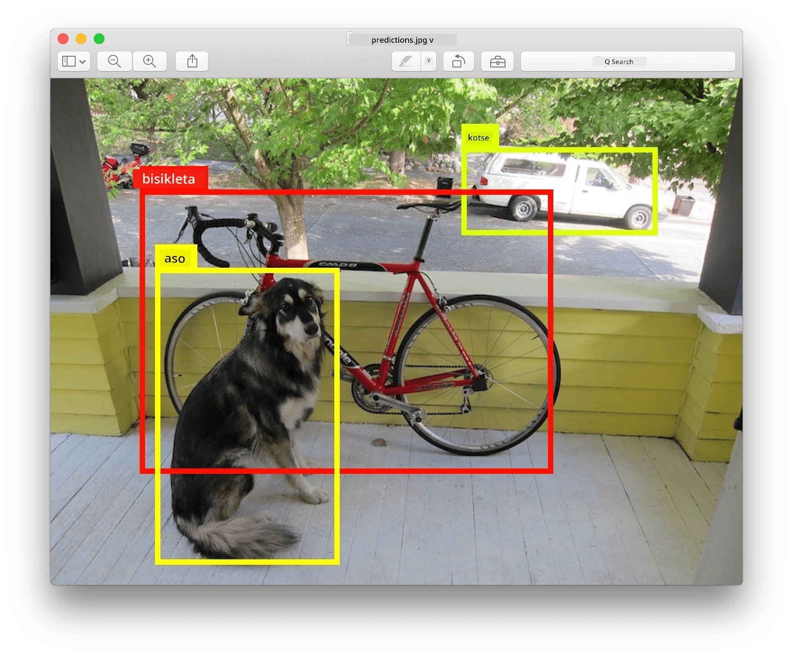
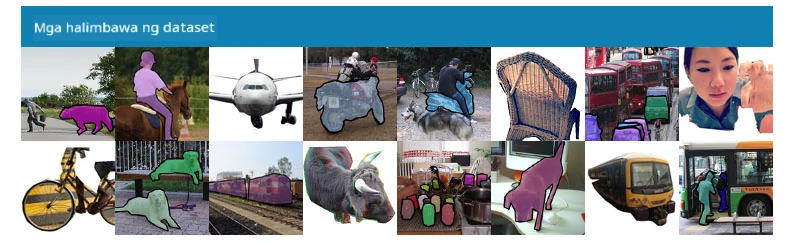
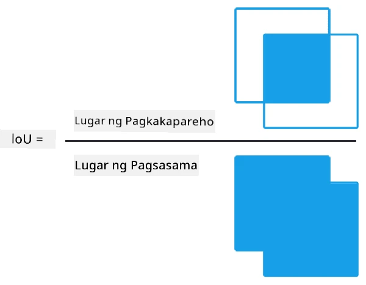
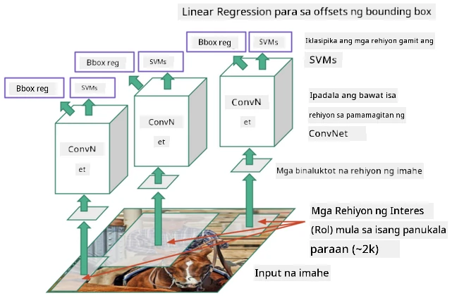
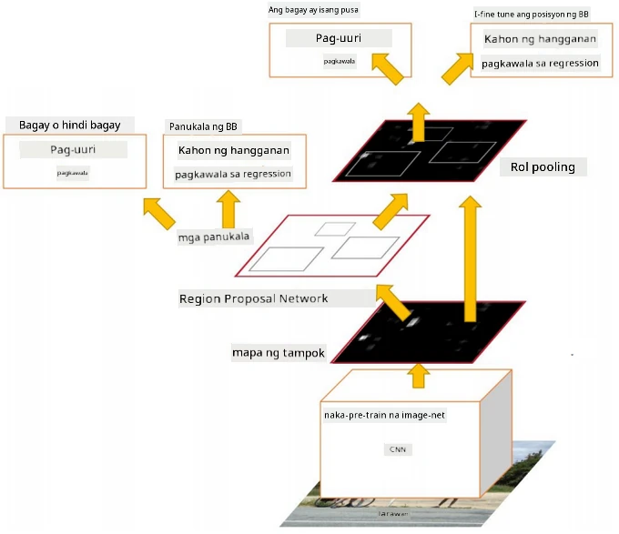
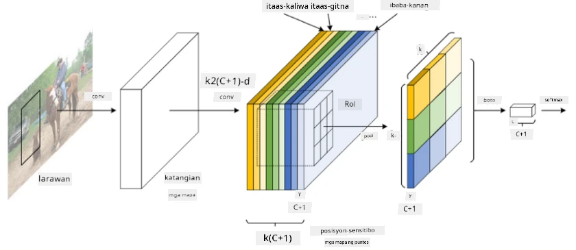
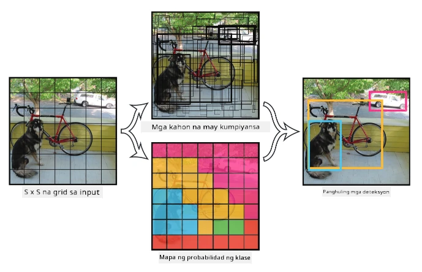

# Pag-detect ng Objekto

Ang mga modelo ng image classification na ating tinalakay hanggang ngayon ay tumatanggap ng isang imahe at nagbibigay ng resulta na kategorya, tulad ng klase na 'numero' sa problema ng MNIST. Gayunpaman, sa maraming pagkakataon, hindi lang natin nais malaman na ang isang larawan ay nagpapakita ng mga bagay - nais din nating matukoy ang eksaktong lokasyon ng mga ito. Ito ang layunin ng **pag-detect ng objekto**.

## [Pre-lecture quiz](https://ff-quizzes.netlify.app/en/ai/quiz/21)

> Larawan mula sa [YOLO v2 web site](https://pjreddie.com/darknet/yolov2/)

## Isang Simpleng Paraan sa Pag-detect ng Objekto

Kung nais nating hanapin ang isang pusa sa isang larawan, ang isang napakasimpleng paraan ng pag-detect ng objekto ay ang sumusunod:

1. Hatiin ang larawan sa maraming tile.
2. Patakbuhin ang image classification sa bawat tile.
3. Ang mga tile na may sapat na mataas na activation ay maaaring ituring na naglalaman ng hinahanap na objekto.

> *Larawan mula sa [Exercise Notebook](ObjectDetection-TF.ipynb)*

Gayunpaman, ang paraang ito ay malayo sa perpekto, dahil hindi nito lubos na natutukoy ang bounding box ng objekto. Para sa mas eksaktong lokasyon, kailangan nating gumamit ng **regression** upang mahulaan ang mga coordinate ng bounding boxes - at para dito, kailangan natin ng mga partikular na dataset.

## Regression para sa Pag-detect ng Objekto

[Ang blog post na ito](https://towardsdatascience.com/object-detection-with-neural-networks-a4e2c46b4491) ay nagbibigay ng magandang pagpapakilala sa pag-detect ng mga hugis.

## Mga Dataset para sa Pag-detect ng Objekto

Maaaring makatagpo ka ng mga sumusunod na dataset para sa gawaing ito:

* [PASCAL VOC](http://host.robots.ox.ac.uk/pascal/VOC/) - 20 klase
* [COCO](http://cocodataset.org/#home) - Common Objects in Context. 80 klase, bounding boxes, at segmentation masks

## Mga Sukatan para sa Pag-detect ng Objekto

### Intersection over Union

Habang madali ang pagsukat ng performance ng algorithm sa image classification, sa pag-detect ng objekto kailangan nating sukatin ang tamang klase pati na rin ang eksaktong lokasyon ng inferred bounding box. Para sa huli, ginagamit natin ang tinatawag na **Intersection over Union** (IoU), na sumusukat kung gaano kahusay ang overlap ng dalawang kahon (o dalawang arbitrary na lugar).

> *Figure 2 mula sa [napakagandang blog post na ito tungkol sa IoU](https://pyimagesearch.com/2016/11/07/intersection-over-union-iou-for-object-detection/)*

Ang ideya ay simple - hinahati natin ang lugar ng intersection ng dalawang pigura sa lugar ng kanilang union. Para sa dalawang magkaparehong lugar, ang IoU ay magiging 1, habang para sa ganap na magkahiwalay na lugar ito ay magiging 0. Kung hindi, ito ay mag-iiba mula 0 hanggang 1. Karaniwan, isinasaalang-alang lamang natin ang mga bounding box na may IoU na higit sa isang tiyak na halaga.

### Average Precision

Halimbawa, nais nating sukatin kung gaano kahusay ang pagkilala sa isang klase ng objekto $C$. Para sukatin ito, ginagamit natin ang **Average Precision** metrics, na kinakalkula sa ganitong paraan:

1. Isaalang-alang ang Precision-Recall curve na nagpapakita ng accuracy depende sa detection threshold value (mula 0 hanggang 1).
2. Depende sa threshold, makakakita tayo ng mas marami o mas kaunting mga objekto sa larawan, at magkakaibang halaga ng precision at recall.
3. Ang curve ay magmumukhang ganito:

> *Larawan mula sa [NeuroWorkshop](http://github.com/shwars/NeuroWorkshop)*

Ang Average Precision para sa isang klase $C$ ay ang lugar sa ilalim ng curve na ito. Mas partikular, ang Recall axis ay karaniwang hinahati sa 10 bahagi, at ang Precision ay ina-average sa lahat ng mga puntong iyon:

$$
AP = {1\over11}\sum_{i=0}^{10}\mbox{Precision}(\mbox{Recall}={i\over10})
$$

### AP at IoU

Isasaalang-alang lamang natin ang mga detection na may IoU na higit sa isang tiyak na halaga. Halimbawa, sa PASCAL VOC dataset karaniwang $\mbox{IoU Threshold} = 0.5$ ang ginagamit, habang sa COCO ang AP ay sinusukat para sa iba't ibang halaga ng $\mbox{IoU Threshold}$.

> *Larawan mula sa [NeuroWorkshop](http://github.com/shwars/NeuroWorkshop)*

### Mean Average Precision - mAP

Ang pangunahing sukatan para sa pag-detect ng objekto ay tinatawag na **Mean Average Precision**, o **mAP**. Ito ay ang halaga ng Average Precision, na ina-average sa lahat ng klase ng objekto, at kung minsan ay sa $\mbox{IoU Threshold}$ din. Ang proseso ng pagkalkula ng **mAP** ay mas detalyadong ipinaliwanag
[sa blog post na ito](https://medium.com/@timothycarlen/understanding-the-map-evaluation-metric-for-object-detection-a07fe6962cf3)), at [dito na may mga code sample](https://gist.github.com/tarlen5/008809c3decf19313de216b9208f3734).

## Iba't Ibang Paraan ng Pag-detect ng Objekto

May dalawang malawak na klase ng mga algorithm sa pag-detect ng objekto:

* **Region Proposal Networks** (R-CNN, Fast R-CNN, Faster R-CNN). Ang pangunahing ideya ay ang pagbuo ng **Regions of Interests** (ROI) at pagpapatakbo ng CNN sa mga ito, naghahanap ng maximum activation. Medyo katulad ito sa simpleng paraan, maliban na ang mga ROI ay nabubuo sa mas matalinong paraan. Isa sa mga pangunahing kahinaan ng mga ganitong pamamaraan ay mabagal ang mga ito, dahil kailangan ng maraming pass ng CNN classifier sa larawan.
* **One-pass** (YOLO, SSD, RetinaNet) methods. Sa mga arkitektura na ito, idinisenyo ang network upang mahulaan ang parehong klase at ROI sa isang pass.

### R-CNN: Region-Based CNN

Ang [R-CNN](http://islab.ulsan.ac.kr/files/announcement/513/rcnn_pami.pdf) ay gumagamit ng [Selective Search](http://www.huppelen.nl/publications/selectiveSearchDraft.pdf) upang makabuo ng hierarchical structure ng mga ROI region, na pagkatapos ay ipinapasa sa CNN feature extractors at SVM-classifiers upang matukoy ang klase ng objekto, at linear regression upang matukoy ang mga coordinate ng *bounding box*. [Opisyal na Papel](https://arxiv.org/pdf/1506.01497v1.pdf)

> *Larawan mula kay van de Sande et al. ICCV’11*

> *Mga larawan mula sa [blog na ito](https://towardsdatascience.com/r-cnn-fast-r-cnn-faster-r-cnn-yolo-object-detection-algorithms-36d53571365e)

### F-RCNN - Fast R-CNN

Ang pamamaraang ito ay katulad ng R-CNN, ngunit ang mga region ay tinutukoy pagkatapos ma-apply ang convolution layers.

> Larawan mula sa [Opisyal na Papel](https://www.cv-foundation.org/openaccess/content_iccv_2015/papers/Girshick_Fast_R-CNN_ICCV_2015_paper.pdf), [arXiv](https://arxiv.org/pdf/1504.08083.pdf), 2015

### Faster R-CNN

Ang pangunahing ideya ng pamamaraang ito ay ang paggamit ng neural network upang mahulaan ang mga ROI - tinatawag na *Region Proposal Network*. [Papel](https://arxiv.org/pdf/1506.01497.pdf), 2016

> Larawan mula sa [opisyal na papel](https://arxiv.org/pdf/1506.01497.pdf)

### R-FCN: Region-Based Fully Convolutional Network

Ang algorithm na ito ay mas mabilis pa kaysa sa Faster R-CNN. Ang pangunahing ideya ay ang sumusunod:

1. Kinukuha ang mga feature gamit ang ResNet-101.
1. Ang mga feature ay pinoproseso ng **Position-Sensitive Score Map**. Ang bawat objekto mula sa $C$ klase ay hinahati sa $k\times k$ na mga region, at sinasanay upang mahulaan ang mga bahagi ng mga objekto.
1. Para sa bawat bahagi mula sa $k\times k$ na mga region, lahat ng network ay bumoboto para sa klase ng objekto, at ang klase ng objekto na may pinakamataas na boto ang pinipili.

> Larawan mula sa [opisyal na papel](https://arxiv.org/abs/1605.06409)

### YOLO - You Only Look Once

Ang YOLO ay isang realtime one-pass algorithm. Ang pangunahing ideya ay ang sumusunod:

 * Ang larawan ay hinahati sa $S\times S$ na mga region.
 * Para sa bawat region, **CNN** ay hinuhulaan ang $n$ posibleng mga objekto, *bounding box* coordinates, at *confidence*=*probability* * IoU.

 

> Larawan mula sa [opisyal na papel](https://arxiv.org/abs/1506.02640)

### Iba Pang Mga Algorithm

* RetinaNet: [opisyal na papel](https://arxiv.org/abs/1708.02002)
   - [PyTorch Implementation sa Torchvision](https://pytorch.org/vision/stable/_modules/torchvision/models/detection/retinanet.html)
   - [Keras Implementation](https://github.com/fizyr/keras-retinanet)
   - [Object Detection gamit ang RetinaNet](https://keras.io/examples/vision/retinanet/) sa Keras Samples
* SSD (Single Shot Detector): [opisyal na papel](https://arxiv.org/abs/1512.02325)

## ✍️ Mga Ehersisyo: Pag-detect ng Objekto

Ipagpatuloy ang iyong pag-aaral sa sumusunod na notebook:

[ObjectDetection.ipynb](ObjectDetection.ipynb)

## Konklusyon

Sa araling ito, nagkaroon ka ng mabilisang pagtingin sa iba't ibang paraan ng pag-detect ng objekto!

## 🚀 Hamon

Basahin ang mga artikulo at notebook tungkol sa YOLO at subukan ito sa iyong sarili:

* [Magandang blog post](https://www.analyticsvidhya.com/blog/2018/12/practical-guide-object-detection-yolo-framewor-python/) na naglalarawan ng YOLO
 * [Opisyal na site](https://pjreddie.com/darknet/yolo/)
 * Yolo: [Keras implementation](https://github.com/experiencor/keras-yolo2), [step-by-step notebook](https://github.com/experiencor/basic-yolo-keras/blob/master/Yolo%20Step-by-Step.ipynb)
 * Yolo v2: [Keras implementation](https://github.com/experiencor/keras-yolo2), [step-by-step notebook](https://github.com/experiencor/keras-yolo2/blob/master/Yolo%20Step-by-Step.ipynb)

## [Post-lecture quiz](https://ff-quizzes.netlify.app/en/ai/quiz/22)

## Review & Self Study

* [Pag-detect ng Objekto](https://tjmachinelearning.com/lectures/1718/obj/) ni Nikhil Sardana
* [Isang magandang paghahambing ng mga algorithm sa pag-detect ng objekto](https://lilianweng.github.io/lil-log/2018/12/27/object-detection-part-4.html)
* [Review ng Deep Learning Algorithms para sa Pag-detect ng Objekto](https://medium.com/comet-app/review-of-deep-learning-algorithms-for-object-detection-c1f3d437b852)
* [Isang Step-by-Step na Pagpapakilala sa Mga Pangunahing Algorithm sa Pag-detect ng Objekto](https://www.analyticsvidhya.com/blog/2018/10/a-step-by-step-introduction-to-the-basic-object-detection-algorithms-part-1/)
* [Pagpapatupad ng Faster R-CNN sa Python para sa Pag-detect ng Objekto](https://www.analyticsvidhya.com/blog/2018/11/implementation-faster-r-cnn-python-object-detection/)

## [Assignment: Pag-detect ng Objekto](lab/README.md)

---

