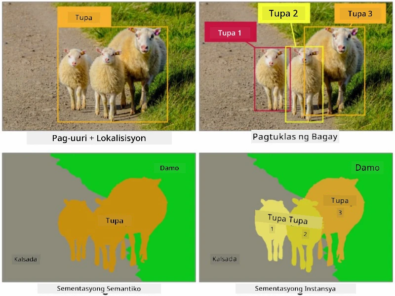
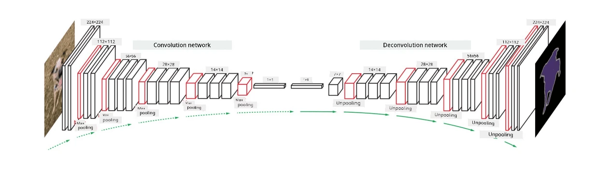

# Segmentation

Natutuhan na natin ang tungkol sa Object Detection, na nagbibigay-daan sa atin upang matukoy ang mga bagay sa larawan sa pamamagitan ng pag-predict ng kanilang *bounding boxes*. Gayunpaman, para sa ilang mga gawain, hindi lang bounding boxes ang kailangan natin, kundi mas tiyak na lokasyon ng mga bagay. Ang gawaing ito ay tinatawag na **segmentation**.

## [Pre-lecture quiz](https://ff-quizzes.netlify.app/en/ai/quiz/23)

Ang segmentation ay maaaring tingnan bilang **pixel classification**, kung saan para sa **bawat** pixel ng larawan, kailangan nating i-predict ang klase nito (*background* bilang isa sa mga klase). Mayroong dalawang pangunahing uri ng segmentation algorithms:

* **Semantic segmentation** na nagsasabi lamang ng klase ng pixel, ngunit hindi nito pinag-iiba ang iba't ibang bagay na nasa parehong klase.
* **Instance segmentation** na naghahati ng mga klase sa iba't ibang instances.

Halimbawa, sa instance segmentation, ang mga tupa ay magkakaibang bagay, ngunit sa semantic segmentation, ang lahat ng tupa ay kinakatawan ng isang klase.

> Larawan mula sa [blog post na ito](https://nirmalamurali.medium.com/image-classification-vs-semantic-segmentation-vs-instance-segmentation-625c33a08d50)

May iba't ibang neural architectures para sa segmentation, ngunit pare-pareho ang kanilang istruktura. Sa isang paraan, ito ay katulad ng autoencoder na natutunan mo dati, ngunit sa halip na i-deconstruct ang orihinal na larawan, ang layunin natin ay i-deconstruct ang isang **mask**. Kaya, ang segmentation network ay may mga sumusunod na bahagi:

* **Encoder** na kumukuha ng mga features mula sa input image
* **Decoder** na nagta-transform ng mga features na iyon sa **mask image**, na may parehong laki at bilang ng channels na tumutugma sa bilang ng mga klase.

> Larawan mula sa [publikasyong ito](https://arxiv.org/pdf/2001.05566.pdf)

Dapat nating bigyang-pansin ang loss function na ginagamit para sa segmentation. Kapag gumagamit ng classical autoencoders, kailangan nating sukatin ang pagkakatulad sa pagitan ng dalawang larawan, at maaari nating gamitin ang mean square error (MSE) para dito. Sa segmentation, ang bawat pixel sa target mask image ay kumakatawan sa numero ng klase (one-hot-encoded sa third dimension), kaya kailangan nating gumamit ng loss functions na partikular para sa classification - cross-entropy loss, na averaged sa lahat ng pixels. Kung ang mask ay binary - **binary cross-entropy loss** (BCE) ang ginagamit.

> ✅ Ang One-hot encoding ay isang paraan upang i-encode ang class label sa isang vector na may haba na katumbas ng bilang ng mga klase. Tingnan ang [artikulong ito](https://datagy.io/sklearn-one-hot-encode/) tungkol sa teknik na ito.

## Segmentation para sa Medical Imaging

Sa araling ito, makikita natin ang segmentation sa aksyon sa pamamagitan ng pag-train ng network upang makilala ang human nevi (kilala rin bilang moles) sa mga medical images. Gagamitin natin ang <a href="https://www.fc.up.pt/addi/ph2%20database.html">PH2 Database</a> ng dermoscopy images bilang pinagmulan ng mga larawan. Ang dataset na ito ay naglalaman ng 200 larawan ng tatlong klase: typical nevus, atypical nevus, at melanoma. Ang lahat ng larawan ay mayroon ding kaukulang **mask** na naglalarawan sa nevus.

> ✅ Ang teknik na ito ay partikular na angkop para sa ganitong uri ng medical imaging, ngunit anong iba pang mga aplikasyon sa totoong mundo ang naiisip mo?

> Larawan mula sa PH2 Database

Magte-train tayo ng model upang i-segment ang anumang nevus mula sa background nito.

## ✍️ Mga Ehersisyo: Semantic Segmentation

Buksan ang mga notebooks sa ibaba upang matuto pa tungkol sa iba't ibang semantic segmentation architectures, magsanay sa paggamit ng mga ito, at makita ang mga ito sa aksyon.

* [Semantic Segmentation Pytorch](SemanticSegmentationPytorch.ipynb)
* [Semantic Segmentation TensorFlow](SemanticSegmentationTF.ipynb)

## [Post-lecture quiz](https://ff-quizzes.netlify.app/en/ai/quiz/24)

## Konklusyon

Ang segmentation ay isang napakalakas na teknik para sa image classification, na lumalampas sa bounding boxes patungo sa pixel-level classification. Ito ay isang teknik na ginagamit sa medical imaging, bukod sa iba pang mga aplikasyon.

## 🚀 Hamon

Ang body segmentation ay isa lamang sa mga karaniwang gawain na maaari nating gawin gamit ang mga larawan ng tao. Ang iba pang mahalagang gawain ay kinabibilangan ng **skeleton detection** at **pose detection**. Subukan ang [OpenPose](https://github.com/CMU-Perceptual-Computing-Lab/openpose) library upang makita kung paano magagamit ang pose detection.

## Review at Pag-aaral sa Sarili

Ang [artikulo sa Wikipedia](https://wikipedia.org/wiki/Image_segmentation) ay nag-aalok ng magandang overview ng iba't ibang aplikasyon ng teknik na ito. Matuto pa nang mag-isa tungkol sa mga subdomain ng Instance segmentation at Panoptic segmentation sa larangang ito.

## [Assignment](lab/README.md)

Sa lab na ito, subukan ang **human body segmentation** gamit ang [Segmentation Full Body MADS Dataset](https://www.kaggle.com/datasets/tapakah68/segmentation-full-body-mads-dataset) mula sa Kaggle.

---

