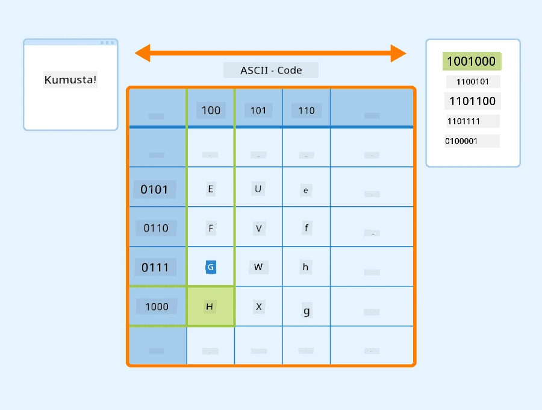
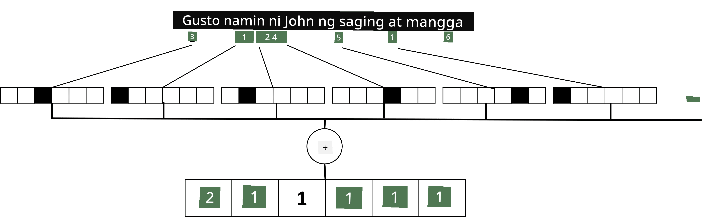

# Pagsasalarawan ng Teksto bilang Tensors

## [Pre-lecture quiz](https://ff-quizzes.netlify.app/en/ai/quiz/25)

## Pag-uuri ng Teksto

Sa unang bahagi ng seksyong ito, magtutuon tayo sa gawain ng **pag-uuri ng teksto**. Gagamitin natin ang [AG News](https://www.kaggle.com/amananandrai/ag-news-classification-dataset) Dataset, na naglalaman ng mga artikulo ng balita tulad ng sumusunod:

* Kategorya: Sci/Tech  
* Pamagat: Ky. Company Wins Grant to Study Peptides (AP)  
* Nilalaman: AP - Isang kumpanya na itinatag ng isang mananaliksik sa kemika mula sa University of Louisville ang nanalo ng grant upang mag-develop...

Ang layunin natin ay uriin ang balita sa isa sa mga kategorya batay sa teksto.

## Pagsasalarawan ng Teksto

Kung nais nating lutasin ang mga gawain sa Natural Language Processing (NLP) gamit ang neural networks, kailangan natin ng paraan upang maipakita ang teksto bilang tensors. Ang mga computer ay kumakatawan na sa mga karakter ng teksto bilang mga numero na tumutugma sa mga font sa iyong screen gamit ang mga encoding tulad ng ASCII o UTF-8.

> [Pinagmulan ng Larawan](https://www.seobility.net/en/wiki/ASCII)

Bilang mga tao, nauunawaan natin kung ano ang **kinakatawan** ng bawat letra, at kung paano nagsasama-sama ang mga karakter upang bumuo ng mga salita sa isang pangungusap. Gayunpaman, ang mga computer mismo ay walang ganitong pag-unawa, at kailangang matutunan ng neural network ang kahulugan nito sa panahon ng pagsasanay.

Dahil dito, maaari tayong gumamit ng iba't ibang paraan sa pagsasalarawan ng teksto:

* **Character-level representation**, kung saan kinakatawan natin ang teksto sa pamamagitan ng pagturing sa bawat karakter bilang isang numero. Kung mayroon tayong *C* na iba't ibang karakter sa ating text corpus, ang salitang *Hello* ay kakatawanin ng 5x*C* tensor. Ang bawat letra ay tutugma sa isang column ng tensor sa one-hot encoding.  
* **Word-level representation**, kung saan gumagawa tayo ng **bokabularyo** ng lahat ng salita sa ating teksto, at pagkatapos ay kinakatawan ang mga salita gamit ang one-hot encoding. Ang pamamaraang ito ay mas mainam, dahil ang bawat letra ay walang gaanong kahulugan sa sarili nito, kaya't sa paggamit ng mas mataas na antas ng semantikong konsepto - mga salita - pinapasimple natin ang gawain para sa neural network. Gayunpaman, dahil sa laki ng diksyunaryo, kailangan nating harapin ang mataas na dimensyong sparse tensors.

Anuman ang representasyon, kailangan muna nating i-convert ang teksto sa isang pagkakasunod-sunod ng **mga token**, kung saan ang isang token ay maaaring isang karakter, isang salita, o minsan kahit bahagi ng isang salita. Pagkatapos, iko-convert natin ang token sa isang numero, karaniwang gamit ang **bokabularyo**, at ang numerong ito ay maaaring ipasok sa isang neural network gamit ang one-hot encoding.

## N-Grams

Sa natural na wika, ang tiyak na kahulugan ng mga salita ay natutukoy lamang sa konteksto. Halimbawa, ang mga kahulugan ng *neural network* at *fishing network* ay ganap na magkaiba. Isa sa mga paraan upang isaalang-alang ito ay ang paggawa ng modelo batay sa mga pares ng salita, at ituring ang mga pares ng salita bilang magkakahiwalay na token sa bokabularyo. Sa ganitong paraan, ang pangungusap na *I like to go fishing* ay kakatawanin ng sumusunod na pagkakasunod-sunod ng mga token: *I like*, *like to*, *to go*, *go fishing*. Ang problema sa pamamaraang ito ay ang paglaki ng laki ng diksyunaryo, at ang mga kumbinasyon tulad ng *go fishing* at *go shopping* ay kinakatawan ng magkaibang token, na walang anumang semantikong pagkakatulad sa kabila ng parehong pandiwa.  

Sa ilang mga kaso, maaari rin nating isaalang-alang ang paggamit ng tri-grams -- mga kumbinasyon ng tatlong salita. Kaya't ang pamamaraang ito ay madalas na tinatawag na **n-grams**. Gayundin, may kabuluhan ang paggamit ng n-grams sa character-level representation, kung saan ang n-grams ay halos tumutugma sa iba't ibang pantig.

## Bag-of-Words at TF/IDF

Kapag nilulutas ang mga gawain tulad ng pag-uuri ng teksto, kailangan nating maipakita ang teksto sa pamamagitan ng isang fixed-size na vector, na gagamitin natin bilang input sa panghuling dense classifier. Isa sa mga pinakasimpleng paraan upang gawin ito ay pagsamahin ang lahat ng indibidwal na representasyon ng salita, halimbawa sa pamamagitan ng pagdaragdag ng mga ito. Kung idaragdag natin ang one-hot encodings ng bawat salita, magkakaroon tayo ng vector ng mga frequency, na nagpapakita kung ilang beses lumitaw ang bawat salita sa loob ng teksto. Ang ganitong representasyon ng teksto ay tinatawag na **bag of words** (BoW).

> Larawan mula sa may-akda

Ang BoW ay mahalagang nagpapakita kung aling mga salita ang lumitaw sa teksto at sa anong dami, na maaaring maging isang magandang indikasyon kung tungkol saan ang teksto. Halimbawa, ang artikulo ng balita tungkol sa politika ay malamang na naglalaman ng mga salitang tulad ng *president* at *country*, habang ang siyentipikong publikasyon ay maaaring may mga salitang tulad ng *collider*, *discovered*, atbp. Kaya't ang mga frequency ng salita ay maaaring sa maraming kaso ay isang magandang indikasyon ng nilalaman ng teksto.

Ang problema sa BoW ay ang ilang karaniwang salita, tulad ng *and*, *is*, atbp. ay lumilitaw sa karamihan ng mga teksto, at sila ang may pinakamataas na frequency, na natatabunan ang mga salitang talagang mahalaga. Maaari nating bawasan ang kahalagahan ng mga salitang ito sa pamamagitan ng pagsasaalang-alang sa frequency kung saan lumilitaw ang mga salita sa buong koleksyon ng dokumento. Ito ang pangunahing ideya sa likod ng TF/IDF na pamamaraan, na tinalakay nang mas detalyado sa mga notebook na naka-attach sa araling ito.

Gayunpaman, wala sa mga pamamaraang ito ang ganap na makakakuha ng **semantika** ng teksto. Kailangan natin ng mas makapangyarihang mga modelo ng neural network upang magawa ito, na tatalakayin natin sa mga susunod na bahagi ng seksyon.

## ✍️ Mga Ehersisyo: Pagsasalarawan ng Teksto

Ipagpatuloy ang iyong pag-aaral sa mga sumusunod na notebook:

* [Text Representation with PyTorch](TextRepresentationPyTorch.ipynb)  
* [Text Representation with TensorFlow](TextRepresentationTF.ipynb)  

## Konklusyon

Sa ngayon, pinag-aralan natin ang mga teknik na maaaring magdagdag ng frequency weight sa iba't ibang salita. Gayunpaman, hindi nila kayang ipakita ang kahulugan o pagkakasunod-sunod. Tulad ng sinabi ng kilalang lingguwista na si J. R. Firth noong 1935, "Ang kumpletong kahulugan ng isang salita ay palaging nasa konteksto, at walang pag-aaral ng kahulugan na hiwalay sa konteksto ang maaaring seryosohin." Matututuhan natin sa mga susunod na bahagi ng kurso kung paano makuha ang impormasyong kontekstwal mula sa teksto gamit ang language modeling.

## 🚀 Hamon

Subukan ang iba pang mga ehersisyo gamit ang bag-of-words at iba't ibang modelo ng datos. Maaaring ma-inspire ka ng [kompetisyon na ito sa Kaggle](https://www.kaggle.com/competitions/word2vec-nlp-tutorial/overview/part-1-for-beginners-bag-of-words)

## [Post-lecture quiz](https://ff-quizzes.netlify.app/en/ai/quiz/26)

## Pagsusuri at Pag-aaral sa Sarili

Sanayin ang iyong mga kasanayan sa text embeddings at bag-of-words techniques sa [Microsoft Learn](https://docs.microsoft.com/learn/modules/intro-natural-language-processing-pytorch/?WT.mc_id=academic-77998-cacaste)

## [Takdang-Aralin: Mga Notebook](assignment.md)

---

