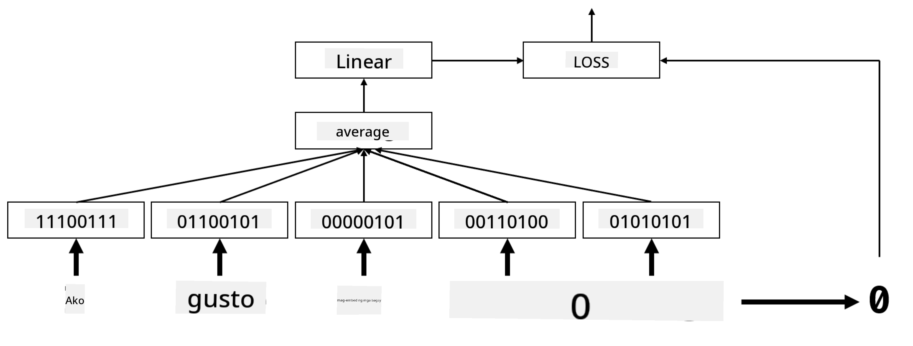
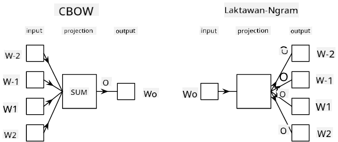

<!--
CO_OP_TRANSLATOR_METADATA:
{
  "original_hash": "e40b47ac3fd48f71304ede1474e66293",
  "translation_date": "2025-08-28T02:44:37+00:00",
  "source_file": "lessons/5-NLP/14-Embeddings/README.md",
  "language_code": "tl"
}
-->
# Embeddings

## [Pre-lecture quiz](https://ff-quizzes.netlify.app/en/ai/quiz/27)

Kapag nagsasanay ng mga classifier gamit ang BoW o TF/IDF, gumagamit tayo ng high-dimensional bag-of-words vectors na may haba na `vocab_size`, at tahasang kinokonvert mula sa low-dimensional positional representation vectors patungo sa sparse one-hot representation. Gayunpaman, ang one-hot representation na ito ay hindi memory-efficient. Bukod dito, ang bawat salita ay itinuturing na hiwalay sa isa't isa, ibig sabihin, ang one-hot encoded vectors ay hindi nagpapakita ng anumang semantikong pagkakatulad sa pagitan ng mga salita.

Ang ideya ng **embedding** ay ang pagrepresenta ng mga salita gamit ang mas mababang-dimensional na dense vectors, na sa isang paraan ay sumasalamin sa semantikong kahulugan ng isang salita. Pag-uusapan natin sa susunod kung paano bumuo ng makabuluhang word embeddings, ngunit sa ngayon isipin muna natin ang embeddings bilang isang paraan upang bawasan ang dimensionality ng isang word vector.

Ang embedding layer ay kukuha ng isang salita bilang input, at magbibigay ng output vector na may tinukoy na `embedding_size`. Sa isang paraan, ito ay katulad ng isang `Linear` layer, ngunit sa halip na kumuha ng one-hot encoded vector, magagawa nitong kumuha ng word number bilang input, na nagbibigay-daan sa atin na iwasan ang paglikha ng malalaking one-hot-encoded vectors.

Sa paggamit ng embedding layer bilang unang layer sa ating classifier network, maaari tayong lumipat mula sa bag-of-words patungo sa **embedding bag** model, kung saan unang kinokonvert ang bawat salita sa ating teksto sa kaukulang embedding, at pagkatapos ay kinakalkula ang ilang aggregate function sa lahat ng mga embeddings na iyon, tulad ng `sum`, `average` o `max`.  

> Larawan mula sa may-akda

## ✍️ Mga Ehersisyo: Embeddings

Ipagpatuloy ang iyong pag-aaral sa mga sumusunod na notebooks:
* [Embeddings with PyTorch](EmbeddingsPyTorch.ipynb)
* [Embeddings TensorFlow](EmbeddingsTF.ipynb)

## Semantic Embeddings: Word2Vec

Habang natututo ang embedding layer na i-map ang mga salita sa vector representation, gayunpaman, ang representation na ito ay hindi kinakailangang may semantikong kahulugan. Magiging maganda kung makakagawa tayo ng vector representation kung saan ang mga magkatulad na salita o mga sinonimo ay tumutugma sa mga vectors na malapit sa isa't isa batay sa ilang vector distance (hal. Euclidean distance).

Upang magawa ito, kailangan nating i-pre-train ang ating embedding model sa isang malaking koleksyon ng teksto sa isang partikular na paraan. Isang paraan upang magsanay ng semantic embeddings ay tinatawag na [Word2Vec](https://en.wikipedia.org/wiki/Word2vec). Ito ay batay sa dalawang pangunahing arkitektura na ginagamit upang makabuo ng distributed representation ng mga salita:

 - **Continuous bag-of-words** (CBoW) — sa arkitekturang ito, sinasanay natin ang modelo upang hulaan ang isang salita mula sa nakapaligid na konteksto. Ibinigay ang ngram $(W_{-2},W_{-1},W_0,W_1,W_2)$, ang layunin ng modelo ay hulaan ang $W_0$ mula sa $(W_{-2},W_{-1},W_1,W_2)$.
 - **Continuous skip-gram** ay kabaligtaran ng CBoW. Ginagamit ng modelo ang nakapaligid na window ng mga context words upang hulaan ang kasalukuyang salita.

Mas mabilis ang CBoW, habang mas mabagal ang skip-gram, ngunit mas mahusay ito sa pagrepresenta ng mga hindi madalas na salita.

> Larawan mula sa [papel na ito](https://arxiv.org/pdf/1301.3781.pdf)

Ang Word2Vec pre-trained embeddings (pati na rin ang iba pang katulad na mga modelo, tulad ng GloVe) ay maaari ring gamitin bilang kapalit ng embedding layer sa neural networks. Gayunpaman, kailangan nating harapin ang mga bokabularyo, dahil ang bokabularyo na ginamit upang i-pre-train ang Word2Vec/GloVe ay malamang na iba sa bokabularyo sa ating text corpus. Tingnan ang mga notebooks sa itaas upang makita kung paano malulutas ang problemang ito.

## Contextual Embeddings

Isang pangunahing limitasyon ng tradisyunal na pretrained embedding representations tulad ng Word2Vec ay ang problema ng word sense disambiguation. Habang ang pretrained embeddings ay maaaring makuha ang ilang kahulugan ng mga salita sa konteksto, ang bawat posibleng kahulugan ng isang salita ay naka-encode sa parehong embedding. Maaari itong magdulot ng problema sa mga downstream models, dahil maraming salita tulad ng salitang 'play' ay may iba't ibang kahulugan depende sa konteksto kung saan ito ginagamit.

Halimbawa, ang salitang 'play' sa dalawang magkaibang pangungusap ay may magkaibang kahulugan:

- Pumunta ako sa isang **play** sa teatro.
- Gusto ni John na **play** kasama ang kanyang mga kaibigan.

Ang pretrained embeddings sa itaas ay kumakatawan sa parehong mga kahulugan ng salitang 'play' sa parehong embedding. Upang malampasan ang limitasyong ito, kailangan nating bumuo ng embeddings batay sa **language model**, na sinanay sa isang malaking corpus ng teksto, at *alam* kung paano maaaring pagsama-samahin ang mga salita sa iba't ibang konteksto. Ang pagtalakay sa contextual embeddings ay labas sa saklaw ng tutorial na ito, ngunit babalikan natin ito kapag pinag-uusapan ang mga language models sa susunod na bahagi ng kurso.

## Konklusyon

Sa araling ito, natuklasan mo kung paano bumuo at gumamit ng embedding layers sa TensorFlow at Pytorch upang mas mahusay na maipakita ang semantikong kahulugan ng mga salita.

## 🚀 Hamon

Ang Word2Vec ay ginamit para sa ilang mga kawili-wiling aplikasyon, kabilang ang pagbuo ng mga liriko ng kanta at tula. Tingnan ang [artikulong ito](https://www.politetype.com/blog/word2vec-color-poems) na nagpapaliwanag kung paano ginamit ng may-akda ang Word2Vec upang bumuo ng tula. Panoorin din ang [video na ito ni Dan Shiffmann](https://www.youtube.com/watch?v=LSS_bos_TPI&ab_channel=TheCodingTrain) upang matuklasan ang ibang paliwanag ng teknik na ito. Pagkatapos, subukang i-apply ang mga teknik na ito sa sarili mong text corpus, marahil mula sa Kaggle.

## [Post-lecture quiz](https://ff-quizzes.netlify.app/en/ai/quiz/28)

## Review & Self Study

Basahin ang papel na ito tungkol sa Word2Vec: [Efficient Estimation of Word Representations in Vector Space](https://arxiv.org/pdf/1301.3781.pdf)

## [Assignment: Notebooks](assignment.md)

---

**Paunawa**:  
Ang dokumentong ito ay isinalin gamit ang AI translation service na [Co-op Translator](https://github.com/Azure/co-op-translator). Bagama't sinisikap naming maging tumpak, tandaan na ang mga awtomatikong pagsasalin ay maaaring maglaman ng mga pagkakamali o hindi pagkakatugma. Ang orihinal na dokumento sa kanyang katutubong wika ang dapat ituring na opisyal na sanggunian. Para sa mahalagang impormasyon, inirerekomenda ang propesyonal na pagsasalin ng tao. Hindi kami mananagot sa anumang hindi pagkakaunawaan o maling interpretasyon na maaaring magmula sa paggamit ng pagsasaling ito.