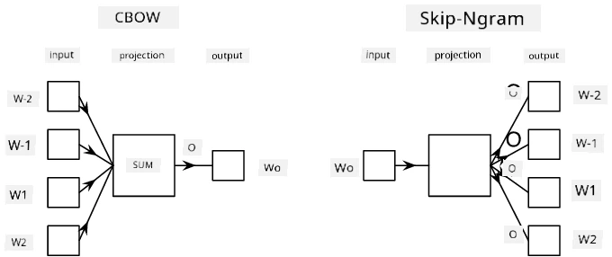

# Pagmomodelo ng Wika

Ang mga semantic embeddings, tulad ng Word2Vec at GloVe, ay isang unang hakbang patungo sa **pagmomodelo ng wika** - ang paggawa ng mga modelo na sa isang paraan ay *nakakaintindi* (o *nagre-representa*) sa kalikasan ng wika.

## [Pre-lecture quiz](https://ff-quizzes.netlify.app/en/ai/quiz/29)

Ang pangunahing ideya sa likod ng pagmomodelo ng wika ay ang pagsasanay sa mga ito gamit ang mga unlabeled na dataset sa isang unsupervised na paraan. Mahalaga ito dahil napakaraming unlabeled na teksto ang magagamit, habang ang dami ng labeled na teksto ay palaging limitado ng dami ng pagsisikap na magagawa natin para sa pag-label. Kadalasan, maaari tayong bumuo ng mga modelo ng wika na kayang **hulaan ang mga nawawalang salita** sa teksto, dahil madali lang na takpan ang isang random na salita sa teksto at gamitin ito bilang sample para sa pagsasanay.

## Pagsasanay ng Embeddings

Sa mga naunang halimbawa, gumamit tayo ng mga pre-trained na semantic embeddings, ngunit interesante ring makita kung paano maaaring sanayin ang mga embeddings na ito. May ilang ideya na maaaring gamitin:

* **N-Gram** na pagmomodelo ng wika, kung saan hinuhulaan natin ang isang token sa pamamagitan ng pagtingin sa N na naunang mga token (N-gram).
* **Continuous Bag-of-Words** (CBoW), kung saan hinuhulaan natin ang gitnang token $W_0$ sa isang hanay ng mga token $W_{-N}$, ..., $W_N$.
* **Skip-gram**, kung saan hinuhulaan natin ang isang hanay ng mga kalapit na token {$W_{-N},\dots, W_{-1}, W_1,\dots, W_N$} mula sa gitnang token $W_0$.

> Larawan mula sa [papel na ito](https://arxiv.org/pdf/1301.3781.pdf)

## ✍️ Mga Halimbawa ng Notebook: Pagsasanay ng CBoW Model

Ipagpatuloy ang iyong pag-aaral gamit ang mga sumusunod na notebook:

* [Pagsasanay ng CBoW Word2Vec gamit ang TensorFlow](CBoW-TF.ipynb)
* [Pagsasanay ng CBoW Word2Vec gamit ang PyTorch](CBoW-PyTorch.ipynb)

## Konklusyon

Sa nakaraang aralin, nakita natin na ang mga word embeddings ay parang mahika! Ngayon, alam natin na ang pagsasanay ng word embeddings ay hindi masyadong komplikadong gawain, at kaya nating sanayin ang sarili nating word embeddings para sa mga tekstong may partikular na larangan kung kinakailangan.

## [Post-lecture quiz](https://ff-quizzes.netlify.app/en/ai/quiz/30)

## Review at Pag-aaral sa Sarili

* [Opisyal na tutorial ng PyTorch sa Pagmomodelo ng Wika](https://pytorch.org/tutorials/beginner/nlp/word_embeddings_tutorial.html).
* [Opisyal na tutorial ng TensorFlow sa pagsasanay ng Word2Vec model](https://www.TensorFlow.org/tutorials/text/word2vec).
* Ang paggamit ng **gensim** framework para sanayin ang pinakakaraniwang ginagamit na embeddings sa ilang linya ng code ay nakasaad [sa dokumentasyong ito](https://pytorch.org/tutorials/beginner/nlp/word_embeddings_tutorial.html).

## 🚀 [Gawain: Sanayin ang Skip-Gram Model](lab/README.md)

Sa laboratoryo, hinahamon ka naming baguhin ang code mula sa araling ito upang sanayin ang skip-gram model sa halip na CBoW. [Basahin ang mga detalye](lab/README.md)

---

