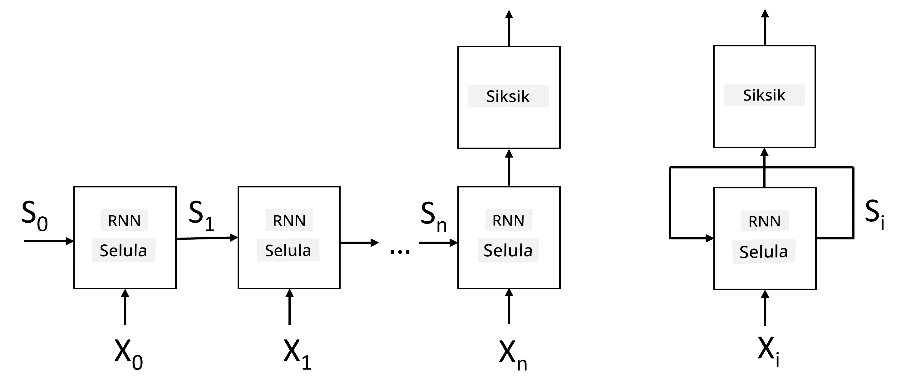
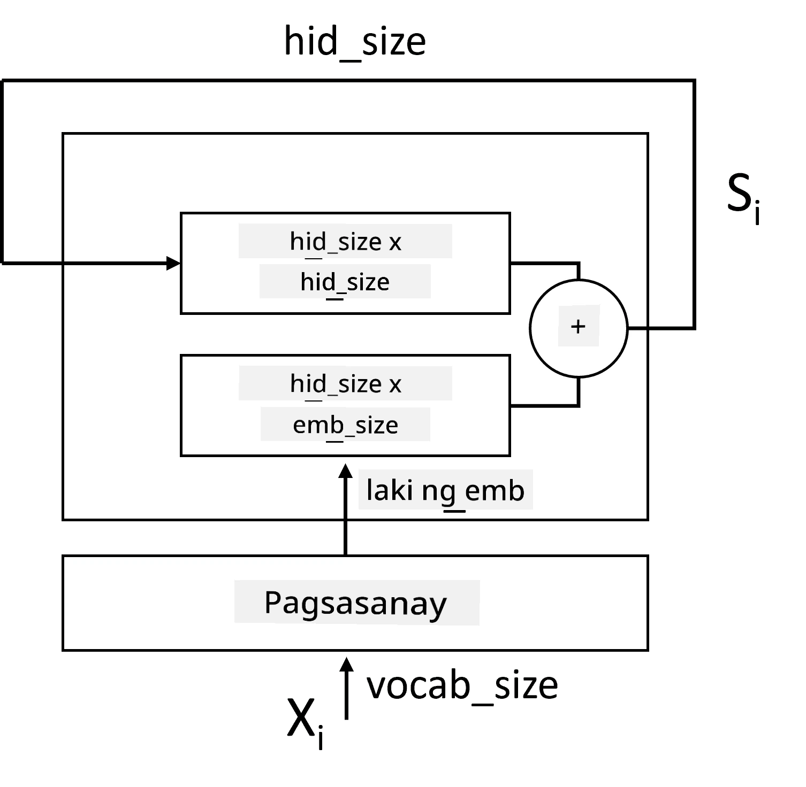
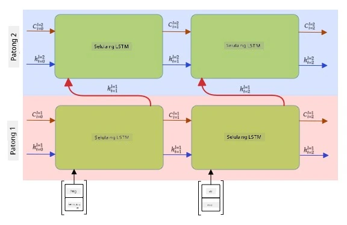

# Recurrent Neural Networks

## [Pre-lecture quiz](https://ff-quizzes.netlify.app/en/ai/quiz/31)

Sa mga nakaraang seksyon, gumamit tayo ng mas mayamang semantic na representasyon ng teksto at isang simpleng linear classifier sa ibabaw ng embeddings. Ang ginagawa ng arkitekturang ito ay kinukuha ang pinagsama-samang kahulugan ng mga salita sa isang pangungusap, ngunit hindi nito isinasaalang-alang ang **pagkakasunod-sunod** ng mga salita, dahil ang operasyon ng pagsasama-sama sa ibabaw ng embeddings ay tinanggal ang impormasyong ito mula sa orihinal na teksto. Dahil hindi kayang i-modelo ng mga modelong ito ang pagkakasunod-sunod ng mga salita, hindi nila masosolusyunan ang mas kumplikado o malalabong gawain tulad ng pagbuo ng teksto o pagsagot sa mga tanong.

Upang makuha ang kahulugan ng pagkakasunod-sunod ng teksto, kailangan nating gumamit ng ibang arkitektura ng neural network, na tinatawag na **recurrent neural network**, o RNN. Sa RNN, ipinapasa natin ang ating pangungusap sa network nang paisa-isang simbolo, at ang network ay gumagawa ng isang **estado**, na pagkatapos ay ipinapasa natin muli sa network kasama ang susunod na simbolo.

> Larawan mula sa may-akda

Sa ibinigay na input sequence ng mga token X0,...,Xn, ang RNN ay lumilikha ng isang sequence ng mga neural network blocks, at sinasanay ang sequence na ito end-to-end gamit ang backpropagation. Ang bawat network block ay tumatanggap ng pares (Xi,Si) bilang input, at gumagawa ng Si+1 bilang resulta. Ang huling estado Sn o (output Yn) ay pumapasok sa isang linear classifier upang makabuo ng resulta. Ang lahat ng network blocks ay may parehong weights, at sinasanay end-to-end gamit ang isang backpropagation pass.

Dahil ang mga state vectors S0,...,Sn ay ipinapasa sa network, kaya nitong matutunan ang mga sequential dependencies sa pagitan ng mga salita. Halimbawa, kapag ang salitang *not* ay lumitaw sa isang bahagi ng sequence, maaari nitong matutunan na i-negate ang ilang elemento sa loob ng state vector, na nagreresulta sa negation.

> ✅ Dahil ang weights ng lahat ng RNN blocks sa larawan sa itaas ay shared, ang parehong larawan ay maaaring i-representa bilang isang block (sa kanan) na may recurrent feedback loop, na ipinapasa ang output state ng network pabalik sa input.

## Anatomy ng isang RNN Cell

Tingnan natin kung paano nakaayos ang isang simpleng RNN cell. Tumatanggap ito ng nakaraang estado Si-1 at kasalukuyang simbolo Xi bilang mga input, at kailangang gumawa ng output state Si (at, minsan, interesado rin tayo sa ibang output Yi, tulad ng sa generative networks).

Ang isang simpleng RNN cell ay may dalawang weight matrices sa loob: ang isa ay nagta-transform ng input symbol (tawagin natin itong W), at ang isa ay nagta-transform ng input state (H). Sa kasong ito, ang output ng network ay kinakalkula bilang &sigma;(W&times;Xi+H&times;Si-1+b), kung saan ang &sigma; ay ang activation function at ang b ay karagdagang bias.

> Larawan mula sa may-akda

Sa maraming kaso, ang mga input tokens ay ipinapasa sa embedding layer bago pumasok sa RNN upang mapababa ang dimensionality. Sa kasong ito, kung ang dimension ng input vectors ay *emb_size*, at ang state vector ay *hid_size* - ang laki ng W ay *emb_size*&times;*hid_size*, at ang laki ng H ay *hid_size*&times;*hid_size*.

## Long Short Term Memory (LSTM)

Isa sa mga pangunahing problema ng klasikong RNNs ay ang tinatawag na **vanishing gradients** problem. Dahil ang RNNs ay sinasanay end-to-end sa isang backpropagation pass, nahihirapan itong i-propagate ang error sa mga unang layers ng network, kaya't hindi matutunan ng network ang mga relasyon sa pagitan ng malalayong tokens. Isa sa mga paraan upang maiwasan ang problemang ito ay ang pagpapakilala ng **explicit state management** gamit ang tinatawag na **gates**. Mayroong dalawang kilalang arkitektura ng ganitong uri: **Long Short Term Memory** (LSTM) at **Gated Relay Unit** (GRU).

> Pinagmulan ng larawan TBD

Ang LSTM Network ay nakaayos sa paraang katulad ng RNN, ngunit may dalawang estado na ipinapasa mula layer patungo sa layer: ang aktwal na estado C, at ang hidden vector H. Sa bawat unit, ang hidden vector Hi ay kinokonekta sa input Xi, at kinokontrol nila kung ano ang mangyayari sa estado C sa pamamagitan ng **gates**. Ang bawat gate ay isang neural network na may sigmoid activation (output sa saklaw [0,1]), na maaaring isipin bilang isang bitwise mask kapag pinarami sa state vector. Narito ang mga sumusunod na gates (mula kaliwa hanggang kanan sa larawan sa itaas):

* Ang **forget gate** ay tumatanggap ng hidden vector at tinutukoy kung aling mga bahagi ng vector C ang kailangan nating kalimutan, at alin ang ipapasa.
* Ang **input gate** ay kumukuha ng ilang impormasyon mula sa input at hidden vectors at isinasama ito sa estado.
* Ang **output gate** ay nagta-transform ng estado sa pamamagitan ng isang linear layer na may *tanh* activation, pagkatapos ay pinipili ang ilan sa mga bahagi nito gamit ang hidden vector Hi upang makabuo ng bagong estado Ci+1.

Ang mga bahagi ng estado C ay maaaring isipin bilang mga flag na maaaring i-on at i-off. Halimbawa, kapag nakatagpo tayo ng pangalang *Alice* sa sequence, maaaring ipalagay na tumutukoy ito sa isang babaeng karakter, at itaas ang flag sa estado na mayroon tayong pangalang babae sa pangungusap. Kapag nakatagpo pa tayo ng mga pariralang *and Tom*, itataas natin ang flag na mayroon tayong pangmaramihang pangngalan. Kaya't sa pamamagitan ng pagmamanipula ng estado, maaari nating subaybayan ang mga gramatikal na katangian ng mga bahagi ng pangungusap.

> ✅ Isang mahusay na mapagkukunan para sa pag-unawa sa mga internals ng LSTM ay ang artikulong ito [Understanding LSTM Networks](https://colah.github.io/posts/2015-08-Understanding-LSTMs/) ni Christopher Olah.

## Bidirectional at Multilayer RNNs

Napag-usapan natin ang mga recurrent networks na gumagana sa isang direksyon, mula simula ng sequence hanggang sa dulo. Mukhang natural ito, dahil kahawig nito ang paraan ng pagbabasa at pakikinig sa pagsasalita. Gayunpaman, dahil sa maraming praktikal na kaso, may random access tayo sa input sequence, maaaring may saysay na patakbuhin ang recurrent computation sa parehong direksyon. Ang ganitong mga network ay tinatawag na **bidirectional** RNNs. Kapag gumagamit ng bidirectional network, kakailanganin natin ng dalawang hidden state vectors, isa para sa bawat direksyon.

Ang isang Recurrent network, alinman sa one-directional o bidirectional, ay kumukuha ng ilang patterns sa loob ng isang sequence, at maaaring i-store ang mga ito sa isang state vector o ipasa sa output. Tulad ng convolutional networks, maaari tayong bumuo ng isa pang recurrent layer sa ibabaw ng una upang makuha ang mas mataas na level na patterns at bumuo mula sa low-level patterns na nakuha ng unang layer. Ito ay humahantong sa konsepto ng isang **multi-layer RNN** na binubuo ng dalawa o higit pang recurrent networks, kung saan ang output ng nakaraang layer ay ipinapasa sa susunod na layer bilang input.

*Larawan mula sa [napakagandang post na ito](https://towardsdatascience.com/from-a-lstm-cell-to-a-multilayer-lstm-network-with-pytorch-2899eb5696f3) ni Fernando López*

## ✍️ Mga Ehersisyo: Embeddings

Ipagpatuloy ang iyong pag-aaral sa mga sumusunod na notebooks:

* [RNNs with PyTorch](RNNPyTorch.ipynb)
* [RNNs with TensorFlow](RNNTF.ipynb)

## Konklusyon

Sa unit na ito, nakita natin na ang RNNs ay maaaring gamitin para sa sequence classification, ngunit sa katunayan, kaya nilang hawakan ang mas maraming gawain, tulad ng pagbuo ng teksto, pagsasalin ng makina, at iba pa. Tatalakayin natin ang mga gawain na ito sa susunod na unit.

## 🚀 Hamon

Magbasa ng ilang literatura tungkol sa LSTMs at isaalang-alang ang kanilang mga aplikasyon:

- [Grid Long Short-Term Memory](https://arxiv.org/pdf/1507.01526v1.pdf)
- [Show, Attend and Tell: Neural Image Caption
Generation with Visual Attention](https://arxiv.org/pdf/1502.03044v2.pdf)

## [Post-lecture quiz](https://ff-quizzes.netlify.app/en/ai/quiz/32)

## Review at Pag-aaral sa Sarili

- [Understanding LSTM Networks](https://colah.github.io/posts/2015-08-Understanding-LSTMs/) ni Christopher Olah.

## [Assignment: Notebooks](assignment.md)

---

